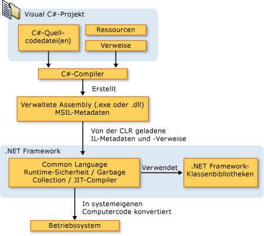

# Einführung in die Programmiersprache C# und in .NET Framework

C# ist eine elegante, typsichere und objektorientierte Sprache, mit der Entwickler eine Vielzahl sicherer und robuster Anwendungen erstellen können, die in [!INCLUDE[dnprdnshort](~/includes/dnprdnshort-md.md)] ausgeführt werden. Mit C# können Sie Windows-Clientanwendungen, XML-Webdienste, verteilte Komponenten, Client-/Serveranwendungen, Datenbankanwendungen und vieles mehr erstellen. Visual C# bietet basierend auf der C#-Sprache und [!INCLUDE[dnprdnshort](~/includes/dnprdnshort-md.md)] einen erweiterten Code-Editor, komfortable Benutzeroberflächen-Designer, integrierte Debugger und viele weitere Tools zur einfachen Anwendungsentwicklung.  
  
> [!NOTE]
> Bei der Visual C#-Dokumentation werden Kenntnisse zu allgemeinen Programmierkonzepten vorausgesetzt. Als Anfänger sollten Sie sich mit Visual C# Express vertraut machen, das im Web verfügbar ist. Außerdem können Sie sich anhand von Büchern und Webressourcen über C# praktische Programmierkenntnisse aneignen.  
  
## Die Programmiersprache C#

 Die C#-Syntax ist trotz ihrer Ausdrucksfülle einfach und leicht zu erlernen. Die C#-Syntax mit geschweiften Klammern ist für alle Benutzer sofort erkennbar, die mit C, C++ oder Java vertraut sind. Entwickler, die mit einer dieser Sprachen vertraut sind, können C# normalerweise innerhalb kürzester Zeit produktiv anwenden. Mit der C#-Syntax werden viele der Komplexitäten von C++ vereinfacht. Zugleich stehen leistungsfähige Features zur Verfügung, z.&nbsp;B. auf NULL festlegbare Werttypen, Enumerationen, Delegaten, Lambda-Ausdrücke und direkter Speicherzugriff, die in Java nicht enthalten sind. C# unterstützt generische Methoden und Typen für verbesserte Typsicherheit und Leistung sowie Iteratoren, mit denen Implementierer von Auflistungsklassen benutzerdefiniertes Iterationsverhalten definieren können, das vom Clientcode einfach verwendet werden kann. [!INCLUDE[vbteclinqext](~/includes/vbteclinqext-md.md)]-Ausdrücke machen eine Abfrage mit starker Typisierung zu einem erstklassigen Sprachkonstrukt.  
  
 Als objektorientierte Sprache unterstützt C# die Konzepte der Kapselung, Vererbung und Polymorphie. Alle Variablen und Methoden, einschließlich der `Main`-Methode, die den Einstiegspunkt der Anwendung darstellt, werden innerhalb der Klassendefinition gekapselt. Eine Klasse kann direkt von einer übergeordneten Klasse erben, aber auch eine beliebige Anzahl von Schnittstellen implementieren. Methoden, die virtuelle Methoden in einer übergeordneten Klasse überschreiben, erfordern das `override`-Schlüsselwort als Möglichkeit, eine versehentliche Neudefinition zu verhindern. In C# verhält sich eine Struktur wie eine vereinfachte Klasse. Sie entspricht einem auf dem Stapel reservierten Typ, der Schnittstellen implementieren kann, jedoch keine Vererbung unterstützt.  
  
 Neben diesen objektorientierten Grundprinzipien vereinfacht C# die Entwicklung von Softwarekomponenten mithilfe mehrerer innovativer Sprachkonstrukte, z.&nbsp;B. folgender:  
  
- Gekapselte Methodensignaturen, *Delegaten* genannt, die typsichere Ereignisbenachrichtigungen ermöglichen.  
  
- Eigenschaften, die als Zugriffsmethoden für private Membervariablen dienen.  
  
- Attribute, die zur Laufzeit deklarative Metadaten zu Typen bereitstellen.  
  
- Inline-XML-Dokumentationskommentare.  
  
- [!INCLUDE[vbteclinqext](~/includes/vbteclinqext-md.md)], die integrierte Abfragefunktionen für eine Vielzahl von Datenquellen bereitstellt.  
  
 Die Interaktion mit weiterer Windows-Software, z.&nbsp;B. COM-Objekten oder systemeigenen Win32-DLLs, wird in C# durch einen Prozess mit dem Namen "Interop" ermöglicht. Mithilfe von Interop bieten C#-Programme dieselbe Funktionalität wie systemeigene C++-Anwendungen. C# unterstützt sogar Zeiger und das Konzept des "unsicheren" Codes für jene Fälle, in denen direkter Speicherzugriff besonders wichtig ist.  
  
 Der C#-Erstellungsprozess ist im Vergleich zu C und C++ einfach und flexibler als in Java. Es gibt keine separaten Headerdateien. Außerdem ist es nicht erforderlich, Methoden und Typen in einem bestimmten Ordner zu deklarieren. Eine C#-Quelldatei kann eine beliebige Anzahl von Klassen, Strukturen, Schnittstellen und Ereignissen definieren.  
  
 Die folgenden zusätzlichen C#-Ressourcen stehen zur Verfügung:  
  
- Eine gute allgemeine Einführung in die Sprache finden Sie in Kapitel 1 der [C#-Sprachspezifikation](../../csharp/language-reference/language-specification/index.md).  
  
- Ausführliche Informationen zu bestimmten Aspekte der Programmiersprache C# finden Sie in der [C#-Referenz](../../csharp/language-reference/index.md).  
  
- Weitere Informationen zu [!INCLUDE[vbteclinq](~/includes/vbteclinq-md.md)] finden Sie unter [LINQ (Language-Integrated Query)](../programming-guide/concepts/linq/index.md) (sprachintegrierte Abfrage).  

## .NET Framework-Plattformarchitektur

 C#-Programme werden auf Grundlage von [!INCLUDE[dnprdnshort](~/includes/dnprdnshort-md.md)] ausgeführt, einer integralen Windows-Komponente, die ein virtuelles Ausführungssystem mit dem Namen Common Language Runtime (CLR) sowie einen einheitlichen Satz Klassenbibliotheken enthält. CLR ist die kommerzielle Microsoft-Implementierung der Common Language Infrastructure (CLI), einem internationalen Standard, der die Grundlage für das Erstellen von Ausführungs- und Entwicklungsumgebungen darstellt, in denen Sprachen und Bibliotheken nahtlos zusammenarbeiten.  
  
 Der in C# geschriebene Quellcode wird in einen Intermediate Language (IL)-Code kompiliert, der der CLI-Spezifikation entspricht. Der IL-Code wird zusammen mit Ressourcen wie z.&nbsp;B. Bitmaps und Zeichenfolgen in einer ausführbaren Datei gespeichert, der so genannten Assembly, die normalerweise die Erweiterung EXE oder DLL aufweist. Eine Assembly enthält ein Manifest, das Informationen über die Typen, die Version, die Kultur und die Sicherheitsanforderungen der Assembly bereitstellt.  
  
 Beim Ausführen des C#-Programms wird die Assembly in die CLR geladen, was je nach den im Manifest enthaltenen Informationen die Durchführung verschiedener Aktionen erfordert. Wenn die Sicherheitsanforderungen erfüllt sind, konvertiert die CLR den IL-Code mithilfe der Just-In-Time (JIT)-Kompilierung in systemeigene Maschinenanweisungen. Die CLR stellt darüber hinaus weitere Dienste zur automatischen Garbage Collection, Ausnahmebehandlung und Ressourcenverwaltung bereit. Der über die CLR ausgeführte Code wird manchmal als "verwalteter Code" bezeichnet. Dieser steht im Gegensatz zum "nicht verwalteten Code", der in systemeigene Maschinensprache kompiliert wird, die auf ein bestimmtes System abgestimmt ist. Das folgende Diagramm veranschaulicht die Beziehungen zwischen C#-Quellcodedateien, den .NET Framework-Klassenbibliotheken, Assemblys sowie der CLR zur Kompilierzeit und zur Laufzeit.  
  
   
  
 Eines der wichtigsten Features in [!INCLUDE[dnprdnshort](~/includes/dnprdnshort-md.md)] ist die Sprachinteroperabilität. Da der vom C#-Compiler generierte IL-Code der CTS (Common Type Specification) entspricht, kann er mit Code interagieren, der mit den .NET-Versionen von Visual Basic, Visual C++ oder mit einer der mehr als 20 weiteren CTS-kompatiblen Sprachen generiert wurde. Eine einzelne Assembly kann mehrere in verschiedenen .NET-Sprachen erstellte Module enthalten, und die Typen können aufeinander verweisen, ganz so, als wären sie in derselben Sprache geschrieben worden.  
  
 Zusätzlich zu den Laufzeitdiensten enthält [!INCLUDE[dnprdnshort](~/includes/dnprdnshort-md.md)] eine ausführliche Bibliothek mit mehr als 4.000 in Namespaces organisierten Klassen, die eine Vielzahl hilfreicher Funktionen bereitstellen, von der Dateieingabe und -ausgabe bis zur Zeichenfolgenbearbeitung, zur XML-Analyse und zu Windows&nbsp;Forms-Steuerelementen. Eine typische C#-Anwendung verwendet für die Ausführung allgemeiner Routinearbeiten ausgiebig die [!INCLUDE[dnprdnshort](~/includes/dnprdnshort-md.md)]-Klassenbibliothek.  
  
 Weitere Informationen zu .NET Framework finden Sie unter [Overview of the Microsoft .NET Framework 3.0](../../framework/get-started/overview.md) (Überblick über Microsoft .NET Framework 3.0).  
  
## Siehe auch

- [C#](../../csharp/index.md)
- [Erste Schritte mit Visual C# und Visual Basic](/visualstudio/ide/getting-started-with-visual-csharp-and-visual-basic)
