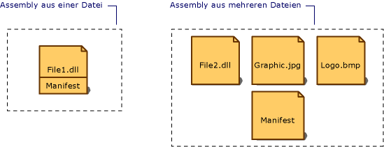

# Assemblymanifest
Jede Assembly, ob statisch oder dynamisch, enthält eine Auflistung von Daten, in der beschrieben ist, wie die Elemente in der Assembly miteinander verknüpft sind. Das Assemblymanifest enthält diese Assemblymetadaten. Ein Assemblymanifest enthält alle Metadaten, die zum Angeben von Versionsanforderungen und Sicherheitsidentität der Assembly erforderlich sind, sowie alle Metadaten, die zum Definieren des Gültigkeitsbereichs der Assembly und zum Auflösen von Verweisen auf Ressourcen und Klassen benötigt werden. Das Assemblymanifest kann entweder in einer PE-Datei (eine EXE- oder DLL-Datei) mit MSIL-Code (Microsoft Intermediate Language) oder in einer eigenständigen PE-Datei gespeichert sein, die ausschließlich Informationen aus dem Assemblymanifest enthält.  
  
 Die folgende Abbildung stellt verschiedene Möglichkeiten zum Speichern des Manifests dar.  
  
   
Typen von Assemblys  
  
 Bei einer Assembly mit einer zugeordneten Datei ist das Manifest in die PE-Datei eingebunden, sodass eine Einzeldateiassembly entsteht. Beim Erstellen einer Mehrfachdateiassembly können Sie eine eigenständige Manifestdatei verwenden, oder Sie beziehen das Manifest in eine der PE-Dateien der Assembly ein.  
  
 Jedes Manifest einer Assembly hat folgende Funktionen:  
  
-   Auflisten der Dateien, aus denen die Assembly besteht.  
  
-   Steuern, wie Verweise auf die Typen und Ressourcen der Assembly den Dateien zugeordnet sind, die die entsprechenden Deklarationen und Implementierungen enthalten.  
  
-   Auflisten anderer Assemblys, von denen die Assembly abhängig ist.  
  
-   Bereitstellen einer Dereferenzierungsebene zwischen den Consumern der Assembly und den Implementierungsdetails der Assembly.  
  
-   Wiedergabe der Selbstbeschreibung der Assembly.  
  
## Inhalt des Assemblymanifests  
 Die folgende Tabelle enthält die im Assemblymanifest enthaltenen Informationen. Die Identität einer Assembly setzt sich aus den ersten vier Elementen zusammen (Assemblyname, Versionsnummer, Kultur und Informationen über den starken Namen).  
  
|Information|Beschreibung|  
|-----------------|-----------------|  
|Assemblyname|Eine Zeichenfolge, die den Namen der Assembly angibt.|  
|Versionsnummer|Eine Haupt- und Nebenversionsnummer und eine Revisions- und Buildnummer. Die Common Language Runtime verwendet diese Nummern, um die Versionsrichtlinien zu erzwingen.|  
|Kultur|Informationen über die Kultur oder Sprache, die die Assembly unterstützt. Diese Informationen dürfen nur verwendet werden, um eine Assembly als Satellitenassembly festzulegen, die kultur- oder sprachspezifische Informationen enthält. (Eine Assembly mit Kulturinformationen wird automatisch als Satellitenassembly betrachtet.)|  
|Informationen über den starken Namen|Der öffentliche Schlüssel des Herausgebers, falls der Assembly ein starker Name zugewiesen wurde.|  
|Liste aller Dateien in der Assembly|Ein Hash für jede in der Assembly enthaltene Datei und ein Dateiname. Beachten Sie, dass alle zur Assembly gehörenden Dateien in demselben Verzeichnis wie die Datei mit dem Assemblymanifest abgelegt sein müssen.|  
|Typverweisinformationen|Informationen, mit denen die Common Language Runtime einen Typverweis auf die Datei zuordnet, die ihre Deklaration und Implementierung enthält. Wird für Typen verwendet, die aus der Assembly exportiert werden.|  
|Informationen über Assemblys, auf die verwiesen wird|Eine Liste mit anderen Assemblys, auf die statische Verweise in der Assembly vorhanden sind. Ein Verweis umfasst den Namen der abhängigen Assembly, die Assemblymetadaten (Version, Kultur, Betriebssystem usw.) und den öffentlichen Schlüssel, wenn die Assembly einen starken Namen besitzt.|  
  
 Im Assemblymanifest können Sie Informationen hinzufügen oder ändern. Dazu müssen Sie Assemblyattribute im Code verwenden. Sie können Versionsinformationen und Informationsattribute ändern, einschließlich Marke, Urheberrecht, Produkt, Firma und Informationsversion. Eine vollständige Liste von Assemblyattributen finden Sie unter [Setting Assembly Attributes (Festlegen von Assemblyattributen)](../../../docs/framework/app-domains/set-assembly-attributes.md).  
  
## Siehe auch  
 [Assemblyinhalte](../../../docs/framework/app-domains/assembly-contents.md)   
 [Assemblyversionen](../../../docs/framework/app-domains/assembly-versioning.md)   
 [Erstellen von Satellitenassemblys](../../../docs/framework/resources/creating-satellite-assemblies-for-desktop-apps.md)   
 [Assemblys mit starkem Namen](../../../docs/framework/app-domains/strong-named-assemblies.md)

