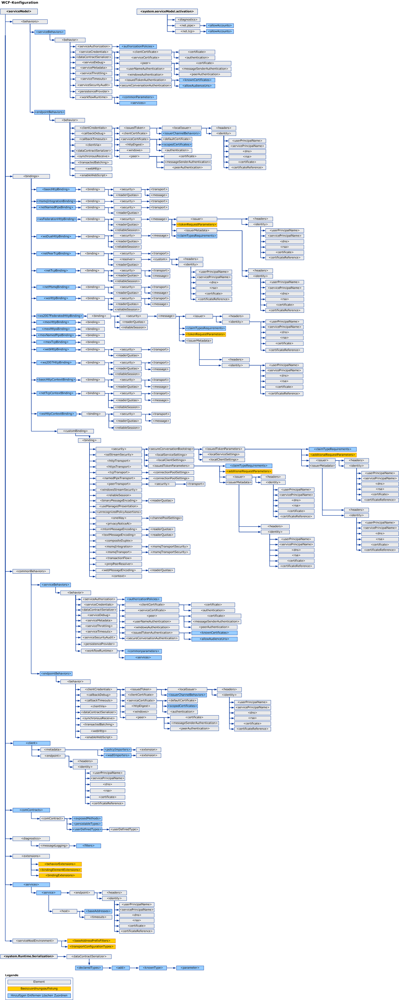

# WCF-Konfigurationsschema
[!INCLUDE[indigo1](../../../../../includes/indigo1-md.md)]-Konfigurationselemente ermöglichen Ihnen, [!INCLUDE[indigo2](../../../../../includes/indigo2-md.md)]-Dienst- und -Clientanwendungen zu konfigurieren. Sie können das [Configuration Editor-Tool (SvcConfigEditor.exe)](../../../../../docs/framework/wcf/configuration-editor-tool-svcconfigeditor-exe.md) verwenden, um Konfigurationsdateien für Clients und Dienste zu erstellen und zu bearbeiten. Da die Konfigurationsdateien als XML formatiert sind, müssen Sie mit XML vertraut sein, wenn Sie diese manuell in einem Texteditor bearbeiten möchten. Andernfalls treten möglicherweise Probleme auf, wie ein nicht gefundenes XML-Elementtag oder -attribut. Das liegt daran, dass bei XML-Elementtags und -attributen zwischen Groß- und Kleinschreibung unterschieden wird.  
  
 Das [!INCLUDE[indigo2](../../../../../includes/indigo2-md.md)]-Konfigurationssystem basiert auf dem <xref:System.Configuration>-Namespace. Deshalb können Sie alle Standardfeatures verwenden, die vom <xref:System.Configuration>-Namespace bereitgestellt werden, wie die Konfigurationssperre, die Verschlüsselung und das Zusammenführen, um die Sicherheit Ihrer Anwendung und ihrer Konfiguration zu erhöhen. Weitere Informationen über diese Konzepte finden Sie in den folgenden Themen.  
  
 [Encrypting Configuration Information (Verschlüsseln von Konfigurationsinformationen)](http://go.microsoft.com/fwlink/?LinkId=95337)  
  
 [Locking Configuration Settings (Sperren von Konfigurationseinstellungen)](http://go.microsoft.com/fwlink/?LinkId=95338)  
  
 In diesem Abschnitt werden alle möglichen Werte eines Konfigurationselements sowie seine Interaktion mit anderen WCF-Konfigurationselementen beschrieben. Die folgende Zuordnung illustriert das WCF-Konfigurationsschema.  
  
   
  
> [!CAUTION]
>  Sie sollten die [!INCLUDE[indigo2](../../../../../includes/indigo2-md.md)]-Konfigurationsabschnitte in den Konfigurationsdateien Ihrer Anwendung (app.config) mit den entsprechenden Zugriffssteuerungslisten (ACL) sichern, um mögliche Sicherheitsrisiken zu verhindern.  So sollten Sie z.&#160;B. sicherstellen, dass nur die entsprechenden Personen auf die Sicherheitseinstellungen von Anwendungsbindungen oder auf den Dienstmodellabschnitt der Konfigurationsdatei eines Diensts zugreifen oder diese ändern können.  
  
## In diesem Abschnitt  
 [\<system.serviceModel>](../../../../../docs/framework/configure-apps/file-schema/wcf/system-servicemodel.md)  
 Beschreibt das `ServiceModel`-Element.  
  
 [\<system.serviceModel.activation>](../../../../../docs/framework/configure-apps/file-schema/wcf/system-servicemodel-activation.md)  
 Konfiguriert das SMSvcHost.exe-Tool.  
  
 [\<system.runtime.serialization>](../../../../../docs/framework/configure-apps/file-schema/wcf/system-runtime-serialization.md)  
 Das Element der obersten Ebene zum Festlegen von Optionen für die Verwendung von Serialisierern, wie z. B. <xref:System.Runtime.Serialization.DataContractSerializer>.  
  
## Verwandte Abschnitte  
 [Konfigurieren von Windows Communication Foundation-Anwendungen](http://msdn.microsoft.com/library/13cb368e-88d4-4c61-8eed-2af0361c6d7a)  
 Beschreibt, wie [!INCLUDE[indigo2](../../../../../includes/indigo2-md.md)]-Dienste und -Clients konfiguriert werden.
