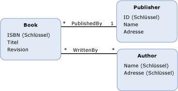

# Zuordnungssatz
Ein *Zuordnungssatz* ist ein logischer Container für [Zuordnung](../../../../docs/framework/data/adonet/association-type.md) Instanzen des gleichen Typs. Ein Zuordnungssatz ist keine Datenmodellkonstruktion; das heißt, er beschreibt nicht die Struktur von Daten oder Beziehungen. Vielmehr stellt ein Zuordnungssatz eine Konstruktion für eine Hosting- oder Speicherumgebung (z. B. die Common Language Runtime oder eine SQL Server-Datenbank) zum Gruppieren von Zuordnungsinstanzen bereit, damit diese einem Datenspeicher zugeordnet werden können.  
  
 Ein Zuordnungssatz wird innerhalb von definiert ein [Entitätscontainer](../../../../docs/framework/data/adonet/entity-container.md), dies ist eine logische Gruppierung von [Entitätenmengen](../../../../docs/framework/data/adonet/entity-set.md) und Zuordnungssätzen.  
  
 Eine Definition für einen Zuordnungssatz enthält die folgenden Informationen:  
  
-   Den Namen des Zuordnungssatzes. (erforderlich)  
  
-   Die Zuordnung, von der er Instanzen enthält. (erforderlich)  
  
-   Zwei [zuordnungssatzenden](../../../../docs/framework/data/adonet/association-set-end.md).  
  
## Beispiel  
 Die unten stehende Abbildung zeigt ein konzeptionelles Modell mit zwei Zuordnungen: `PublishedBy` und `WrittenBy`. Obwohl die Abbildung keine Informationen zu Zuordnungssätzen bereitstellt, zeigt die nächste Abbildung ein Beispiel für Zuordnungssätze und Entitätenmengen auf Grundlage dieses Modells.  
  
   
  
 Das folgende Beispiel zeigt einen Zuordnungssatz (`PublishedBy`) und zwei Entitätenmengen (`Books` und `Publishers`), basierend auf dem oben gezeigten Modell. BI in der `Books` Entitätenmenge stellt eine Instanz der dem `Book` Entitätstyp zur Laufzeit. Auf ähnliche Weise Pj stellt eine `Publisher` -Instanz in der `Publishers` Entitätenmenge. BiPj stellt eine Instanz der dem `PublishedBy` Zuordnung in der `PublishedBy` Zuordnungssatz.  
  
   
  
 Die [ADO.NET Entity Framework](../../../../docs/framework/data/adonet/ef/index.md) verwendet eine domänenspezifische Sprache (DSL) Bezeichnung konzeptionelle Schemadefinitionssprache ([CSDL](../../../../docs/framework/data/adonet/ef/language-reference/csdl-specification.md)) um konzeptionelle Modelle zu definieren. Die folgende CSDL definiert einen Entitätscontainer mit einem Zuordnungssatz für jede Zuordnung in der oben gezeigten Abbildung. Beachten Sie, dass der Name und die Zuordnung für jeden Zuordnungssatz mit XML-Attributen definiert werden.  
  
 [!code-xml[EDM_Example_Model#EntityContainerExample](../../../../samples/snippets/xml/VS_Snippets_Data/edm_example_model/xml/books.edmx#entitycontainerexample)]  
  
 Es ist möglich, mehrere Zuordnungssätze pro Zuordnung, solange keine Teilen zwei Zuordnungssätze definieren eine [zuordnungssatzende](../../../../docs/framework/data/adonet/association-set-end.md). Die folgende CSDL definiert einen Entitätscontainer mit zwei Zuordnungssätzen für die `WrittenBy`-Zuordnung. Beachten Sie, dass mehrere Entitätssätze für die Entitätstypen `Book` und `Author` definiert wurden, und dass sich kein Zuordnungssatz ein Zuordnungssatzende teilt.  
  
 [!code-xml[EDM_Example_Model#MultipleAssociationSets](../../../../samples/snippets/xml/VS_Snippets_Data/edm_example_model/xml/books3.edmx#multipleassociationsets)]  
  
## Siehe auch  
 [Schlüsselkonzepte im Entity Data Model](../../../../docs/framework/data/adonet/entity-data-model-key-concepts.md)  
 [Entity Data Model](../../../../docs/framework/data/adonet/entity-data-model.md)  
 [Fremdschlüsseleigenschaft](../../../../docs/framework/data/adonet/foreign-key-property.md)
