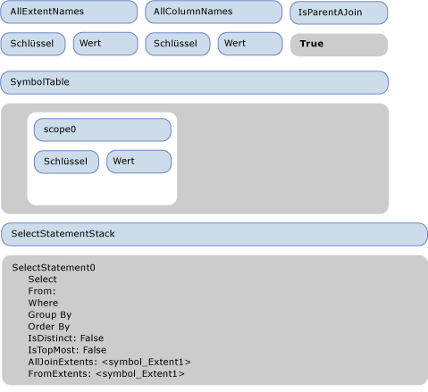
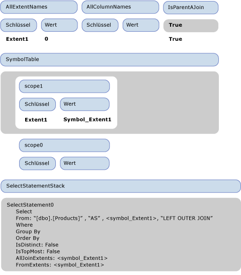

# <a name="walkthrough-sql-generation"></a>Exemplarische Vorgehensweise: SQL-Generierung
In diesem Thema wird veranschaulicht, wie die SQL-Generierung in erfolgt die [Beispielanbieter](http://go.microsoft.com/fwlink/?LinkId=180616). Die folgende Entity SQL-Abfrage verwendet das im Beispielanbieter enthaltene Modell:  
  
```  
SELECT  j1.ProductId, j1.ProductName, j1.CategoryName, j2.ShipCountry, j2.ProductId  
FROM (  SELECT P.ProductName, P.ProductId, P.Category.CategoryName  
        FROM NorthwindEntities.Products AS P) as j1  
INNER JOIN (SELECT OD.ProductId, OD.Order.ShipCountry as ShipCountry  
            FROM NorthwindEntities.OrderDetails AS OD) as j2  
            ON j1.ProductId == j2.ProductId   
```  
  
 Die Abfrage erzeugt die folgende Ausgabebefehlsstruktur, die an den Anbieter übergeben wird:  
  
```  
DbQueryCommandTree  
|_Parameters  
|_Query : Collection{Record['C1'=Edm.Int32, 'ProductID'=Edm.Int32, 'ProductName'=Edm.String, 'CategoryName'=Edm.String, 'ShipCountry'=Edm.String, 'ProductID1'=Edm.Int32]}  
  |_Project  
    |_Input : 'Join4'  
    | |_InnerJoin  
    |   |_Left : 'Join1'  
    |   | |_LeftOuterJoin  
    |   |   |_Left : 'Extent1'  
    |   |   | |_Scan : dbo.Products  
    |   |   |_Right : 'Extent2'  
    |   |   | |_Scan : dbo.Categories  
    |   |   |_JoinCondition  
    |   |     |_  
    |   |       |_Var(Extent1).CategoryID  
    |   |       |_=  
    |   |       |_Var(Extent2).CategoryID  
    |   |_Right : 'Join3'  
    |   | |_LeftOuterJoin  
    |   |   |_Left : 'Extent3'  
    |   |   | |_Scan : dbo.OrderDetails  
    |   |   |_Right : 'Join2'  
    |   |   | |_LeftOuterJoin  
    |   |   |   |_Left : 'Extent4'  
    |   |   |   | |_Scan : dbo.Orders  
    |   |   |   |_Right : 'Extent5'  
    |   |   |   | |_Scan : dbo.InternationalOrders  
    |   |   |   |_JoinCondition  
    |   |   |     |_  
    |   |   |       |_Var(Extent4).OrderID  
    |   |   |       |_=  
    |   |   |       |_Var(Extent5).OrderID  
    |   |   |_JoinCondition  
    |   |     |_  
    |   |       |_Var(Extent3).OrderID  
    |   |       |_=  
    |   |       |_Var(Join2).Extent4.OrderID  
    |   |_JoinCondition  
    |     |_  
    |       |_Var(Join1).Extent1.ProductID  
    |       |_=  
    |       |_Var(Join3).Extent3.ProductID  
    |_Projection  
      |_NewInstance : Record['C1'=Edm.Int32, 'ProductID'=Edm.Int32, 'ProductName'=Edm.String, 'CategoryName'=Edm.String, 'ShipCountry'=Edm.String, 'ProductID1'=Edm.Int32]  
        |_Column : 'C1'  
        | |_1  
        |_Column : 'ProductID'  
        | |_Var(Join4).Join1.Extent1.ProductID  
        |_Column : 'ProductName'  
        | |_Var(Join4).Join1.Extent1.ProductName  
        |_Column : 'CategoryName'  
        | |_Var(Join4).Join1.Extent2.CategoryName  
        |_Column : 'ShipCountry'  
        | |_Var(Join4).Join3.Join2.Extent4.ShipCountry  
        |_Column : 'ProductID1'  
          |_Var(Join4).Join3.Extent3.ProductID  
```  
  
 In diesem Thema wird beschrieben, wie diese Ausgabebefehlsstruktur in die folgenden SQL-Anweisungen übersetzt wird.  
  
```  
SELECT   
1 AS [C1],   
[Extent1].[ProductID] AS [ProductID],   
[Extent1].[ProductName] AS [ProductName],   
[Extent2].[CategoryName] AS [CategoryName],   
[Join3].[ShipCountry] AS [ShipCountry],   
[Join3].[ProductID] AS [ProductID1]  
FROM   [dbo].[Products] AS [Extent1]  
LEFT OUTER JOIN [dbo].[Categories] AS [Extent2] ON [Extent1].[CategoryID] = [Extent2].[CategoryID]  
INNER JOIN    
(SELECT [Extent3].[OrderID] AS [OrderID1], [Extent3].[ProductID] AS [ProductID], [Extent3].[UnitPrice] AS [UnitPrice], [Extent3].[Quantity] AS [Quantity], [Extent3].[Discount] AS [Discount], [Join2].[OrderID2], [Join2].[CustomerID], [Join2].[EmployeeID], [Join2].[OrderDate], [Join2].[RequiredDate], [Join2].[ShippedDate], [Join2].[Freight], [Join2].[ShipName], [Join2].[ShipAddress], [Join2].[ShipCity], [Join2].[ShipRegion], [Join2].[ShipPostalCode], [Join2].[ShipCountry], [Join2].[OrderID3], [Join2].[CustomsDescription], [Join2].[ExciseTax]  
FROM  [dbo].[OrderDetails] AS [Extent3]  
LEFT OUTER JOIN    
      (SELECT [Extent4].[OrderID] AS [OrderID2], [Extent4].[CustomerID] AS [CustomerID], [Extent4].[EmployeeID] AS [EmployeeID], [Extent4].[OrderDate] AS [OrderDate], [Extent4].[RequiredDate] AS [RequiredDate], [Extent4].[ShippedDate] AS [ShippedDate], [Extent4].[Freight] AS [Freight], [Extent4].[ShipName] AS [ShipName], [Extent4].[ShipAddress] AS [ShipAddress], [Extent4].[ShipCity] AS [ShipCity], [Extent4].[ShipRegion] AS [ShipRegion], [Extent4].[ShipPostalCode] AS [ShipPostalCode], [Extent4].[ShipCountry] AS [ShipCountry], [Extent5].[OrderID] AS [OrderID3], [Extent5].[CustomsDescription] AS [CustomsDescription], [Extent5].[ExciseTax] AS [ExciseTax]  
FROM  [dbo].[Orders] AS [Extent4]  
LEFT OUTER JOIN [dbo].[InternationalOrders] AS [Extent5] ON [Extent4].[OrderID] = [Extent5].[OrderID]   
      ) AS [Join2] ON [Extent3].[OrderID] = [Join2].[OrderID2]   
   ) AS [Join3] ON [Extent1].[ProductID] = [Join3].[ProductID]  
```  
  
## <a name="first-phase-of-sql-generation-visiting-the-expression-tree"></a>Erste Phase der SQL-Generierung: Zugriff auf die Ausdrucksstruktur  
 Die folgende Abbildung veranschaulicht den leeren Anfangszustand des Besuchers.  In diesem Thema werden nur die für die Erläuterung der exemplarischen Vorgehensweise relevanten Eigenschaften dargestellt.  
  
   
  
 Wird auf den Projektknoten zugegriffen, wird VisitInputExpression über seine Eingabe (Join4) aufgerufen. Dadurch wird der Zugriff auf Join4 durch die Methode VisitJoinExpression ausgelöst. Da dies ein Join auf oberster Ebene ist, gibt IsParentAJoin false zurück. Es wird ein neues SqlSelectStatement (SelectStatement0) erstellt und auf dem SELECT-Anweisungsstapel abgelegt. Außerdem wird ein neuer Bereich (scope0) in der Symboltabelle eingetragen. Vor dem Zugriff auf die erste (linke) Eingabe des Joins wird "true" auf dem IsParentAJoin-Stapel abgelegt. Bevor der Zugriff auf Join1, der linken Eingabe von Join4, erfolgt, entspricht der Zustand des Besuchers dem in der nächsten Abbildung dargestellten Zustand.  
  
   
  
 Wenn die Joinzugriffsmethode über Join4 aufgerufen wird, hat IsParentAJoin den Wert true. Daher verwendet sie die aktuelle SELECT-Anweisung SelectStatement0 erneut. Es wird ein neuer Bereich (scope1) eingetragen. Bevor der Zugriff auf sein linkes untergeordnetes Element (Extent1) erfolgt, wird ein weiterer Wert true auf dem IsParentAJoin-Stapel abgelegt.  
  
 Wenn auf Extent1 zugegriffen wird, weil IsParentAJoin true zurückgibt, wird ein SqlBuilder zurückgegeben, der "[dbo].[Products]" enthält. Die Steuerung wird an die Methode zurückgegeben, die auf Join4 zugreift. Ein Eintrag von IsParentAJoin wird ausgelesen, und ProcessJoinInputResult wird aufgerufen. Diese Methode fügt das Ergebnis des Zugriffs auf Extent1 an die FROM-Klausel von SelectStatement0 an. Es wird ein neues From-Symbol (symbol_Extent1) für den Eingabebindungsnamen "Extent1" erstellt, das den FromExtents von SelectStatement0 hinzugefügt wird. Außerdem werden "AS" und symbol_Extent1 an die FROM-Klausel angefügt. AllExtentNames wird ein neuer Eintrag mit dem Wert 0 für "Extent1" hinzugefügt. Dem aktuellen Bereich in der Symboltabelle wird ein neuer Eintrag hinzugefügt, um "Extent1" seinem Symbol symbol_Extent1 zuzuordnen. Symbol_Extent1 wird außerdem den AllJoinExtents der SqlSelectStatement-Anweisung hinzugefügt.  
  
 Bevor der Zugriff auf die rechte Eingabe von Join1 erfolgt, wird der FROM-Klausel von SelectStatement0 "LEFT OUTER JOIN" hinzugefügt. Da die rechte Eingabe ein Scan-Ausdruck ist, wird der Wert true erneut auf dem IsParentAJoin-Stapel abgelegt. Der Zustand vor dem Zugriff auf die rechte Eingabe wird in der nächsten Abbildung dargestellt.  
  
   
  
 Die rechte Eingabe wird auf die gleiche Weise wie die linke Eingabe verarbeitet. Der Zustand nach dem Zugriff auf die rechte Eingabe wird in der nächsten Abbildung dargestellt.  
  
   
  
 Im nächsten Schritt wird "false" auf dem IsParentAJoin-Stapel abgelegt, und die Joinbedingung "Var(Extent1).CategoryID == Var(Extent2).CategoryID" wird verarbeitet. Var(Extent1) wird nach einer Suche in der Symboltabelle in <symbol_Extent1> aufgelöst. Da die Instanz in einem einfachen Symbol als Ergebnis der Verarbeitung Var(Extent1) aufgelöst wird. CategoryID, ein SqlBuilder mit \<symbol1 >. " CategoryID"zurückgegeben. Auf ähnliche Weise wird die andere Seite des Vergleichs verarbeitet. Das Ergebnis des Zugriffs auf die Joinbedingung wird an die FROM-Klausel von SelectStatement1 angefügt, und der Wert "false" wird vom IsParentAJoin-Stapel ausgelesen.  
  
 Damit wurde Join1 vollständig verarbeitet, und aus der Symboltabelle wird ein Bereich ausgelesen.  
  
 Die Steuerung wird zur Verarbeitung von Join4, dem übergeordneten Element von Join1, zurückgegeben. Da das untergeordnete Element die SELECT-Anweisung wiederverwendet hat, werden die Join1-Blöcke durch ein einzelnes Joinsymbol <joinSymbol_Join1> ersetzt. Außerdem wird der Symboltabelle ein neuer Eintrag hinzugefügt, um <joinSymbol_Join1> Join1 zuzuordnen.  
  
 Der nächste zu verarbeitende Knoten ist Join3, das zweite untergeordnete Element von Join4. Da es sich um ein rechtes untergeordnetes Element handelt, wird "false" auf dem IsParentAJoin-Stapel abgelegt. Der Zustand des Besuchers zu diesem Zeitpunkt wird in der nächsten Abbildung veranschaulicht.  
  
   
  
 Für Join3 gibt IsParentAJoin false zurück und muss ein neues SqlSelectStatement (SelectStatement1) starten und auf dem Stapel ablegen. Die Verarbeitung wird wie bei den vorherigen Joins weiter ausgeführt. Es wird ein neuer Bereich auf dem Stapel abgelegt, und die untergeordneten Elemente werden verarbeitet. Das linke untergeordnete Element ist ein Block (Extent3), und das rechte untergeordnete Element ist ein Join (Join2), der ebenfalls ein neues SqlSelectStatement starten muss: SelectStatement2. Die untergeordneten Elemente von Join2 sind auch Blöcke und werden in SelectStatement2 aggregiert.  
  
 Der Zustand des Besuchers direkt nach dem Zugriff auf Join2, jedoch vor seiner Nachbearbeitung (ProcessJoinInputResult), wird in der nächsten Abbildung dargestellt:  
  
   
  
 In der vorherigen Abbildung wird SelectStatement2 als nicht typisiert dargestellt, da es zwar vom Stapel ausgelesen wurde, jedoch noch nicht vom übergeordneten Element nachbearbeitet wurde. Es muss dem FROM-Teil des übergeordneten Elements hinzugefügt werden, ist jedoch ohne SELECT-Klausel keine vollständige SQL-Anweisung. Daher werden die Standardspalten (alle von ihren Eingaben erzeugten Spalten) zu diesem Zeitpunkt der Select-Liste durch die AddDefaultColumns-Methode hinzugefügt. AddDefaultColumns durchläuft die Symbole in FromExtents und fügt alle im Bereich enthaltenen Spalten für jedes Symbol hinzu. Bei einem einfachen Symbol überprüft die Methode den Symboltyp, um alle zugehörigen hinzuzufügenden Eigenschaften abzurufen. Außerdem füllt sie das AllColumnNames-Wörterbuch mit den Spaltennamen. Das abgeschlossene SelectStatement2 wird an die FROM-Klausel von SelectStatement1 angefügt.  
  
 Danach wird ein neues Joinsymbol erstellt, um Join2 darzustellen. Es wird als geschachtelter Join gekennzeichnet und den AllJoinExtents von SelectStatement1 sowie der Symboltabelle hinzugefügt.  Jetzt muss die Joinbedingung von Join3, "Var(Extent3).OrderID = Var(Join2).Extent4.OrderID", verarbeitet werden. Die Verarbeitung der linken Seite ähnelt der Joinbedingung von Join1. Die Verarbeitung der rechten Seite, "Var(Join2).Extent4.OrderID", erfolgt jedoch auf andere Weise, da der Join vereinfacht werden muss.  
  
 Die nächste Abbildung zeigt den Zustand des Besuchers direkt vor der Verarbeitung des DbPropertyExpression "Var(Join2).Extent4.OrderID".  
  
 Beachten Sie, wie auf "Var(Join2).Extent4.OrderID" zugegriffen wird. Zuerst wird auf die Instanzeigenschaft "Var(Join2).Extent4" zugegriffen, bei der es sich um eine weitere DbPropertyExpression handelt, die zunächst auf ihre Instanz "Var(Join2)" zugreift. Im obersten Bereich in der Symboltabelle wird "Join2" zu <joinSymbol_join2> aufgelöst. Beachten Sie, dass in der Zugriffsmethode für DbPropertyExpression bei der Verarbeitung von "Var(Join2).Extent4" ein Joinsymbol zurückgegeben wird, wenn auf die Instanz zugegriffen wird und eine Vereinfachung erforderlich ist.  
  
 Da es sich um einen verschachtelten Join handelt, wird die Eigenschaft "Extent4" im NameToExtent-Wörterbuch des Joinsymbols gesucht, in <symbol_Extent4> aufgelöst und ein neues SymbolPair(<joinSymbol_join2>, <symbol_Extent4>) zurückgegeben. Da von der Verarbeitung der Instanz von "Var(Join2).Extent4.OrderID" ein Symbolpaar zurückgegeben wird, wird die Eigenschaft "OrderID" vom ColumnPart dieses Symbolpaars (<symbol_Extent4>) aufgelöst, der über eine Liste der Spalten des Blocks verfügt, den er darstellt. Daher wird "Var(Join2).Extent4.OrderID" zu { <joinSymbol_Join2>, ".", <symbol_OrderID>} aufgelöst.  
  
 Die Joinbedingung von Join4 wird auf ähnliche Weise verarbeitet. Die Steuerung wird an die VisitInputExpression-Methode zurück übergeben, die das oberste Projekt verarbeitet hat. Wenn Sie die FromExtents des zurückgegebenen SelectStatement0 betrachten, können Sie feststellen, dass die Eingabe als Join identifiziert wird, die ursprünglichen Blöcke entfernt werden und diese durch einen neuen Block, der nur das Joinsymbol enthält, ersetzt werden. Die Symboltabelle wird ebenfalls aktualisiert, und danach wird der Projektionsteil des Projekts verarbeitet. Das Auflösen der Eigenschaften und das Vereinfachen der Joinblöcke erfolgt wie oben beschrieben.  
  
   
  
 Schließlich wird das folgende SqlSelectStatement erzeugt:  
  
```  
SELECT:   
  "1", " AS ", "[C1]",  
  <symbol_Extent1>, ".", "[ProductID]", " AS ", "[ProductID]",   
  <symbol_Extent1>, ".", "[ProductName]", " AS ", "[ProductName]",  
  <symbol_Extent2>, ".", "[CategoryName]", " AS ", "[CategoryName]",  
  <joinSymbol_Join3>, ".", <symbol_ShipCountry>, " AS ", "[ShipCountry]",   
  <joinSymbol_Join3>, ".", <symbol_ProductID>, " AS ", "[ProductID1]"  
FROM: "[dbo].[Products]", " AS ", <symbol_Extent1>,   
        "LEFT OUTER JOIN ""[dbo].[Categories]", " AS ", <symbol_Extent2>, " ON ", <symbol_Extent1>, ".", "[CategoryID]", " = ", <symbol_Extent2>, ".", "[CategoryID]",   
        "INNER JOIN ",   
        " (", SELECT:   
           <symbol_Extent3>, ".", "[OrderID]", " AS ", <symbol_OrderID>, ",   
              <symbol_Extent3>, ".", "[ProductID]", " AS ", <symbol_ProductID>, ...,  
         <joinSymbol_Join2>, ".", <symbol_OrderID_2>, ", ",   
           <joinSymbol_Join2>, ".", <symbol_CustomerID>, ....,    
        <joinSymbol_Join2>, ".", <symbol_OrderID_3>,   
<joinSymbol_Join2>, ".", <symbol_CustomsDescription>,   
<joinSymbol_Join2>, ".", <symbol_ExciseTax>  
FROM: "[dbo].[OrderDetails]", " AS ", <symbol_Extent3>,   
"LEFT OUTER JOIN ",   
" (", SELECT:   
<symbol_Extent4>, ".", "[OrderID]", " AS ", <symbol_OrderID_2>,   
<symbol_Extent4>, ".", "[CustomerID]", " AS ", <symbol_CustomerID>, ...  
<symbol_Extent5>, ".", "[OrderID]", " AS ", <symbol_OrderID_3>,  
<symbol_Extent5>, ".", "[CustomsDescription]", " AS ", <symbol_CustomsDescription>,  
<symbol_Extent5>, ".", "[ExciseTax]", " AS ", <symbol_ExciseTax>  
FROM: "[dbo].[Orders]", " AS ", <symbol_Extent4>,  
"LEFT OUTER JOIN ", , "[dbo].[InternationalOrders]", " AS ", <symbol_Extent5>,   
" ON ", <symbol_Extent4>, ".", "[OrderID]", " = ", , <symbol_Extent5>, ".", "[OrderID]"  
" )", " AS ", <joinSymbol_Join2>, " ON ", , , <symbol_Extent3>, ".", "[OrderID]", " = ", , <joinSymbol_Join2>, ".", <symbol_OrderID_2>  
" )", " AS ", <joinSymbol_Join3>, " ON ", , , <symbol_Extent1>, ".", "[ProductID]", " = ", , <joinSymbol_Join3>, ".", <symbol_ProductID>  
```  
  
### <a name="second-phase-of-sql-generation-generating-the-string-command"></a>Zweite Phase der SQL-Generierung: Generieren des Zeichenfolgenbefehls  
 In der zweiten Phase werden tatsächliche Namen für die Symbole erzeugt, und wir konzentrieren uns nur auf die Symbole, die Spalten mit dem Namen "OrderID" darstellen, da in diesem Fall ein Konflikt gelöst werden muss. Diese werden im SqlSelectStatement hervorgehoben. Beachten Sie, dass die in der Abbildung verwendeten Suffixe nur dazu verwendet werden, hervorzuheben, dass es sich um unterschiedliche Instanzen handelt. Damit sollen keine neuen Namen dargestellt werden, da die endgültigen Namen (die sich möglicherweise von den ursprünglichen Namen unterscheiden) zu diesem Zeitpunkt noch nicht zugewiesen wurden.  
  
 Das erste Symbol, das umbenannt werden muss, ist <symbol_OrderID>. Als neuer Name wird "OrderID1" zugewiesen. 1 wird als zuletzt verwendetes Suffix für "OrderID" gekennzeichnet, und das Symbol wird als Symbol gekennzeichnet, für das keine Umbenennung erforderlich ist. Danach wird die erste Verwendung von <symbol_OrderID_2> festgestellt. Es wird umbenannt, sodass das nächste verfügbare Suffix ("OrderID2") verwendet wird. Das Symbol wird wieder als Symbol gekennzeichnet, für das keine Umbenennung erforderlich ist, damit es bei der nächsten Verwendung nicht umbenannt wird. Mit <symbol_OrderID_3> wird auf dieselbe Weise verfahren.  
  
 Am Ende der zweiten Phase wird die endgültige SQL-Anweisung generiert.  
  
## <a name="see-also"></a>Siehe auch  
 [SQL-Generierung im Beispielanbieter](../../../../../docs/framework/data/adonet/ef/sql-generation-in-the-sample-provider.md)
