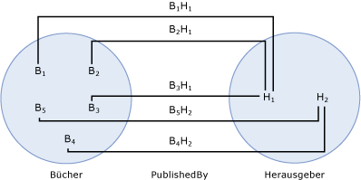

# Entitätenmenge
Ein *Entitätenmenge* ist ein logischer Container für Instanzen von einem [Entitätstyp](../../../../docs/framework/data/adonet/entity-type.md) und Instanzen eines beliebigen Typs abgeleitet aus diesem Entitätstyp. (Informationen über abgeleitete Typen finden Sie unter [Entity Data Model: Vererbung](../../../../docs/framework/data/adonet/entity-data-model-inheritance.md).) Die Beziehung zwischen einem Entitätstyp und einer Entitätenmenge entspricht der Beziehung zwischen einer Zeile und einer Tabelle in einer relationalen Datenbank: Wie eine Zeile beschreibt ein Entitätstyp Datenstruktur, und eine Entitätenmenge enthält wie eine Tabelle Instanzen einer bestimmten Struktur. Eine Entitätenmenge ist keine Datenmodellkonstruktion, sie beschreibt keine Datenstruktur. Vielmehr stellt eine Entitätenmenge eine Konstruktion für eine Hosting- oder Speicherumgebung (z. B. die Common Language Runtime oder eine SQL Server-Datenbank) zum Gruppieren von Entitätstypinstanzen bereit, damit diese einem Datenspeicher zugeordnet werden können.  
  
 Eine Entitätenmenge wird definiert, in eine [Entitätscontainer](../../../../docs/framework/data/adonet/entity-container.md), dies ist eine logische Gruppierung von Entitätenmengen und [Zuordnungssätze](../../../../docs/framework/data/adonet/association-set.md).  
  
 Die folgenden Voraussetzungen müssen erfüllt sein, damit eine Entitätstypinstanz in einer Entitätenmenge existiert:  
  
-   Der Typ der Instanz stimmt entweder mit dem Entitätstyp überein, auf dem die Entitätenmenge basiert, oder der Typ der Instanz ist ein Untertyp des Entitätstyps.  
  
-   Die [Entitätsschlüssel](../../../../docs/framework/data/adonet/entity-key.md) für die Instanz innerhalb der Entitätenmenge eindeutig ist.  
  
-   Die Instanz ist in keiner anderen Entitätenmenge vorhanden.  
  
    > [!NOTE]
    >  Mehrere Entitätenmengen können mit dem gleichen Entitätstyp definiert werden, aber eine Instanz eines bestimmten Entitätstyps kann nur in einer Entitätenmenge vorhanden sein.  
  
 Sie müssen nicht für jeden Entitätstyp in einem konzeptionellen Modell eine Entitätenmenge definieren.  
  
## Beispiel  
 Die unten stehende Abbildung zeigt ein konzeptionelles Modell mit drei Entitätstypen: `Book`, `Publisher` und `Author`.  
  
   
  
 Die folgende Abbildung zeigt zwei Entitätenmengen (`Books` und `Publishers`) und einen Zuordnungssatz (`PublishedBy`) auf Grundlage des oben gezeigten konzeptionellen Modells. BI in der `Books` Entitätenmenge stellt eine Instanz der dem `Book` Entitätstyp zur Laufzeit. Auf ähnliche Weise Pj darstellen einer `Publisher` Instanz die `Publishers` Entitätenmenge. BiPj stellt eine Instanz der dem `PublishedBy` Zuordnung in der `PublishedBy` Zuordnungssatz.  
  
   
  
 Die [ADO.NET Entity Framework](../../../../docs/framework/data/adonet/ef/index.md) verwendet eine domänenspezifische Sprache (DSL) Bezeichnung konzeptionelle Schemadefinitionssprache ([CSDL](../../../../docs/framework/data/adonet/ef/language-reference/csdl-specification.md)) um konzeptionelle Modelle zu definieren. Die folgende CSDL definiert einen Entitätscontainer mit einer Entitätenmenge für jeden Entitätstyp im oben gezeigten konzeptionellen Modell. Beachten Sie, dass der Name und der Entitätstyp für jede Entitätenmenge mit XML-Attributen definiert werden.  
  
 [!code-xml[EDM_Example_Model#EntityContainerExample](../../../../samples/snippets/xml/VS_Snippets_Data/edm_example_model/xml/books.edmx#entitycontainerexample)]  
  
 Pro Typ (MEST) können mehrere Entitätssätze definiert werden. Die folgende CSDL definiert einen Entitätscontainer mit zwei Entitätenmengen für den `Book`-Entitätstyp:  
  
 [!code-xml[EDM_Example_Model#MESTExample](../../../../samples/snippets/xml/VS_Snippets_Data/edm_example_model/xml/books2.edmx#mestexample)]  
  
## Siehe auch  
 [Schlüsselkonzepte im Entity Data Model](../../../../docs/framework/data/adonet/entity-data-model-key-concepts.md)  
 [Entity Data Model](../../../../docs/framework/data/adonet/entity-data-model.md)
