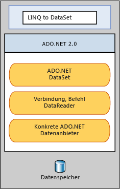

# LINQ to DataSet
Mit [!INCLUDE[linq_dataset](../../../../includes/linq-dataset-md.md)] können Daten, die in einem <xref:System.Data.DataSet>\-Objekt zwischengespeichert sind, leichter und schneller abgefragt werden.  Genauer gesagt, vereinfacht [!INCLUDE[linq_dataset](../../../../includes/linq-dataset-md.md)] das Abfragen, da der Entwickler Abfragen direkt in der Programmiersprache schreiben kann, statt eine separate Abfragesprache verwenden zu müssen.  Dies ist besonders für [!INCLUDE[vsprvs](../../../../includes/vsprvs-md.md)]\-Entwickler von Vorteil, kommen sie doch so beim Schreiben von Abfragen in den Genuss der von [!INCLUDE[vsprvs](../../../../includes/vsprvs-md.md)] gebotenen Funktionen, wie Syntaxüberprüfung bei der Kompilierung, statische Typisierung und IntelliSense\-Unterstützung.  
  
 [!INCLUDE[linq_dataset](../../../../includes/linq-dataset-md.md)] kann auch für das Abfragen von Daten verwendet werden, die aus einer oder mehreren Datenquellen konsolidiert wurden.  Dies ermöglicht eine Vielzahl von Szenarios, bei denen Flexibilität bei der Darstellung und Behandlung von Daten erforderlich ist, wie das Abfragen lokal aggregierter Daten und die Zwischenspeicherung auf der mittleren Ebene bei Webanwendungen.  Diese Manipulationsmethode wird insbesondere bei der Erstellung von Berichterstellungs\-, Analyse\- und Business Intelligence\-Anwendungen benötigt.  
  
 Die [!INCLUDE[linq_dataset](../../../../includes/linq-dataset-md.md)]\-Funktionalität wird in erster Linie durch die Erweiterungsmethoden in den Klassen <xref:System.Data.DataRowExtensions> und <xref:System.Data.DataTableExtensions> verfügbar gemacht. [!INCLUDE[linq_dataset](../../../../includes/linq-dataset-md.md)] baut auf der vorhandenen [!INCLUDE[ado_whidbey_long](../../../../includes/ado-whidbey-long-md.md)]\-Architektur auf und nutzt diese. Es soll auf keinen Fall [!INCLUDE[ado_whidbey_long](../../../../includes/ado-whidbey-long-md.md)] im Anwendungscode ersetzen.  Der vorhandene ADO.NET 2.0\-Code funktioniert auch in einer [!INCLUDE[linq_dataset](../../../../includes/linq-dataset-md.md)]\-Anwendung. Die Beziehung zwischen [!INCLUDE[linq_dataset](../../../../includes/linq-dataset-md.md)] und [!INCLUDE[ado_whidbey_long](../../../../includes/ado-whidbey-long-md.md)] und dem Datenspeicher wird im folgenden Diagramm illustriert.  
  
   
  
## In diesem Abschnitt  
 [Erste Schritte](../../../../docs/framework/data/adonet/getting-started-linq-to-dataset.md)  
  
 [Informationen zum Programmieren](../../../../docs/framework/data/adonet/programming-guide-linq-to-dataset.md)  
  
## Referenz  
 <xref:System.Data.DataTableExtensions>  
  
 <xref:System.Data.DataRowExtensions>  
  
 <xref:System.Data.DataRowComparer>  
  
## Siehe auch  
 [LINQ \(Language\-Integrated Query\)](../Topic/LINQ%20\(Language-Integrated%20Query\).md)   
 [LINQ und ADO.NET](../../../../docs/framework/data/adonet/linq-and-ado-net.md)   
 [ADO.NET](../../../../docs/framework/data/adonet/index.md)