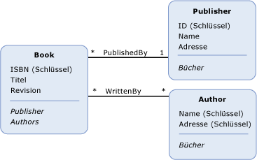

# Navigationseigenschaft
Ein *Navigationseigenschaft* ist eine optionale Eigenschaft für ein [Entitätstyp](../../../../docs/framework/data/adonet/entity-type.md) , mit dessen Hilfe für die Navigation von einem [End](../../../../docs/framework/data/adonet/association-end.md) des ein [Zuordnung](../../../../docs/framework/data/adonet/association-type.md) an das andere Ende. Im Gegensatz zu anderen [Eigenschaften](../../../../docs/framework/data/adonet/property.md), keine Navigationseigenschaften Daten.  
  
 Die Definition einer Navigationseigenschaft enthält Folgendes:  
  
-   Einen Namen. (erforderlich)  
  
-   Die Zuordnung, in der sie navigiert. (erforderlich)  
  
-   Die Enden der Zuordnung, in der sie navigiert. (erforderlich)  
  
 Beachten Sie, dass Navigationseigenschaften für beide Entitätstypen an den Enden einer Zuordnung optional sind. Wenn Sie für einen Entitätstyp am Ende einer Zuordnung eine Navigationseigenschaft definieren, muss keine Navigationseigenschaft für den Entitätstyp am anderen Ende der Zuordnung definiert werden.  
  
 Der Datentyp einer Navigationseigenschaft richtet sich nach der [Multiplizität](../../../../docs/framework/data/adonet/association-end-multiplicity.md) seine Remoteinstanz [Zuordnungsende](../../../../docs/framework/data/adonet/association-end.md). Angenommen, eine Navigationseigenschaft, `OrdersNavProp`, ist für einen `Customer`-Entitätstyp vorhanden und navigiert eine 1:n-Zuordnung zwischen `Customer` und `Order`. Da das Remotezuordnungsende für die Navigationseigenschaft eine Multiplizität von n (*) aufweist, ist sein Datentyp eine Auflistung (von `Order`). Ist eine Navigationseigenschaft, `CustomerNavProp`, für den `Order`-Entitätstyp vorhanden, wäre sein Datentyp dementsprechend `Customer`, da die Multiplizität des Remoteendes "eins" (1) beträgt.  
  
## Beispiel  
 Die unten stehende Abbildung zeigt ein konzeptionelles Modell mit drei Entitätstypen: `Book`, `Publisher` und `Author`. Die Navigationseigenschaften `Publisher` und `Authors` werden für den Book-Entitätstyp definiert. Die Navigationseigenschaft `Books` wird sowohl für den Publisher-Entitätstyp als auch den `Author`-Entitätstyp definiert.  
  
   
  
 Die [ADO.NET Entity Framework](../../../../docs/framework/data/adonet/ef/index.md) verwendet eine domänenspezifische Sprache (DSL) Bezeichnung konzeptionelle Schemadefinitionssprache ([CSDL](../../../../docs/framework/data/adonet/ef/language-reference/csdl-specification.md)) um konzeptionelle Modelle zu definieren. Die folgende CSDL definiert den in der Abbildung oben gezeigten `Book`-Entitätstyp:  
  
 [!code-xml[EDM_Example_Model#EntityExample](../../../../samples/snippets/xml/VS_Snippets_Data/edm_example_model/xml/books.edmx#entityexample)]  
  
 Beachten Sie, dass XML-Attribute verwendet werden, um die zum Definieren einer Navigationseigenschaft erforderlichen Informationen zu übermitteln: Das Attribut `Name` enthält den Namen der Eigenschaft, `Relationship` enthält den Namen der Zuordnung, in der sie navigiert, und `FromRole` sowie `ToRole` enthalten die Enden der Zuordnung.  
  
## Siehe auch  
 [Schlüsselkonzepte im Entity Data Model](../../../../docs/framework/data/adonet/entity-data-model-key-concepts.md)  
 [Entity Data Model](../../../../docs/framework/data/adonet/entity-data-model.md)
