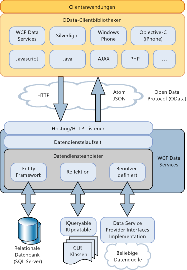

# &#220;bersicht &#252;ber WCF Data Services
[!INCLUDE[ssAstoria](../../../../includes/ssastoria-md.md)] ermöglicht mithilfe des [!INCLUDE[ssODataFull](../../../../includes/ssodatafull-md.md)] das Erstellen und Verwenden von Datendiensten für das Internet oder ein Intranet.  Mit [!INCLUDE[ssODataShort](../../../../includes/ssodatashort-md.md)] können Sie Daten als Ressourcen verfügbar machen, die mit URIs adressierbar sind.  Dies ermöglicht es Ihnen, mit der REST\-Semantik \(Representational State Transfer\) und insbesondere mit den standardmäßigen HTTP\-Verben GET, PUT, POST und DELETE auf Daten zuzugreifen und Daten zu ändern. Dieses Thema bietet eine Übersicht über die in [!INCLUDE[ssODataShort](../../../../includes/ssodatashort-md.md)] definierten Muster und Methoden und die von [!INCLUDE[ssAstoria](../../../../includes/ssastoria-md.md)] bereitgestellten Funktionen, mit denen [!INCLUDE[ssODataShort](../../../../includes/ssodatashort-md.md)] in .NET Framework\-basierten Anwendungen verwendet werden kann.  
  
## Adressieren von Daten als Ressourcen  
 [!INCLUDE[ssODataShort](../../../../includes/ssodatashort-md.md)] macht Daten als Ressourcen verfügbar, die anhand von URIs adressiert werden können. Die Ressourcenpfade werden basierend auf den Entitätsbeziehungskonventionen des Entity Data Model erstellt.  In diesem Modell stellen Entitäten Operationseinheiten von Daten in einer Anwendungsdomäne dar, z. B. Kunden, Bestellungen, Artikel und Produkte.  Weitere Informationen finden Sie unter [Entity Data Model](../../../../docs/framework/data/adonet/entity-data-model.md).  
  
 In [!INCLUDE[ssODataShort](../../../../includes/ssodatashort-md.md)] werden Entitätsressourcen als Entitätenmenge adressiert, der Instanzen von Entitätstypen enthält.  So gibt beispielsweise der URI `http://services.odata.org/Northwind/Northwind.svc/Customers('ALFKI')/Orders` alle Bestellungen des `Northwind`\-Datendiensts zurück, die mit dem Kunden mit dem `CustomerID`\-Wert `ALFKI.` verknüpft sind.  
  
 Mit Abfrageausdrücken können Sie herkömmliche Abfragevorgänge für Ressourcen ausführen, z. B. Filtern, Sortieren und Paging.  Der URI `http://services.odata.org/Northwind/Northwind.svc/Customers('ALFKI')/Orders?$filter=Freight gt 50` filtert z. B. die Ressourcen, um nur die Bestellungen mit Frachtkosten von über 50 Dollar zurückzugeben.  Weitere Informationen finden Sie unter [Zugreifen auf Datendienstressourcen](../../../../docs/framework/data/wcf/accessing-data-service-resources-wcf-data-services.md).  
  
## Interoperabler Datenzugriff  
 [!INCLUDE[ssODataShort](../../../../includes/ssodatashort-md.md)] beruht auf Standardinternetprotokollen, um die Interaktion von Datendiensten mit Anwendungen, die .NET Framework nicht verwenden, zu ermöglichen.  Da Sie Daten mithilfe von Standard\-URIs adressieren können, kann die Anwendung mit der REST\-Semantik \( Representational State Transfer\), speziell mit den Standard\-HTTP\-Verben GET, PUT, POST und DELETE, auf Daten zugreifen und diese ändern.  Dies ermöglicht Ihnen den Zugriff auf diese Dienste von einem Client, der über Standard\-HTTP\-Protokolle übertragene Daten analysieren und darauf zugreifen kann.  
  
 [!INCLUDE[ssODataShort](../../../../includes/ssodatashort-md.md)] definiert einen Satz von Erweiterungen für das Atom Publishing Protocol \(AtomPub\). HTTP\-Anforderungen und \-Antworten werden in mehreren Datenformaten unterstützt, um verschiedene Clientanwendungen und \-plattformen zu unterstützen.  Ein [!INCLUDE[ssODataShort](../../../../includes/ssodatashort-md.md)]\-Feed kann Daten in Atom, JavaScript Object Notation \(JSON\) und als einfaches XML darstellen.  Atom ist zwar das Standardformat, das Format des Feeds wird jedoch im Header der HTTP\-Anforderung angegeben.  Weitere Informationen finden Sie unter [OData: Atom\-Format](http://go.microsoft.com/fwlink/?LinkID=185794) und [OData: JSON\-Format](http://go.microsoft.com/fwlink/?LinkID=185795).  
  
 Beim Veröffentlichen von Daten als [!INCLUDE[ssODataShort](../../../../includes/ssodatashort-md.md)]\-Feed erfordert [!INCLUDE[ssAstoria](../../../../includes/ssastoria-md.md)] für Vorgänge wie das Zwischenspeichern und die Authentifizierung weitere vorhandene Internetfunktionen.  Hierzu wird [!INCLUDE[ssAstoria](../../../../includes/ssastoria-md.md)] in vorhandene Hostinganwendungen und Dienste integriert, z. B. ASP.NET, Windows Communication Foundation \(WCF\) und Internetinformationsdienste \(IIS\).  
  
## Speicherunabhängigkeit  
 Obwohl Ressourcen auf Grundlage eines Entitätsbeziehungsmodells adressiert werden, macht [!INCLUDE[ssAstoria](../../../../includes/ssastoria-md.md)] [!INCLUDE[ssODataShort](../../../../includes/ssodatashort-md.md)]\-Feeds unabhängig von der zugrunde liegenden Datenquelle verfügbar. Nachdem [!INCLUDE[ssAstoria](../../../../includes/ssastoria-md.md)] eine HTTP\-Anforderung für eine von einem URI identifizierte Ressource akzeptiert hat, wird die Anforderung deserialisiert, und eine Darstellung dieser Anforderung wird an einen [!INCLUDE[ssAstoria](../../../../includes/ssastoria-md.md)]\-Anbieter übergeben.  Dieser Anbieter übersetzt die Anforderung in ein datenquellenspezifisches Format und führt die Anforderung für die zugrunde liegende Datenquelle aus. [!INCLUDE[ssAstoria](../../../../includes/ssastoria-md.md)] erreicht Speicherunabhängigkeit, indem das konzeptionelle Modell, das von [!INCLUDE[ssODataShort](../../../../includes/ssodatashort-md.md)] vorgeschriebene Ressourcen adressiert, vom spezifischen Schema der zugrunde liegenden Datenquelle getrennt wird.  
  
 [!INCLUDE[ssAstoria](../../../../includes/ssastoria-md.md)] ist in ADO.NET Entity Framework integriert, sodass Sie Datendienste erstellen können, die relationale Daten verfügbar machen.  Sie können die Entity Data Model\-Tools verwenden, um ein Datenmodell zu erstellen, das adressierbare Ressourcen als Entitäten enthält, und gleichzeitig die Zuordnung zwischen diesem Modell und den Tabellen in der zugrunde liegenden Datenbank definieren.  Weitere Informationen finden Sie unter [Entity Framework\-Anbieter](../../../../docs/framework/data/wcf/entity-framework-provider-wcf-data-services.md).  
  
 [!INCLUDE[ssAstoria](../../../../includes/ssastoria-md.md)] ermöglicht außerdem das Erstellen von Datendiensten, die alle Datenstrukturen verfügbar machen, die eine Implementierung der <xref:System.Linq.IQueryable%601>\-Schnittstelle zurückgeben.  Dies ermöglicht das Erstellen von Datendiensten, die Daten aus .NET Framework\-Typen verfügbar machen.  Erstellungs\-, Aktualisierungs\- und Löschvorgänge werden unterstützt, wenn Sie außerdem die <xref:System.Data.Services.IUpdatable>\-Schnittstelle implementieren.  Weitere Informationen finden Sie unter [Reflektionsanbieter](../../../../docs/framework/data/wcf/reflection-provider-wcf-data-services.md).  
  
 Ein Beispiel für die Integration von [!INCLUDE[ssAstoria](../../../../includes/ssastoria-md.md)] in diesen Datenanbietern finden Sie im Architekturdiagramm weiter unten in diesem Thema.  
  
## Benutzerdefinierte Geschäftslogik  
 [!INCLUDE[ssAstoria](../../../../includes/ssastoria-md.md)] vereinfacht das Hinzufügen benutzerdefinierter Geschäftslogik zu einem Datendienst mithilfe von Dienstvorgängen und Interceptors.  Dienstvorgänge sind auf dem Server definierte Methoden, die genau wie Datenressourcen über URIs adressierbar sind.  Für Dienstvorgänge kann auch Abfrageausdruckssyntax zum Filtern, Sortieren und Paging der von einem Vorgang zurückgegebenen Daten verwendet werden. Der URI `http://localhost:12345/Northwind.svc/GetOrdersByCity?city='London'&$orderby=OrderDate&$top=10&$skip=10` stellt z. B. einen Aufruf des Dienstvorgangs mit dem Namen `GetOrdersByCity` im Northwind\-Datendienst dar, der Aufträge für Kunden aus London mit nach `OrderDate` sortierten Seitenergebnissen zurückgibt.  Weitere Informationen finden Sie unter [Dienstvorgänge](../../../../docs/framework/data/wcf/service-operations-wcf-data-services.md).  
  
 Mit Interceptoren können Sie eine benutzerdefinierte Anwendungslogik in die Verarbeitung von Anforderungs\- oder Antwortnachrichten durch einen Datendienst integrieren.  Interceptors werden aufgerufen, wenn für die angegebene Entitätenmenge ein Abfrage\-, Einfüge\-, Aktualisierungs\- oder Löschvorgang durchgeführt wird.  Dadurch kann ein Interceptor die Daten ändern, eine Autorisierungsrichtlinie erzwingen oder sogar den Vorgang beenden.  Interceptormethoden müssen explizit für eine bestimmte Entitätenmenge, die von einem Datendienst zur Verfügung gestellt wird, registriert werden.  Weitere Informationen finden Sie unter [Interceptoren](../../../../docs/framework/data/wcf/interceptors-wcf-data-services.md).  
  
## Clientbibliotheken  
 [!INCLUDE[ssODataShort](../../../../includes/ssodatashort-md.md)] definiert eine Reihe einheitlicher Muster zum Interagieren mit Datendiensten.  Dies ermöglicht das Erstellen wiederverwendbarer Komponenten auf Grundlage dieser Dienste, z. B. clientseitiger Bibliotheken, die die Verwendung dieser Datendienste erleichtern.  
  
 [!INCLUDE[ssAstoria](../../../../includes/ssastoria-md.md)] enthält Clientbibliotheken sowohl für .NET Framework\-basierte als auch für Silverlight\-basierte Clientanwendungen.  Diese Clientbibliotheken ermöglichen die Interaktion mit Datendiensten mithilfe von .NET Framework\-Objekten.  Zudem werden objektbasierte Abfragen und LINQ\-Abfragen, das Laden verknüpfter Objekte, die Änderungsnachverfolgung und die Identitätsauflösung unterstützt. Weitere Informationen finden Sie unter [WCF Data Services\-Clientbibliothek](../../../../docs/framework/data/wcf/wcf-data-services-client-library.md).  
  
 Neben den in .NET Framework und Silverlight enthaltenen [!INCLUDE[ssODataShort](../../../../includes/ssodatashort-md.md)]\-Clientbibliotheken sind weitere Clientbibliotheken verfügbar, mit denen Sie einen [!INCLUDE[ssODataShort](../../../../includes/ssodatashort-md.md)]\-Feed in Clientanwendungen nutzen können, z. B. PHP\-, AJAX\- und Java\-Anwendungen.  Weitere Informationen finden Sie unter [OData SDK](http://go.microsoft.com/fwlink/?LinkID=185796).  
  
## Architekturübersicht  
 Das folgende Diagramm veranschaulicht die [!INCLUDE[ssAstoria](../../../../includes/ssastoria-md.md)]\-Architektur zum Verfügbarmachen von [!INCLUDE[ssODataShort](../../../../includes/ssodatashort-md.md)]\-Feeds und zur Verwendung dieser Feeds in [!INCLUDE[ssODataShort](../../../../includes/ssodatashort-md.md)]\-fähigen Clientbibliotheken:  
  
   
  
## Siehe auch  
 [WCF Data Services 4.5](../../../../docs/framework/data/wcf/index.md)   
 [Erste Schritte](../../../../docs/framework/data/wcf/getting-started-with-wcf-data-services.md)   
 [Definieren von WCF Data Services](../../../../docs/framework/data/wcf/defining-wcf-data-services.md)   
 [Accessing a Data Service \(WCF Data Services\)](http://msdn.microsoft.com/de-de/1e54a2b9-2ec6-4002-b8f8-c1d8df37c350)   
 [WCF Data Services\-Clientbibliothek](../../../../docs/framework/data/wcf/wcf-data-services-client-library.md)   
 [Representational State Transfer \(REST\)](http://go.microsoft.com/fwlink/?LinkId=113919)