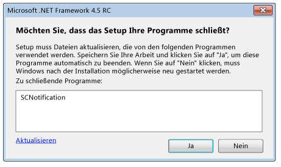

# Reduzieren von Systemneustarts bei .NET Framework 4.5-Installationen
Das Installationsprogramm [!INCLUDE[net_v45](../../../includes/net-v45-md.md)] verwendet den [Neustart-Manager](http://go.microsoft.com/fwlink/?LinkId=231425), um Systemneustarts während der Installation möglichst zu verhindern. Wenn das App-Setupprogramm .NET Framework installiert, kann es über eine Schnittstelle mit dem Neustart-Manager diese Funktion nutzen. Weitere Informationen finden Sie unter [How to: Get Progress from the .NET Framework 4.5 Installer (Vorgehensweise: Abrufen des Status vom Installationsprogramm für .NET Framework 4.5)](../../../docs/framework/deployment/how-to-get-progress-from-the-dotnet-installer.md).  
  
## Gründe für einen Neustart  
 Die [!INCLUDE[net_v45](../../../includes/net-v45-md.md)]-Installation erfordert einen Systemneustart, wenn während der Installation eine .NET Framework 4-App in Verwendung ist. Dies liegt daran, dass .NET Framework 4-Dateien durch [!INCLUDE[net_v45](../../../includes/net-v45-md.md)] ersetzt werden und diese Dateien während der Installation verfügbar sein müssen. In vielen Fällen lässt sich ein Neustart verhindern, indem .NET Framework 4-Apps, die in Verwendung sind, präemptiv erkannt und geschlossen werden. Einige System-Apps dürfen jedoch nicht geschlossen werden. In diesen Fällen lässt sich ein Neustart nicht vermeiden.  
  
## Endbenutzererfahrung  
 Ein Endbenutzer, der eine vollständige Installation von [!INCLUDE[net_v45](../../../includes/net-v45-md.md)] ausführt, hat die Möglichkeit zu verhindern, dass ein Systemneustart erfolgt, wenn das Installationsprogramm .NET Framework 4-Apps erkennt, die derzeit verwendet werden. In einer Meldung werden alle aktiven .NET Framework 4-Apps aufgeführt, und die Meldung bietet die Option, diese Apps vor der Installation zu schließen. Wenn der Benutzer die Option bestätigt, werden diese Apps vom Installationsprogramm beendet, und ein Systemneustart wird vermieden. Wenn der Benutzer nicht innerhalb einer bestimmten Zeitspanne auf die Meldung reagiert, wird die Installation fortgesetzt, ohne die Apps zu schließen.  
  
 Wenn der Neustart-Manager eine Situation erkennt, die einen Systemneustart erfordert, selbst wenn derzeit ausgeführte Apps geschlossen werden, wird die Meldung nicht angezeigt.  
  
   
Aufforderung zum Schließen von .NET Framework-Apps, die in Verwendung sind  
  
## Verwenden eines verketteten Installationsprogramms  
 Wenn Sie zusammen mit der App .NET Framework verteilen möchten, jedoch ein eigenes Setupprogramm und eine eigene Benutzeroberfläche verwendet werden sollen, können Sie den .NET Framework-Setupvorgang in den eigenen Setupvorgang einschließen (mit diesem verketten). Weitere Informationen zu verketteten Installationen finden Sie im [Handbuch für die Bereitstellung für Entwickler](../../../docs/framework/deployment/deployment-guide-for-developers.md). Um Systemneustarts bei verketteten Installationen zu reduzieren, stellt das .NET Framework-Installationsprogramm die Liste der zu schließenden Apps für das Setupprogramm bereit. Das Setupprogramm muss diese Informationen für den Benutzer über eine Benutzeroberfläche, z. B. ein Meldungsfeld, bereitstellen, die Antwort des Benutzers abrufen und dann die Antwort an das .NET Framework-Installationsprogramm weiterleiten. Ein Beispiel für ein verkettetes Installationsprogramm finden Sie unter [How to: Get Progress from the .NET Framework 4.5 Installer (Vorgehensweise: Abrufen des Status vom Installationsprogramm für .NET Framework 4.5)](../../../docs/framework/deployment/how-to-get-progress-from-the-dotnet-installer.md).  
  
 Wenn Sie ein verkettetes Installationsprogramm verwenden, jedoch kein eigenes Meldungsfeld zum Schließen von Apps bereitstellen möchten, können Sie beim Verketten des .NET Framework-Setupvorgangs die Befehlszeilenoptionen und `/showrmui` und `/passive` verwenden. Wenn Sie diese Optionen zusammen verwenden und die Apps geschlossen werden können, zeigt das Installationsprogramm das Meldungsfeld zum Schließen von Apps an, um einen Systemneustart zu vermeiden. Das Verhalten dieses Meldungsfelds im passiven Modus ist mit dem Verhalten auf der vollständigen Benutzeroberfläche identisch. Den vollständigen Satz von Befehlszeilenoptionen für .NET Framework Redisbutable finden Sie unter [Handbuch für die Bereitstellung für Entwickler](../../../docs/framework/deployment/deployment-guide-for-developers.md).  
  
## Siehe auch  
 [Bereitstellung](../../../docs/framework/deployment/index.md)  
 [Bereitstellungshandbuch für Entwickler](../../../docs/framework/deployment/deployment-guide-for-developers.md)  
 [Gewusst wie: Abrufen des Status vom Installationsprogramm für .NET Framework 4.5](../../../docs/framework/deployment/how-to-get-progress-from-the-dotnet-installer.md)
