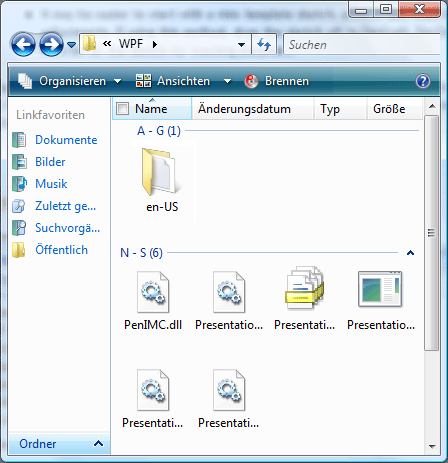

# Implementing the UI Automation Grid Control Pattern
> [!NOTE]
>  Diese Dokumentation ist für .NET Framework\-Entwickler vorgesehen, die die verwalteten [!INCLUDE[TLA2#tla_uiautomation](../../../includes/tla2sharptla-uiautomation-md.md)]\-Klassen verwenden möchten, die im <xref:System.Windows.Automation>\-Namespace definiert sind. Aktuelle Informationen zur [!INCLUDE[TLA2#tla_uiautomation](../../../includes/tla2sharptla-uiautomation-md.md)] finden Sie auf der Seite zur [Windows\-Automatisierungs\-API: UI\-Automatisierung](http://go.microsoft.com/fwlink/?LinkID=156746).  
  
 Dieses Thema enthält Richtlinien und Konventionen für das Implementieren von <xref:System.Windows.Automation.Provider.IGridProvider>, einschließlich Informationen über Eigenschaften, Methoden und Ereignissen. Links zu zusätzlichen Referenzen sind am Ende dieser Übersicht aufgelistet.  
  
 Das <xref:System.Windows.Automation.GridPattern>\-Steuerelementmuster wird zur Unterstützung von Steuerelementen verwendet, die als Container für eine Auflistung von untergeordneten Elementen dienen. Die untergeordneten Elemente dieses Elements müssen <xref:System.Windows.Automation.Provider.IGridItemProvider> implementieren und in einem zweidimensionalen logischen Koordinatensystem angeordnet sein, das zeilen\- und spaltenweise durchlaufen werden kann. Beispiele für Steuerelemente, die dieses Steuerelementmuster implementieren, finden Sie unter [Control Pattern Mapping for UI Automation Clients](../../../docs/framework/ui-automation/control-pattern-mapping-for-ui-automation-clients.md).  
  
   
## Implementierungsrichtlinien und \-konventionen  
 Beachten Sie beim Implementieren des Grid\-Steuerelementmusters die folgenden Richtlinien und Konventionen:  
  
-   Grid\-Koordinaten sind nullbasiert, wobei die obere linke Zelle \(oder die obere rechte Zelle, je nach Gebietsschema\) die Koordinaten \(0,0\) aufweist.  
  
-   Auch wenn eine Zelle leer ist, muss ein Benutzeroberflächenautomatisierungs\-Element zurückgegeben werden, um die <xref:System.Windows.Automation.Provider.IGridItemProvider.ContainingGrid%2A>\-Eigenschaft dieser Zelle zu unterstützen. Dies ist möglich, wenn das Layout von untergeordneten Elementen im Raster dem eines unregelmäßigen Arrays entspricht \(siehe folgendes Beispiel\).  
  
   
Beispiel für ein Grid\-Steuerelement mit leeren Koordinaten  
  
-   Ein Raster mit einem einzelnen Element muss weiterhin <xref:System.Windows.Automation.Provider.IGridProvider> implementieren, wenn es logisch als Raster gilt. Die Anzahl untergeordneter Elemente im Raster ist unwesentlich.  
  
-   Ausgeblendete Zeilen und Spalten können je nach der Anbieterimplementierung in der [!INCLUDE[TLA2#tla_uiautomation](../../../includes/tla2sharptla-uiautomation-md.md)]\-Struktur geladen werden. Daher werden sie in den Eigenschaften <xref:System.Windows.Automation.GridPattern.GridPatternInformation.RowCount%2A> und <xref:System.Windows.Automation.GridPattern.GridPatternInformation.ColumnCount%2A> angegeben. Wenn die ausgeblendeten Zeilen und Spalten noch nicht geladen wurden, sollten sie nicht gezählt werden.  
  
-   <xref:System.Windows.Automation.Provider.IGridProvider> ermöglicht keine aktive Bearbeitung eines Rasters. <xref:System.Windows.Automation.Provider.ITransformProvider> muss implementiert werden, um diese Funktionalität zu aktivieren.  
  
-   Verwenden Sie einen <xref:System.Windows.Automation.StructureChangedEventHandler>, um Änderungen an der Struktur oder am Layout des Raster zu erfassen, z. B. Zellen, die hinzugefügt, entfernt oder zusammengeführt wurden.  
  
-   Verwenden Sie einen <xref:System.Windows.Automation.AutomationFocusChangedEventHandler>, um den Durchlauf durch die Elemente oder Zellen eines Rasters zu verfolgen.  
  
   
## Erforderliche Member für IGridProvider  
 Zum Implementieren der IGridProvider\-Schnittstelle werden die folgenden Eigenschaften und Methoden benötigt.  
  
|Erforderliche Member|Typ|Notizen|  
|--------------------------|---------|-------------|  
|<xref:System.Windows.Automation.Provider.IGridProvider.RowCount%2A>|Eigenschaft|Keine|  
|<xref:System.Windows.Automation.Provider.IGridProvider.ColumnCount%2A>|Eigenschaft|Keine|  
|<xref:System.Windows.Automation.Provider.IGridProvider.GetItem%2A>|Methode|Keine|  
  
 Diesem Steuerelementmuster sind keine Ereignisse zugeordnet.  
  
   
## Ausnahmen  
 Anbieter müssen die folgenden Ausnahmen auslösen.  
  
|Ausnahmetyp|Bedingung|  
|-----------------|---------------|  
|<xref:System.ArgumentOutOfRangeException>|<xref:System.Windows.Automation.Provider.IGridProvider.GetItem%2A>   -   Wenn die angeforderte Zeilenkoordinate größer als <xref:System.Windows.Automation.Provider.IGridProvider.RowCount%2A> bzw. die Spaltenkoordinate größer als <xref:System.Windows.Automation.Provider.IGridProvider.ColumnCount%2A> ist.|  
|<xref:System.ArgumentOutOfRangeException>|<xref:System.Windows.Automation.Provider.IGridProvider.GetItem%2A>   -   Wenn eine der beiden angeforderten Zeilen\- oder Spaltenkoordinaten kleiner als 0 \(null\) ist.|  
  
## Siehe auch  
 [UI Automation Control Patterns Overview](../../../docs/framework/ui-automation/ui-automation-control-patterns-overview.md)   
 [Support Control Patterns in a UI Automation Provider](../../../docs/framework/ui-automation/support-control-patterns-in-a-ui-automation-provider.md)   
 [UI Automation Control Patterns for Clients](../../../docs/framework/ui-automation/ui-automation-control-patterns-for-clients.md)   
 [Implementing the UI Automation GridItem Control Pattern](../../../docs/framework/ui-automation/implementing-the-ui-automation-griditem-control-pattern.md)   
 [UI Automation Tree Overview](../../../docs/framework/ui-automation/ui-automation-tree-overview.md)   
 [Use Caching in UI Automation](../../../docs/framework/ui-automation/use-caching-in-ui-automation.md)