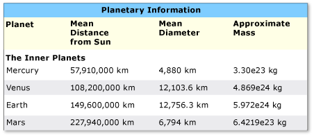
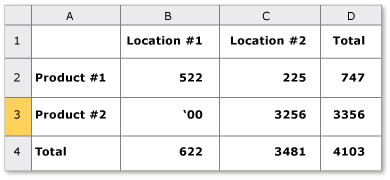

# Implementieren des Table-Steuerelementmusters der Benutzeroberfl&#228;chenautomatisierung
> [!NOTE]
>  Diese Dokumentation ist für .NET Framework-Entwickler, die die verwaltete verwenden möchten vorgesehen [!INCLUDE[TLA2#tla_uiautomation](../../../includes/tla2sharptla-uiautomation-md.md)] Klassen, die in der <xref:System.Windows.Automation> Namespace. Die neuesten Informationen zur [!INCLUDE[TLA2#tla_uiautomation](../../../includes/tla2sharptla-uiautomation-md.md)], finden Sie unter [Windows Automation API: UI-Automatisierung](http://go.microsoft.com/fwlink/?LinkID=156746).  
  
 Dieses Thema enthält Richtlinien und Konventionen zum Implementieren von <xref:System.Windows.Automation.Provider.ITableProvider>, einschließlich Informationen zu Eigenschaften, Methoden und Ereignisse. Links zu zusätzlichen Referenzen sind am Ende dieser Übersicht aufgelistet.  
  
 Die <xref:System.Windows.Automation.TablePattern> -Steuerelementmuster dient zur Unterstützung von Steuerelementen, die als Container für eine Auflistung von untergeordneten Elementen dienen. Die untergeordneten Elemente dieses Elements müssen implementieren <xref:System.Windows.Automation.Provider.ITableItemProvider> und organisiert werden, in einem zweidimensionalen logischen Koordinatensystem, die nach Zeilen und Spalten durchlaufen werden kann. Dieses Steuerelementmuster entspricht dem <xref:System.Windows.Automation.Provider.IgridProvider>, mit dem Unterschied, dass jedes implementieren Steuerelement <xref:System.Windows.Automation.Provider.ITableProvider> auch Beziehung verfügbar machen muss eine Spalte bzw. Zeile Header für jedes untergeordnete Element. Beispiele für Steuerelemente, die dieses Steuerelementmuster implementieren, finden Sie unter [Control Pattern Mapping for UI Automation Clients](../../../docs/framework/ui-automation/control-pattern-mapping-for-ui-automation-clients.md).  
  
   
## Implementierungsrichtlinien und -konventionen  
 Beachten Sie beim Implementieren des Table-Steuerelementmusters die folgenden Richtlinien und Konventionen:  
  
-   Zugriff auf den Inhalt der einzelnen Zellen erfolgt über eine zweidimensionalen logischen Koordinatensystem oder ein Array von der erforderlichen gleichzeitigen Implementierung von bereitgestellten <xref:System.Windows.Automation.Provider.IGridProvider>.  
  
-   Eine Spalten- oder Zeilenüberschrift kann in einem Tabellenobjekt enthalten sein oder ein separates Headerobjekt darstellen, das einem Tabellenobjekt zugeordnet ist.  
  
-   Spalten- und Zeilenüberschriften können sowohl eine primäre als auch beliebige unterstützende Überschriften enthalten.  
  
> [!NOTE]
>  Dieses Konzept wird im offensichtlich eine [!INCLUDE[TLA#tla_xl](../../../includes/tlasharptla-xl-md.md)] Kalkulationstabelle, in dem ein Benutzer eine Spalte "First Name" definiert wurde. Diese Spalte verfügt jetzt über zwei Überschriften. Die vom Benutzer definierte Überschrift „Vorname“ und die alphanumerische Bezeichnung der Spalte, die von der Anwendung zugewiesen wird.  
  
-   Finden Sie unter [implementieren die Grid-Steuerelementmusters der Benutzeroberflächenautomatisierung](../../../docs/framework/ui-automation/implementing-the-ui-automation-grid-control-pattern.md) für verwandte Rasterfunktionalität.  
  
   
Beispiel für eine Tabelle mit komplexen Spaltenüberschriften  
  
   
Beispiel für eine Tabelle mit mehrdeutiger RowOrColumnMajor-Eigenschaft  
  
   
## Erforderliche Member für ITableProvider  
 Für die ITableProvider-Schnittstelle werden die folgenden Eigenschaften und Methoden benötigt.  
  
|Erforderliche Member|Memberart|Notizen|  
|----------------------|-----------------|-----------|  
|<xref:System.Windows.Automation.Provider.ITableProvider.RowOrColumnMajor%2A>|Eigenschaft|Keine|  
|<xref:System.Windows.Automation.Provider.ITableProvider.GetColumnHeaders%2A>|Methode|Keine|  
|<xref:System.Windows.Automation.Provider.ITableProvider.GetRowHeaders%2A>|Methode|Keine|  
  
 Diesem Steuerelementmuster sind keine Ereignisse zugeordnet.  
  
   
## Ausnahmen  
 Diesem Steuerelementmuster sind keine Ausnahmen zugeordnet.  
  
## Siehe auch  
 [Übersicht über Steuerelementmuster für Benutzeroberflächenautomatisierung](../../../docs/framework/ui-automation/ui-automation-control-patterns-overview.md)   
 [Unterstützung von Steuerelementmustern in einem Benutzeroberflächenautomatisierungs-Anbieter](../../../docs/framework/ui-automation/support-control-patterns-in-a-ui-automation-provider.md)   
 [Steuerelementmuster für Benutzeroberflächenautomatisierung für Clients](../../../docs/framework/ui-automation/ui-automation-control-patterns-for-clients.md)   
 [Implementieren des TableItem-Steuerelementmusters der Benutzeroberflächenautomatisierung](../../../docs/framework/ui-automation/implementing-the-ui-automation-tableitem-control-pattern.md)   
 [Implementieren die Grid-Steuerelementmusters der Benutzeroberflächenautomatisierung](../../../docs/framework/ui-automation/implementing-the-ui-automation-grid-control-pattern.md)   
 [Übersicht über die Benutzeroberflächenautomatisierungs-Struktur](../../../docs/framework/ui-automation/ui-automation-tree-overview.md)   
 [Zwischenspeichern Sie in der Benutzeroberflächenautomatisierung](../../../docs/framework/ui-automation/use-caching-in-ui-automation.md)