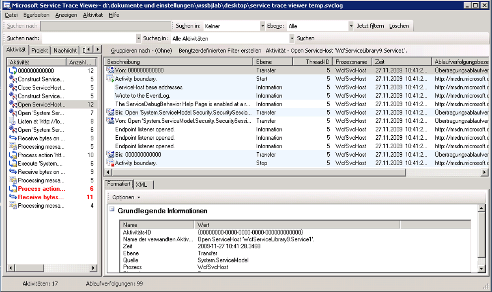
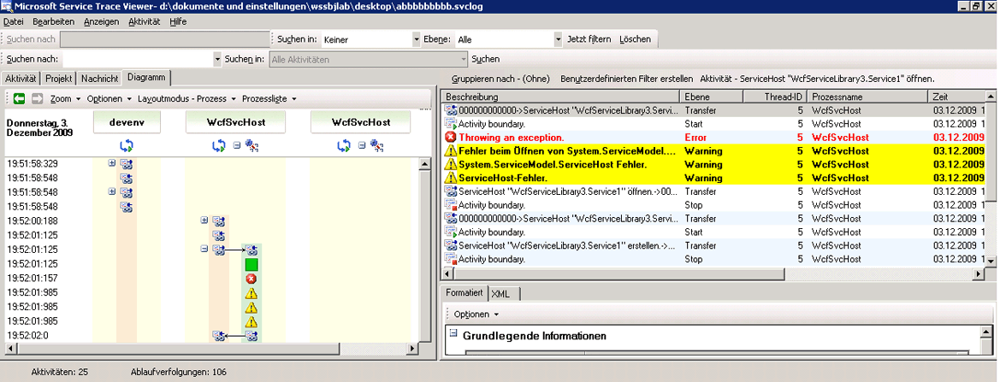

# <a name="emitting-user-code-traces"></a>Ausgeben von Benutzercode-Ablaufverfolgungen
Zusätzlich zum Aktivieren der Ablaufverfolgung in der Konfiguration zum Sammeln von Instrumentationsdaten, die von der Windows Communication Foundation (WCF) generiert, können Sie auch programmgesteuert in Benutzercode Ausgeben von ablaufverfolgungen. Auf diese Weise können proaktiv Instrumentierungsdaten zur späteren Analyse erstellt werden. Die entsprechende Vorgehensweise wird in diesem Thema erläutert.  
  
 Darüber hinaus die [erweitern Tracing](../../../../../docs/framework/wcf/samples/extending-tracing.md) Beispiel enthält den Code, die in den folgenden Abschnitten veranschaulicht.  
  
## <a name="creating-a-trace-source"></a>Erstellen einer Ablaufverfolgungsquelle  
 Mithilfe des folgenden Codes können Sie eine Ablaufverfolgungsquelle für Benutzer erstellen:  
  
```  
TraceSource ts = new TraceSource("myUserTraceSource");  
```  
  
## <a name="creating-activities"></a>Erstellen von Aktivitäten  
 Bei Aktivitäten handelt es sich um logische Verarbeitungseinheiten. Für jede größere Verarbeitungseinheit, in der Ablaufverfolgungen gruppiert werden sollen, kann eine Aktivität erstellt werden. So können Sie beispielsweise eine Aktivität für jede Anforderung an den Dienst erstellen. Gehen Sie hierzu folgendermaßen vor:  
  
1.  Speichern Sie die Aktivitäts-ID des Bereichs.  
  
2.  Erstellen Sie eine neue Aktivitäts-ID.  
  
3.  Wechseln Sie von der Aktivität des Bereichs zur neuen Aktivität, legen Sie die neue Aktivität für den Bereich fest, und geben Sie für diese Aktivität eine Start-Ablaufverfolgung aus.  
  
 Im folgenden Codebeispiel wird die hierfür erforderliche Vorgehensweise veranschaulicht:  
  
```  
Guid oldID = Trace.CorrelationManager.ActivityId;  
Guid traceID = Guid.NewGuid();  
ts.TraceTransfer(0, "transfer", traceID);  
Trace.CorrelationManager.ActivityId = traceID; // Trace is static  
ts.TraceEvent(TraceEventType.Start, 0, "Add request");  
```  
  
## <a name="emitting-traces-within-a-user-activity"></a>Ausgeben von Ablaufverfolgungen innerhalb einer Benutzeraktivität  
 Der folgende Code dient zum Ausgeben von Ablaufverfolgungen innerhalb einer Benutzeraktivität:  
  
```  
double value1 = 100.00D;  
double value2 = 15.99D;  
ts.TraceInformation("Client sends message to Add " + value1 + ", " + value2);  
double result = client.Add(value1, value2);  
ts.TraceInformation("Client receives Add response '" + result + "'");  
```  
  
## <a name="stopping-the-activities"></a>Beenden der Aktivitäten  
 Wechseln Sie zum Beenden der Aktivitäten zur vorherigen Aktivität zurück, beenden Sie die aktuelle Aktivitäts-ID, und legen Sie für den Bereich wieder die vorherige Aktivitäts-ID fest.  
  
 Im folgenden Codebeispiel wird die hierfür erforderliche Vorgehensweise veranschaulicht:  
  
```  
ts.TraceTransfer(0, "transfer", oldID);  
ts.TraceEvent(TraceEventType.Stop, 0, "Add request");  
Trace.CorrelationManager.ActivityId = oldID;  
```  
  
## <a name="propagating-the-activity-id-to-a-service"></a>Weitergeben der Aktivitäts-ID an einen Dienst  
 Wird das `propagateActivity`-Attribut für die `true`-Ablaufverfolgungsquelle sowohl in der Konfigurationsdatei des Clients als auch in der Konfigurationsdatei des Diensts auf `System.ServiceModel` festgelegt, erfolgt die Dienstverarbeitung für die Add-Anforderung in der Aktivität, die auch für den Client definiert ist. Werden vom Dienst eigene Aktivitäten und Übertragungen definiert, erscheinen die Dienstablaufverfolgungen nicht in der vom Client weitergegebenen Aktivität. Stattdessen erscheinen sie in einer Aktivität, die anhand von Übertragungsablaufverfolgungen mit der Aktivität korreliert wird, deren ID vom Client weitergegeben wird.  
  
> [!NOTE]
>  Wenn die `propagateActivity` -Attributsatz zur `true` auf dem Client und Dienst die umgebungsaktivität im Vorgangsbereich des Diensts von WCF festgelegt ist.  
  
 Sie können den folgenden Code verwenden, um zu überprüfen, ob eine Aktivität im Bereich von WCF festgelegt wurde.  
  
```  
// Check if an activity was set in scope by WCF, if it was   
// propagated from the client. If not, ( ambient activity is   
// equal to Guid.Empty), create a new one.  
if(Trace.CorrelationManager.ActivityId == Guid.Empty)  
{  
    Guid newGuid = Guid.NewGuid();  
    Trace.CorrelationManager.ActivityId = newGuid;  
}  
// Emit your Start trace.  
ts.TraceEvent(TraceEventType.Start, 0, "Add Activity");  
  
// Emit the processing traces for that request.  
serviceTs.TraceInformation("Service receives Add "   
                            + n1 + ", " + n2);  
// double result = n1 + n2;  
serviceTs.TraceInformation("Service sends Add result" + result);  
  
// Emit the Stop trace and exit the method scope.  
ts.TraceEvent(TraceEventType.Stop, 0, "Add Activity");  
// return result;  
```  
  
## <a name="tracing-exceptions-thrown-in-code"></a>Verfolgen von im Code ausgelösten Ausnahmen  
 Wird im Code eine Ausnahme ausgelöst, kann diese Ausnahme mithilfe des folgenden Codes auch ab der Warnstufe verfolgt werden:  
  
```  
ts.TraceEvent(TraceEventType.Warning, 0, "Throwing exception " + "exceptionMessage");  
```  
  
## <a name="viewing-user-traces-in-the-service-trace-viewer-tool"></a>Anzeigen von Benutzerablaufverfolgungen im Service Trace Viewer-Tool  
 Dieser Abschnitt enthält Screenshots von ablaufverfolgungen, die durch die Ausführung generiert der [erweitern Tracing](../../../../../docs/framework/wcf/samples/extending-tracing.md) Beispiel, bei der Anzeige mithilfe der [Service Trace Viewer-Tool (SvcTraceViewer.exe)](../../../../../docs/framework/wcf/service-trace-viewer-tool-svctraceviewer-exe.md).  
  
 In der folgenden Abbildung wird die zuvor erstellte "Add Request"-Aktivität im linken Bereich ausgewählt. Sie wird zusammen mit drei anderen mathematischen Operationen (Divide, Subtract, Multiply) aufgeführt. Diese stellen das Anwendungsclientprogramm dar. Durch den Benutzercode wurde für jede Operation eine neue Aktivität definiert, um potenzielle Fehler in verschiedenen Anforderungen zu isolieren.  
  
 Zur Veranschaulichung der Verwendung von Übertragungen in die [Tracing erweitern](../../../../../docs/framework/wcf/samples/extending-tracing.md) Beispiel eine Calculator-Aktivität, die die vier vorgangsanforderungen kapselt wird auch erstellt werden. Für jede Anforderung findet eine Übertragung von der Berechnungsaktivität zur Anforderungsaktivität und umgekehrt statt (die Ablaufverfolgung ist im rechten oberen Bereich der Abbildung hervorgehoben).  
  
 Wird im linken Bereich eine Aktivität ausgewählt, werden die in dieser Aktivität enthaltenen Ablaufverfolgungen im rechten oberen Bereich angezeigt. Wenn `propagateActivity` ist `true` an jedem Endpunkt des anforderungspfads, werden die ablaufverfolgungen in der Anforderungsaktivität von allen Prozessen, die in der Anforderung beteiligt sind. In diesem Beispiel sind sowohl Ablaufverfolgungen vom Client als auch vom Dienst enthalten (siehe 4. Spalte des Bereichs).  
  
 Diese Aktivität weist die folgende Verarbeitungsreihenfolge auf:  
  
1.  Client sendet Nachricht an Add.  
  
2.  Dienst empfängt Nachricht mit Add-Anforderung.  
  
3.  Dienst sendet Add-Antwort.  
  
4.  Client empfängt Add-Antwort.  
  
 All diese Ablaufverfolgungen werden auf Informationsebene ausgegeben. Durch Klicken auf eine Ablaufverfolgung im rechten oberen Bereich werden im rechten unteren Bereich die Details der entsprechenden Ablaufverfolgung angezeigt.  
  
 Im folgenden Diagramm sind auch Übertragungsablaufverfolgungen von der und zur Berechnungsaktivität sowie zwei Paare von Start- und Stop-Ablaufverfolgungen pro Anforderungsaktivität enthalten (eins für den Client, eins für den Dienst, also jeweils eins für jede Ablaufverfolgungsquelle).  
  
   
Liste der Aktivitäten nach Erstellungszeit (linker Bereich) und deren geschachtelter Aktivitäten (Bereich rechts oben)  
  
 Wird vom Dienstcode eine Ausnahme ausgelöst, durch die auch vom Client eine Ausnahme ausgelöst wird (beispielsweise bei Ausbleiben einer Antwort auf eine Anforderung), erscheinen sowohl die Warn- oder Fehlermeldung des Diensts als auch die des Clients in der gleichen Aktivität, um das Herstellen eines direkten Zusammenhangs zu ermöglichen. Im folgenden Diagramm ist eine Ausnahme, die besagt, "der Dienst zum Verarbeiten dieser Anforderung im Benutzercode verweigert." löst der Dienst aus. Der Client löst eine Ausnahme, die besagt, "der Server die Anforderung aufgrund eines internen Fehlers nicht verarbeiten konnte." auch aus.  
  
   
Endpunktübergreifende Fehler für eine bestimmte Anforderung erscheinen in der gleichen Aktivität, wenn die Anforderungsaktivitäts-ID weitergegeben wurde.  
  
 Durch Doppelklicken auf die Multiply-Aktivität im linken Bereich wird das folgende Diagramm angezeigt. Dieses enthält die Ablaufverfolgungen für die Multiply-Aktivität für jeden beteiligten Prozess. Es ist zu sehen, dass zunächst eine Warnung für den Service aufgetreten ist (Ausnahme ausgelöst). Daraufhin kommt es auch auf dem Client zu Warnungen und Fehlern, da die Anforderung nicht verarbeitet werden konnte. Somit lassen sich die kausale Fehlerbeziehung zwischen Endpunkten sowie die Grundursache des Fehlers ableiten.  
  
   
Diagrammansicht der Fehlerkorrelation  
  
 Zum Abrufen der vorherigen Ablaufverfolgungen wird `ActivityTracing` für die Benutzerablaufverfolgungsquellen und `propagateActivity=true` für die `System.ServiceModel`-Ablaufverfolgungsquelle festgelegt. `ActivityTracing` wurde nicht für die `System.ServiceModel`-Ablaufverfolgungsquelle festgelegt, um die Aktivitätsweitergabe von Benutzercode an Benutzercode zu ermöglichen. (Wenn ServiceModel-aktivitätsablaufverfolgung aktiviert ist, wird die auf dem Client definierte Aktivitäts-ID nicht ganz nach den Dienstcode Benutzer weitergegeben; Übertragungen korrelieren jedoch der Client und Dienst benutzercodeaktivitäten an die intermediate WCF-Aktivitäten.)  
  
 Das Definieren von Aktivitäten und das Weitergeben der Aktivitäts-ID ermöglicht das endpunktübergreifende Herstellen eines direkten Fehlerzusammenhangs. Dadurch lässt sich die Grundursache eines Fehlers schneller ermitteln.  
  
## <a name="see-also"></a>Siehe auch  
 [Erweitern der Ablaufverfolgung](../../../../../docs/framework/wcf/samples/extending-tracing.md)
