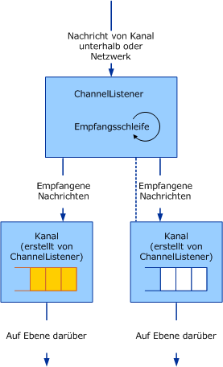

# <a name="service-channel-listeners-and-channels"></a>Dienst: Kanallistener und Kanäle

Es gibt drei Kategorien von kanalobjekten: Kanäle, Kanallistener und kanalfactorys. Kanäle sind die Schnittstelle zwischen der Anwendung und dem Kanalstapel. Kanallistener sind für die Erstellung von Kanälen auf der Empfänger- (oder Abhör-)Seite zuständig, normalerweise als Reaktion auf eine neue eingehende Nachricht oder Verbindung. Kanalfactorys sind dafür zuständig, Kanäle auf der Senderseite zu erstellen, um eine Kommunikation mit einem Endpunkt zu initiieren.

## <a name="channel-listeners-and-channels"></a>Kanallistener und Kanäle

Kanallistener sind für die Erstellung von Kanälen und den Empfang von Nachrichten von der unteren Ebene oder vom Netzwerk zuständig. Empfangene Nachrichten werden der oberen Ebene mithilfe eines Kanals, der durch den Kanallistener erstellt wird, zugestellt.

Im folgenden Diagramm wird der Prozess des Empfangs von Nachrichten und ihrer Übermittlung an die obere Ebene veranschaulicht.



Ein Kanallistener, der Nachrichten empfängt und sie der oberen Ebene über Kanäle zustellt.

Der Prozess kann in jedem Kanal als Warteschlange konzipiert werden, obwohl die Implementierung möglicherweise keine Warteschlange verwendet. Der Kanallistener ist dafür zuständig, Nachrichten von der unteren Ebene oder vom Netzwerk zu empfangen und sie in die Warteschlange zu stellen. Der Kanal ist für das Abrufen von Nachrichten aus der Warteschlange und ihre Übergabe an die obere Ebene zuständig, wenn diese Ebene eine Nachricht anfordert, z. B. durch Aufrufen von `Receive` im Kanal.

WCF stellt basisklassenhilfen für diesen Prozess bereit. (Für ein Diagramm der Kanal-Hilfsklassen, die in diesem Artikel beschrieben wird, finden Sie unter [Übersicht über das Kanalmodell](channel-model-overview.md).)

- Die <xref:System.ServiceModel.Channels.CommunicationObject> -Klasse implementiert <xref:System.ServiceModel.ICommunicationObject> und erzwingt die in Schritt 2 beschriebenen Zustandsautomaten [Entwickeln von Kanälen](developing-channels.md).

- Die <xref:System.ServiceModel.Channels.ChannelManagerBase> -Klasse implementiert <xref:System.ServiceModel.Channels.CommunicationObject> und bietet eine einheitliche Basisklasse für <xref:System.ServiceModel.Channels.ChannelFactoryBase> und <xref:System.ServiceModel.Channels.ChannelListenerBase>. Die <xref:System.ServiceModel.Channels.ChannelManagerBase>-Klasse funktioniert in Verbindung mit <xref:System.ServiceModel.Channels.ChannelBase>. Dies ist eine Basisklasse, die <xref:System.ServiceModel.Channels.IChannel> implementiert.

- Die <xref:System.ServiceModel.Channels.ChannelFactoryBase> -Klasse implementiert <xref:System.ServiceModel.Channels.ChannelManagerBase> und <xref:System.ServiceModel.Channels.IChannelFactory> und konsolidiert die `CreateChannel` -Überladungen in einer `OnCreateChannel` abstrakte Methode.

- Die <xref:System.ServiceModel.Channels.ChannelListenerBase> -Klasse implementiert <xref:System.ServiceModel.Channels.IChannelListener>. Die Klasse wird für grundlegende Zustandsverwaltung verwendet.

Die folgende Diskussion basiert auf der [Transport: UDP](../../../../docs/framework/wcf/samples/transport-udp.md) Beispiel.

## <a name="creating-a-channel-listener"></a>Erstellen eines kanallisteners

Die `UdpChannelListener` abgeleitet, dass das Beispiel implementiert die <xref:System.ServiceModel.Channels.ChannelListenerBase> Klasse. Er verwendet einen einzelnen UDP-Socket, um Datagramme zu empfangen. Die `OnOpen`-Methode empfängt Daten mit dem UDP-Socket in einer asynchronen Schleife. Die Daten werden dann mit dem Nachrichtencodierungssystem in Nachrichten konvertiert:

```csharp
message = UdpConstants.MessageEncoder.ReadMessage(
  new ArraySegment<byte>(buffer, 0, count),
  bufferManager
);
```

Da derselbe Datagrammkanal Nachrichten darstellt, die aus einer Reihe von Quellen eintreffen, ist der `UdpChannelListener` ein Singletonlistener. Es gibt höchstens einen aktiven <xref:System.ServiceModel.Channels.IChannel> diesem Listener gleichzeitig zugeordnet. In diesem Beispiel wird nur dann ein weiterer generiert, wenn ein Kanal, der mit der <xref:System.ServiceModel.Channels.ChannelListenerBase%601.AcceptChannel%2A>-Methode zurückgegeben wird, anschließend freigegeben wird. Wenn eine Nachricht empfangen wird, ist es in diesem in die Warteschlange eingereiht.

### <a name="udpinputchannel"></a>UdpInputChannel

Die `UdpInputChannel` -Klasse implementiert <xref:System.ServiceModel.Channels.IInputChannel>. Sie besteht aus einer Warteschlange mit eingehenden Nachrichten, die vom `UdpChannelListener`-Socket gefüllt wird. Diese Nachrichten werden mit der <xref:System.ServiceModel.Channels.IInputChannel.Receive%2A>-Methode aus der Warteschlange entfernt.
