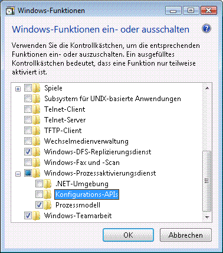

# Konfigurieren von Internetinformationsdienste 7.0 für Windows Communication Foundation
Internetinformationsdienste (IIS) 7.0 weist einen modularen Aufbau auf, der es Ihnen ermöglicht, die benötigten Komponenten selektiv zu installieren. Dieser Aufbau basiert auf der neuen manifest-gesteuerten Komponententechnologie, die in [!INCLUDE[wv](../../../../includes/wv-md.md)] eingeführt wurde. Es gibt mehr als 40 eigenständige Funktionskomponenten von [!INCLUDE[iisver](../../../../includes/iisver-md.md)], die unabhängig voneinander installiert werden können. Dies ermöglicht es IT-Profis, die Installation problemlos nach Bedarf anzupassen. In diesem Thema wird erläutert, wie [!INCLUDE[iisver](../../../../includes/iisver-md.md)] zur Verwendung mit [!INCLUDE[indigo1](../../../../includes/indigo1-md.md)] konfiguriert wird, und ermittelt, welche Komponenten erforderlich sind.  
  
## Minimale Installation: Installieren von WAS  
 Die minimale Installation des gesamten [!INCLUDE[iisver](../../../../includes/iisver-md.md)]-Pakets besteht in der Installation des Windows-Prozessaktivierungsdiensts (WAS). WAS ist eine eigenständige Funktion und die einzige Funktion in [!INCLUDE[iisver](../../../../includes/iisver-md.md)], die für alle [!INCLUDE[wv](../../../../includes/wv-md.md)]-Betriebssysteme (Home Basic, Home Premium, Business und Ultimate sowie Enterprise) zur Verfügung steht.  
  
 Klicken Sie in der Systemsteuerung auf **Programme** , und klicken Sie dann auf **Windows-Funktionen ein- oder ausschalten** unter aufgeführt **Programme und Funktionen**, die WAS-Komponente wird angezeigt, der die Liste wie in der folgenden Abbildung dargestellt.  
  
   
  
 Diese Funktion weist die folgenden untergeordneten Komponenten auf:  
  
-   .NET-Umgebung  
  
-   Konfigurations-APIs  
  
-   Prozessmodell  
  
 Wenn Sie nur den Stammknoten von WAS, wählen Sie die **Prozessmodell** Unterknoten ist standardmäßig aktiviert. Beachten Sie, dass Sie mit dieser Installation lediglich WAS installieren, da kein Webserver unterstützt wird.  
  
 Vornehmen [!INCLUDE[indigo2](../../../../includes/indigo2-md.md)] oder eine beliebige [!INCLUDE[vstecasp](../../../../includes/vstecasp-md.md)] Anwendung funktioniert, überprüfen Sie die **'.NET-umgebung'** Kontrollkästchen. Dies bedeutet, dass alle WAS-Komponenten erforderlich sind, damit [!INCLUDE[indigo2](../../../../includes/indigo2-md.md)] und [!INCLUDE[vstecasp](../../../../includes/vstecasp-md.md)] ordnungsgemäß funktionieren. Diese werden automatisch überprüft, sobald Sie eine dieser Komponenten installieren.  
  
## IIS 7.0: Standardinstallation  
 Durch Überprüfen der **Internetinformationsdienste (IIS)** Feature, einige der untergeordneten Knoten sind wie in der folgenden Abbildung dargestellt automatisch aktiviert.  
  
   
  
 Dies ist die Standardinstallation von [!INCLUDE[iisver](../../../../includes/iisver-md.md)]. Mit dieser Installation können Sie [!INCLUDE[iisver](../../../../includes/iisver-md.md)] zum Verarbeiten von statischem Inhalt (wie HTML-Seiten und anderen Inhalt) verwenden. Sie können jedoch keine [!INCLUDE[vstecasp](../../../../includes/vstecasp-md.md)]- und CGI-Anwendungen oder [!INCLUDE[indigo2](../../../../includes/indigo2-md.md)]-Dienste ausführen.  
  
## IIS 7.0: Installation mit ASP.NET-Unterstützung  
 Sie müssen [!INCLUDE[vstecasp](../../../../includes/vstecasp-md.md)] installieren, um [!INCLUDE[vstecasp](../../../../includes/vstecasp-md.md)] in IIS 7.0 verwenden zu können. Nach der Überprüfung **ASP.NET**, sollte am Bildschirm Folgendes angezeigt.  
  
   
  
 Dies ist die minimale Umgebung, damit [!INCLUDE[indigo2](../../../../includes/indigo2-md.md)] und [!INCLUDE[vstecasp](../../../../includes/vstecasp-md.md)]-Anwendungen in [!INCLUDE[iisver](../../../../includes/iisver-md.md)] funktionieren.  
  
## IIS 7.0: Installation mit IIS 6.0-Kompatibilitätskomponenten  
 Bei der Installation von [!INCLUDE[iisver](../../../../includes/iisver-md.md)] auf einem System mit Visual Studio 2005 oder ein anderer Automatisierungsskripts oder Tools (z. B. "Adsutil.vbs"), die Konfiguration virtueller Anwendungen, mit denen [!INCLUDE[iis601](../../../../includes/iis601-md.md)] Metabasis-API, stellen Sie sicher, dass Sie sich beim dem [!INCLUDE[iis601](../../../../includes/iis601-md.md)]  **Skriptingtools**. Dies automatisch geprüft, ob die untergeordneten Knoten des [!INCLUDE[iis601](../../../../includes/iis601-md.md)] **-Verwaltungskompatibilität**. Die folgende Abbildung zeigt den Bildschirm, nachdem dies durchgeführt wurde.  
  
   
  
 Bei dieser Installation steht Ihnen alles zur Verfügung, was Sie zur Verwendung der [!INCLUDE[iisver](../../../../includes/iisver-md.md)]-, [!INCLUDE[vstecasp](../../../../includes/vstecasp-md.md)]- und [!INCLUDE[indigo2](../../../../includes/indigo2-md.md)]-Funktionen und -Beispiele im Internet benötigen.  
  
## Anforderungsbeschränkungen  
 Unter [!INCLUDE[wv](../../../../includes/wv-md.md)] mit IIS 7 wurden der Standardwert von `maxUri` und die `maxQueryStringSize`-Einstellungen geändert. Standardmäßig sind in Anforderungsfiltern in IIS 7.0 eine URL-Länge von 4096 Zeichen und Abfragezeichenfolgen mit einer Länge von 2048 Zeichen zulässig. Um diese Standardwerte zu ändern, fügen Sie das folgende XML der Datei App.config hinzu.  
  
 `<system.webServer>`  
  
 `<security>`  
  
 `<requestFiltering>`  
  
 `<requestLimits maxUrl="8192" maxQueryString="8192" />`  
  
 `</requestFiltering>`  
  
 `</security>`  
  
 `</system.webServer>`  
  
## Siehe auch  
 [WAS-Aktivierungsarchitektur](../../../../docs/framework/wcf/feature-details/was-activation-architecture.md)  
 [Konfigurieren von WAS für die Verwendung mit WCF](../../../../docs/framework/wcf/feature-details/configuring-the-wpa--service-for-use-with-wcf.md)  
 [Vorgehensweise: Installieren und Konfigurieren von WCF-Aktivierungskomponenten](../../../../docs/framework/wcf/feature-details/how-to-install-and-configure-wcf-activation-components.md)  
 [Windows Server AppFabric-Hostingfunktionen](http://go.microsoft.com/fwlink/?LinkId=201276)
