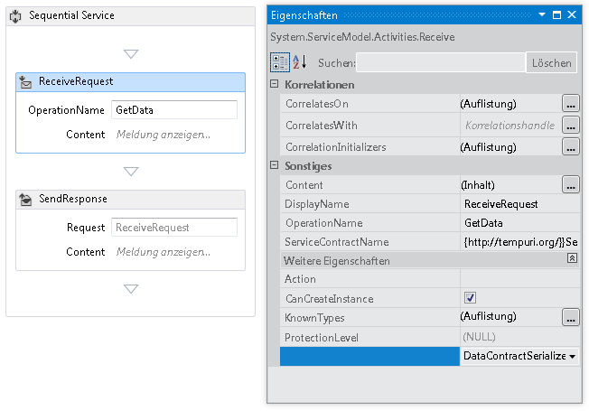
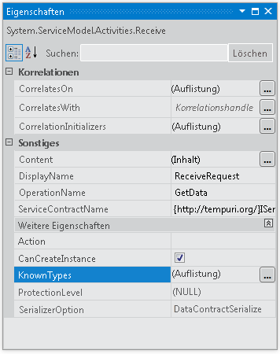

# <a name="configuring-serialization-in-a-workflow-service"></a>Konfigurieren der Serialisierung in einem Workflowdienst
Workflowdienste sind Windows Communication Foundation (WCF)-Dienste und daher keine verwenden Sie entweder die <xref:System.Runtime.Serialization.DataContractSerializer> (Standard) oder die <xref:System.Xml.Serialization.XmlSerializer>. Beim Schreiben von Nicht-Workflowdiensten wird der Typ des zu verwendenden Serialisierungsprogramms im Dienstvertrag oder Vorgangsvertrag angegeben. Beim Erstellen von WCF-Workflowdienste keinen diese Verträge im Code angeben, aber sie werden vielmehr zur Laufzeit generiert, durch vertragsrückschluss. Weitere Informationen zu vertragsrückschluss, finden Sie unter [Verwenden von Verträgen im Workflow](../../../../docs/framework/wcf/feature-details/using-contracts-in-workflow.md).  Das Serialisierungsprogramm wird mithilfe der <xref:System.ServiceModel.Activities.Receive.SerializerOption%2A>-Eigenschaft angegeben. Diese kann im Designer festgelegt werden, wie in der folgenden Abbildung dargestellt.  
  
   
  
 Das Serialisierungsprogramm kann auch im Code festgelegt werden, wie im folgenden Beispiel gezeigt.  
  
```  
Receive approveExpense = new Receive  
            {  
                OperationName = "ApproveExpense",  
                CanCreateInstance = true,  
                ServiceContractName = "FinanceService",  
                SerializerOption = SerializerOption.DataContractSerializer,  
                Content = ReceiveContent.Create(new OutArgument<Expense>(expense))  
            };  
```  
  
 Bekannte Typen können auch für Workflowdienste angegeben werden. Weitere Informationen über bekannte Typen finden Sie unter [Datenvertragstypen bezeichnet](../../../../docs/framework/wcf/feature-details/data-contract-known-types.md). Bekannte Typen können im Designer oder im Code angegeben werden. Um bekannte Typen im Designer anzugeben, klicken Sie im Eigenschaftenfenster für eine <xref:System.ServiceModel.Activities.Receive>-Aktivität neben der KnownTypes-Eigenschaft auf die Schaltfläche mit den Auslassungspunkten, wie in der folgenden Abbildung gezeigt.  
  
   
  
 Dadurch wird der Typauflistungs-Editor angezeigt, mit dem Sie bekannte Typen suchen und angeben können.  
  
   
  
 Klicken Sie auf die **hinzufügen, geben Sie neue** verknüpfen und mithilfe der Dropdownliste auswählen oder einen Typ zu suchen, das der Auflistung bekannter Typen hinzugefügt. Verwenden Sie die <xref:System.ServiceModel.Activities.Receive.KnownTypes%2A>-Eigenschaft, um bekannte Typen im Code anzugeben, wie im folgenden Beispiel gezeigt.  
  
```  
Receive approveExpense = new Receive  
            {  
                OperationName = "ApproveExpense",  
                CanCreateInstance = true,  
                ServiceContractName = "FinanceService",  
                SerializerOption = SerializerOption.DataContractSerializer,  
                Content = ReceiveContent.Create(new OutArgument<Expense>(expense))  
            };  
            approveExpense.KnownTypes.Add(typeof(Travel));  
            approveExpense.KnownTypes.Add(typeof(Meal));  
```  
  
 Um ein vollständiges Codebeispiel zeigt, wie Serialisierung, die für einen Workflowdienst konfigurieren finden Sie unter finden Sie unter [Formatieren von Meldungen in Workflowdiensten](../../../../docs/framework/windows-workflow-foundation/samples/formatting-messages-in-workflow-services.md).
