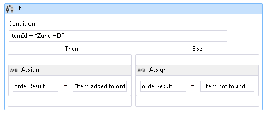
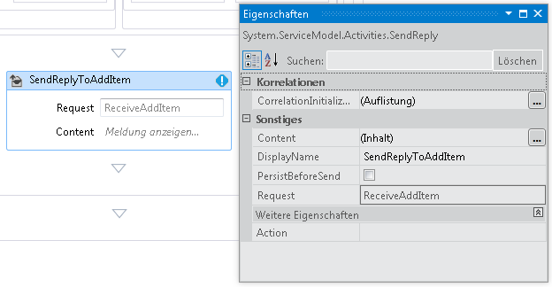

# Erstellen eines Workflowdiensts mit langer Ausf&#252;hrungszeit
In diesem Thema wird beschrieben, wie ein Workflowdienst mit langer Laufzeit erstellt wird.  Workflowdienste mit langer Laufzeit können über einen sehr großen Zeitraum hinweg ausgeführt werden.  Währenddessen kann der Workflow in den Leerlauf wechseln und auf weitere Informationen warten.  In diesem Fall wird der Workflow in einer SQL\-Datenbank beibehalten und aus dem Arbeitsspeicher entfernt.  Wenn weitere Informationen für die Workflowinstanz verfügbar sind, wird diese wieder in den Arbeitsspeicher geladen, und die Ausführung wird fortgesetzt.  In diesem Szenario implementieren Sie ein stark vereinfachtes Bestellsystem.  Zunächst wird eine Nachricht vom Client an den Workflow gesendet, um die Bestellung zu beginnen.  Die Bestell\-ID wird an den Client zurückgegeben.  Der Workflowdienst wartet nun auf eine weitere Nachricht vom Client, wechselt in den Leerlauf und wird in der SQL\-Datenbank beibehalten.  Wenn die nächste Nachricht vom Client mit der Bestellung eines Artikels empfangen wird, wird der Workflowdienst wieder in den Arbeitsspeicher geladen, und die Bestellung wird abschließend bearbeitet.  In diesem Codebeispiel wird eine Zeichenfolge zurückgegeben, die angibt, dass der Artikel der Bestellung hinzugefügt wurde.  Das Codebeispiel ist nicht als reale Anwendung der Technologie gedacht. Es soll vielmehr auf einfache Weise einen Workflowdienst mit langer Laufzeit veranschaulichen. In diesem Thema wird davon ausgegangen, dass Sie mit dem Erstellen von [!INCLUDE[vs_current_long](../../../../includes/vs-current-long-md.md)]\-Projekten und \-Projektmappen vertraut sind.  
  
## Vorbereitungsmaßnahmen  
 Sie müssen folgende Software installiert haben, um diese exemplarische Vorgehensweise verwenden zu können:  
  
1.  Microsoft SQL Server 2008  
  
2.  [!INCLUDE[vs_current_long](../../../../includes/vs-current-long-md.md)]  
  
3.  Microsoft [!INCLUDE[netfx_current_long](../../../../includes/netfx-current-long-md.md)]  
  
4.  Sie sind mit WCF und [!INCLUDE[vs_current_long](../../../../includes/vs-current-long-md.md)] vertraut und wissen, wie Projekte und Projektmappen erstellt werden.  
  
### So richten Sie die SQL\-Datenbank ein  
  
1.  Damit Workflowdienstinstanzen beibehalten werden können, muss Microsoft SQL Server installiert sein, und Sie müssen eine Datenbank konfiguriert haben, in der die beibehaltenen Workflowinstanzen gespeichert werden können.  Klicken Sie auf **Start**, und wählen Sie **Alle Programme**, **Microsoft SQL Server 2008** sowie **Microsoft SQL Management Studio** aus, um Microsoft SQL Management Studio auszuführen.  
  
2.  Klicken Sie auf die Schaltfläche **Verbinden**, um sich bei der SQL Server\-Instanz anzumelden.  
  
3.  Klicken Sie in der Strukturansicht mit der rechten Maustaste auf **Datenbanken**, und wählen Sie **Neue Datenbank** aus, um die neue Datenbank `SQLPersistenceStore` zu erstellen.  
  
4.  Führen Sie die Skriptdatei SqlWorkflowInstanceStoreSchema.sql unter C:\\Windows\\Microsoft.NET\\Framework\\v4.0\\SQL\\en in der SQLPersistenceStore\-Datenbank aus, um die erforderlichen Datenbankschemas einzurichten.  
  
5.  Führen Sie die Skriptdatei SqlWorkflowInstanceStoreLogic.sql unter C:\\Windows\\Microsoft.NET\\Framework\\v4.0\\SQL\\en in der SQLPersistenceStore\-Datenbank aus, um die erforderliche Datenbanklogik einzurichten.  
  
### So erstellen Sie den im Internet gehosteten Workflowdienst  
  
1.  Erstellen Sie eine [!INCLUDE[vs_current_long](../../../../includes/vs-current-long-md.md)]\-Projektmappe mit dem Namen `OrderProcessing`.  
  
2.  Fügen Sie der Projektmappe das neue [!INCLUDE[indigo2](../../../../includes/indigo2-md.md)]\-Workflowdienstanwendungsprojekt `OrderService` hinzu.  
  
3.  Wählen Sie im Dialogfeld mit den Projekteigenschaften die Registerkarte **Web** aus.  
  
    1.  Wählen Sie unter **Startaktion** die Aktion **Bestimmte Seite** aus, und geben Sie `Service1.xamlx` an.  
  
           
  
    2.  Wählen Sie unter **Server** den Eintrag **Lokalen IIS\-Webserver verwenden** aus.  
  
           
  
        > [!WARNING]
        >  [!INCLUDE[vs_current_long](../../../../includes/vs-current-long-md.md)] muss im Administratormodus ausgeführt werden, um diese Einstellung vorzunehmen.  
  
         Mit diesen beiden Schritten wird das Workflowdienstprojekt konfiguriert, das von IIS gehostet werden soll.  
  
4.  Öffnen Sie ggf. `Service1.xamlx`, und löschen Sie die vorhandenen Aktivitäten **ReceiveRequest** und **SendResponse**.  
  
5.  Wählen Sie die Aktivität **Sequenzieller Dienst** aus, klicken Sie auf den Link **Variablen**, und fügen Sie die Variablen aus der folgenden Abbildung hinzu.  Dadurch werden einige Variablen hinzugefügt, die im weiteren Verlauf in diesem Workflow verwendet werden.  
  
    > [!NOTE]
    >  Wenn CorrelationHandle nicht in der Dropdownliste für den Variablentyp enthalten ist, wählen Sie **Nach Typen suchen** aus der Dropdownliste aus.  Geben Sie CorrelationHandle im Feld **Typname** ein, wählen Sie CorrelationHandle aus dem Listenfeld aus, und klicken Sie auf **OK**.  
  
       
  
6.  Verschieben Sie eine **ReceiveAndSendReply**\-Aktivitätsvorlage per Drag & Drop in die Aktivität **Sequenzieller Dienst**.  Diese Gruppe von Aktivitäten empfängt eine Nachricht von einem Client und sendet eine Antwort.  
  
    1.  Wählen Sie die **Receive**\-Aktivität aus, und legen Sie die hevorgehobenen Eigenschaften fest, wie in der folgenden Abbildung veranschaulicht.  
  
           
  
         Mit der DisplayName\-Eigenschaft wird der angezeigte Name für die Receive\-Aktivität im Designer festgelegt.  Mit der ServiceContractName\-Eigenschaft und der OperationName\-Eigenschaft wird der Name des Dienstvertrags und des Vorgangs angegeben, die von der Receive\-Aktivität implementiert werden.  [!INCLUDE[crabout](../../../../includes/crabout-md.md)] Verwendung von Verträgen in Workflowdiensten finden Sie unter [Verwenden von Verträgen im Workflow](../../../../docs/framework/wcf/feature-details/using-contracts-in-workflow.md).  
  
    2.  Klicken Sie auf den Link **Definieren** in der **ReceiveStartOrder**\-Aktivität, und legen Sie die Eigenschaften fest, wie in der folgenden Abbildung veranschaulicht.  Beachten Sie, dass das Optionsfeld **Parameter** ausgewählt und der Parameter `p_customerName` an die Variable `customerName` gebunden ist.  Dadurch wird die **Receive**\-Aktivität konfiguriert, um einige Daten zu empfangen und an lokale Variablen zu binden.  
  
           
  
    3.  Wählen Sie die **SendReplyToReceive**\-Aktivität aus, und legen Sie die hervorgehobene Eigenschaft fest, wie in der folgenden Abbildung veranschaulicht.  
  
           
  
    4.  Klicken Sie auf den Link **Definieren** in der **SendReplyToStartOrder**\-Aktivität, und legen Sie die Eigenschaften fest, wie in der folgenden Abbildung veranschaulicht.  Beachten Sie, dass das Optionsfeld **Parameter** ausgewählt und der Parameter `p_orderId` an die Variable `orderId` gebunden ist.  Mit dieser Einstellung wird festgelegt, dass von der SendReplyToStartOrder\-Aktivität ein Wert vom Typ Zeichenfolge an den Aufrufer zurückgegeben wird.  
  
           
  
        > [!NOTE]
    5.  Verschieben Sie eine Zuweisungsaktivität per Drag & Drop zwischen der **Receive**\- und der **SendReply**\-Aktivität, und legen Sie die Eigenschaften fest, wie in der folgenden Abbildung veranschaulicht:  
  
           
  
         Dadurch wird eine neue Bestell\-ID erstellt, und der Wert wird in der orderId\-Variablen platziert.  
  
    6.  Wählen Sie die **ReplyToStartOrder**\-Aktivität aus.  Klicken Sie im Eigenschaftenfenster auf die Schaltfläche mit den Auslassungszeichen \(...\) für **CorrelationInitializers**.  Klicken Sie auf den Link **Initialisierer hinzufügen**, geben Sie `orderIdHandle` im Initialisierertextfeld ein, wählen Sie Abfragekorrelationsinitialisierer für den Korrelationstyp aus, und wählen Sie im Dropdownfeld für XPath\-Abfragen den Eintrag p\_orderId aus.  Diese Einstellungen sind in der folgenden Abbildung dargestellt.  Klicken Sie auf **OK**.  Dadurch wird eine Korrelation zwischen dem Client und dieser Instanz des Workflowdiensts initialisiert.  Wenn eine Nachricht mit dieser Bestell\-ID empfangen wird, wird sie an diese Instanz des Workflowdiensts weitergeleitet.  
  
           
  
7.  Verschieben Sie eine andere **ReceiveAndSendReply**\-Aktivität per Drag & Drop an das Ende des Workflows \(außerhalb der **Sequenz** mit der ersten **Receive**\- und der ersten **SendReply**\-Aktivität\).  Dadurch wird die zweite Meldung empfangen, die vom Client gesendet wurde, und beantwortet.  
  
    1.  Wählen Sie die **Sequenz** mit der neu hinzugefügten **Receive**\- und der neu hinzugefügten **SendReply**\-Aktivität aus, und klicken Sie auf die Schaltfläche **Variablen**.  Fügen Sie die in der folgenden Abbildung hervorgehobene Variable hinzu:  
  
           
  
    2.  Wählen Sie die **Receive**\-Aktivität aus, und legen Sie die Eigenschaften fest, wie in der folgenden Abbildung veranschaulicht:  
  
           
  
    3.  Klicken Sie in der **ReceiveAddItem**\-Aktivität auf den Link **Definieren**, und fügen Sie die Parameter hinzu, wie in der folgenden Abbildung veranschaulicht. Dadurch wird die Receive\-Aktivität konfiguriert, um zwei Parameter, die Bestell\-ID und die ID des bestellten Artikels zu akzeptieren.  
  
           
  
    4.  Klicken Sie auf die Auslassungsschaltfläche **CorrelateOn**, und geben Sie `orderIdHandle` ein.  Klicken Sie unter **XPath\-Abfragen** auf den Dropdownpfeil, und wählen Sie `p_orderId` aus.  Dadurch wird die Korrelation für die zweite Receive\-Aktivität konfiguriert.  [!INCLUDE[crabout](../../../../includes/crabout-md.md)] zur Korrelation finden Sie unter [Korrelation](../../../../docs/framework/wcf/feature-details/correlation.md).  
  
           
  
    5.  Verschieben Sie die **If**\-Aktivität per Drag & Drop unmittelbar hinter die **ReceiveAddItem**\-Aktivität.  Diese Aktivität verhält sich analog zu einer Anweisung.  
  
        1.  Legen Sie die **Condition**\-Eigenschaft auf `itemId==”Zune HD” (itemId=”Zune HD” for Visual Basic)` fest.  
  
        2.  Verschieben Sie eine **Assign**\-Aktivität per Drag & Drop in den Abschnitt **Then** und eine andere in den Bereich **Else**, und legen Sie die Eigenschaften der **Assign**\-Aktivitäten wie in der folgenden Abbildung veranschaulicht fest.  
  
               
  
             Wenn die Bedingung `true` ist, wird der Abschnitt **Then** ausgeführt.  Wenn die Bedingung `false` ist, wird der Abschnitt **Else** ausgeführt.  
  
        3.  Wählen Sie die **SendReplyToReceive**\-Aktivität aus, und legen Sie die **DisplayName**\- Eigenschaft fest, wie in der folgenden Abbildung veranschaulicht.  
  
               
  
        4.  Klicken Sie auf den Link **Definieren** in der **SetReplyToAddItem**\-Aktivität, und konfigurieren Sie sie, wie in der folgenden Abbildung veranschaulicht.  Dadurch wird die **SendReplyToAddItem**\-Aktivität konfiguriert, um den Wert in der `orderResult`\-Variablen zurückzugeben.  
  
               
  
8.  Öffnen Sie die web.config\-Datei, und fügen Sie folgende Elemente im Abschnitt \<behavior\> hinzu, um die Workflowpersistenz zu aktivieren.  
  
    ```xml  
    <sqlWorkflowInstanceStore connectionString="Data Source=your-machine\SQLExpress;Initial Catalog=SQLPersistenceStore;Integrated Security=True;Asynchronous Processing=True" instanceEncodingOption="None" instanceCompletionAction="DeleteAll" instanceLockedExceptionAction="BasicRetry" hostLockRenewalPeriod="00:00:30" runnableInstancesDetectionPeriod="00:00:02" />  
              <workflowIdle timeToUnload="0"/>  
  
    ```  
  
    > [!WARNING]
    >  Ersetzen Sie den Namen des Hosts und der SQL Server\-Instanz aus dem vorherigen Codeausschnitt.  
  
9. Erstellen Sie die Projektmappe.  
  
### So erstellen Sie eine Clientanwendung zum Aufrufen des Workflowdiensts  
  
1.  Fügen Sie der Projektmappe ein neues Konsolenanwendungsprojekt mit dem Namen `OrderClient` hinzu.  
  
2.  Fügen Sie dem `OrderClient`\-Projekt Verweise auf die folgenden Assemblys hinzu:  
  
    1.  System.ServiceModel.dll  
  
    2.  System.ServiceModel.Activities.dll  
  
3.  Fügen Sie dem Workflowdienst einen Dienstverweis hinzu, und geben Sie `OrderService` als Namespace an.  
  
4.  Fügen Sie der `Main()`\-Methode des Clientprojekts den folgenden Code hinzu:  
  
    ```  
    static void Main(string[] args)  
    {  
       // Send initial message to start the workflow service  
       Console.WriteLine("Sending start message");  
       StartOrderClient startProxy = new StartOrderClient();  
       string orderId = startProxy.StartOrder("Kim Abercrombie");  
  
       // The workflow service is now waiting for the second message to be sent  
       Console.WriteLine("Workflow service is idle...");  
       Console.WriteLine("Press [ENTER] to send an add item message to reactivate the workflow service...");  
       Console.ReadLine();  
  
       // Send the second message  
       Console.WriteLine("Sending add item message");  
       AddItemClient addProxy = new AddItemClient();  
       AddItem item = new AddItem();  
       item.p_itemId = "Zune HD";  
       item.p_orderId = orderId;  
  
       string orderResult = addProxy.AddItem(item);  
       Console.WriteLine("Service returned: " + orderResult);  
    }  
  
    ```  
  
5.  Erstellen Sie die Projektmappe, und führen Sie die `OrderClient`\-Anwendung aus.  Der folgende Text wird vom Client angezeigt:  
  
    ```Output  
  
                  Sending start message  
    Workflow service is idle...  Press [ENTER] to send an add item message to reactivate the workflow service...    
    ```  
  
6.  Um zu überprüfen, ob der Workflowdienst beibehalten wurde, starten Sie SQL Server Management Studio, indem Sie im **Startmenü** auf **Alle Programme**, **Microsoft SQL Server 2008** und **SQL Server Management Studio** klicken.  
  
    1.  Erweitern Sie im linken Bereich **Datenbanken**, **SQLPersistenceStore** und **Views**, und klicken Sie mit der rechten Maustaste auf **System.Activities.DurableInstancing.Instances**, und wählen Sie **Oberste 1000 Zeilen auswählen** aus.  Im Bereich **Ergebnisse** sollte mindestens eine Instanz aufgeführt sein.  Es kann sein, dass auch Instanzen früherer Ausführungen aufgelistet sind, wenn Fehler bei der Ausführung aufgetreten sind.  Sie können vorhandene Zeilen löschen, indem Sie mit der rechten Maustaste auf **System.Activities.DurableInstancing.Instances** klicken und **Oberste 200 Zeilen bearbeiten** auswählen. Anschließend klicken Sie auf die Schaltfläche **Ausführen**, wählen alle Zeilen im Ergebnisbereich aus und klicken auf **Löschen**.  Um zu überprüfen, ob in der Datenbank die Instanz angezeigt wird, die von Ihrer Anwendung erstellt wurde, können Sie überprüfen, ob die Ansicht für Instanzen vor Ausführung des Clients leer ist.  Führen Sie die Abfrage \(Oberste 1000 Zeilen auswählen\) erneut aus, sobald der Client ausgeführt wird, und überprüfen Sie, ob eine neue Instanz hinzugefügt wurde.  
  
7.  Drücken Sie die EINGABETASTE, um die Nachricht zum Hinzufügen des Artikels an den Workflowdienst zu senden.  Der folgende Text wird vom Client angezeigt:  
  
    ```Output  
  
                  Sending add item message  
    Service returned: Item added to order  
    Press any key to continue .  .  .    
    ```  
  
## Siehe auch  
 [Workflowdienste](../../../../docs/framework/wcf/feature-details/workflow-services.md)