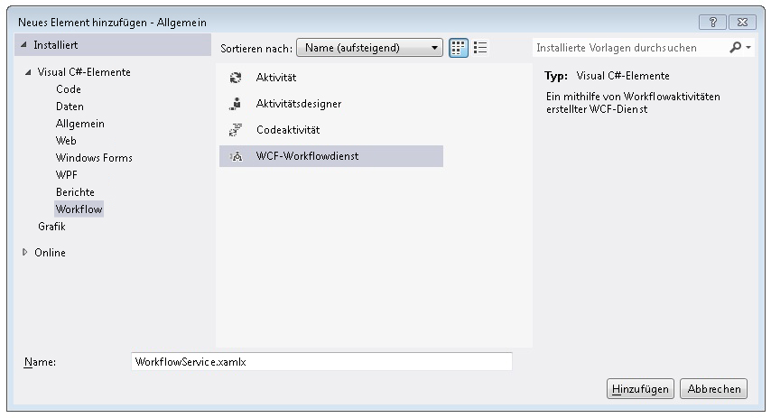
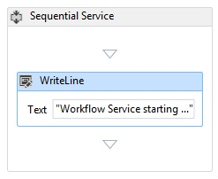
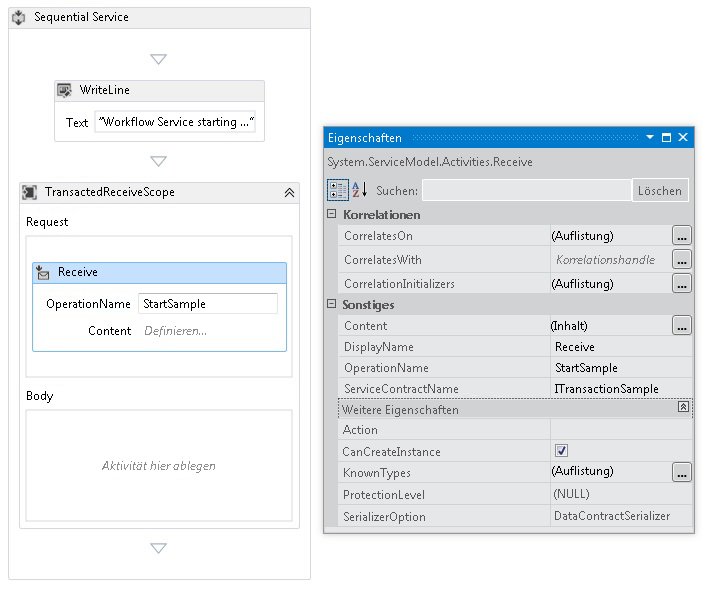
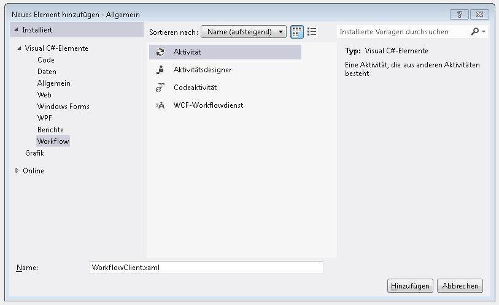
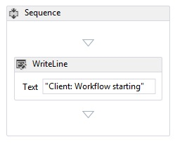
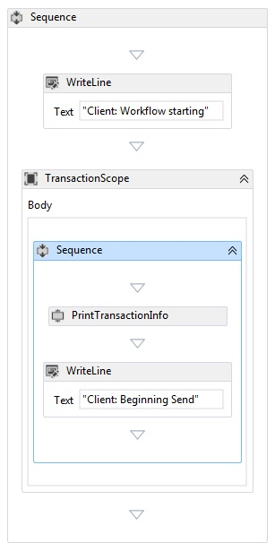
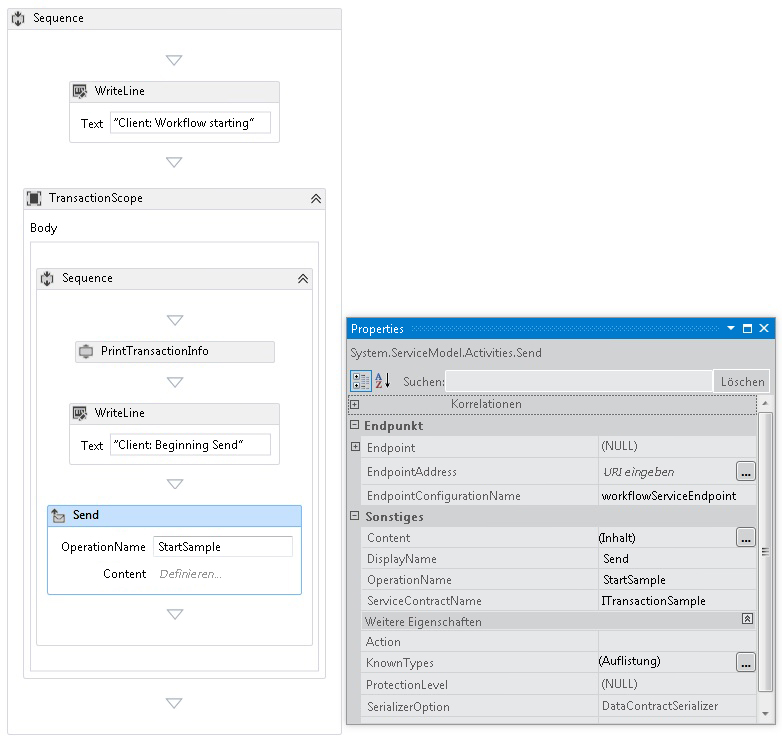

# <a name="flowing-transactions-into-and-out-of-workflow-services"></a>Transaktionsfluss in Workflowdienste und aus Workflowdiensten
Workflowdienste und Clients können an Transaktionen teilnehmen.  Damit ein Dienstvorgang Teil einer Ambient-Transaktion wird, fügen Sie eine <xref:System.ServiceModel.Activities.Receive>-Aktivität in eine <xref:System.ServiceModel.Activities.TransactedReceiveScope>-Aktivität ein. Alle Aufrufe, die von einer <xref:System.ServiceModel.Activities.Send>-Aktivität oder einer <xref:System.ServiceModel.Activities.SendReply>-Aktivität in <xref:System.ServiceModel.Activities.TransactedReceiveScope> durchgeführt werden, werden auch in der Ambient-Transaktion durchgeführt. Eine Workflowclientanwendung kann mit der <xref:System.Activities.Statements.TransactionScope>-Aktivität eine Ambient-Transaktion erstellen und Dienstvorgänge mithilfe der Ambient-Transaktion aufrufen. In diesem Thema wird die Erstellung eines Workflowdiensts und Workflowclients, die an Transaktionen teilnehmen, erläutert.  
  
> [!WARNING]
>  Wenn eine Workflowdienstinstanz innerhalb einer Transaktion geladen wird und der Workflow eine <xref:System.Activities.Statements.Persist>-Aktivität enthält, bleibt die Workflowinstanz bis zum Timeout der Transaktion hängen.  
  
> [!IMPORTANT]
>  Es wird empfohlen, bei Verwendung von <xref:System.ServiceModel.Activities.TransactedReceiveScope> alle empfangenen Nachrichten im Workflow in <xref:System.ServiceModel.Activities.TransactedReceiveScope>-Aktivitäten zu platzieren.  
  
> [!IMPORTANT]
>  Wenn Sie <xref:System.ServiceModel.Activities.TransactedReceiveScope> verwenden und Nachrichten in der falschen Reihenfolge eintreffen, wird beim Versuch, die erste der Nachrichten außerhalb der normalen Reihenfolge zu übermitteln, der Workflow abgebrochen. Sie müssen sicherstellen, dass der Workflow im Leerlauf stets einen konsistenten Haltepunkt aufweist. Falls der Workflow abgebrochen wird, können Sie ihn auf diese Weise anhand eines früheren Persistenzpunkts erneut starten.  
  
### <a name="create-a-shared-library"></a>Erstellen einer freigegebenen Bibliothek  
  
1.  Erstellen Sie eine neue leere Visual Studio-Projektmappe.  
  
2.  Fügen Sie ein neues Klassenbibliotheksprojekt mit dem Namen `Common` hinzu. Fügen Sie Verweise auf die folgenden Assemblys hinzu:  
  
    -   System.Activities.dll  
  
    -   System.ServiceModel.dll  
  
    -   System.ServiceModel.Activities.dll  
  
    -   System.Transactions.dll  
  
3.  Fügen Sie dem `PrintTransactionInfo`-Projekt eine neue Klasse mit dem Namen `Common` hinzu. Diese Klasse wird von <xref:System.Activities.NativeActivity> abgeleitet und überlädt die <xref:System.Activities.NativeActivity.Execute%2A>-Methode.  
  
    ```  
    using System;  
    using System;  
    using System.Activities;  
    using System.Transactions;  
  
    namespace Common  
    {  
        public class PrintTransactionInfo : NativeActivity  
        {  
            protected override void Execute(NativeActivityContext context)  
            {  
                RuntimeTransactionHandle rth = context.Properties.Find(typeof(RuntimeTransactionHandle).FullName) as RuntimeTransactionHandle;  
  
                if (rth == null)  
                {  
                    Console.WriteLine("There is no ambient RuntimeTransactionHandle");  
                }  
  
                Transaction t = rth.GetCurrentTransaction(context);  
  
                if (t == null)  
                {  
                    Console.WriteLine("There is no ambient transaction");  
                }  
                else  
                {  
                    Console.WriteLine("Transaction: {0} is {1}", t.TransactionInformation.DistributedIdentifier, t.TransactionInformation.Status);  
                }  
            }  
        }  
  
    }  
    ```  
  
     Diese native Aktivität, in der Informationen zur Ambient-Transaktion angezeigt werden, wird in den in diesem Thema verwendeten Dienst- und Clientworkflows eingesetzt. Erstellen der Projektmappe, um diese Aktivität in verfügbar zu machen die **allgemeine** Teil der **Toolbox**.  
  
### <a name="implement-the-workflow-service"></a>Implementieren des Workflowdiensts  
  
1.  Fügen Sie einen neuen [!INCLUDE[indigo2](../../../../includes/indigo2-md.md)] Workflowdienst aufgerufen `WorkflowService` auf die `Common` Projekt. Rechts klicken Sie hierzu die `Common` -Projekt, wählen **hinzufügen**, **neues Element...** Option **Workflow** unter **installierte Vorlagen** , und wählen Sie **WCF-Workflowdienst**.  
  
       
  
2.  Löschen Sie die `ReceiveRequest`-Standardaktivität und `SendResponse`-Standardaktivität.  
  
3.  Ziehen Sie eine <xref:System.Activities.Statements.WriteLine>-Aktivität in die `Sequential Service`-Aktivität. Legen Sie die Texteigenschaft auf `"Workflow Service starting ..."` fest, wie im folgenden Beispiel gezeigt.  
  
       
  
4.  Verschieben Sie eine <xref:System.ServiceModel.Activities.TransactedReceiveScope>-Aktivität per Drag & Drop an die Stelle nach der <xref:System.Activities.Statements.WriteLine>-Aktivität. Die <xref:System.ServiceModel.Activities.TransactedReceiveScope> -Aktivität befindet sich der **Messaging** Teil der **Toolbox**. Die <xref:System.ServiceModel.Activities.TransactedReceiveScope> Aktivität besteht aus zwei Abschnitten **anfordern** und **Text**. Die **anfordern** Abschnitt enthält die <xref:System.ServiceModel.Activities.Receive> Aktivität. Die **Text** Abschnitt enthält die Aktivitäten, die innerhalb einer Transaktion ausgeführt wird, nachdem eine Nachricht empfangen wurde.  
  
       
  
5.  Wählen Sie die <xref:System.ServiceModel.Activities.TransactedReceiveScope> Aktivität, und klicken Sie auf die **Variablen** Schaltfläche. Fügen Sie die folgenden Variablen hinzu:  
  
       
  
    > [!NOTE]
    >  Sie können die standardmäßig vorhandene Datenvariable löschen. Sie können auch die vorhandene Handlevariable verwenden.  
  
6.  Drag & drop eine <xref:System.ServiceModel.Activities.Receive> Aktivität innerhalb der **anfordern** Teil der <xref:System.ServiceModel.Activities.TransactedReceiveScope> Aktivität. Legen Sie die folgenden Eigenschaften fest:  
  
    |Eigenschaft|Wert|  
    |--------------|-----------|  
    |CanCreateInstance|Wahr (aktivieren Sie das Kontrollkästchen)|  
    |OperationName|StartSample|  
    |ServiceContractName|ITransactionSample|  
  
     Der Workflow müsste wie folgt aussehen:  
  
       
  
7.  Klicken Sie auf die **definieren...**  wiederherstellungsverknüpfung in der <xref:System.ServiceModel.Activities.Receive> Aktivität, und legen Sie die folgenden Einstellungen:  
  
       
  
8.  Ziehen Sie eine <xref:System.Activities.Statements.Sequence>-Aktivität per Drag & Drop in den Textabschnitt vom <xref:System.ServiceModel.Activities.TransactedReceiveScope>. Verschieben Sie innerhalb der <xref:System.Activities.Statements.Sequence>-Aktivität zwei <xref:System.Activities.Statements.WriteLine>-Aktivitäten per Drag & Drop, und legen Sie die <xref:System.Activities.Statements.WriteLine.Text%2A>-Eigenschaften wie in der folgenden Tabelle gezeigt fest.  
  
    |Aktivität|Wert|  
    |--------------|-----------|  
    |1. WriteLine|"Service: abgeschlossene empfangen"|  
    |2. WriteLine|"Service: Received = " + requestMessage|  
  
     Der Workflow müsste jetzt wie folgt aussehen:  
  
       
  
9. Drag & drop die `PrintTransactionInfo` Aktivität nach der zweiten <xref:System.Activities.Statements.WriteLine> Aktivität in der **Text** in die <xref:System.ServiceModel.Activities.TransactedReceiveScope> Aktivität.  
  
       
  
10. Ziehen Sie eine <xref:System.Activities.Statements.Assign>-Aktivität per Drag & Drop an die Stelle nach der `PrintTransactionInfo`-Aktivität, und legen Sie die Eigenschaften entsprechend der folgenden Tabelle fest.  
  
    |Eigenschaft|Wert|  
    |--------------|-----------|  
    |Beschreibung|replyMessage|  
    |Wert|"Service: Sending reply."|  
  
11. Ziehen Sie eine <xref:System.Activities.Statements.WriteLine>-Aktivität per Drag & Drop an die Stelle nach der <xref:System.Activities.Statements.Assign>-Aktivität, und legen Sie die <xref:System.Activities.Statements.WriteLine.Text%2A>-Eigenschaft auf "Service: Begin reply" fest.  
  
     Der Workflow müsste jetzt wie folgt aussehen:  
  
       
  
12. Klicken Sie mit der rechten Maustaste auf die <xref:System.ServiceModel.Activities.Receive> Aktivität, und wählen **SendReply erstellen** und fügen Sie ihn nach dem letzten <xref:System.Activities.Statements.WriteLine> Aktivität. Klicken Sie auf die **definieren...**  wiederherstellungsverknüpfung in der `SendReplyToReceive` Aktivität, und legen Sie die folgenden Einstellungen.  
  
       
  
13. Drag & drop eine <xref:System.Activities.Statements.WriteLine> Aktivität nach dem der `SendReplyToReceive` Aktivität, und legen sie hat <xref:System.Activities.Statements.WriteLine.Text%2A> Eigenschaft, um "Service: Reply sent."  
  
14. Verschieben Sie eine <xref:System.Activities.Statements.WriteLine>-Aktivität per Drag & Drop an das Ende des Workflows, und legen Sie die Eigenschaft <xref:System.Activities.Statements.WriteLine.Text%2A> auf "Service: Workflow ends, press ENTER to exit" fest.  
  
     Der abgeschlossene Dienstworkflow müsste wie folgt aussehen:  
  
       
  
### <a name="implement-the-workflow-client"></a>Implementieren des Workflowclients  
  
1.  Fügen Sie eine neue WCF-Workflowanwendung mit dem Namen `WorkflowClient` zum `Common`-Projekt hinzu. Rechts klicken Sie hierzu die `Common` -Projekt, wählen **hinzufügen**, **neues Element...** Option **Workflow** unter **installierte Vorlagen** , und wählen Sie **Aktivität**.  
  
       
  
2.  Ziehen Sie eine <xref:System.Activities.Statements.Sequence>-Aktivität per Drag & Drop auf die Entwurfsoberfläche.  
  
3.  Verschieben Sie in der <xref:System.Activities.Statements.Sequence>-Aktivität eine <xref:System.Activities.Statements.WriteLine>-Aktivität per Drag & Drop, und legen Sie die <xref:System.Activities.Statements.WriteLine.Text%2A>-Eigenschaft auf `"Client: Workflow starting"` fest. Der Workflow müsste jetzt wie folgt aussehen:  
  
       
  
4.  Verschieben Sie eine <xref:System.Activities.Statements.TransactionScope>-Aktivität per Drag & Drop an die Stelle nach der <xref:System.Activities.Statements.WriteLine>-Aktivität.  Wählen Sie die <xref:System.Activities.Statements.TransactionScope>-Aktivität aus, klicken Sie auf die Schaltfläche Variablen, und fügen Sie die folgenden Variablen hinzu.  
  
       
  
5.  Ziehen Sie eine <xref:System.Activities.Statements.Sequence>-Aktivität per Drag & Drop in den Text der <xref:System.Activities.Statements.TransactionScope>-Aktivität.  
  
6.  Verschieben Sie eine `PrintTransactionInfo`-Aktivität per Drag & Drop innerhalb der <xref:System.Activities.Statements.Sequence>-Aktivität.  
  
7.  Drag & drop eine <xref:System.Activities.Statements.WriteLine> Aktivität nach dem die `PrintTransactionInfo` Aktivität, und legen dessen <xref:System.Activities.Statements.WriteLine.Text%2A> Eigenschaft auf "Client: Beginning Send". Der Workflow müsste jetzt wie folgt aussehen:  
  
       
  
8.  Ziehen Sie eine <xref:System.ServiceModel.Activities.Send>-Aktivität per Drag & Drop an die Stelle nach der <xref:System.Activities.Statements.Assign>-Aktivität, und legen Sie die folgenden Eigenschaften fest:  
  
    |Eigenschaft|Wert|  
    |--------------|-----------|  
    |EndpointConfigurationName|workflowServiceEndpoint|  
    |OperationName|StartSample|  
    |ServiceContractName|ITransactionSample|  
  
     Der Workflow müsste jetzt wie folgt aussehen:  
  
       
  
9. Klicken Sie auf die **definieren...**  verknüpfen, und legen Sie die folgenden Einstellungen:  
  
       
  
10. Klicken Sie mit der rechten Maustaste auf die <xref:System.ServiceModel.Activities.Send> Aktivität, und wählen **ReceiveReply erstellen**. Die <xref:System.ServiceModel.Activities.ReceiveReply>-Aktivität wird automatisch nach der <xref:System.ServiceModel.Activities.Send>-Aktivität platziert.  
  
11. Klicken Sie in der ReceiveReplyForSend-Aktivität auf den Link Definieren..., und legen Sie die folgenden Einstellungen fest:  
  
       
  
12. Verschieben Sie eine <xref:System.Activities.Statements.WriteLine>-Aktivität per Drag & Drop zwischen der <xref:System.ServiceModel.Activities.Send>-Aktivität und der <xref:System.ServiceModel.Activities.ReceiveReply>-Aktivität, und legen Sie die <xref:System.Activities.Statements.WriteLine.Text%2A>-Eigenschaft auf "Client: Send complete" fest.  
  
13. Ziehen Sie eine <xref:System.Activities.Statements.WriteLine>-Aktivität per Drag & Drop an die Stelle nach der <xref:System.ServiceModel.Activities.ReceiveReply>-Aktivität, und legen Sie die <xref:System.Activities.Statements.WriteLine.Text%2A>-Eigenschaft auf "Client side: Reply received = " + replyMessage fest.  
  
14. Verschieben Sie eine `PrintTransactionInfo`-Aktivität per Drag & Drop an die Stelle nach der <xref:System.Activities.Statements.WriteLine>-Aktivität.  
  
15. Verschieben Sie eine <xref:System.Activities.Statements.WriteLine>-Aktivität per Drag & Drop an das Ende des Workflows, und legen Sie die <xref:System.Activities.Statements.WriteLine.Text%2A>-Eigenschaft auf "Client workflow ends" fest. Der abgeschlossene Clientworkflow sollte wie das folgende Diagramm aussehen.  
  
       
  
16. Erstellen Sie die Projektmappe.  
  
### <a name="create-the-service-application"></a>Erstellen der Dienstanwendung  
  
1.  Fügen Sie der Projektmappe ein neues Konsolenanwendungsprojekt mit dem Namen `Service` hinzu. Fügen Sie Verweise auf die folgenden Assemblys hinzu:  
  
    1.  System.Activities.dll  
  
    2.  System.ServiceModel.dll  
  
    3.  System.ServiceModel.Activities.dll  
  
2.  Öffnen Sie die generierte Datei Program.cs und den folgenden Code:  
  
    ```  
    static void Main()  
          {  
              Console.WriteLine("Building the server.");  
              using (WorkflowServiceHost host = new WorkflowServiceHost(new DeclarativeServiceWorkflow(), new Uri("net.tcp://localhost:8000/TransactedReceiveService/Declarative")))  
              {                
                  //Start the server  
                  host.Open();  
                  Console.WriteLine("Service started.");  
  
                  Console.WriteLine();  
                  Console.ReadLine();  
                  //Shutdown  
                  host.Close();  
              };         
          }  
    ```  
  
3.  Fügen Sie dem Projekt die folgende app.config-Datei hinzu.  
  
    ```xml  
    <?xml version="1.0" encoding="utf-8" ?>  
    <!-- Copyright © Microsoft Corporation.  All rights reserved. -->  
    <configuration>  
        <system.serviceModel>  
            <bindings>  
                <netTcpBinding>  
                    <binding transactionFlow="true" />  
                </netTcpBinding>  
            </bindings>  
        </system.serviceModel>  
    </configuration>  
    ```  
  
### <a name="create-the-client-application"></a>Erstellen der Clientanwendung  
  
1.  Fügen Sie der Projektmappe ein neues Konsolenanwendungsprojekt mit dem Namen `Client` hinzu. Fügen Sie einen Verweis auf System.Activities.dll hinzu.  
  
2.  Öffnen Sie die Datei program.cs, und fügen Sie den folgenden Code hinzu.  
  
    ```  
    class Program  
        {  
  
            private static AutoResetEvent syncEvent = new AutoResetEvent(false);  
  
            static void Main(string[] args)  
            {  
                //Build client  
                Console.WriteLine("Building the client.");  
                WorkflowApplication client = new WorkflowApplication(new DeclarativeClientWorkflow());  
                client.Completed = Program.Completed;  
                client.Aborted = Program.Aborted;  
                client.OnUnhandledException = Program.OnUnhandledException;  
  
                //Wait for service to start  
                Console.WriteLine("Press ENTER once service is started.");  
                Console.ReadLine();  
  
                //Start the client              
                Console.WriteLine("Starting the client.");  
                client.Run();  
                syncEvent.WaitOne();  
  
                //Sample complete  
                Console.WriteLine();  
                Console.WriteLine("Client complete. Press ENTER to exit.");  
                Console.ReadLine();  
            }  
  
            private static void Completed(WorkflowApplicationCompletedEventArgs e)  
            {  
                Program.syncEvent.Set();  
            }  
  
            private static void Aborted(WorkflowApplicationAbortedEventArgs e)  
            {  
                Console.WriteLine("Client Aborted: {0}", e.Reason);  
                Program.syncEvent.Set();  
            }  
  
            private static UnhandledExceptionAction OnUnhandledException(WorkflowApplicationUnhandledExceptionEventArgs e)  
            {  
                Console.WriteLine("Client had an unhandled exception: {0}", e.UnhandledException);  
                return UnhandledExceptionAction.Cancel;  
            }  
        }  
    ```  
  
## <a name="see-also"></a>Siehe auch  
 [Workflowdienste](../../../../docs/framework/wcf/feature-details/workflow-services.md)  
 [Übersicht über Windows Communication Foundation-Transaktionen](../../../../docs/framework/wcf/feature-details/transactions-overview.md)  
 [Verwendung von TransactedReceiveScope](../../../../docs/framework/windows-workflow-foundation/samples/use-of-transactedreceivescope.md)
