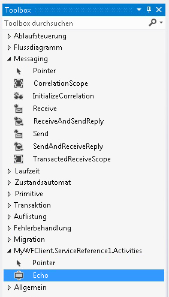

# Vorgehensweise: Zugreifen auf einen Dienst aus einer Workflowanwendung
In diesem Thema wird beschrieben, wie Sie einen Workflowdienst in einer Workflowkonsolenanwendung aufrufen. Es hängt vom Abschluss der [Vorgehensweise: Erstellen eines Workflowdiensts mit Messagingaktivitäten](../../../../docs/framework/wcf/feature-details/how-to-create-a-workflow-service-with-messaging-activities.md) Thema. Obwohl in diesem Thema beschrieben wird, wie Sie einen Workflowdienst aus einer Workflowanwendung aufrufen, können Sie die gleichen Methoden auch verwenden, um beliebige andere [!INCLUDE[indigo1](../../../../includes/indigo1-md.md)]-Dienste aus einer Workflowanwendung aufzurufen.  
  
### Erstellen eines Workflowkonsolen-Anwendungsprojekts  
  
1.  Starten Sie [!INCLUDE[vs_current_long](../../../../includes/vs-current-long-md.md)].  
  
2.  Laden Sie das MyWFService-Projekt, das Sie erstellt, in haben der [Vorgehensweise: Erstellen eines Workflowdiensts mit Messagingaktivitäten](../../../../docs/framework/wcf/feature-details/how-to-create-a-workflow-service-with-messaging-activities.md) Thema.  
  
3.  Klicken Sie mit der rechten Maustaste auf die **MyWFService** -Lösung in die **Projektmappen-Explorer** , und wählen Sie **hinzufügen**, **neues Projekt**. Wählen Sie **Workflow** in der **installierte Vorlagen** und **Workflowkonsolenanwendung** aus der Liste der Projekttypen zur Verfügung. Geben Sie dem Projekt den Namen "MyWFClient", und verwenden Sie wie in der folgenden Abbildung gezeigt den Standardspeicherort.  
  
       
  
     Klicken Sie auf die **OK** Schaltfläche beim Schließen der **hinzufügen Dialogfeld "Neues Projekt"**.  
  
4.  Nachdem das Projekt erstellt wurde, wird die Datei "Workflow1.xaml" im Designer geöffnet. Klicken Sie auf die **Toolbox** Tab, um die Toolbox zu öffnen, ist er nicht bereits geöffnet, und klicken Sie auf das Pinsymbol, damit das Toolboxfenster geöffnet bleibt.  
  
5.  Drücken Sie STRG+F5, um den Dienst zu erstellen und zu starten. Wie zuvor auch, wird der ASP.NET Development Server gestartet, und Internet Explorer zeigt die WCF-Hilfeseite an. Merken Sie sich den URI für diese Seite, da Sie diesen im nächsten Schritt verwenden.  
  
       
  
6.  Klicken Sie mit der rechten Maustaste auf die **MyWFClient** -Projekt in der **Projektmappen-Explorer** , und wählen Sie **Hinzufügen eines Dienstverweises**. Klicken Sie auf die **Discover** Schaltfläche, um die aktuelle Projektmappe nach Diensten suchen. Klicken Sie in der Liste "Dienste" auf das Dreieck neben der Datei "Service1.xamlx". Klicken Sie auf das Dreieck neben "Service1", um die vom Dienst "Service1" implementierten Verträge aufzuführen. Erweitern Sie die **"Service1"** Knoten in der **Services** Liste. Echo-Vorgang wird angezeigt, der **Vorgänge** Liste wie in der folgenden Abbildung dargestellt.  
  
       
  
     Halten Sie den Standardnamespace, und klicken Sie auf **OK** beim Schließen der **Hinzufügen eines Dienstverweises** Dialogfeld. Das folgende Dialogfeld wird angezeigt.  
  
       
  
     Klicken Sie auf **OK** um das Dialogfeld zu schließen. Drücken Sie dann STRG+UMSCHALT+B, um die Projektmappe zu erstellen. Beachten Sie, dass in der Toolbox ein neuer Abschnitt hinzugefügt wurde aufgerufen **MyWFClient.ServiceReference1.Activities**. Erweitern Sie diesen Abschnitt, und beachten Sie die Echo-Aktivität, die wie in der folgenden Abbildung dargestellt hinzugefügt wurde.  
  
       
  
7.  Drag & drop eine <!--zz <xref:System.ServiceModel.Activities.Sequence>--> `System.ServiceModel.Activities.Sequence` Aktivität auf die Designeroberfläche. Diese befindet sich in der **Control Flow** Abschnitt der Toolbox.  
  
8.  Mit der <!--zz <xref:System.ServiceModel.Activities.Sequence>--> `System.ServiceModel.Activities.Sequence` Aktivität im Fokus, klicken Sie auf die **Variablen** verknüpfen, und fügen Sie eine Zeichenfolgenvariable mit dem Namen `inString`. Geben Sie der Variablen einen Standardwert von `"Hello, world"` sowie eine Zeichenfolgenvariable mit dem Namen `outString` wie im folgenden Diagramm dargestellt.  
  
       
  
9. Drag & drop ein **Echo** Aktivität in der <!--zz <xref:System.ServiceModel.Activities.Sequence>--> `System.ServiceModel.Activities.Sequence`. Binden Sie im Eigenschaftenfenster die `inMsg` Argument an die `inString` Variable und die `outMsg` Argument an die `outString` -Variable, wie in der folgenden Abbildung dargestellt. Dadurch wird der Wert der `inString`-Variable an den Vorgang übergeben und anschließend der Rückgabewert in die `outString`-Variable eingefügt.  
  
       
  
10. Drag & drop eine **WriteLine** Aktivität unten die **Echo** Aktivität, die vom Dienstaufruf zurückgegebene Zeichenfolge anzuzeigen. Die **WriteLine** Aktivität befindet sich der **primitive** Knoten in der Toolbox. Binden der **Text** Argument der **WriteLine** Aktivität, um die `outString` Variable, indem Sie eingeben `outString` in das Textfeld auf die **WriteLine** Aktivität. Der Workflow sollte jetzt wie die folgende Abbildung aussehen.  
  
       
  
11. Mit der rechten Maustaste in die Projektmappe "mywfservice", und wählen Sie **Startprojekte festlegen...** . Wählen Sie die **mehrere Startprojekte** Optionsfeld und wählen Sie **starten** für jedes Projekt in der **Aktion** Spalte wie in der folgenden Abbildung gezeigt.  
  
       
  
12. Drücken Sie STRG+F5, um sowohl den Dienst als auch den Client zu starten. Der Dienst für den ASP.NET Development Server gehostet, Internet Explorer zeigt die WCF-Hilfeseite und die Workflow-Clientanwendung wird in einem Konsolenfenster gestartet und zeigt die Zeichenfolge, die vom Dienst ("Hello, World") zurückgegeben.  
  
## Siehe auch  
 [Workflowdienste](../../../../docs/framework/wcf/feature-details/workflow-services.md)  
 [Vorgehensweise: Erstellen eines Workflowdiensts mit Messagingaktivitäten](../../../../docs/framework/wcf/feature-details/how-to-create-a-workflow-service-with-messaging-activities.md)  
 [Verarbeiten einer WCF-Diensts aus einem Workflow in einem Webprojekt](http://go.microsoft.com/fwlink/?LinkId=207725)
