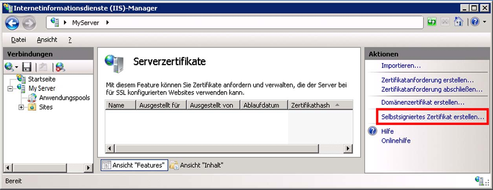

# <a name="how-to-configure-an-iis-hosted-wcf-service-with-ssl"></a>Vorgehensweise: Konfigurieren eines IIS-gehosteten WCF-Diensts mit SSL
In diesem Thema wird beschrieben, wie ein von IIS gehosteter WCF-Dienst für die Verwendung der HTTP-Transportsicherheit eingerichtet wird. Die HTTP-Transportsicherheit erfordert für die Registrierung bei IIS ein SSL-Zertifikat. Wenn Sie über kein SSL-Zertifikat verfügen, können Sie mit IIS ein Testzertifikat generieren. Danach müssen Sie der Website eine SSL-Bindung hinzufügen und die Authentifizierungseigenschaften der Website konfigurieren. Abschließend müssen Sie den WCF-Dienst für die Verwendung von HTTPS konfigurieren.  
  
### <a name="creating-a-self-signed-certificate"></a>Erstellen eines selbstsignierten Zertifikats  
  
1.  Öffnen Sie den Internetinformationsdienste-Manager (inetmgr.exe), und wählen Sie in der linken Strukturansicht den Computernamen aus. Wählen Sie auf der rechten Seite des Bildschirms Serverzertifikate aus.  
  
       
  
2.  Klicken Sie im Fenster Zertifikate auf den **selbstsigniertes Zertifikat erstellen...** Link.  
  
       
  
3.  Geben Sie einen Anzeigenamen für das selbstsignierte Zertifikat, und klicken Sie auf **OK**.  
  
       
  
     Die Details des neu erstellten selbstsignierten Zertifikats werden nun angezeigt, der **Serverzertifikate** Fenster.  
  
       
  
     Das generierte Zertifikat wird im Speicher für vertrauenswürdige Stammzertifizierungsstellen installiert.  
  
### <a name="add-ssl-binding"></a>Hinzufügen einer SSL-Bindung  
  
1.  Erweitern Sie im Internetinformationsdienste-Manager, der **Sites** Ordner und dann die **Default Web Site** Ordner in der Strukturansicht auf der linken Seite des Bildschirms.  
  
2.  Klicken Sie auf die **Bindungen...** Verknüpfen Sie der **Aktionen** Abschnitt im rechten oberen Bereich des Fensters.  
  
       
  
3.  Klicken Sie im Fenster Sitebindungen auf dem **hinzufügen** Schaltfläche.  
  
       
  
4.  In der **Sitebindung hinzufügen** Dialogfeld Wählen Sie Https für den Typ und den Anzeigenamen des selbstsignierten Zertifikats, das Sie gerade erstellt haben.  
  
       
  
### <a name="configure-virtual-directory-for-ssl"></a>Konfigurieren eines virtuellen Verzeichnisses für SSL  
  
1.  Wählen Sie im Internetinformationsdienste-Manager das virtuelle Verzeichnis aus, das den sicheren WCF-Dienst enthält.  
  
2.  Wählen Sie im mittleren Bereich des Fensters **SSL-Einstellungen** im IIS-Abschnitt.  
  
       
  
3.  Die SSL-Einstellungen wählen Sie im Bereich der **SSL erforderlich** Kontrollkästchen und klicken Sie auf der **übernehmen** link in der **Aktionen** Abschnitt auf der rechten Seite des Bildschirms.  
  
       
  
### <a name="configure-wcf-service-for-http-transport-security"></a>Konfigurieren des WCF-Dienstes für HTTP-Transportsicherheit  
  
1.  Konfigurieren Sie in der Datei web.config des WCF-Diensts die HTTP-Bindung für die Verwendung der Transportsicherheit, wie im folgenden XML-Code dargestellt.  
  
    ```xml  
    <bindings>  
          <basicHttpBinding>  
            <binding name="secureHttpBinding">  
              <security mode="Transport">  
                <transport clientCredentialType="None"/>  
              </security>  
            </binding>  
          </basicHttpBinding>  
    </bindings>  
    ```  
  
2.  Geben Sie den Dienst und Dienstendpunkt an, wie im folgenden XML-Code gezeigt.  
  
    ```xml  
    <services>  
          <service name="MySecureWCFService.Service1">  
            <endpoint address=""  
                      binding="basicHttpBinding"  
                      bindingConfiguration="secureHttpBinding"  
                      contract="MySecureWCFService.IService1"/>  
  
            <endpoint address="mex"  
                      binding="mexHttpsBinding"  
                      contract="IMetadataExchange" />  
          </service>  
    </services>  
    ```  
  
## <a name="example"></a>Beispiel  
 Im Folgenden finden Sie ein vollständiges Beispiel für die Datei web.config eines WCF-Diensts, der HTTP-Transportsicherheit verwendet.  
  
```xml  
<?xml version="1.0"?>  
<configuration>  
  
  <system.web>  
    <compilation debug="true" targetFramework="4.0" />  
  </system.web>  
  <system.serviceModel>  
    <services>  
      <service name="MySecureWCFService.Service1">  
        <endpoint address=""  
                  binding="basicHttpBinding"  
                  bindingConfiguration="secureHttpBinding"  
                  contract="MySecureWCFService.IService1"/>  
  
        <endpoint address="mex"  
                  binding="mexHttpsBinding"  
                  contract="IMetadataExchange" />  
      </service>  
    </services>  
    <bindings>  
      <basicHttpBinding>  
        <binding name="secureHttpBinding">  
          <security mode="Transport">  
            <transport clientCredentialType="None"/>  
          </security>  
        </binding>  
      </basicHttpBinding>  
    </bindings>  
    <behaviors>  
      <serviceBehaviors>  
        <behavior>  
          <!-- To avoid disclosing metadata information, set the value below to false and remove the metadata endpoint above before deployment -->  
          <serviceMetadata httpsGetEnabled="true"/>  
          <!-- To receive exception details in faults for debugging purposes, set the value below to true.  Set to false before deployment to avoid disclosing exception information -->  
          <serviceDebug includeExceptionDetailInFaults="false"/>  
        </behavior>  
      </serviceBehaviors>  
    </behaviors>  
    <serviceHostingEnvironment multipleSiteBindingsEnabled="true" />  
  </system.serviceModel>  
  <system.webServer>  
    <modules runAllManagedModulesForAllRequests="true"/>  
  </system.webServer>  
  
</configuration>  
```  
  
## <a name="see-also"></a>Siehe auch  
 [Hosten in Internetinformationsdienste (IIS)](../../../../docs/framework/wcf/feature-details/hosting-in-internet-information-services.md)  
 [Internet-Internetinformationsdiensts](../../../../docs/framework/wcf/samples/internet-information-service-hosting-instructions.md)  
 [Internetinformation Services Hosting bewährte Methoden](../../../../docs/framework/wcf/feature-details/internet-information-services-hosting-best-practices.md)  
 [IIS-Hosting mithilfe von Inlinecode](../../../../docs/framework/wcf/samples/iis-hosting-using-inline-code.md)
