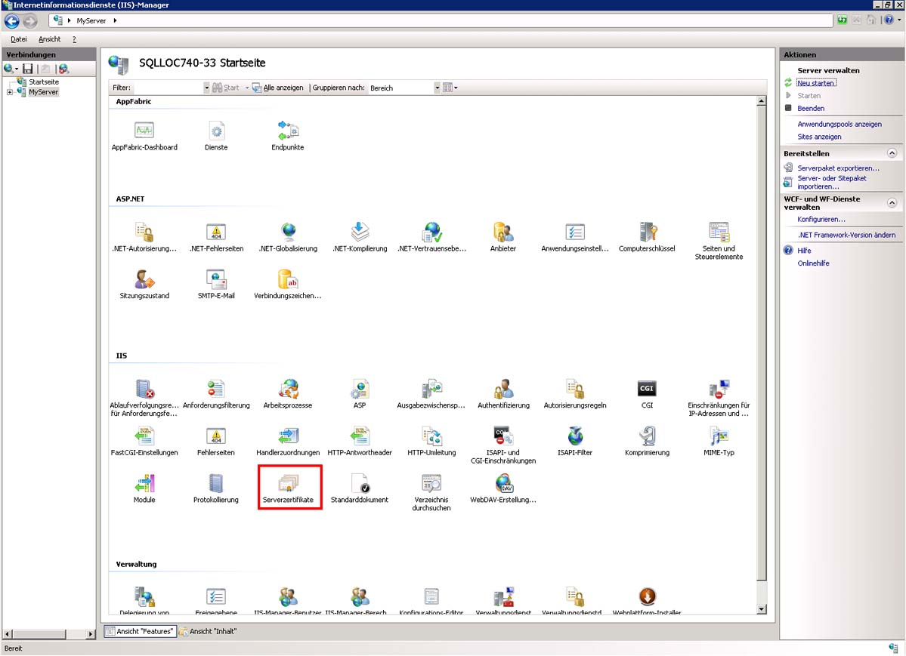
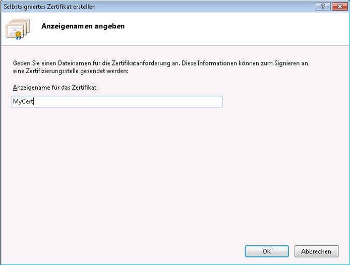
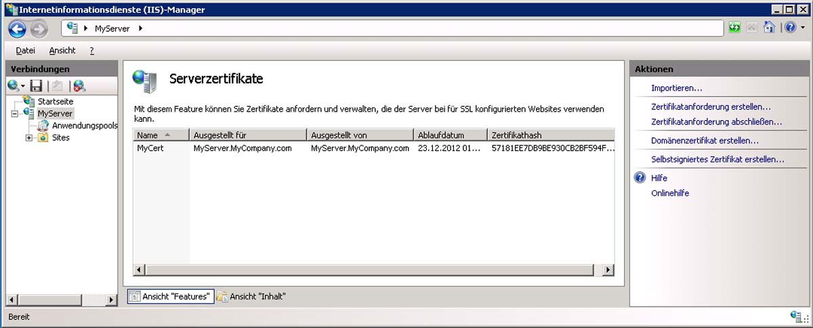

# Vorgehensweise: Konfigurieren eines IIS-gehosteten WCF-Diensts mit SSL
In diesem Thema wird beschrieben, wie ein von IIS gehosteter WCF\-Dienst für die Verwendung der HTTP\-Transportsicherheit eingerichtet wird.  Die HTTP\-Transportsicherheit erfordert für die Registrierung bei IIS ein SSL\-Zertifikat.  Wenn Sie über kein SSL\-Zertifikat verfügen, können Sie mit IIS ein Testzertifikat generieren.  Danach müssen Sie der Website eine SSL\-Bindung hinzufügen und die Authentifizierungseigenschaften der Website konfigurieren.  Abschließend müssen Sie den WCF\-Dienst für die Verwendung von HTTPS konfigurieren.  
  
### Erstellen eines selbstsignierten Zertifikats  
  
1.  Öffnen Sie den Internetinformationsdienste\-Manager \(**inetmgr.exe**\), und wählen Sie in der linken Strukturansicht den Computernamen aus.  Wählen Sie auf der rechten Seite des Bildschirms **Serverzertifikate** aus.  
  
       
  
2.  Klicken Sie im Fenster **Serverzertifikate** auf den Link **Selbstsigniertes Zertifikat erstellen**.  
  
       
  
3.  Geben Sie einen Anzeigenamen für das selbstsignierte Zertifikat ein, und klicken Sie auf **OK**.  
  
       
  
     Die Details des neu erstellten selbstsignierten Zertifikats werden jetzt im Fenster **Serverzertifikate** angezeigt.  
  
       
  
     Das generierte Zertifikat wird im Speicher für vertrauenswürdige Stammzertifizierungsstellen installiert.  
  
### Hinzufügen einer SSL\-Bindung  
  
1.  Erweitern Sie im Internetinformationsdienste\-Manager in der Strukturansicht auf der linken Seite des Bildschirms den Ordner **Sites** und dann den Ordner **Standardwebsite**.  
  
2.  Klicken Sie im rechten oberen Bereich des Fensters auf den Link **Bindungen** im Abschnitt **Aktionen**.  
  
       
  
3.  Klicken Sie im Fenster **Websitebindungen** auf die Schaltfläche **Hinzufügen**.  
  
       
  
4.  Wählen Sie im Dialogfeld **Sitebindung hinzufügen** HTTPS für den Typ und den Anzeigenamen des selbstsignierten Zertifikats aus, das Sie gerade erstellt haben.  
  
       
  
### Konfigurieren eines virtuellen Verzeichnisses für SSL  
  
1.  Wählen Sie im Internetinformationsdienste\-Manager das virtuelle Verzeichnis aus, das den sicheren WCF\-Dienst enthält.  
  
2.  Wählen Sie im mittleren Bereich des Fensters im IIS\-Abschnitt **SSL\-Einstellungen** aus.  
  
       
  
3.  Aktivieren Sie im Bereich **SSL\-Einstellungen** das Kontrollkästchen **SSL erforderlich**, und klicken Sie auf der rechten Seite des Bildschirms im Abschnitt **Aktionen** auf den Link **Anwenden**.  
  
       
  
### Konfigurieren des WCF\-Dienstes für HTTP\-Transportsicherheit  
  
1.  Konfigurieren Sie in der Datei **web.config** des WCF\-Diensts die HTTP\-Bindung für die Verwendung der Transportsicherheit, wie im folgenden XML\-Code dargestellt.  
  
    ```  
    <bindings>  
          <basicHttpBinding>  
            <binding name="secureHttpBinding">  
              <security mode="Transport">  
                <transport clientCredentialType="None"/>  
              </security>  
            </binding>  
          </basicHttpBinding>  
        </bindings>  
  
    ```  
  
2.  Geben Sie den Dienst und Dienstendpunkt an, wie im folgenden XML\-Code gezeigt.  
  
    ```  
    <services>  
          <service name="MySecureWCFService.Service1">  
            <endpoint address=""  
                      binding="basicHttpBinding"  
                      bindingConfiguration="secureHttpBinding"  
                      contract="MySecureWCFService.IService1"/>  
  
            <endpoint address="mex"  
                      binding="mexHttpsBinding"  
                      contract="IMetadataExchange" />  
          </service>  
        </services>  
  
    ```  
  
## Beispiel  
 Im Folgenden finden Sie ein vollständiges Beispiel für die Datei **web.config** eines WCF\-Diensts, der HTTP\-Transportsicherheit verwendet.  
  
```  
<?xml version="1.0"?>  
<configuration>  
  
  <system.web>  
    <compilation debug="true" targetFramework="4.0" />  
  </system.web>  
  <system.serviceModel>  
    <services>  
      <service name="MySecureWCFService.Service1">  
        <endpoint address=""  
                  binding="basicHttpBinding"  
                  bindingConfiguration="secureHttpBinding"  
                  contract="MySecureWCFService.IService1"/>  
  
        <endpoint address="mex"  
                  binding="mexHttpsBinding"  
                  contract="IMetadataExchange" />  
      </service>  
    </services>  
    <bindings>  
      <basicHttpBinding>  
        <binding name="secureHttpBinding">  
          <security mode="Transport">  
            <transport clientCredentialType="None"/>  
          </security>  
        </binding>  
      </basicHttpBinding>  
    </bindings>  
    <behaviors>  
      <serviceBehaviors>  
        <behavior>  
          <!-- To avoid disclosing metadata information, set the value below to false and remove the metadata endpoint above before deployment -->  
          <serviceMetadata httpsGetEnabled="true"/>  
          <!-- To receive exception details in faults for debugging purposes, set the value below to true.  Set to false before deployment to avoid disclosing exception information -->  
          <serviceDebug includeExceptionDetailInFaults="false"/>  
        </behavior>  
      </serviceBehaviors>  
    </behaviors>  
    <serviceHostingEnvironment multipleSiteBindingsEnabled="true" />  
  </system.serviceModel>  
 <system.webServer>  
    <modules runAllManagedModulesForAllRequests="true"/>  
  </system.webServer>  
  
</configuration>  
  
```  
  
<!-- TODO: review snippet reference  [!CODE [Microsoft.Win32.RegistryKey#4](Microsoft.Win32.RegistryKey#4)]  -->  
  
## Siehe auch  
 [Hosten in Internetinformationsdiensten](../../../../docs/framework/wcf/feature-details/hosting-in-internet-information-services.md)   
 [Hostinganweisungen des Internetinformationsdiensts](../../../../docs/framework/wcf/samples/internet-information-service-hosting-instructions.md)   
 [Empfohlene Vorgehensweisen für das Hosten in Internetinformationsdiensten](../../../../docs/framework/wcf/feature-details/internet-information-services-hosting-best-practices.md)   
 [IIS\-Hosting mithilfe von Inlinecode](../../../../docs/framework/wcf/samples/iis-hosting-using-inline-code.md)