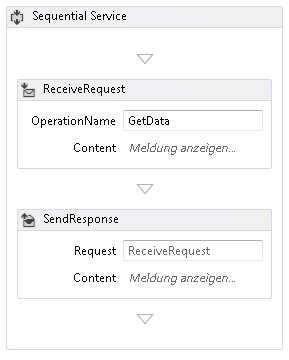
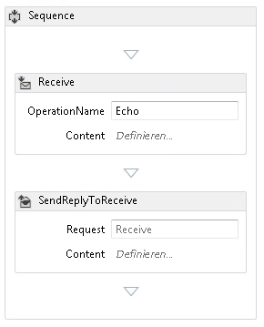
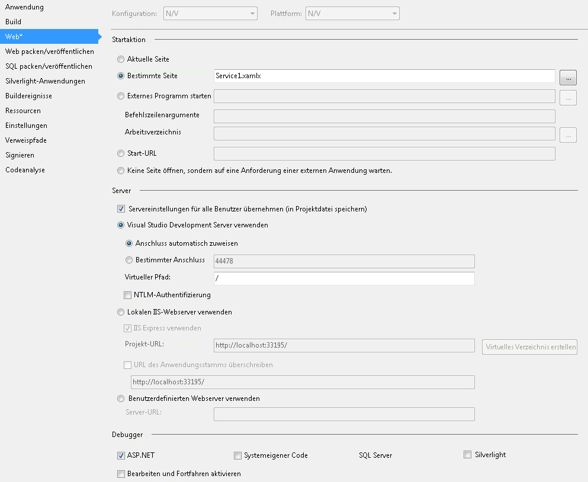

# Vorgehensweise: Erstellen eines Workflowdiensts mit Messagingaktivit&#228;ten
In diesem Thema wird beschrieben, wie Sie mithilfe der Messagingaktivitäten einen einfachen Workflowdienst erstellen.  Der Schwerpunkt des Themas liegt auf der Mechanik zum Erstellen eines Workflowdiensts. Der Dienst besteht ausschließlich aus Messagingaktivitäten.  In einem realen Dienst enthält der Workflow noch viele andere Aktivitäten.  Der Dienst implementiert einen Vorgang mit dem Namen "Echo", der eine Zeichenfolge verwendet und diese an den Aufrufer zurückgibt.  Dieses Thema ist das erste von zwei Themen, die zusammengehören.  Im nächsten Thema, [Vorgehensweise: Zugreifen auf einen Dienst aus einer Workflowanwendung](../../../../docs/framework/wcf/feature-details/how-to-access-a-service-from-a-workflow-application.md), wird erläutert, wie Sie eine Workflowanwendung erstellen, die den in diesem Thema erstellten Dienst aufrufen kann.  
  
### So erstellen Sie ein Workflowdienstprojekt  
  
1.  Starten Sie [!INCLUDE[vs_current_long](../../../../includes/vs-current-long-md.md)].  
  
2.  Klicken Sie auf das Menü **Datei**, und wählen Sie **Neu** und dann **Projekt** aus, um das Dialogfeld **Neues Projekt** anzuzeigen.  Wählen Sie in der Liste der installierten Vorlagen **Workflow** und in der Liste der Projekttypen **Dienstanwendung für WCF\-Workflows** aus.  Geben Sie dem Projekt den Namen `MyWFService`, und verwenden Sie wie in der folgenden Abbildung gezeigt den Standardspeicherort.  
  
     Klicken Sie auf die Schaltfläche **OK**, um das Dialogfeld **Neues Projekt** zu schließen.  
  
3.  Nachdem das Projekt erstellt wurde, wird die Datei "Service1.xamlx" im Designer geöffnet. Dies ist in der folgenden Abbildung dargestellt.  
  
       
  
     Klicken Sie mit der rechten Maustaste auf die Aktivität mit der Bezeichnung **Sequenzieller Dienst**, und wählen Sie **Löschen** aus.  
  
### So implementiert Sie den Workflowdienst  
  
1.  Wählen Sie auf der linken Seite des Bildschirms die Registerkarte **Toolbox** aus, um die Toolbox anzuzeigen, und klicken Sie auf das Pinsymbol, damit das Fenster geöffnet bleibt.  Erweitern Sie den Abschnitt **Messaging** der Toolbox, um die Messagingaktivitäten und die Vorlagen für Messagingaktivitäten anzuzeigen, wie in der folgenden Abbildung dargestellt.  
  
       
  
2.  Ziehen Sie eine **ReceiveAndSendReply**\-Vorlage auf den Workflow\-Designer.  Es wird eine <xref:System.ServiceModel.Activities.Sequence>\-Aktivität mit einer **Receive**\-Aktivität gefolgt von einer <xref:System.ServiceModel.Activities.SendReply>\-Aktivität erstellt. Dies ist in der folgenden Abbildung dargestellt.  
  
       
  
     Beachten Sie, dass die <xref:System.ServiceModel.Activities.SendReply>\-Eigenschaft der <xref:System.ServiceModel.Activities.SendReply.Request%2A>\-Aktivität auf `Receive` festgelegt ist, also auf den Namen der <xref:System.ServiceModel.Activities.Receive>\-Aktivität, auf die die <xref:System.ServiceModel.Activities.SendReply>\-Aktivität antwortet.  
  
3.  Geben Sie in der <xref:System.ServiceModel.Activities.Receive>\-Aktivität im Textfeld mit der Bezeichnung `OperationName` den Text **Echo** ein.  Dadurch wird der Name des Vorgangs definiert, den der Dienst implementiert.  
  
       
  
4.  Öffnen Sie bei ausgewählter <xref:System.ServiceModel.Activities.Receive>\-Aktivität das Eigenschaftenfenster, falls dies noch nicht der Fall ist, indem Sie auf das Menü **Ansicht** klicken und **Eigenschaftenfenster** wählen.  Verschieben Sie den Fensterinhalt im **Eigenschaftenfenster** nach unten, bis **CanCreateInstance** angezeigt wird, und klicken wie in der folgenden Abbildung gezeigt auf das Kontrollkästchen.  Mit dieser Einstellung wird es dem Workflowdiensthost ermöglicht, \(bei Bedarf\) eine neue Instanz des Diensts zu erstellen, wenn eine Meldung empfangen wird.  
  
       
  
5.  Wählen Sie die <xref:System.ServiceModel.Activities.Sequence>\-Aktivität aus, und klicken Sie in der linken unteren Ecke des Designers auf die Schaltfläche **Variablen**.  Der Variablen\-Editor wird angezeigt.  Klicken Sie auf den Link **Variable erstellen**, um eine Variable zum Speichern der Zeichenfolge hinzuzufügen, die an den Vorgang gesendet wird.  Geben Sie der Variable den Namen `msg`, und legen Sie seinen **Variable**\-Typ auf "String" \(Zeichenfolge\) fest. Dies ist in der folgenden Abbildung dargestellt.  
  
       
  
     Klicken Sie erneut auf die Schaltfläche **Variablen**, um den Variablen\-Editor zu schließen.  
  
6.  Klicken Sie für die **\-Aktivität** im Textfeld **Inhalt** auf den Link <xref:System.ServiceModel.Activities.Receive>Definieren..., um das Dialogfeld **Inhaltsdefinition** anzuzeigen.  Aktivieren Sie das Optionsfeld **Parameter**, klicken Sie auf den Link **Neuen Parameter hinzufügen**, geben Sie im `Namenstextfeld` den Text **inMsg** ein, wählen Sie im Dropdown\-Listenfeld **Typ** den Eintrag **Zeichenfolge** aus, und geben Sie im Textfeld `Zuweisen zu` den Text **msg** ein. Dies ist in der folgenden Abbildung dargestellt.  
  
       
  
     Dadurch wird angegeben, dass die Empfangsaktivität Zeichenfolgenparameter empfängt und dass diese Daten an die `msg`\-Variable gebunden werden.  Klicken Sie auf **OK**, um das Dialogfeld **Inhaltsdefinition** zu schließen.  
  
7.  Klicken Sie für die \-Aktivität im Feld **Inhalt** auf den Link <xref:System.ServiceModel.Activities.SendReply>Definieren..., um das Dialogfeld **Inhaltsdefinition** anzuzeigen.  Aktivieren Sie das Optionsfeld **Parameter**, klicken Sie auf den Link **Neuen Parameter hinzufügen**, geben Sie im Textfeld `Name` den Text **msg** ein, wählen Sie im Dropdown\-Listenfeld **Typ** den Eintrag **Zeichenfolge** aus, und geben Sie im Textfeld `Wert` den Text **msg** ein. Dies ist in der folgenden Abbildung dargestellt.  
  
       
  
     Dadurch wird angegeben, dass die <xref:System.ServiceModel.Activities.SendReply>\-Aktivität eine Nachricht oder einen Nachrichtenvertragstyp sendet und dass die Daten an die `msg`\-Variable gebunden werden.  Da dies eine <xref:System.ServiceModel.Activities.SendReply>\-Aktivität ist, werden die Daten von `msg` verwendet, um die von der Aktivität an den Client zurückgesendete Nachricht aufzufüllen.  Klicken Sie auf **OK**, um das Dialogfeld **Inhaltsdefinition** zu schließen.  
  
8.  Speichern und erstellen Sie die Projektmappe, indem Sie auf das Menü **Erstellen** klicken und **Projektmappe erstellen** auswählen.  
  
## Konfigurieren des Workflowdienstprojekts  
 Der Workflowdienst wurde abgeschlossen.  In diesem Abschnitt wird erklärt, wie Sie die Workflowdienstprojektmappe so konfigurieren, dass sie auf einfache Weise gehostet und ausgeführt werden kann.  Diese Projektmappe verwendet den ASP.NET Development Server zum Hosten des Diensts.  
  
#### So legen Sie Projektstartoptionen fest  
  
1.  Klicken Sie im **Projektmappen\-Explorer**mit der rechten Maustaste auf **MyWFService**, und wählen Sie **Eigenschaften** aus, um das Dialogfeld **Projekteigenschaften** anzuzeigen.  
  
2.  Wählen Sie die Registerkarte **Web** aus, und wählen Sie unter **Startaktion** die Option **Bestimmte Seite**. Geben Sie dann wie in der folgenden Abbildung gezeigt im Textfeld den Text `Service1.xamlx` ein.  
  
       
  
     Der in "Service1.xamlx" definierte Dienst wird dann unter ASP.NET Development Server gehostet.  
  
3.  Drücken Sie STRG\+F5, um den Dienst zu starten.  Das Symbol "ASP.NET Development Server" wird in der unteren rechten Ecke des Desktops angezeigt. Dies ist in der folgenden Abbildung dargestellt.  
  
       
  
     Außerdem zeigt Internet Explorer für den Dienst die Hilfeseite für WCF\-Dienste an.  
  
       
  
4.  Fahren mit dem Thema [Vorgehensweise: Zugreifen auf einen Dienst aus einer Workflowanwendung](../../../../docs/framework/wcf/feature-details/how-to-access-a-service-from-a-workflow-application.md) fort, um einen Workflowclient zu erstellen, der diesen Dienst aufruft.  
  
## Siehe auch  
 [Workflowdienste](../../../../docs/framework/wcf/feature-details/workflow-services.md)   
 [Übersicht über das Hosten von Workflowdiensten](../../../../docs/framework/wcf/feature-details/hosting-workflow-services-overview.md)   
 [Messagingaktivitäten](../../../../docs/framework/wcf/feature-details/messaging-activities.md)