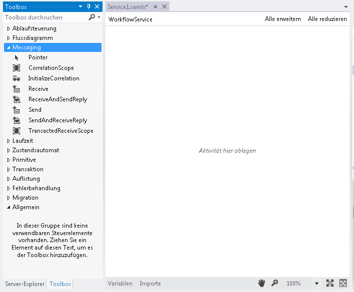
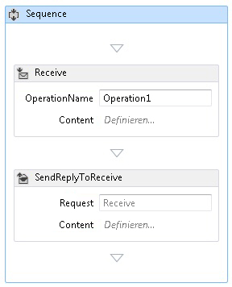

# Vorgehensweise: Erstellen eines Workflowdiensts mit Messagingaktivitäten
In diesem Thema wird beschrieben, wie Sie mithilfe der Messagingaktivitäten einen einfachen Workflowdienst erstellen. Der Schwerpunkt des Themas liegt auf der Mechanik zum Erstellen eines Workflowdiensts. Der Dienst besteht ausschließlich aus Messagingaktivitäten. In einem realen Dienst enthält der Workflow noch viele andere Aktivitäten. Der Dienst implementiert einen Vorgang mit dem Namen "Echo", der eine Zeichenfolge verwendet und diese an den Aufrufer zurückgibt. Dieses Thema ist das erste von zwei Themen, die zusammengehören. Im nächsten Thema [Vorgehensweise: Zugreifen auf einen Dienst aus einer Workflowanwendung](../../../../docs/framework/wcf/feature-details/how-to-access-a-service-from-a-workflow-application.md) erläutert, wie eine workflowanwendung erstellen, die den in diesem Thema erstellten Dienst aufrufen kann.  
  
### So erstellen Sie ein Workflowdienstprojekt  
  
1.  Starten Sie [!INCLUDE[vs_current_long](../../../../includes/vs-current-long-md.md)].  
  
2.  Klicken Sie auf die **Datei** klicken Sie im Menü **neu**, und klicken Sie dann **Projekt** zum Anzeigen der **Dialogfeld "Neues Projekt"**. Wählen Sie **Workflow** aus der Liste der installierten Vorlagen und **WCF-Workflowdienstanwendung** aus der Liste der Projekttypen zur Verfügung. Nennen Sie das Projekt `MyWFService` und verwenden Sie den Standardspeicherort, wie in der folgenden Abbildung dargestellt.  
  
     Klicken Sie auf die **OK** Schaltfläche beim Schließen der **Dialogfeld "Neues Projekt"**.  
  
3.  Nachdem das Projekt erstellt wurde, wird die Datei "Service1.xamlx" im Designer geöffnet. Dies ist in der folgenden Abbildung dargestellt.  
  
       
  
     Mit der rechten Maustaste in der Aktivität, die mit der Bezeichnung **sequenzieller Dienst** , und wählen Sie **löschen**.  
  
### So implementiert Sie den Workflowdienst  
  
1.  Wählen Sie die **Toolbox** Registerkarte auf der linken Seite des Bildschirms, um die Toolbox anzuzeigen, und klicken Sie auf das Pinsymbol, damit das Fenster geöffnet bleibt. Erweitern Sie die **Messaging** Abschnitt der Toolbox, um die messagingaktivitäten und die Vorlagen für messagingaktivitäten anzuzeigen, wie in der folgenden Abbildung dargestellt.  
  
       
  
2.  Drag & drop eine **ReceiveAndSendReply** Vorlage in den Workflowdesigner. Erstellt eine <!--zz <xref:System.ServiceModel.Activities.Sequence>--> `System.ServiceModel.Activities.Sequence` Aktivität mit dem eine **empfangen** -Aktivität gefolgt von einer <xref:System.ServiceModel.Activities.SendReply> Aktivität wie in der folgenden Abbildung dargestellt.  
  
       
  
     Beachten Sie, dass die <xref:System.ServiceModel.Activities.SendReply>-Eigenschaft der <xref:System.ServiceModel.Activities.SendReply.Request%2A>-Aktivität auf `Receive` festgelegt ist, also auf den Namen der <xref:System.ServiceModel.Activities.Receive>-Aktivität, auf die die <xref:System.ServiceModel.Activities.SendReply>-Aktivität antwortet.  
  
3.  In der <xref:System.ServiceModel.Activities.Receive> Aktivitätstyp `Echo` in das Textfeld mit der Bezeichnung **OperationName**. Dadurch wird der Name des Vorgangs definiert, den der Dienst implementiert.  
  
       
  
4.  Mit der <xref:System.ServiceModel.Activities.Receive> Aktivität ausgewählt, um das Eigenschaftenfenster zu öffnen, wenn nicht bereits geöffnet, indem Sie auf die **Ansicht** Menü- und Auswählen von **Fenster "Eigenschaften"**. In der **Fenster "Eigenschaften"** einen Bildlauf nach unten, bis Sie finden Sie unter **CanCreateInstance** , und klicken Sie auf das Kontrollkästchen, wie in der folgenden Abbildung dargestellt. Mit dieser Einstellung wird es dem Workflowdiensthost ermöglicht, (bei Bedarf) eine neue Instanz des Diensts zu erstellen, wenn eine Meldung empfangen wird.  
  
       
  
5.  Wählen Sie die <!--zz <xref:System.ServiceModel.Activities.Sequence>--> `System.ServiceModel.Activities.Sequence` Aktivität, und klicken Sie auf die **Variablen** Schaltfläche in der unteren linken Ecke des Designers. Der Variablen-Editor wird angezeigt. Klicken Sie auf die **Variable erstellen** Link, um eine Variable zum Speichern der Zeichenfolge, die gesendet, um den Vorgang hinzuzufügen. Benennen Sie die Variable `msg` und legen Sie dessen **Variable** Geben Sie in eine Zeichenfolge, wie in der folgenden Abbildung dargestellt.  
  
       
  
     Klicken Sie auf die **Variablen** Schaltfläche erneut aus, um den Variablen-Editor zu schließen.  
  
6.  Klicken Sie auf die **definieren...** Link der **Inhalt** Textfeld in der <xref:System.ServiceModel.Activities.Receive> Aktivität zum Anzeigen der **Inhaltsdefinition** Dialogfeld. Wählen Sie die **Parameter** Optionsfeld, klicken Sie auf die **hinzufügen neuen Parameter** verknüpfen möchten, geben Sie `inMsg` in der **Namen** wählen Sie im Textfeld **Zeichenfolge**in der **Typ** Dropdown-Listenfeld, und geben `msg` in der **zuordnen zu** Textfeld wie in der folgenden Abbildung dargestellt.  
  
       
  
     Dadurch wird angegeben, dass die Empfangsaktivität Zeichenfolgenparameter empfängt und dass diese Daten an die `msg`-Variable gebunden werden. Klicken Sie auf **OK** schließen die **Inhaltsdefinition** Dialogfeld.  
  
7.  Klicken Sie auf die **definieren...**  link die **Content** im Feld der <xref:System.ServiceModel.Activities.SendReply> Aktivität zum Anzeigen der **Inhaltsdefinition** Dialogfeld. Wählen Sie die **Parameter** Optionsfeld, klicken Sie auf die **hinzufügen neuen Parameter** verknüpfen möchten, geben Sie `outMsg` in der **Namen** Textfeld, wählen **Zeichenfolge**in der **Typ** im Dropdown-Listenfeld und `msg` in der **Wert** Textfeld wie in der folgenden Abbildung dargestellt.  
  
       
  
     Dadurch wird angegeben, dass die <xref:System.ServiceModel.Activities.SendReply>-Aktivität eine Nachricht oder einen Nachrichtenvertragstyp sendet und dass die Daten an die `msg`-Variable gebunden werden. Da dies eine <xref:System.ServiceModel.Activities.SendReply>-Aktivität ist, werden die Daten von `msg` verwendet, um die von der Aktivität an den Client zurückgesendete Nachricht aufzufüllen. Klicken Sie auf **OK** schließen die **Inhaltsdefinition** Dialogfeld.  
  
8.  Speichern und erstellen Sie die Projektmappe, indem Sie auf die **erstellen** Menü- und Auswählen von **Projektmappe**.  
  
## Konfigurieren des Workflowdienstprojekts  
 Der Workflowdienst wurde abgeschlossen. In diesem Abschnitt wird erklärt, wie Sie die Workflowdienstprojektmappe so konfigurieren, dass sie auf einfache Weise gehostet und ausgeführt werden kann. Diese Projektmappe verwendet den ASP.NET Development Server zum Hosten des Diensts.  
  
#### So legen Sie Projektstartoptionen fest  
  
1.  In der **Projektmappen-Explorer**, mit der rechten Maustaste **MyWFService** , und wählen Sie **Eigenschaften** zum Anzeigen der **Projekteigenschaften** Dialogfeld.  
  
2.  Wählen Sie die **Web** Registerkarte, und wählen Sie **bestimmte Seite** unter **Startaktion** und Typ `Service1.xamlx` in das Textfeld ein, wie in der folgenden Abbildung dargestellt.  
  
       
  
     Der in "Service1.xamlx" definierte Dienst wird dann unter ASP.NET Development Server gehostet.  
  
3.  Drücken Sie STRG+F5, um den Dienst zu starten. Das Symbol "ASP.NET Development Server" wird in der unteren rechten Ecke des Desktops angezeigt. Dies ist in der folgenden Abbildung dargestellt.  
  
       
  
     Außerdem zeigt Internet Explorer für den Dienst die Hilfeseite für WCF-Dienste an.  
  
       
  
4.  Fortfahren mit dem [Vorgehensweise: Zugreifen auf einen Dienst aus einer Workflowanwendung](../../../../docs/framework/wcf/feature-details/how-to-access-a-service-from-a-workflow-application.md) Thema, um einen workflowclient zu erstellen, die diesen Dienst aufruft.  
  
## Siehe auch  
 [Workflowdienste](../../../../docs/framework/wcf/feature-details/workflow-services.md)  
 [Übersicht über das Hosten von Workflowdiensten](../../../../docs/framework/wcf/feature-details/hosting-workflow-services-overview.md)  
 [Messagingaktivitäten](../../../../docs/framework/wcf/feature-details/messaging-activities.md)
