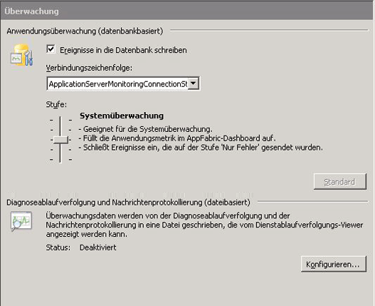
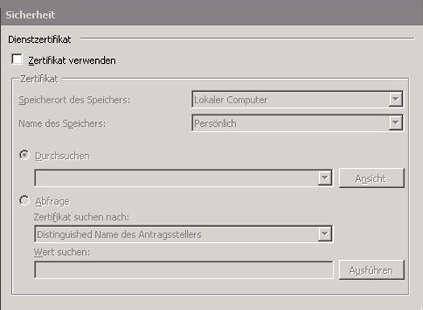
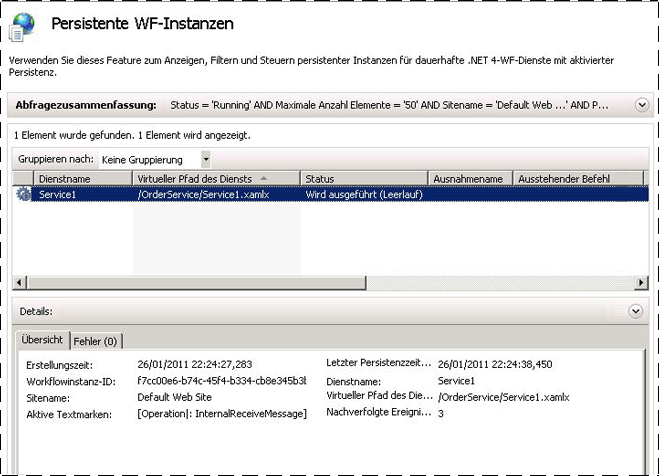

# Vorgehensweise: Hosten eines Workflowdiensts mit Windows Server AppFabric
Das Hosten von Workflowdiensten in AppFabric ähnelt dem Hosten unter IIS/WAS. Der einzige Unterschied besteht in den Tools von AppFabric zum Bereitstellen, Überwachen und Verwalten von Workflowdiensten. In diesem Thema verwendet den Workflowdienst erstellt der [Erstellen eines Workflowdiensts langer](../../../../docs/framework/wcf/feature-details/creating-a-long-running-workflow-service.md). Sie werden Schritt für Schritt durch das Erstellen eines Workflowdiensts geführt. In diesem Thema wird erläutert, wie der Workflowdienst mit AppFabric gehostet wird. [!INCLUDE[crabout](../../../../includes/crabout-md.md)]Windows Server AppFabric finden Sie unter [Dokumentation zu Windows Server App Fabric](http://go.microsoft.com/fwlink/?LinkID=193037&clcid=0x409). Vergewissern Sie sich, dass Windows Server AppFabric installiert ist, bevor Sie die nachfolgenden Schritte ausführen.  Um diese öffnen Sie Internet Information Services (inetmgr.exe) zu erreichen, klicken Sie auf den Servernamen in der **Verbindungen** anzeigen, klicken Sie auf Standorte, und klicken Sie auf **Default Web Site**. In der rechten Seite des Bildschirms sehen Sie einen Abschnitt aufgerufen **AppFabric**. Wenn dieser Bereich nicht (oben rechts) angezeigt wird, ist AppFabric nicht installiert. [!INCLUDE[crabout](../../../../includes/crabout-md.md)]Installieren von Windows Server AppFabric finden Sie unter [Installieren von Windows Server AppFabric](http://go.microsoft.com/fwlink/?LinkId=193136).  
  
### Erstellen eines einfachen Workflowdiensts  
  
1.  Open [!INCLUDE[vs_current_long](../../../../includes/vs-current-long-md.md)] und Laden Sie die OrderProcessing-Projektmappe, die Sie erstellt, in haben der [Erstellen eines Workflowdiensts langer](../../../../docs/framework/wcf/feature-details/creating-a-long-running-workflow-service.md) Thema.  
  
2.  Klicken Sie mit der rechten Maustaste auf die **OrderService** Projekt, und wählen Sie **Eigenschaften** , und wählen Sie die **Web** Registerkarte.  
  
3.  In der **Startaktion** wählen Sie im Abschnitt der Eigenschaftenseite **bestimmte Seite** , und geben Sie im Eingabefeld Service1.xamlx.  
  
4.  In der **Server** wählen Sie im Abschnitt der Eigenschaftenseite **lokalen IIS-Webserver verwenden** und geben Sie die folgende URL: `http://localhost/OrderService`.  
  
5.  Klicken Sie auf die **virtuelles Verzeichnis erstellen** Schaltfläche. Dadurch wird ein neues virtuelles Verzeichnis erstellt, und das Projekt wird eingerichtet, damit die erforderlichen Dateien beim Erstellen des Projekts in das virtuelle Verzeichnis kopiert werden.  Sie können die XAMLX-, die web.config- sowie alle erforderlichen DLL-Dateien auch manuell in das virtuelle Verzeichnis kopieren.  
  
### Konfigurieren eines Workflowdiensts zum Hosten in Windows Server AppFabric  
  
1.  Öffnen Sie den Internetinformationsdienste-Manager (inetmgr.exe).  
  
2.  Navigieren Sie zum virtuellen Verzeichnis OrderService in der **Verbindungen** Bereich.  
  
3.  Klicken Sie mit der rechten Maustaste auf OrderService, und wählen Sie **WCF- und WF-Dienste verwalten**, **konfigurieren...** . Die **WCF und WF für Anwendung konfigurieren** Dialogfeld wird angezeigt.  
  
4.  Wählen Sie die **allgemeine** Registerkarte ", um allgemeine Informationen zur Anwendung anzuzeigen, wie im folgenden Screenshot gezeigt.  
  
       
  
5.  Wählen Sie die **Überwachung** Registerkarte. Es werden verschiedene Überwachungseinstellungen angezeigt, wie in der folgenden Bildschirmabbildung veranschaulicht.  
  
       
  
     [!INCLUDE[crabout](../../../../includes/crabout-md.md)]Konfigurieren von Workflow Service-Überwachung in AppFabric finden Sie unter [Konfigurieren der Überwachung mit AppFabric](http://go.microsoft.com/fwlink/?LinkId=193153).  
  
6.  Wählen Sie die **Workflowpersistenz** Registerkarte. Dort können Sie Ihre Anwendung für die Verwendung des Standardpersistenzanbieters von AppFabric konfigurieren, wie in der folgenden Bildschirmabbildung veranschaulicht.  
  
       
  
     [!INCLUDE[crabout](../../../../includes/crabout-md.md)]Konfigurieren von Workflowpersistenz in Windows Server AppFabric finden Sie unter [Workflowpersistenz in AppFabric konfigurieren](http://go.microsoft.com/fwlink/?LinkId=193148).  
  
7.  Wählen Sie die **Workflowhostverwaltung** Registerkarte. Dort können Sie angeben, wann Workflowdienstinstanzen im Leerlauf entladen und beibehalten werden sollen, wie in der folgenden Bildschirmabbildung veranschaulicht.  
  
       
  
     [!INCLUDE[crabout](../../../../includes/crabout-md.md)]Workflow Host-Management-Konfiguration finden Sie unter [Konfiguration – Workflowhostverwaltung in AppFabric](http://go.microsoft.com/fwlink/?LinkId=193151).  
  
8.  Wählen Sie die **Autostart-** Registerkarte. Dort können Sie Autostarteinstellungen für die Workflowdienste in der Anwendung angeben, wie in der folgenden Bildschirmabbildung veranschaulicht.  
  
       
  
     [!INCLUDE[crabout](../../../../includes/crabout-md.md)]Konfigurieren des automatischen Starts finden Sie unter [konfigurieren Autostart-mit AppFabric](http://go.microsoft.com/fwlink/?LinkId=193150).  
  
9. Wählen Sie die **Einschränkung** Registerkarte. Dort können Sie Einschränkungseinstellungen für den Workflowdienst konfigurieren, wie in der folgenden Bildschirmabbildung veranschaulicht.  
  
       
  
     [!INCLUDE[crabout](../../../../includes/crabout-md.md)]konfigurieren die Einschränkung finden Sie unter [Konfigurieren von Einschränkung mit AppFabric](http://go.microsoft.com/fwlink/?LinkId=193149).  
  
10. Wählen Sie die **Sicherheit** Registerkarte. Dort können Sie Sicherheitseinstellungen für die Anwendung konfigurieren, wie in der folgenden Bildschirmabbildung veranschaulicht.  
  
       
  
     [!INCLUDE[crabout](../../../../includes/crabout-md.md)]Konfigurieren der Sicherheit mit Windows Server AppFabric finden Sie unter [Konfigurieren der Sicherheit mit AppFabric](http://go.microsoft.com/fwlink/?LinkId=193152).  
  
### Verwenden von Windows Server AppFabric  
  
1.  Erstellen Sie die Projektmappe, um die benötigten Dateien in das virtuelle Verzeichnis zu kopieren.  
  
2.  Klicken Sie mit der mit der rechten Maustaste auf das OrderClient-Projekt, und wählen Sie **Debuggen**, **neue Instanz starten** an die Clientanwendung gestartet.  
  
3.  Der Client wird ausgeführt und zeigt Visual Studio eine **Sicherheitswarnung Anfügen** (Dialogfeld), klicken Sie auf die **nicht Anfügen** Schaltfläche. Damit wird Visual Studio angewiesen, den IIS-Prozess nicht zum Debuggen anzufügen.  
  
4.  Der Workflowdienst wird unmittelbar von der Clientanwendung aufgerufen; anschließend wartet die Anwendung. Der Workflowdienst wird in den Leerlauf versetzt und beibehalten. Sie können dies überprüfen, indem Sie Internetinformationsdienste (inetmgr.exe) starten, im Bereich Verbindungen zu OrderService navigieren und die Instanz auswählen. Klicken Sie dann im rechten Bereich auf das Symbol für das AppFabric-Dashboard. Unter Persistente WF-Instanzen wird eine beibehaltene Workflowdienstinstanz angezeigt, wie in der folgenden Bildschirmabbildung veranschaulicht.  
  
       
  
     Die **WF Instanz Verlauf** listet Informationen zu den Workflowdienst, z. B. die Anzahl der Aktivierungen für Workflow-Dienst, die Anzahl der Workflows instanzverlauf und die Anzahl der Workflowinstanzen Fehler aufwiesen. Unter Aktive Instanzen (einschließlich Leerlauf) wird ein Link angezeigt. Wenn Sie darauf klicken, werden weitere Informationen über Workflowinstanzen im Leerlauf angezeigt, wie in der folgenden Bildschirmabbildung veranschaulicht.  
  
       
  
     Weitere Informationen zu Windows Server AppFabric-Features und deren Verwendung finden Sie unter [Windows Server App Fabric-Hostingfunktionen](http://go.microsoft.com/fwlink/?LinkID=193143&clcid=0x409)  
  
## Siehe auch  
 [Erstellen eines Workflowdiensts langer](../../../../docs/framework/wcf/feature-details/creating-a-long-running-workflow-service.md)  
 [Windows Server AppFabric-Hostingfunktionen](http://go.microsoft.com/fwlink/?LinkId=193143)  
 [Installieren von Windows Server AppFabric](http://go.microsoft.com/fwlink/?LinkId=193136)  
 [Windows Server AppFabric-Dokumentation](http://go.microsoft.com/fwlink/?LinkID=193037&clcid=0x409)
