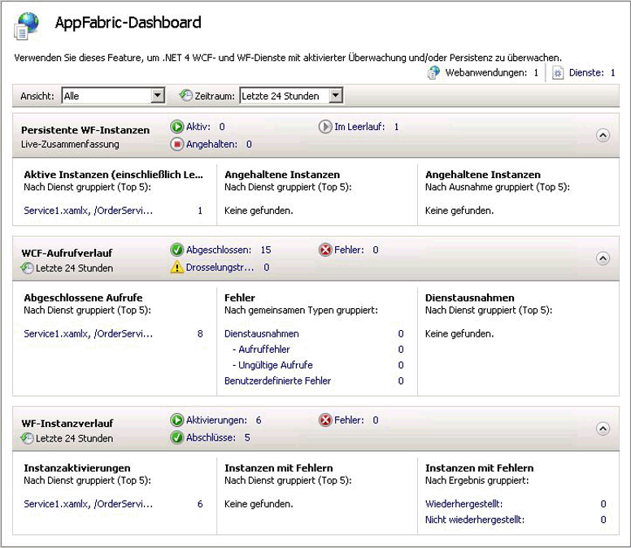

# Vorgehensweise: Hosten eines Workflowdiensts mit Windows Server AppFabric
Das Hosten von Workflowdiensten in AppFabric ähnelt dem Hosten unter IIS\/WAS.Der einzige Unterschied besteht in den Tools von AppFabric zum Bereitstellen, Überwachen und Verwalten von Workflowdiensten.In diesem Thema wird der Workflowdienst aus [Erstellen eines Workflowdiensts mit langer Ausführungszeit](../../../../docs/framework/wcf/feature-details/creating-a-long-running-workflow-service.md) verwendet.Sie werden Schritt für Schritt durch das Erstellen eines Workflowdiensts geführt.In diesem Thema wird erläutert, wie der Workflowdienst mit AppFabric gehostet wird.[!INCLUDE[crabout](../../../../includes/crabout-md.md)] Windows Server AppFabric finden Sie in der [Dokumentation zu Windows Server AppFabric](http://go.microsoft.com/fwlink/?LinkID=193037&clcid=0x407).Vergewissern Sie sich, dass Windows Server AppFabric installiert ist, bevor Sie die nachfolgenden Schritte ausführen.Öffnen Sie dazu Internetinformationsdienste \(inetmgr.exe\), klicken Sie in der Ansicht **Verbindungen** auf den Namen Ihres Servers, auf Websites und dann auf **Standardwebsite**.Auf der rechten Bildschirmseite sollte nun der Bereich **AppFabric** angezeigt werden.Wenn dieser Bereich nicht \(oben rechts\) angezeigt wird, ist AppFabric nicht installiert.[!INCLUDE[crabout](../../../../includes/crabout-md.md)] zum Installieren von Windows Server AppFabric finden Sie unter [Installieren von Windows Server AppFabric](http://go.microsoft.com/fwlink/?LinkId=193136).  
  
### Erstellen eines einfachen Workflowdiensts  
  
1.  Öffnen Sie [!INCLUDE[vs_current_long](../../../../includes/vs-current-long-md.md)], und laden Sie die OrderProcessing\-Projektmappe, die Sie im Thema [Erstellen eines Workflowdiensts mit langer Ausführungszeit](../../../../docs/framework/wcf/feature-details/creating-a-long-running-workflow-service.md) erstellt haben.  
  
2.  Klicken Sie mit der rechten Maustaste auf das Projekt **OrderService**, und wählen Sie **Eigenschaften** und dann die Registerkarte **Web** aus.  
  
3.  Legen Sie die **Startaktion** auf **Bestimmte Seite** fest, und geben Sie im Eingabefeld Service1.xamlx als Startseite ein.  
  
4.  Wählen Sie auf der Eigenschaftenseite im Bereich **Server** den Eintrag **Lokalen IIS\-Webserver verwenden** aus, und geben Sie folgende URL ein: `http://localhost/OrderService`.  
  
5.  Klicken Sie auf die Schaltfläche **Virtuelles Verzeichnis erstellen**.Dadurch wird ein neues virtuelles Verzeichnis erstellt, und das Projekt wird eingerichtet, damit die erforderlichen Dateien beim Erstellen des Projekts in das virtuelle Verzeichnis kopiert werden.Sie können die XAMLX\-, die web.config\- sowie alle erforderlichen DLL\-Dateien auch manuell in das virtuelle Verzeichnis kopieren.  
  
### Konfigurieren eines Workflowdiensts zum Hosten in Windows Server AppFabric  
  
1.  Öffnen Sie den Internetinformationsdienste\-Manager \(inetmgr.exe\).  
  
2.  Navigieren Sie im Bereich **Verbindungen** zum virtuellen Verzeichnis OrderService.  
  
3.  Klicken Sie mit der rechten Maustaste auf OrderService, und wählen Sie **WCF\- und WF\-Dienste verwalten**, **Konfigurieren** aus.Das Dialogfeld **WCF und WF für die Webanwendung konfigurieren** wird angezeigt.  
  
4.  Wählen Sie die Registerkarte **Allgemein** aus, um allgemeine Informationen zur Anwendung anzuzeigen, wie in der folgenden Bildschirmabbildung veranschaulicht.  
  
       
  
5.  Klicken Sie auf die Registerkarte **Überwachung**.Es werden verschiedene Überwachungseinstellungen angezeigt, wie in der folgenden Bildschirmabbildung veranschaulicht.  
  
       
  
     [!INCLUDE[crabout](../../../../includes/crabout-md.md)] das Konfigurieren einer Workflowdienstüberwachung in AppFabric finden Sie unter [Konfigurieren der Überwachung mit AppFabric](http://go.microsoft.com/fwlink/?LinkId=193153).  
  
6.  Wählen Sie die Registerkarte **Workflowpersistenz** aus.Dort können Sie Ihre Anwendung für die Verwendung des Standardpersistenzanbieters von AppFabric konfigurieren, wie in der folgenden Bildschirmabbildung veranschaulicht.  
  
       
  
     [!INCLUDE[crabout](../../../../includes/crabout-md.md)] das Konfigurieren der Workflowpersistenz in Windows Server AppFabric finden Sie unter [Konfigurieren von Workflowpersistenz in AppFabric](http://go.microsoft.com/fwlink/?LinkId=193148).  
  
7.  Wählen Sie die Registerkarte **Workflowhostverwaltung** aus.Dort können Sie angeben, wann Workflowdienstinstanzen im Leerlauf entladen und beibehalten werden sollen, wie in der folgenden Bildschirmabbildung veranschaulicht.  
  
       
  
     [!INCLUDE[crabout](../../../../includes/crabout-md.md)] das Konfigurieren der Workflowhostverwaltung finden Sie unter [Konfigurieren der Workflowhostverwaltung in AppFabric](http://go.microsoft.com/fwlink/?LinkId=193151).  
  
8.  Wählen Sie die Registerkarte **Autostart** aus.Dort können Sie Autostarteinstellungen für die Workflowdienste in der Anwendung angeben, wie in der folgenden Bildschirmabbildung veranschaulicht.  
  
       
  
     [!INCLUDE[crabout](../../../../includes/crabout-md.md)] das Konfigurieren von Autostart finden Sie unter [Konfigurieren des automatischen Starts mit AppFabric](http://go.microsoft.com/fwlink/?LinkId=193150).  
  
9. Wählen Sie die Registerkarte **Drosselung** aus.Dort können Sie Einschränkungseinstellungen für den Workflowdienst konfigurieren, wie in der folgenden Bildschirmabbildung veranschaulicht.  
  
       
  
     [!INCLUDE[crabout](../../../../includes/crabout-md.md)] das Konfigurieren von Einschränkungen finden Sie unter [Konfigurieren der Drosselung mit AppFabric](http://go.microsoft.com/fwlink/?LinkId=193149).  
  
10. Wählen Sie die Registerkarte **Sicherheit** aus.Dort können Sie Sicherheitseinstellungen für die Anwendung konfigurieren, wie in der folgenden Bildschirmabbildung veranschaulicht.  
  
       
  
     [!INCLUDE[crabout](../../../../includes/crabout-md.md)] das Konfigurieren der Sicherheit mit Windows Server AppFabric finden Sie unter [Konfigurieren von Sicherheit mit AppFabric](http://go.microsoft.com/fwlink/?LinkId=193152).  
  
### Verwenden von Windows Server AppFabric  
  
1.  Erstellen Sie die Projektmappe, um die benötigten Dateien in das virtuelle Verzeichnis zu kopieren.  
  
2.  Klicken Sie mit der rechten Maustaste auf das Projekt OrderClient, und wählen Sie **Debuggen**, **Neue Instanz starten** aus, um die Clientanwendung zu starten.  
  
3.  Der Client wird ausgeführt, und von Visual Studio wird das Dialogfeld **Sicherheitswarnung anfügen** angezeigt. Klicken Sie auf die Schaltfläche **Nicht anfügen**.Damit wird Visual Studio angewiesen, den IIS\-Prozess nicht zum Debuggen anzufügen.  
  
4.  Der Workflowdienst wird unmittelbar von der Clientanwendung aufgerufen; anschließend wartet die Anwendung.Der Workflowdienst wird in den Leerlauf versetzt und beibehalten.Sie können dies überprüfen, indem Sie Internetinformationsdienste \(inetmgr.exe\) starten, im Bereich Verbindungen zu OrderService navigieren und die Instanz auswählen.Klicken Sie im rechten Bereich auf das Symbol für das AppFabric\-Dashboard.Unter Persistente WF\-Instanzen wird eine beibehaltene Workflowdienstinstanz angezeigt, wie in der folgenden Bildschirmabbildung veranschaulicht.  
  
       
  
     Unter **WF\-Instanzverlauf** werden Informationen über den Workflowdienst angezeigt, beispielsweise wie oft der Workflowdienst aktiviert wurde, wie oft die Workflowdienstinstanz abgeschlossen wurde oder wie viele Workflowinstanzen Fehler aufwiesen.Unter Aktive Instanzen \(einschließlich Leerlauf\) wird ein Link angezeigt. Wenn Sie darauf klicken, werden weitere Informationen über Workflowinstanzen im Leerlauf angezeigt, wie in der folgenden Bildschirmabbildung veranschaulicht.  
  
       
  
     Weitere Informationen über die Funktionen von Windows Server AppFabric und ihre Verwendung finden Sie unter [Windows Server AppFabric\-Hostingfunktionen](http://go.microsoft.com/fwlink/?LinkID=193143&clcid=0x407)  
  
## Siehe auch  
 [Erstellen eines Workflowdiensts mit langer Ausführungszeit](../../../../docs/framework/wcf/feature-details/creating-a-long-running-workflow-service.md)   
 [Windows Server AppFabric\-Hostingfunktionen](http://go.microsoft.com/fwlink/?LinkId=193143)   
 [Installieren von Windows Server AppFabric](http://go.microsoft.com/fwlink/?LinkId=193136)   
 [Dokumentation zu Windows Server AppFabric](http://go.microsoft.com/fwlink/?LinkID=193037&clcid=0x407)