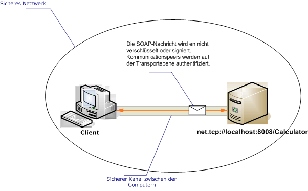

# Intranet: Ungesicherter Client und Dienst
In der folgenden Darstellung sehen Sie einen einfachen [!INCLUDE[indigo1](../../../../includes/indigo1-md.md)]\-Dienst, mit dem einer [!INCLUDE[indigo2](../../../../includes/indigo2-md.md)]\-Anwendung Informationen in einem sicheren privaten Netzwerk zur Verfügung gestellt werden.  Sicherheit ist nicht erforderlich, da die Daten eher unwichtig sind, das Netzwerk als grundsätzlich sicher eingestuft wird oder Sicherheit durch eine Ebene unterhalb der [!INCLUDE[indigo2](../../../../includes/indigo2-md.md)]\-Infrastruktur bereitgestellt wird.  
  
   
  
|Merkmal|Beschreibung|  
|-------------|------------------|  
|Sicherheitsmodus|Keine|  
|Transport|TCP|  
|Bindung|<xref:System.ServiceModel.NetTcpBinding>|  
|Interoperabilität|Nur [!INCLUDE[indigo2](../../../../includes/indigo2-md.md)]|  
|Authentifizierung|Keine|  
|Integrität|Keine|  
|Vertraulichkeit|Keine|  
  
## Dienst  
 Der folgende Code und die folgende Konfiguration werden unabhängig voneinander ausgeführt.  Führen Sie einen der folgenden Schritte aus:  
  
-   Erstellen Sie einen separaten Dienst, indem Sie den Code ohne Konfiguration verwenden.  
  
-   Erstellen Sie mit der angegebenen Konfiguration einen Dienst, aber definieren Sie keine Endpunkte.  
  
### Code  
 Im folgenden Code wird gezeigt, wie ein Endpunkt ohne Sicherheit erstellt wird:  
  
 [!code-csharp[C_UnsecuredService#2](../../../../samples/snippets/csharp/VS_Snippets_CFX/c_unsecuredservice/cs/source.cs#2)]
 [!code-vb[C_UnsecuredService#2](../../../../samples/snippets/visualbasic/VS_Snippets_CFX/c_unsecuredservice/vb/source.vb#2)]  
  
### Konfiguration  
 Mit dem folgenden Code wird derselbe Endpunkt mithilfe von Konfiguration eingerichtet:  
  
```  
<?xml version="1.0" encoding="utf-8"?>  
<configuration>  
  <system.serviceModel>  
    <behaviors />  
    <services>  
      <service behaviorConfiguration=""   
               name="ServiceModel.Calculator">  
        <endpoint address="net.tcp://localhost:8008/Calculator"   
                  binding="netTcpBinding"  
                  bindingConfiguration="tcp_Unsecured"   
                  name="netTcp_ICalculator"  
                  contract="ServiceModel.ICalculator" />  
      </service>  
    </services>  
    <bindings>  
      <netTcpBinding>  
        <binding name="tcp_Unsecured">  
          <security mode="None" />  
        </binding>  
      </netTcpBinding>  
    </bindings>  
    <client />  
  </system.serviceModel>  
</configuration>  
```  
  
## Client  
 Der folgende Code und die folgende Konfiguration werden unabhängig voneinander ausgeführt.  Führen Sie einen der folgenden Schritte aus:  
  
-   Erstellen Sie mit dem Code \(und Clientcode\) einen eigenständigen Client.  
  
-   Erstellen Sie einen Client, der keine Endpunktadressen definiert.  Verwenden Sie stattdessen den Clientkonstruktor, der den Konfigurationsnamen als Argument verwendet.  Beispiel:  
  
     [!code-csharp[C_SecurityScenarios#0](../../../../samples/snippets/csharp/VS_Snippets_CFX/c_securityscenarios/cs/source.cs#0)]
     [!code-vb[C_SecurityScenarios#0](../../../../samples/snippets/visualbasic/VS_Snippets_CFX/c_securityscenarios/vb/source.vb#0)]  
  
### Code  
 Im folgenden Code wird ein Basis\-[!INCLUDE[indigo2](../../../../includes/indigo2-md.md)]\-Client gezeigt, der mit dem TCP\-Protokoll auf einen ungesicherten Endpunkt zugreift.  
  
 [!code-csharp[C_UnsecuredClient#2](../../../../samples/snippets/csharp/VS_Snippets_CFX/c_unsecuredclient/cs/source.cs#2)]
 [!code-vb[C_UnsecuredClient#2](../../../../samples/snippets/visualbasic/VS_Snippets_CFX/c_unsecuredclient/vb/source.vb#2)]  
  
### Konfiguration  
 Der folgende Konfigurationscode gilt für den Client:  
  
```  
<?xml version="1.0" encoding="utf-8"?>  
<configuration>  
  <system.serviceModel>  
    <bindings>  
      <netTcpBinding>  
        <binding name="NetTcpBinding_ICalculator" >  
          <security mode="None">  
          </security>  
        </binding>  
      </netTcpBinding>  
    </bindings>  
    <client>  
      <endpoint address="net.tcp://machineName:8008/Calculator "  
                binding="netTcpBinding"   
                bindingConfiguration="NetTcpBinding_ICalculator"  
                contract="ICalculator"   
                name="NetTcpBinding_ICalculator" />  
    </client>  
  </system.serviceModel>  
</configuration>  
```  
  
## Siehe auch  
 <xref:System.ServiceModel.NetTcpBinding>   
 [Übersicht über die Sicherheit](../../../../docs/framework/wcf/feature-details/security-overview.md)   
 [Sicherheitsmodell für Windows Server AppFabric](http://go.microsoft.com/fwlink/?LinkID=201279&clcid=0x409)