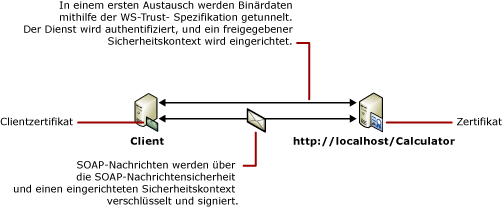

# <a name="message-security-with-a-certificate-client"></a>Nachrichtensicherheit durch einem Zertifikatclient
Das folgende Szenario zeigt, wie ein Client und ein Dienst von [!INCLUDE[indigo1](../../../../includes/indigo1-md.md)] mit dem Nachrichtensicherheitsmodus gesichert werden. Sowohl der Client als auch der Dienst werden mit Zertifikaten authentifiziert. [!INCLUDE[crdefault](../../../../includes/crdefault-md.md)][Distributed Application Security](../../../../docs/framework/wcf/feature-details/distributed-application-security.md).  
  
 Eine beispielanwendung finden Sie unter [Nachrichtensicherheitszertifikat](../../../../docs/framework/wcf/samples/message-security-certificate.md).  
  
   
  
|Merkmal|Beschreibung|  
|--------------------|-----------------|  
|Sicherheitsmodus|Meldung|  
|Interoperabilität|Nur [!INCLUDE[indigo2](../../../../includes/indigo2-md.md)]|  
|Authentifizierung (Server)|Mit Dienstzertifikat|  
|Authentifizierung (Client)|Mit Clientzertifikat|  
|Integrität|Ja|  
|Vertraulichkeit|Ja|  
|Transport|HTTP|  
|Bindung|<xref:System.ServiceModel.WSHttpBinding>|  
  
## <a name="service"></a>Dienst  
 Der folgende Code und die folgende Konfiguration werden unabhängig voneinander ausgeführt. Führen Sie einen der folgenden Schritte aus:  
  
-   Erstellen Sie einen separaten Dienst, indem Sie den Code ohne Konfiguration verwenden.  
  
-   Erstellen Sie mit der angegebenen Konfiguration einen Dienst, aber definieren Sie keine Endpunkte.  
  
### <a name="code"></a>Code  
 Der folgende Code zeigt, wie Sie einen Dienstendpunkt erstellen, der zum Herstellen eines sicheren Kontextes die Nachrichtensicherheit verwendet.  
  
 [!code-csharp[C_SecurityScenarios#10](../../../../samples/snippets/csharp/VS_Snippets_CFX/c_securityscenarios/cs/source.cs#10)]
 [!code-vb[C_SecurityScenarios#10](../../../../samples/snippets/visualbasic/VS_Snippets_CFX/c_securityscenarios/vb/source.vb#10)]  
  
### <a name="configuration"></a>Konfiguration  
 Anstelle des Codes kann die folgende Konfiguration verwendet werden:  
  
```xml  
<?xml version="1.0" encoding="utf-8"?>  
<configuration>  
  <system.serviceModel>  
    <behaviors>  
      <serviceBehaviors>  
        <behavior name="ServiceCredentialsBehavior">  
          <serviceCredentials>  
            <serviceCertificate findValue="Contoso.com"  
                                x509FindType="FindBySubjectName" />  
          </serviceCredentials>  
        </behavior>  
      </serviceBehaviors>  
    </behaviors>  
    <services>  
      <service behaviorConfiguration="ServiceCredentialsBehavior"   
               name="ServiceModel.Calculator">  
        <endpoint address="http://localhost/Calculator"   
                  binding="wsHttpBinding"  
                  bindingConfiguration="MessageAndCerficiateClient"   
                  name="SecuredByClientCertificate"  
                  contract="ServiceModel.ICalculator" />  
      </service>  
    </services>  
    <bindings>  
      <wsHttpBinding>  
        <binding name="WSHttpBinding_ICalculator">  
          <security mode="Message">  
            <message clientCredentialType="Certificate" />  
          </security>  
        </binding>  
      </wsHttpBinding>  
    </bindings>  
    <client />  
  </system.serviceModel>  
</configuration>  
```  
  
## <a name="client"></a>Client  
 Der folgende Code und die folgende Konfiguration werden unabhängig voneinander ausgeführt. Führen Sie einen der folgenden Schritte aus:  
  
-   Erstellen Sie mit dem Code (und Clientcode) einen eigenständigen Client.  
  
-   Erstellen Sie einen Client, der keine Endpunktadressen definiert. Verwenden Sie stattdessen den Clientkonstruktor, der den Konfigurationsnamen als Argument verwendet. Beispiel:  
  
     [!code-csharp[C_SecurityScenarios#0](../../../../samples/snippets/csharp/VS_Snippets_CFX/c_securityscenarios/cs/source.cs#0)]
     [!code-vb[C_SecurityScenarios#0](../../../../samples/snippets/visualbasic/VS_Snippets_CFX/c_securityscenarios/vb/source.vb#0)]  
  
### <a name="code"></a>Code  
 Der folgende Code erstellt den Client. Die Bindung bezieht sich auf den Nachrichtensicherheitsmodus, und der Clientanmeldeinformationstyp wird auf `Certificate` festgelegt.  
  
 [!code-csharp[C_SecurityScenarios#17](../../../../samples/snippets/csharp/VS_Snippets_CFX/c_securityscenarios/cs/source.cs#17)]
 [!code-vb[C_SecurityScenarios#17](../../../../samples/snippets/visualbasic/VS_Snippets_CFX/c_securityscenarios/vb/source.vb#17)]  
  
### <a name="configuration"></a>Konfiguration  
 Die folgende Konfiguration gibt das Clientzertifikat mit einem Endpunktverhalten an. Weitere Informationen zu Zertifikaten finden Sie unter [Arbeiten mit Zertifikaten](../../../../docs/framework/wcf/feature-details/working-with-certificates.md). Der Code verwendet zudem eine <`identity`> Element, um einen DNS Domain Name System () der Serveridentität des erwarteten anzugeben. [!INCLUDE[crabout](../../../../includes/crabout-md.md)]Identität, finden Sie unter [-Dienstidentität und Authentifizierung](../../../../docs/framework/wcf/feature-details/service-identity-and-authentication.md).  
  
```xml  
<?xml version="1.0" encoding="utf-8"?>  
<configuration>  
  <system.serviceModel>  
    <behaviors>  
      <endpointBehaviors>  
        <behavior name="endpointCredentialsBehavior">  
          <clientCredentials>  
            <clientCertificate findValue="Cohowinery.com"   
               storeLocation="LocalMachine"  
              x509FindType="FindBySubjectName" />  
          </clientCredentials>  
        </behavior>  
      </endpointBehaviors>  
    </behaviors>  
    <bindings>  
      <wsHttpBinding>  
        <binding name="WSHttpBinding_ICalculator" >  
          <security mode="Message">  
            <message clientCredentialType="Certificate" />  
          </security>  
        </binding>  
      </wsHttpBinding>  
    </bindings>  
    <client>  
      <endpoint address="http://machineName/Calculator"   
                behaviorConfiguration="endpointCredentialsBehavior"  
                binding="wsHttpBinding"  
                bindingConfiguration="WSHttpBinding_ICalculator"  
                contract="ICalculator"  
                name="WSHttpBinding_ICalculator">  
        <identity>  
          <dns value="Contoso.com" />  
        </identity>  
      </endpoint>  
    </client>  
  </system.serviceModel>  
</configuration>  
```  
  
## <a name="see-also"></a>Siehe auch  
 [Sicherheit (Übersicht)](../../../../docs/framework/wcf/feature-details/security-overview.md)  
 [Dienstidentität und Authentifizierung](../../../../docs/framework/wcf/feature-details/service-identity-and-authentication.md)  
 [Verwenden von Zertifikaten](../../../../docs/framework/wcf/feature-details/working-with-certificates.md)  
 [Sicherheitsmodell für Windows Server AppFabric](http://go.microsoft.com/fwlink/?LinkID=201279&clcid=0x409)
