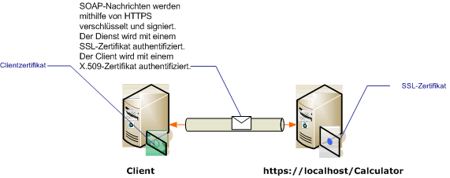

# <a name="transport-security-with-certificate-authentication"></a>Transportsicherheit mit Zertifikatauthentifizierung
In diesem Thema wird die Server- und Clientauthentifizierung mit X.509-Zertifikaten bei Verwendung der Transportsicherheit behandelt. Weitere Informationen zu X.509-Zertifikaten finden Sie unter [X.509 Public Key Certificates (X.509-Zertifikate mit öffentlichem Schlüssel)](https://msdn.microsoft.com/library/bb540819\(VS.85\).aspx). Zertifikate müssen von einer Zertifizierungsstelle ausgestellt werden, die häufig eine Drittanbieter-Zertifikataussteller handelt. In einer Windows Server-Domäne können Sie Active Directory-Zertifikatdienste verwenden, um Zertifikate für Clientcomputer in der Domäne auszustellen. Weitere Informationen finden Sie unter [Windows 2008 R2-Zertifikatdienste](https://go.microsoft.com/fwlink/?LinkID=209949&clcid=0x409). In diesem Szenario wird der Dienst unter Internetinformationsdienste (IIS) konfiguriert mit Secure Sockets Layer (SSL) gehostet. Der Dienst ist mit einem SSL-Zertifikat (X.509) konfiguriert, um Clients das Überprüfen der Identität des Servers zu ermöglichen. Der Client ist ebenfalls mit einem X.509-Zertifikat konfiguriert, das es dem Dienst ermöglicht, die Identität des Clients zu überprüfen. Das Zertifikat des Servers muss für den Client vertrauenswürdig sein und das Zertifikat des Clients für den Server. Die eigentlichen Mechanismen, anhand derer der Dienst und der Client die Identität des anderen überprüfen, werden in diesem Thema nicht behandelt. Weitere Informationen finden Sie unter [digitale Signatur auf Wikipedia](https://go.microsoft.com/fwlink/?LinkId=253157).  
  
 In diesem Szenario wird das im folgenden Diagramm dargestellte Anforderungs-/Antwortnachrichtenmuster implementiert.  
  
   
  
 Weitere Informationen zur Verwendung eines Zertifikats mit einem Dienst finden Sie unter [arbeiten mit Zertifikaten](../../../../docs/framework/wcf/feature-details/working-with-certificates.md) und [Vorgehensweise: Konfigurieren eines Anschlusses mit einem SSL-Zertifikat](../../../../docs/framework/wcf/feature-details/how-to-configure-a-port-with-an-ssl-certificate.md). In der folgenden Tabelle werden die verschiedenen Merkmale des Szenarios beschrieben.  
  
|Merkmal|Beschreibung|  
|--------------------|-----------------|  
|Sicherheitsmodus|Transport|  
|Interoperabilität|Mit vorhandenen Webdienstclients und Diensten.|  
|Authentifizierung (Server)<br /><br /> Authentifizierung (Client)|Ja (mit einem SSL-Zertifikat)<br /><br /> Ja (mit einem X.509-Zertifikat)|  
|Datenintegrität|Ja|  
|Datenvertraulichkeit|Ja|  
|Transport|HTTPS|  
|Bindung|<xref:System.ServiceModel.WSHttpBinding>|  
  
## <a name="configure-the-service"></a>Konfigurieren des Diensts  
 Da der Dienst in diesem Szenario unter IIS gehostet wird, wird er mit einer Datei "web.config" konfiguriert. Die folgende Datei "web.config" zeigt, wie die <xref:System.ServiceModel.WSHttpBinding> zur Verwendung von Transportsicherheit und X.509-Clientanmeldeinformationen konfiguriert wird.  
  
```xml  
<configuration>  
  <system.serviceModel>  
    <protocolMapping>  
      <add scheme="https" binding="wsHttpBinding" />  
    </protocolMapping>  
    <bindings>  
      <wsHttpBinding>  
        <!-- configure wsHttp binding with Transport security mode and clientCredentialType as Certificate -->  
        <binding>  
          <security mode="Transport">  
            <transport clientCredentialType="Certificate"/>              
          </security>  
        </binding>  
      </wsHttpBinding>  
    </bindings>  
    <!--For debugging purposes set the includeExceptionDetailInFaults attribute to true-->  
    <behaviors>  
      <serviceBehaviors>  
        <behavior>            
           <serviceDebug includeExceptionDetailInFaults="True" />  
        </behavior>  
      </serviceBehaviors>  
    </behaviors>  
  </system.serviceModel>  
</configuration>  
```  
  
## <a name="configure-the-client"></a>Konfigurieren des Clients  
 Der Client kann im Code oder in einer Datei "app.config" konfiguriert werden. Das folgende Beispiel zeigt, wie Sie den Client im Code konfigurieren.  
  
```vb  
// Create the binding.  
WSHttpBinding myBinding = new WSHttpBinding();  
myBinding.Security.Mode = SecurityMode.Transport;  
myBinding.Security.Transport.ClientCredentialType =  
   HttpClientCredentialType.Certificate;  
  
// Create the endpoint address. Note that the machine name   
// must match the subject or DNS field of the X.509 certificate  
// used to authenticate the service.   
EndpointAddress ea = new  
   EndpointAddress("https://localhost/CalculatorService/service.svc");  
  
// Create the client. The code for the calculator   
// client is not shown here. See the sample applications  
// for examples of the calculator code.  
CalculatorClient cc =  
   new CalculatorClient(myBinding, ea);  
  
// The client must specify a certificate trusted by the server.  
cc.ClientCredentials.ClientCertificate.SetCertificate(  
    StoreLocation.CurrentUser,  
    StoreName.My,  
    X509FindType.FindBySubjectName,  
    "contoso.com");  
  
// Begin using the client.  
Console.WriteLine(cc.Add(100, 1111));  
//...  
cc.Close();  
```  
  
 Alternativ können Sie den Client wie im folgenden Beispiel dargestellt in einer Datei "app.config" konfigurieren:  
  
```xml  
<configuration>  
  <system.serviceModel>  
    <client>  
      <!-- this endpoint has an https: address -->  
      <endpoint address=" https://localhost/CalculatorService/service.svc "   
                behaviorConfiguration="endpointCredentialBehavior"  
                binding="wsHttpBinding"   
                bindingConfiguration="Binding1"   
                contract="Microsoft.Samples.TransportSecurity.ICalculator"/>  
    </client>  
    <behaviors>  
      <endpointBehaviors>  
        <behavior name="endpointCredentialBehavior">  
          <clientCredentials>  
            <clientCertificate findValue="contoso.com"  
                               storeLocation="CurrentUser"  
                               storeName="My"  
                               x509FindType="FindBySubjectName" />  
          </clientCredentials>  
        </behavior>  
      </endpointBehaviors>  
    </behaviors>  
    <bindings>  
      <wsHttpBinding>  
        <!-- configure wsHttpbinding with Transport security mode  
                   and clientCredentialType as Certificate -->  
        <binding name="Binding1">  
          <security mode="Transport">  
            <transport clientCredentialType="Certificate"/>  
          </security>  
        </binding>  
      </wsHttpBinding>  
    </bindings>  
  </system.serviceModel>  
  
<startup><supportedRuntime version="v4.0" sku=".NETFramework,Version=v4.0"/></startup></configuration>  
```  
  
## <a name="see-also"></a>Siehe auch  
 [Übersicht über die Sicherheit](../../../../docs/framework/wcf/feature-details/security-overview.md)  
 [Sicherheitsmodell für Windows Server AppFabric](https://go.microsoft.com/fwlink/?LinkID=201279&clcid=0x409)
