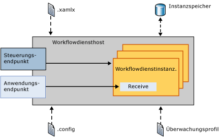

# Interne Funktionsweise des Workflowdiensthosts
<xref:System.ServiceModel.WorkflowServiceHost> stellt einen Host für Workflowdienste bereit.Der Host lauscht unter anderem auf eingehende Meldungen, leitet sie an die entsprechende Workflowdienstinstanz weiter und kontrolliert das Entladen und Beibehalten von Workflows.In diesem Thema wird beschrieben, wie eingehende Meldungen vom WorkflowServiceHost verarbeitet werden.  
  
## Übersicht über WorkflowServiceHost  
 Mit der <xref:System.ServiceModel.WorkflowServiceHost>\-Klasse werden Workflowdienste gehostet.Die Klasse lauscht auf eingehende Meldungen und leitet diese an die entsprechende Dienstinstanz weiter, erstellt neue Dienstinstanzen oder lädt vorhandene Instanzen bei Bedarf aus dem permanenten Speicher.Im folgenden Diagramm wird die allgemeine Funktionsweise von <xref:System.ServiceModel.WorkflowServiceHost> veranschaulicht.  
  
   
  
 Das Diagramm zeigt, dass Workflowdienstdefinitionen von <xref:System.ServiceModel.WorkflowServiceHost> aus XAMLX\-Dateien und Konfigurationsinformationen aus einer Konfigurationsdatei geladen werden.Außerdem wird eine Überwachungskonfiguration aus dem Überwachungsprofil geladen.<xref:System.ServiceModel.WorkflowServiceHost> macht einen Workflowsteuerungsendpunkt verfügbar, mit dem Sie Steuerungsvorgänge an Workflowinstanzen senden können.Weitere Informationen finden Sie unter [Workflowsteuerungsendpunkt](../../../../docs/framework/wcf/feature-details/workflow-control-endpoint.md) und [Workflowverwaltungsendpunkt \(Beispiel\)](../../../../docs/framework/windows-workflow-foundation/samples/workflow-management-endpoint-sample.md).  
  
 <xref:System.ServiceModel.WorkflowServiceHost> macht darüber hinaus Anwendungsendpunkte zum Lauschen auf eingehende Meldungen verfügbar.Eingehende Meldungen werden an die entsprechende Workflowdienstinstanz gesendet \(sofern diese aktuell geladen ist\).Bei Bedarf wird eine neue Workflowinstanz erstellt.Wenn eine vorhandene Instanz beibehalten wurde, wird diese aus dem Persistenzspeicher geladen.  
  
## Details zum WorkflowServiceHost  
 Im folgenden Diagramm wird detaillierter veranschaulicht, wie Meldungen von <xref:System.ServiceModel.WorkflowServiceHost> verarbeitet werden.  
  
   
  
 Das Diagramm enthält drei verschiedene Endpunkte: einen Anwendungsendpunkt, einen Workflowsteuerungsendpunkt sowie einen Workflowhostingendpunkt.Der Anwendungsendpunkt empfängt Meldungen für eine spezifische Workflowinstanz.Der Workflowsteuerungsendpunkt lauscht auf Steuerungsvorgänge.Der Workflowhostingendpunkt lauscht auf Meldungen, die bewirken, dass <xref:System.ServiceModel.WorkflowServiceHost> geladen wird und Workflows ausgeführt werden, die keine Dienstworkflows sind.Alle Meldungen werden, wie im Diagramm gezeigt, von der WCF\-Laufzeit verarbeitet.Die Einschränkung von Workflowdienstinstanzen wird mit der <xref:System.ServiceModel.Description.ServiceThrottlingBehavior.MaxConcurrentInstances%2A>\-Eigenschaft erreicht.Diese Eigenschaft schränkt die Anzahl von gleichzeitigen Workflowdienstinstanzen ein.Wenn diese Drosselung überschritten wird, werden zusätzliche Anforderungen für neue Workflowdienstinstanzen oder Anforderungen zum Aktivieren beibehaltener Workflowinstanzen in einer Warteschlange gespeichert.Die in der Warteschlange gespeicherten Anforderungen werden in FIFO\-Reihenfolge verarbeitet, unabhängig davon, ob sie Anforderungen für eine neue Instanz oder eine ausgeführte, beibehaltene Instanz sind.Hostrichtlinieninformationen werden geladen, um festzulegen, wie Ausnahmefehler gehandhabt und Workflowdienste im Leerlauf entladen und beibehalten werden.[!INCLUDE[crabout](../../../../includes/crabout-md.md)] zu diesen Themen finden Sie unter [Vorgehensweise: Konfigurieren des Verhaltens bei nicht behandelten Ausnahmen für Workflows mit WorkflowServiceHost](../../../../docs/framework/wcf/feature-details/config-workflow-unhandled-exception-workflowservicehost.md) und [Vorgehensweise: Konfigurieren des Leerlaufverhaltens mit WorkflowServiceHost](../../../../docs/framework/wcf/feature-details/how-to-configure-idle-behavior-with-workflowservicehost.md).Workflowinstanzen werden gemäß den Hostrichtlinien beibehalten und bei Bedarf erneut geladen.Weitere Informationen zur Workflowpersistenz finden Sie unter [Vorgehensweise: Konfigurieren der Persistenz mit WorkflowServiceHost](../../../../docs/framework/wcf/feature-details/how-to-configure-persistence-with-workflowservicehost.md), [Erstellen eines Workflowdiensts mit langer Ausführungszeit](../../../../docs/framework/wcf/feature-details/creating-a-long-running-workflow-service.md) und [Workflowpersistenz](../../../../docs/framework/windows-workflow-foundation//workflow-persistence.md).  
  
 In der folgenden Abbildung wird das Aufrufen von WorkflowServiceHost.Open veranschaulicht.  
  
   
  
 Der Workflow wird aus XAML geladen, und die Aktivitätsstruktur wird erstellt.<xref:System.ServiceModel.WorkflowServiceHost> durchläuft die Aktivitätsstruktur und erstellt die Dienstbeschreibung.Die Konfiguration wird auf den Host angewendet.Abschließend beginnt der Host mit dem Lauschen auf eingehende Meldungen.  
  
 In der folgenden Abbildung wird die Vorgehensweise von <xref:System.ServiceModel.WorkflowServiceHost> beim Empfangen einer Meldung für eine Receive\-Aktivität veranschaulicht, deren CanCreateInstance auf `true` festgelegt ist.  
  
   
  
 Die Meldung wird empfangen und vom WCF\-Kanalstapel verarbeitet.Drosselungen werden überprüft und Korrelationsabfragen ausgeführt.Wenn die Meldung an eine vorhandene Instanz gerichtet ist, wird sie übermittelt.Wenn eine neue Instanz erstellt werden muss, wird die Receive\-Aktivität der CanCreateInstance\-Eigenschaft überprüft.Wenn die Eigenschaft auf True festgelegt ist, wird eine neue Instanz erstellt, und die Meldung wird übermittelt.  
  
 In der folgenden Abbildung wird die Vorgehensweise von <xref:System.ServiceModel.WorkflowServiceHost> beim Empfangen einer Meldung für eine Receive\-Aktivität veranschaulicht, deren CanCreateInstance auf False festgelegt ist.  
  
   
  
 Die Meldung wird empfangen und vom WCF\-Kanalstapel verarbeitet.Drosselungen werden überprüft und Korrelationsabfragen ausgeführt.Die Meldung ist für eine vorhandene Instanz bestimmt \(CanCreateInstance ist auf False festgelegt\). Daher wird die Instanz aus dem Persistenzspeicher geladen, das Lesezeichen wird wiederaufgenommen, und der Workflow wird ausgeführt.  
  
> [!WARNING]
>  Der Workflowdiensthost kann nicht geöffnet werden, wenn SQL Server nur zum Lauschen auf das NamedPipe\-Protokoll konfiguriert wurde.  
  
## Siehe auch  
 [Workflowdienste](../../../../docs/framework/wcf/feature-details/workflow-services.md)   
 [Hosten von Workflowdiensten](../../../../docs/framework/wcf/feature-details/hosting-workflow-services.md)   
 [Workflowsteuerungsendpunkt](../../../../docs/framework/wcf/feature-details/workflow-control-endpoint.md)   
 [Workflowverwaltungsendpunkt \(Beispiel\)](../../../../docs/framework/windows-workflow-foundation/samples/workflow-management-endpoint-sample.md)   
 [Vorgehensweise: Konfigurieren des Verhaltens bei nicht behandelten Ausnahmen für Workflows mit WorkflowServiceHost](../../../../docs/framework/wcf/feature-details/config-workflow-unhandled-exception-workflowservicehost.md)   
 [Erstellen eines Workflowdiensts mit langer Ausführungszeit](../../../../docs/framework/wcf/feature-details/creating-a-long-running-workflow-service.md)   
 [Workflowpersistenz](../../../../docs/framework/windows-workflow-foundation//workflow-persistence.md)