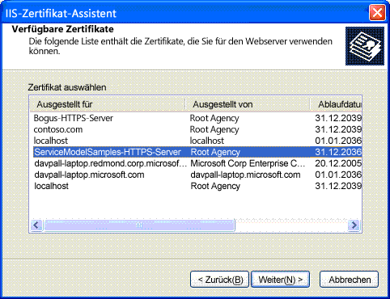

# Installationsanleitung f&#252;r IIS-Serverzertifikate (Internetinformationsdienste)
Zum Ausführen der Beispiele, die über eine sichere Kommunikation mit Internetinformationsdiensten \(IIS\) verbunden sind, müssen Sie ein Serverzertifikat erstellen und installieren.  
  
## Schritt 1.Erstellen von Zertifikaten  
 Öffnen Sie zum Erstellen eines Zertifikats eine Visual Studio\-Eingabeaufforderung mit Administratorrechten, und führen Sie die Datei Setup.bat aus, die in den einzelnen Beispielen enthalten ist, bei denen die sichere Kommunikation über IIS erfolgt.Stellen Sie vor dem Ausführen dieser Batchdatei sicher, dass der Pfad den Ordner einschließt, in dem sich die Datei Makecert.exe befindet.Der folgende Befehl wird zum Erstellen des Zertifikats in Setup.bat verwendet.  
  
```  
makecert -sr LocalMachine -ss My -n CN=ServiceModelSamples-HTTPS-Server -sky exchange -sk ServiceModelSamples-HTTPS-Key  
```  
  
## Schritt 2.Installieren von Zertifikaten  
 Welche Schritte Sie zum Installieren der erstellten Zertifikate ausführen müssen, hängt von der verwendeten IIS\-Version ab.  
  
#### Installation mit IIS 5.1 \(Windows XP\) und IIS 6.0 \(Windows Server 2003\)  
  
1.  Öffnen Sie das MMC\-Snap\-In Internetinformationsdienste\-Manager.  
  
2.  Klicken Sie mit der rechten Maustaste auf die Standardwebsite, und wählen Sie **Eigenschaften**.  
  
3.  Klicken Sie auf die Registerkarte **Verzeichnissicherheit**.  
  
4.  Klicken Sie auf die Schaltfläche **Serverzertifikat**.Der Assistent für Webserverzertifikate wird gestartet.  
  
5.  Durchlaufen Sie den Assistenten.Wählen Sie die Option zum Zuweisen eines Zertifikats aus.Wählen Sie aus der angezeigten Liste mit Zertifikaten das Zertifikat ServiceModelSamples\-HTTPS\-Server aus.  
  
       
  
6.  Testen Sie den Zugriff auf den Dienst in einem Browser mit der HTTPS\-Adresse https:\/\/localhost\/servicemodelsamples\/service.svc.  
  
#### Wenn zuvor SSL mit Httpcfg.exe konfiguriert wurde  
  
1.  Verwenden Sie zum Erstellen des Serverzertifikats Makecert.exe \(oder führen Sie Setup.bat aus\).  
  
2.  Führen Sie den IIS\-Manager aus, und installieren Sie das Zertifikat wie oben beschrieben.  
  
3.  Fügen Sie dem Clientprogramm folgenden Code hinzu.  
  
> [!IMPORTANT]
>  Dieser Code ist nur für Testzertifikate erforderlich, die z. B. mit Makecert.exe erstellt wurden.Er wird nicht für Produktionsumgebungen empfohlen.  
  
```  
PermissiveCertificatePolicy.Enact("CN=ServiceModelSamples-HTTPS-Server");  
```  
  
#### Installation mit IIS 7.0 \(Windows Vista und Windows Server 2008\)  
  
1.  Klicken Sie im Menü **Start** auf **Ausführen**, und geben Sie **inetmgr** ein, um das MMC\-Snap\-In Internetinformationsdienste \(IIS\) zu öffnen.  
  
2.  Klicken Sie mit der rechten Maustaste auf die **Standardwebsite**, und wählen Sie **Bindungen bearbeiten**.  
  
3.  Klicken Sie im Dialogfeld **Sitebindungen** auf **Hinzufügen**.  
  
4.  Wählen Sie in der Dropdownliste **Typ** die Option **HTTPS**.  
  
5.  Wählen Sie aus der Dropdownliste **SSL\-Zertifikat** die Option **ServiceModelSamples\-HTTPS\-Server** aus, und klicken Sie auf **OK**.  
  
6.  Testen Sie den Zugriff auf den Dienst in einem Browser mit der HTTPS\-Adresse https:\/\/localhost\/servicemodelsamples\/service.svc.  
  
> [!NOTE]
>  Da es sich bei dem gerade installierten Testzertifikat nicht um ein vertrauenswürdiges Zertifikat handelt, werden im Internet Explorer möglicherweise zusätzliche Sicherheitswarnungen angezeigt, wenn Sie zu lokalen Webseiten navigieren, die dieses Zertifikat verwenden.  
  
## Entfernen von Zertifikaten  
  
-   Führen Sie im Internetinformationsdienste\-Manager die zuvor beschriebenen Schritte aus. Entfernen Sie jedoch das Zertifikat bzw. die Bindung, anstatt sie hinzuzufügen.  
  
-   Entfernen Sie das Computerzertifikat mit dem folgenden Befehl.  
  
    ```  
    httpcfg delete ssl -i 0.0.0.0:443  
    ```