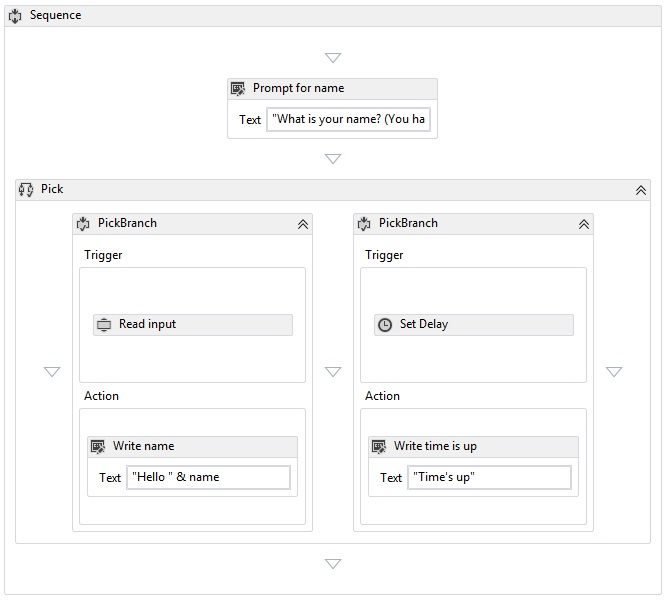

# Auswahlaktivit&#228;t
Die <xref:System.Activities.Statements.Pick>-Aktivität vereinfacht die Modellierung einer Gruppe von Ereignistriggern gefolgt von den entsprechenden Handlern.  Eine <xref:System.Activities.Statements.Pick>-Aktivität enthält eine Sammlung von <xref:System.Activities.Statements.PickBranch>-Aktivitäten, wobei jedes <xref:System.Activities.Statements.PickBranch>-Objekt eine Paarung einer <xref:System.Activities.Statements.PickBranch.Trigger%2A>-Aktivität und einer <xref:System.Activities.Statements.PickBranch.Action%2A>-Aktivität darstellt.  Bei der Ausführung werden die Trigger für alle Branches parallel ausgeführt.  Nach Abschluss eines Triggers wird die zugeordnete Aktion ausgeführt, und alle anderen Trigger werden abgebrochen.  Das Verhalten der [!INCLUDE[netfx_current_short](../../../includes/netfx-current-short-md.md)]<xref:System.Activities.Statements.Pick>-Aktivität ist vergleichbar mit der [!INCLUDE[netfx35_short](../../../includes/netfx35-short-md.md)]<xref:System.Workflow.Activities.Listen>-Aktivität.  
  
 Der folgende Screenshot aus dem SDK-Beispiel [Verwenden der Pick-Aktivität](../../../docs/framework/windows-workflow-foundation/samples/using-the-pick-activity.md) zeigt eine Pick-Aktivität mit zwei Branches.  Ein Branch verfügt über einen Trigger mit dem Namen **Read input**, eine benutzerdefinierte Aktivität, die Eingaben aus der Befehlszeile liest. Der zweite Branch verfügt über einen Aktivitätstrigger <xref:System.Activities.Statements.Delay>. Wenn die Aktivität **Read input** Daten empfängt, bevor die Aktivität <xref:System.Activities.Statements.Delay> beendet wird, wird <xref:System.Activities.Statements.Delay> abgebrochen und eine Mitteilung in die Konsole geschrieben.  Die Aktivität **Read input** wird jedoch abgebrochen und eine Timeoutmeldung in die Konsole geschrieben, wenn die Aktivität in der zugewiesenen Zeit keine Daten empfängt.  Dies ist ein allgemeines Muster, mit dem einer beliebigen Aktion ein Timeoutverhalten hinzugefügt werden kann.  
  
   
  
## <a name="best-practices"></a>Bewährte Methoden  
 Bei Verwendung der Pick-Option ist die ausgeführte Verzweigung diejenige, deren Trigger zuerst abgeschlossen wird.  Vom Konzept her werden alle Trigger parallel ausgeführt. Ein Trigger hat möglicherweise den Großteil seiner Logik ausgeführt, bevor er durch den Abschluss eines anderen Triggers abgebrochen wird.  Unter Beachtung dieser Option gilt als allgemeine Richtlinie für die Verwendung einer Pick-Aktivität, dass der Trigger als Einzelereignis behandelt werden sollte und so wenig Logik wie möglich enthalten sein sollte.  Im Idealfall enthält der Trigger gerade genügend Logik, um ein Ereignis empfangen zu können. Die gesamte Verarbeitung des Ereignisses sollte in der Aktion der Verzweigung erfolgen.  Auf diese Weise kann der Grad der Überschneidung bei der Ausführung der Trigger minimiert werden.  Nehmen Sie zum Beispiel eine <xref:System.Activities.Statements.Pick>-Aktivität mit zwei Triggern an, wobei jeder Trigger eine <xref:System.ServiceModel.Activities.Receive>-Aktivität gefolgt von zusätzlicher Logik enthält.  Wenn die zusätzliche Logik einen Leerlaufpunkt einführt, können beide <xref:System.ServiceModel.Activities.Receive>-Aktivitäten erfolgreich abgeschlossen werden.  Ein Trigger wird vollständig abgeschlossen, während ein anderer nur teilweise abgeschlossen wird.  In einigen Szenarien ist es nicht zulässig, dass eine Meldung angenommen und die Verarbeitung nur teilweise abgeschlossen wird.  Wenn daher integrierte WF-Messagingaktivitäten wie <xref:System.ServiceModel.Activities.Receive> und <xref:System.ServiceModel.Activities.SendReply> verwendet werden, während <xref:System.ServiceModel.Activities.Receive> häufig im Trigger verwendet wird, sollten <xref:System.ServiceModel.Activities.SendReply> und andere Logik nach Möglichkeit in die Aktion eingefügt werden.  
  
## <a name="using-the-pick-activity-in-the-designer"></a>Verwenden der Pick-Aktivität im Designer  
 Um die Pick-Aktivität im Designer verwenden zu können, suchen Sie in der Toolbox nach **Pick** und **PickBranch**.  Ziehen Sie **Pick** per Drag & Drop auf die Canvas.  Standardmäßig enthält eine neue **Pick**-Aktivität im Designer zwei Branches.  Um zusätzliche Branches hinzuzufügen, ziehen Sie die **PickBranch**-Aktivität per Drag & Drop neben vorhandene Branches. Aktivitäten können für die **Pick**-Aktivität entweder im Bereich **Trigger** oder im Bereich **Aktion** einer **PickBranch** abgelegt werden.  
  
## <a name="using-the-pick-activity-in-code"></a>Verwenden der Pick-Aktivität im Code  
 Die <xref:System.Activities.Statements.Pick>-Aktivität wird verwendet, indem die zugehörige <xref:System.Activities.Statements.Pick.Branches%2A>-Sammlung mit <xref:System.Activities.Statements.PickBranch>-Aktivitäten aufgefüllt wird. Die <xref:System.Activities.Statements.PickBranch>-Aktivitäten verfügen jeweils über eine <xref:System.Activities.Statements.PickBranch.Trigger%2A>-Eigenschaft des Typs <xref:System.Activities.Activity>. Wenn die Ausführung der angegebenen Aktivität abgeschlossen wird, wird die <xref:System.Activities.Statements.PickBranch.Action%2A> ausgeführt.  
  
 Im folgenden Codebeispiel wird veranschaulicht, wie mit einer <xref:System.Activities.Statements.Pick>-Aktivität ein Timeout für eine Aktivität implementiert wird, die eine Zeile aus der Konsole liest.  
  
```csharp  
Sequence body = new Sequence()  
{  
    Variables = { name },  
    Activities =   
   {  
       new System.Activities.Statements.Pick  
        {  
           Branches =   
           {  
               new PickBranch  
               {  
                   Trigger = new ReadLine  
                   {  
                      Result = name,  
                      BookmarkName = "name"  
                   },  
                   Action = new WriteLine   
                   {   
                       Text = ExpressionServices.Convert<string>(ctx => "Hello " +   
                           name.Get(ctx))   
                   }  
               },  
               new PickBranch  
               {  
                   Trigger = new Delay  
                   {  
                      Duration = new TimeSpan(0, 0, 5)  
                   },  
                   Action = new WriteLine  
                   {  
                      Text = "Time is up."  
                   }  
               }  
           }  
       }  
   }  
};  
  
```  
  
```xaml  
<Sequence xmlns="http://schemas.microsoft.com/netfx/2009/xaml/activities" xmlns:x="http://schemas.microsoft.com/winfx/2006/xaml">  
  <Sequence.Variables>  
    <Variable x:TypeArguments="x:String" Name="username" />  
  </Sequence.Variables>  
  <Pick>  
    <PickBranch>  
      <PickBranch.Trigger>  
        <ReadLine BookmarkName="name" Result="username" />  
      </PickBranch.Trigger>  
      <WriteLine>[String.Concat("Hello ", username)]</WriteLine>  
    </PickBranch>  
    <PickBranch>  
      <PickBranch.Trigger>  
        <Delay>00:00:05</Delay>  
      </PickBranch.Trigger>  
      <WriteLine>Time is up.</WriteLine>  
    </PickBranch>  
  </Pick>  
</Sequence>  
  
```