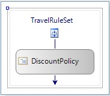
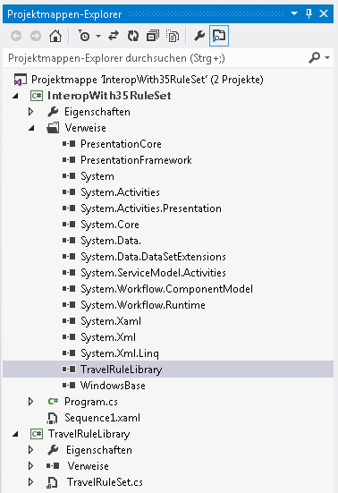

# <a name="interop-with-35-rule-set"></a>Zusammenarbeit mit dem 3.5-Regelsatz
Dieses Beispiel veranschaulicht die Verwendung von der <xref:System.Activities.Statements.Interop> -Aktivität zur Integration mit einer benutzerdefinierten Aktivität in [!INCLUDE[netfx35_short](../../../../includes/netfx35-short-md.md)] mit <!--zz <xref:System.Workflow.Activities.Policy> --> `System.Workflow.Activities.Policy` und Regeln. Es übergibt Daten an die benutzerdefinierte Aktivität, indem es [!INCLUDE[netfx_current_long](../../../../includes/netfx-current-long-md.md)]-Variablen an die von der benutzerdefinierten Aktivität verfügbar gemachten Abhängigkeitseigenschaften bindet.  
  
## <a name="requirements"></a>Anforderungen  
  
1.  [!INCLUDE[vs_current_long](../../../../includes/vs-current-long-md.md)]  
  
2.  [!INCLUDE[netfx_current_long](../../../../includes/netfx-current-long-md.md)]  
  
3.  [!INCLUDE[netfx35_long](../../../../includes/netfx35-long-md.md)]  
  
## <a name="demonstrates"></a>Veranschaulicht  
 <xref:System.Activities.Statements.Interop> Aktivität <!--zz <xref:System.Workflow.Activities.Policy> --> `System.Workflow.Activities.Policy` -Aktivität in [!INCLUDE[netfx35_short](../../../../includes/netfx35-short-md.md)] mit Abhängigkeitseigenschaften  
  
## <a name="discussion"></a>Diskussion  
 Im Beispiel wird eines der Integrationsszenarien zum Integrieren in eine [!INCLUDE[netfx35_short](../../../../includes/netfx35-short-md.md)]-Aktivität veranschaulicht. Dieses Beispiel enthält eine [!INCLUDE[netfx35_short](../../../../includes/netfx35-short-md.md)] benutzerdefinierte Aktivität, die aufruft, ein <!--zz <xref:System.Workflow.Activities.Policy> --> `System.Workflow.Activities.Policy` Aktivität.  
  
## <a name="travelrulelibrary"></a>TravelRuleLibrary  
 Beim Öffnen von TravelRuleSet.cs im Designer wird eine benutzerdefinierte sequenzielle Aktivität angezeigt, die eine Richtlinienaktivität enthält:  
  
   
  
 Doppelklicken Sie auf die **DiscountPolicy** richtlinienaktivität, um die Regeln zu überprüfen. Der Regeleditor scheint die Regeln anzuzeigen.  
  
   
  
 Mit der rechten Maustaste die **DiscountPolicy** Aktivität, und wählen die **Anzeigecode** Option aus, um den Code-beside-C#-Code zu untersuchen, die mit dieser Aktivität wechselt. Achten Sie auf die Einstellung der Abhängigkeitseigenschaft für `DiscountLevel`. Diese entspricht einem <xref:System.Activities.Argument> in [!INCLUDE[netfx_current_short](../../../../includes/netfx-current-short-md.md)].  
  
```  
public static DependencyProperty DiscountLevelProperty = DependencyProperty.Register("DiscountLevel", typeof(int), typeof(TravelRuleSet));  
  
[DescriptionAttribute("DiscountLevel")]  
[CategoryAttribute("DiscountLevel Category")]  
[BrowsableAttribute(true)]  
[DesignerSerializationVisibilityAttribute(DesignerSerializationVisibility.Visible)]  
public int DiscountLevel  
{  
   get  
   {  
return ((int)base.GetValue(TravelRuleSet.DiscountLevelProperty)));  
   }  
   set  
   {  
base.SetValue(TravelRuleSet.DiscountLevelProperty, value);  
   }  
}  
```  
  
## <a name="interopwith35ruleset"></a>InteropWith35RuleSet  
 Dies ist ein sequenzielles Workflowprojekt von [!INCLUDE[netfx_current_short](../../../../includes/netfx-current-short-md.md)], das die <xref:System.Activities.Statements.Interop>-Aktivität für die Integration mit dem im TravelRuleLibrary-Projekt erstellten benutzerdefinierten Regelsatz verwendet. Variablen werden wie folgt auf der <xref:System.Activities.Statements.Sequence> der obersten Ebene erstellt.  
  
   
  
   
  
 Schließlich wird die <xref:System.Activities.Statements.Interop>-Aktivität für die Integration mit TravelRuleSet verwendet. Die Variablen, die zuvor in der <xref:System.Activities.Statements.Sequence> deklariert wurden, werden zum Binden an die Abhängigkeitseigenschaften verwendet.  
  
   
  
   
  
   
  
> [!IMPORTANT]
>  Die Beispiele sind möglicherweise bereits auf dem Computer installiert. Suchen Sie nach dem folgenden Verzeichnis (Standardverzeichnis), bevor Sie fortfahren.  
>   
>  `<InstallDrive>:\WF_WCF_Samples`  
>   
>  Wenn dieses Verzeichnis nicht vorhanden ist, fahren Sie mit [Windows Communication Foundation (WCF) und Windows Workflow Foundation (WF) Samples für .NET Framework 4](https://go.microsoft.com/fwlink/?LinkId=150780) alle Windows Communication Foundation (WCF) herunterladen und [!INCLUDE[wf1](../../../../includes/wf1-md.md)] Beispiele. Dieses Beispiel befindet sich im folgenden Verzeichnis.  
>   
>  `<InstallDrive>:\WF_WCF_Samples\WF\Basic\Built-InActivities\InteropWith35RuleSet`
