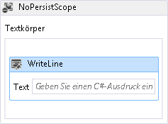
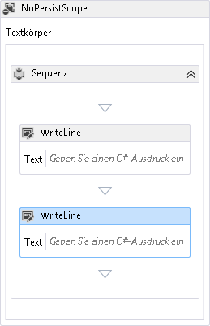

# Unterstützung für neue Workflow Foundation 4.5-Funktionen im neu gehosteten Workflow-Designer
Windows Workflow Foundation (WF) in [!INCLUDE[net_v45](../../../includes/net-v45-md.md)] eingeführt wurden viele neue Features, einschließlich einiger Erweiterungen für die Workflow-Designer-Erfahrung. In diesem Thema wird erörtert, welche dieser Funktionen im neu gehosteten Designer bzw. derzeit überhaupt nicht unterstützt werden.  
  
> [!NOTE]
>  Eine Liste aller von der neuen Windows Workflow Foundation (WF)-Funktionen in [!INCLUDE[net_v45](../../../includes/net-v45-md.md)], einschließlich derer, die unabhängig von Designer betreffen, finden Sie unter [Neuigkeiten in Windows Workflow Foundation in .NET 4.5](../../../docs/framework/windows-workflow-foundation/whats-new-in-wf-in-dotnet.md).  
  
## Aktivitäten  
 Die integrierte Aktivitätsbibliothek enthält neue Aktivitäten und neue Funktionen für vorhandene Aktivitäten. Alle diese neuen Aktivitäten werden im neu gehosteten Designer unterstützt. Weitere Informationen über diese neuen Aktivitäten finden Sie unter den [Aktivitäten](../../../docs/framework/windows-workflow-foundation/whats-new-in-wf-in-dotnet.md#BKMK_NewActivities) Abschnitt [Neuigkeiten in Windows Workflow Foundation in .NET 4.5](../../../docs/framework/windows-workflow-foundation/whats-new-in-wf-in-dotnet.md).  
  
## C#-Ausdrücke  
 Vor [!INCLUDE[net_v45](../../../includes/net-v45-md.md)] konnten alle Ausdrücke in Workflows nur in Visual Basic geschrieben werden. In [!INCLUDE[net_v45](../../../includes/net-v45-md.md)] werden Visual Basic-Ausdrücke nur für Projekte verwendet, die mit Visual Basic erstellt wurden. Visual C#-Projekte verwenden jetzt die Programmiersprache C# für Ausdrücke. Beim Erstellen von Workflows in [!INCLUDE[vs_current_long](../../../includes/vs-current-long-md.md)] wird ein voll funktionaler C#-Ausdrucks-Editor mit Funktionen wie IntelliSense und der Hervorhebung grammatikalischer Fehler bereitgestellt. Die in früheren Versionen erstellten C#-Workflowprojekte, die Visual Basic-Ausdrücke verwenden, sind weiterhin funktionsfähig.  
  
> [!WARNING]
>  C#-Ausdrücke werden im neu gehosteten Designer nicht unterstützt.  
  
## Neue Designer-Funktionen  
  
### Designer-Suche  
 Die [Schnellsuche](../../../docs/framework/windows-workflow-foundation/whats-new-in-wf-in-dotnet.md#BKMK_QuickFind) und [in Dateien suchen](../../../docs/framework/windows-workflow-foundation/whats-new-in-wf-in-dotnet.md#BKMK_FindInFiles) Features eingeführt, mit [!INCLUDE[net_v45](../../../includes/net-v45-md.md)] werden im neu gehosteten Designer nicht unterstützt. Die `Toolbox`-Suche wird im neu gehosteten Designer unterstützt. Weitere Informationen zu diesen Funktionen finden Sie unter [Designer-Suche](../../../docs/framework/windows-workflow-foundation/whats-new-in-wf-in-dotnet.md#BKMK_DesignerSearch).  
  
> [!WARNING]
>  [Schnellsuche](../../../docs/framework/windows-workflow-foundation/whats-new-in-wf-in-dotnet.md#BKMK_QuickFind) und [in Dateien suchen](../../../docs/framework/windows-workflow-foundation/whats-new-in-wf-in-dotnet.md#BKMK_FindInFiles) werden im neu gehosteten Designer nicht unterstützt.  
  
### Löschen von Kontextmenüelementen im Variablen- und Argument-Designer  
 In [!INCLUDE[netfx40_short](../../../includes/netfx40-short-md.md)] konnten Variablen und Argumente nur im Designer und mithilfe der Tastatur gelöscht werden. Ab [!INCLUDE[net_v45](../../../includes/net-v45-md.md)] können Variablen und Argumente mithilfe des Kontextmenüs gelöscht werden. Diese Funktion wird im neu gehosteten Designer unterstützt.  
  
 Das folgende Bildschirmfoto zeigt das Kontextmenü des Variablen- und Argument-Designers.  
  
   
  
### Automatisches Umschließen mit Sequenz  
 Da ein Workflow oder bestimmte Containeraktivitäten (z. B. <xref:System.Activities.Statements.NoPersistScope>) nur eine einzelne Textkörperaktivität enthalten können, musste der Entwickler zum Hinzufügen einer zweiten Aktivität die erste Aktivität löschen, eine <xref:System.Activities.Statements.Sequence>-Aktivität hinzufügen und der Sequenzaktivität dann beide Aktivitäten hinzufügen. Wenn der Designeroberfläche ab [!INCLUDE[net_v45](../../../includes/net-v45-md.md)] eine zweite Aktivität hinzugefügt wird, wird automatisch eine `Sequence`-Aktivität erstellt, um beide Aktivitäten zu umschließen. Diese Funktion wird im neu gehosteten Designer unterstützt.  
  
 Die folgende Bildschirmaufnahme zeigt eine `WriteLine`-Aktivität in `Body` von `NoPersistScope`.  
  
   
  
 Die folgende Bildschirmaufnahme zeigt die automatisch erstellte `Sequence`-Aktivität in `Body`, wenn eine zweite `WriteLine`-Komponente unterhalb der ersten abgelegt wird.  
  
   
  
### Schwenkmodus  
 Um in einem umfangreichen Workflow einfacher im Designer zu navigieren, kann der Schwenkmodus aktiviert werden, der es dem Entwickler ermöglicht, den sichtbaren Teil des Workflows durch Klicken und Ziehen zu verschieben, anstatt die Bildlaufleisten zu verwenden. Die Schaltfläche zum Aktivieren des Schwenkmodus befindet sich in der rechten unteren Ecke des Designers. Diese Funktion wird im neu gehosteten Designer unterstützt.  
  
 Das folgende Bildschirmfoto zeigt die Schaltfläche zum Schwenken, die sich in der unteren rechten Ecke des Workflow-Designers befindet.  
  
   
  
 Die mittlere Maustaste oder die LEERTASTE kann ebenfalls verwendet werden, um den Workflow-Designer zu schwenken.  
  
### Mehrfachauswahl  
 Mehrere Aktivitäten können gleichzeitig ausgewählt werden, indem Sie entweder ein Rechteck darum ziehen (wenn der Schwenkmodus nicht aktiviert ist), oder indem Sie die STRG-TASTE gedrückt halten und nacheinander auf die gewünschten Aktivitäten klicken. Diese Funktion wird im neu gehosteten Designer unterstützt.  
  
 Mehrere ausgewählte Aktivitäten können auch im Designer gezogen und abgelegt und über das Kontextmenü bearbeitet werden.  
  
### Gliederungsansicht der Workflowelemente  
 Um das Navigieren in hierarchischen Workflows zu erleichtern, werden die Komponenten eines Workflows in einer strukturähnlichen Gliederungsansicht angezeigt. Die Gliederungsansicht wird angezeigt, der **Dokumentgliederung** anzeigen. Wählen Sie zum Öffnen dieser Sicht in Visual Studio in der oberen Menüleiste **Ansicht**, **Other Windows**, **Dokumentgliederung**, oder drücken Sie STRG-W, U. Wenn Sie auf einen Knoten in der Gliederungsansicht klicken, wechseln Sie automatisch zur entsprechenden Aktivität im Workflow-Designer, und die Gliederungsansicht wird aktualisiert, um die im Designer ausgewählten Aktivitäten anzuzeigen. Diese Funktion wird im neu gehosteten Designer unterstützt.  
  
 Das folgende Bildschirmfoto des abgeschlossenen Workflows aus der [Getting Started Tutorial](../../../docs/framework/windows-workflow-foundation/getting-started-tutorial.md) zeigt die Gliederungsansicht mit einem sequenziellen Workflow.  
  
   
  
### Bessere Kontrolle über die Sichtbarkeit der Shellleiste und Headerelemente  
 In einem neu gehosteten Designer sind einige standardmäßigen Benutzeroberflächen-Steuerelemente für einen bestimmten Workflow möglicherweise bedeutungslos und deaktiviert. In [!INCLUDE[netfx40_short](../../../includes/netfx40-short-md.md)] wird diese Anpassung nur von der Shellleiste im unteren Bereich des Designers unterstützt. In [!INCLUDE[net_v45](../../../includes/net-v45-md.md)] kann die Sichtbarkeit der Shellheaderelemente am oberen Rand des Designers angepasst werden, indem <xref:System.Activities.Presentation.View.DesignerView.WorkflowShellHeaderItemsVisibility%2A> mit dem entsprechenden <xref:System.Activities.Presentation.View.ShellHeaderItemsVisibility>-Wert festgelegt wird.  
  
### Automatisches Verbinden und Einfügen in Flussdiagramm- und Zustandsautomatworkflows  
 In [!INCLUDE[netfx40_short](../../../includes/netfx40-short-md.md)] mussten Verbindungen zwischen Knoten in einem Flussdiagramm-Workflow manuell hinzugefügt werden. In [!INCLUDE[net_v45](../../../includes/net-v45-md.md)] weisen Flussdiagramm- und Zustandsautomatknoten Punkte für die automatische Verbindung auf, die sichtbar werden, wenn eine Aktivität aus der Toolbox auf die Designeroberfläche gezogen wird. Durch Ablegen einer Aktivität auf einem dieser Punkte wird die Aktivität automatisch zusammen mit der erforderlichen Verbindung hinzugefügt.  
  
 Das folgende Bildschirmfoto zeigt die Anfügepunkte, die sichtbar werden, wenn eine Aktivität aus der Toolbox gezogen wird.  
  
   
  
 Aktivitäten können auch auf Verbindungen zwischen Flussdiagrammknoten und -zuständen gezogen werden, um den Knoten automatisch zwischen zwei anderen Knoten einzufügen. Das folgende Bildschirmfoto zeigt die hervorgehobene Verbindungslinie, auf die Aktivitäten aus der Toolbox gezogen und abgelegt werden können.  
  
   
  
 Automatisches Verbinden und automatisches Einfügen werden im neu gehosteten Designer unterstützt.  
  
### Designer-Anmerkungen  
 Zur einfacheren Entwicklung größerer Workflows unterstützt der Designer jetzt das Hinzufügen von Anmerkungen, um den Entwurfsprozess nachzuverfolgen. Aktivitäten, Zustände, Flussdiagrammknoten, Variablen und Argumente können mit Anmerkungen versehen werden. Das folgende Bildschirmfoto zeigt das Kontextmenü, das verwendet wird, um dem Designer Anmerkungen hinzuzufügen.  
  
   
  
 Designer-Anmerkungen werden im neu gehosteten Designer unterstützt.  
  
### Definieren und Nutzen von ActivityDelegate-Objekten im Designer  
 Aktivitäten in [!INCLUDE[netfx40_short](../../../includes/netfx40-short-md.md)] verwendeten <xref:System.Activities.ActivityDelegate>-Objekte, um Ausführungspunkte verfügbar zu machen, in denen andere Teile des Workflows mit der Ausführung eines Workflows interagieren konnten. Zur Verwendung dieser Ausführungspunkte war normalerweise jedoch beträchtlicher Code erforderlich. In diesem Release können Entwickler die Aktivitätsdelegaten mit dem Workflow-Designer definieren und nutzen. Weitere Informationen finden Sie unter [wie: definieren und Verarbeiten von aktivitätsdelegaten im Workflow-Designer](/visualstudio/workflow-designer/how-to-define-and-consume-activity-delegates-in-the-workflow-designer).  
  
 Aktivitätsdelegaten werden im neu gehosteten Designer unterstützt.  
  
### Validierung zur Buildzeit  
 In [!INCLUDE[netfx40_short](../../../includes/netfx40-short-md.md)] galten Workflowvalidierungsfehler während der Erstellung eines Workflowprojekts nicht als Erstellungsfehler. Das bedeutete, dass das Erstellen eines Workflowprojekts erfolgreich gewesen sein konnte, obwohl Workflowvalidierungsfehler auftraten. In [!INCLUDE[net_v45](../../../includes/net-v45-md.md)] bewirken Workflowvalidierungsfehler, dass die Erstellung fehlschlägt.  
  
> [!WARNING]
>  Die Validierung zur Buildzeit wird im neu gehosteten Designer nicht unterstützt.  
  
### Hintergrundvalidierung zur Entwurfszeit  
 In [!INCLUDE[netfx40_short](../../../includes/netfx40-short-md.md)] wurde die Workflowvalidierung als Vordergrundprozess ausgeführt, was bei komplexen oder zeitaufwändigen Validierungsprozessen dazu führen konnte, dass die Benutzeroberfläche hängen blieb. Da die Workflowvalidierung nun in einem Hintergrundthread stattfindet, wird die Benutzeroberfläche nicht blockiert.  
  
 Die Hintergrundvalidierung zur Entwurfszeit wird im neu gehosteten Designer unterstützt.  
  
### Der Ansichtszustand wird an einem separaten Ort in XAML-Dateien gespeichert  
 In [!INCLUDE[netfx40_short](../../../includes/netfx40-short-md.md)] werden die Ansichtszustandsinformationen für einen Workflow an vielen verschiedenen Orten in der XAML-Datei gespeichert. Dies ist für Entwickler, die XAML direkt lesen oder Code zum Entfernen von Ansichtszustandsinformationen schreiben möchten, ungünstig. In [!INCLUDE[net_v45](../../../includes/net-v45-md.md)], die Informationen zum Ansichtszustand in der XAML-Datei als separates Element in der XAML-Datei serialisiert wird.  Entwickler können leicht finden und bearbeiten die Ansichtszustandsinformationen einer Aktivität oder den Ansichtszustand vollständig entfernen.  
  
 Diese Funktion wird im neu gehosteten Workflow-Designer unterstützt.  
  
### Opt-In für Workflow 4.5-Funktionen im neu gehosteten Designer  
 Um die Abwärtskompatibilität zu gewährleisten, werden einige neue Funktionen in [!INCLUDE[net_v45](../../../includes/net-v45-md.md)] im neu gehosteten Designer standardmäßig nicht aktiviert. Dadurch wird sichergestellt, dass vorhandene Anwendungen, die den neu gehosteten Designer verwenden, nicht beeinträchtigt werden, indem ein Update auf die neueste Version ausgeführt wird. Um neue Funktionen im neu gehosteten Designer zu aktivieren, legen Sie entweder <xref:System.Activities.Presentation.DesignerConfigurationService.TargetFrameworkName%2A> auf ".NET Framework 4.5" oder einzelne Member von <xref:System.Activities.Presentation.DesignerConfigurationService> so fest, dass sie einzelne Funktionen aktivieren.  
  
## Neue Modelle für die Workflowentwicklung  
 Zusätzlich zu den Entwicklungsmodellen für sequenzielle oder Flussdiagramm-Workflows umfasst diese Version Zustandsautomatworkflows und Vertrag zuerst-Workflowdienste.  
  
### Zustandsautomatworkflows  
 Zustandsautomatworkflows wurden als Teil der .NET Framework 4.0.1, im eingeführt, die die [Microsoft .NET Framework 4 Plattformupdate 1](https://go.microsoft.com/fwlink/?LinkID=215092). Dieses Update umfasste verschiedene neue Klassen und Aktivitäten, die es den Entwicklern ermöglichten, Zustandsautomatworkflows zu erstellen. Diese Klassen und Aktivitäten wurden für [!INCLUDE[net_v45](../../../includes/net-v45-md.md)] aktualisiert. Updates umfassen:  
  
1.  Festlegen von Haltepunkten für Zustände  
  
2.  Kopieren und Einfügen von Übergängen im Workflow-Designer  
  
3.  Designerunterstützung für das Erstellen von freigegebenen Triggerübergängen  
  
4.  Aktivitäten, die zum Erstellen von Zustandsautomatworkflows verwendet werden, darunter: <xref:System.Activities.Statements.StateMachine>, <xref:System.Activities.Statements.State> und <xref:System.Activities.Statements.Transition>  
  
 Der folgende Screenshot zeigt den abgeschlossenen Zustandsautomatworkflow aus der [Getting Started Tutorial](../../../docs/framework/windows-workflow-foundation/getting-started-tutorial.md) Schritt [Vorgehensweise: Erstellen Sie einen Statuscomputerworkflow](../../../docs/framework/windows-workflow-foundation/how-to-create-a-state-machine-workflow.md).  
  
   
  
 Weitere Informationen zum Erstellen der Zustandsautomatworkflows finden Sie unter [Statusmechanismus-Workflows](../../../docs/framework/windows-workflow-foundation/state-machine-workflows.md). Zustandsautomatworkflows werden im neu gehosteten Designer unterstützt.  
  
### Vertrag zuerst-Workflowentwicklung  
 Das Tool zur Webentwicklung Vertrag zuerst-Workflowentwicklung ermöglicht den Entwickler, die zuerst Entwerfen eines Vertrags in Code generieren Sie dann, mit ein paar Mausklicks in Visual Studio automatisch eine Aktivitätsvorlage in der Toolbox, die jeden Vorgang darstellt. Diese Aktivitäten werden dann verwendet, um einen Workflow zu erstellen, der die vom Vertrag definierten Vorgänge implementiert. Der Workflow-Designer überprüft den Workflowdienst, um sicherzustellen, dass diese Vorgänge implementiert wurden und dass die Signatur des Workflows mit der Vertragssignatur übereinstimmt. Der Entwickler kann einen Workflowdienst auch einer Auflistung implementierter Verträge zuordnen. Weitere Informationen zum Entwickeln von Vertrag zuerst-Workflowdiensten, finden Sie unter [Vorgehensweise: Erstellen eines Workflowdiensts, das Verarbeiten eines vorhandenen Dienstvertrags](../../../docs/framework/windows-workflow-foundation/how-to-create-a-workflow-service-that-consumes-an-existing-service-contract.md).  
  
> [!WARNING]
>  Die Vertrag zuerst-Workflowentwicklung wird im Workflow-Designer nicht unterstützt.
