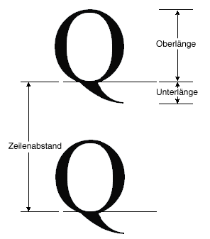

# Gewusst wie: Abrufen von Schriftarteigenschaften
Die <xref:System.Drawing.FontFamily> Klasse bietet die folgenden Methoden, die verschiedene Metriken für eine bestimmte Produktfamilie/Formatvorlage Kombination abrufen:  
  
-   <xref:System.Drawing.FontFamily.GetEmHeight%2A>(FontStyle)  
  
-   <xref:System.Drawing.FontFamily.GetCellAscent%2A>(FontStyle)  
  
-   <xref:System.Drawing.FontFamily.GetCellDescent%2A>(FontStyle)  
  
-   <xref:System.Drawing.FontFamily.GetLineSpacing%2A>(FontStyle)  
  
 Von diesen Methoden zurückgegebenen Zahlen sind in Schriftentwurfseinheiten, sodass sie unabhängig von der Größe und die Einheiten eines bestimmten werden <xref:System.Drawing.Font> Objekt.  
  
 Die folgende Abbildung zeigt die verschiedenen Metriken.  
  
   
  
## Beispiel  
 Das folgende Beispiel zeigt die Metriken für den Schriftschnitt der Schriftart Arial-Produktfamilie. Der Code erstellt zudem eine <xref:System.Drawing.Font> Objekt (basierend auf der Arial-Kategorie), mit der Größe von 16 Pixel und zeigt die Metriken (in Pixel) für diesen bestimmten <xref:System.Drawing.Font> Objekt.  
  
 Die folgende Abbildung zeigt die Ausgabe des Beispielcodes.  
  
   
  
 Beachten Sie die ersten beiden Zeilen der Ausgabe in der vorherigen Abbildung aus. Die <xref:System.Drawing.Font> Objekt zurückgibt, eine Größe von 16, und die <xref:System.Drawing.FontFamily> Objekt eine Geviertgröße von 2.048 zurück. Diese beiden Zahlen (16 und 2.048) sind der Schlüssel für die Konvertierung zwischen Schriftentwurfseinheiten und die Einheiten (in diesem Fall Pixel) von der <xref:System.Drawing.Font> Objekt.  
  
 Beispielsweise können Sie den Anstieg von Entwurfseinheiten in Pixel wie folgt konvertieren:  
  
   
  
 Der folgende Code positioniert Text vertikal durch Festlegen der <xref:System.Drawing.PointF.Y%2A> Datenmember einer <xref:System.Drawing.PointF> Objekt. Die y-Koordinate gestiegen `font.Height` für jede neue Zeile des Texts. Die <xref:System.Drawing.Font.Height%2A> Eigenschaft von einem <xref:System.Drawing.Font> Objekt gibt den Zeilenabstand (in Pixel) für diesen bestimmten <xref:System.Drawing.Font> Objekt. In diesem Beispiel wird die Anzahl von zurückgegebenen <xref:System.Drawing.Font.Height%2A> ist 19. Beachten Sie, dass dies die Anzahl (in eine ganze Zahl aufgerundet) erhalten, indem die Zeilenabstand Metrik in Pixel konvertiert identisch ist.  
  
 Beachten Sie, dass die Gevierthöhe (so genannte Größe oder Em Größe) nicht die Summe der Versalhöhe und Unterlänge ist. Die Summe der Versalhöhe und Unterlänge wird die Zellenhöhe aufgerufen. Die Zellenhöhe minus der internen vorangestellten ist die Gevierthöhe gleich. Die Zellenhöhe plus der externen vorangestellten entspricht den Zeilenabstand.  
  
 [!code-csharp[System.Drawing.FontsAndText#71](../../../../samples/snippets/csharp/VS_Snippets_Winforms/System.Drawing.FontsAndText/CS/Class1.cs#71)]
 [!code-vb[System.Drawing.FontsAndText#71](../../../../samples/snippets/visualbasic/VS_Snippets_Winforms/System.Drawing.FontsAndText/VB/Class1.vb#71)]  
  
## Kompilieren des Codes  
 Das obige Beispiel ist für die Verwendung in Windows Forms konzipiert und erfordert die <xref:System.Windows.Forms.PaintEventArgs> `e`-Klasse, die ein Parameter von <xref:System.Windows.Forms.PaintEventHandler> ist.  
  
## Siehe auch  
 [Grafik und Zeichnen in Windows Forms](../../../../docs/framework/winforms/advanced/graphics-and-drawing-in-windows-forms.md)  
 [Verwenden von Schriftarten und Text](../../../../docs/framework/winforms/advanced/using-fonts-and-text.md)
