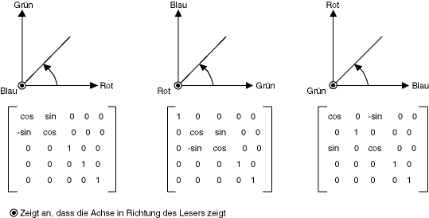

# Gewusst wie: Drehen von Farben
Drehungswinkel in einem vierdimensionalen Farbraum ist schwer zu visualisieren. Wir können Drehung zu visualisieren, indem Sie einverstanden sind, behalten Sie eine der festen Farbe Komponenten vereinfachen. Angenommen Sie, wir akzeptieren Sie den Alphaanteil auf 1 festgesetzt (vollständig deckend) beibehalten. Dann können wir einen dreidimensionale Farbraum mit Rot-, Grün- und Blau-Achsen darstellen, in der folgenden Abbildung dargestellt.  
  
   
  
 Eine Farbe kann als ein Punkt im 3D-Raum betrachtet werden. Z. B. den Punkt (1, 0, 0) im Raum darstellt, die Farbe Rot und der Punkt im Raum (0, 1, 0) stellt die Farbe Grün.  
  
 Die folgende Abbildung zeigt worum es sich dabei um die Farbe (1, 0, 0) drehen, durch einen Winkel von 60 Grad in Rot-Grün-Ebene. Drehungswinkel in einer Ebene Parallel zur Rot-Grün-Ebene kann als Drehung der blauen Achse betrachtet werden.  
  
   
  
 Die folgende Abbildung zeigt, wie eine Farbmatrix zum Ausführen von Drehungen zu jeder der drei-Koordinate Achsen (Rot, Grün, Blau) initialisiert werden.  
  
   
  
## Beispiel  
 Im folgenden Beispiel wird ein Bild, das alle einfarbig (1, 0, 0,6) und eine Drehung 60 Grad der blauen Achse gilt. Der Winkel der Drehung ist in einer Ebene, die parallel zur Rot-Grün ist, out überflüssig.  
  
 Die folgende Abbildung zeigt das ursprüngliche Bild auf der linken Seite und die Farbe gedreht Bild auf der rechten Seite.  
  
   
  
 Die folgende Abbildung zeigt eine Visualisierung der Drehung Farbe, die in den folgenden Code ausgeführt.  
  
   
  
 [!code-csharp[System.Drawing.RotateColors#1](../../../../samples/snippets/csharp/VS_Snippets_Winforms/System.Drawing.RotateColors/CS/Form1.cs#1)]
 [!code-vb[System.Drawing.RotateColors#1](../../../../samples/snippets/visualbasic/VS_Snippets_Winforms/System.Drawing.RotateColors/VB/Form1.vb#1)]  
  
## Kompilieren des Codes  
 Das obige Beispiel ist für die Verwendung mit Windows Forms konzipiert und erfordert <xref:System.Windows.Forms.PaintEventArgs> `e`, einen Parameter von der <xref:System.Windows.Forms.Control.Paint> -Ereignishandler. Ersetzen Sie `RotationInput.bmp` mit einem Dateinamen und Pfad auf Ihrem System gültig.  
  
## Siehe auch  
 <xref:System.Drawing.Imaging.ColorMatrix>  
 <xref:System.Drawing.Imaging.ImageAttributes>  
 [Grafik und Zeichnen in Windows Forms](../../../../docs/framework/winforms/advanced/graphics-and-drawing-in-windows-forms.md)  
 [Neufärben von Bildern](../../../../docs/framework/winforms/advanced/recoloring-images.md)
