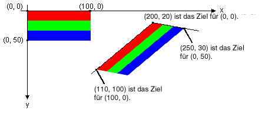

# Gewusst wie: Drehen, Spiegeln und Zerren von Bildern
Sie können ein Bild drehen, spiegeln und zerren, indem Sie Zielpunkte für die obere linke, obere rechte und untere linke Ecke des Originalbilds angeben.  Durch die drei Zielpunkte wird eine affine Transformation ermittelt, durch die das rechteckige Originalbild einem Parallelogramm zugeordnet wird.  
  
## Beispiel  
 Angenommen, das Originalbild entspricht einem Rechteck mit der oberen linken Ecke an Position \(0, 0\), der oberen rechten Ecke an Position \(100, 0\) und der unteren linken Ecke an Position \(0, 50\).  Stellen Sie sich jetzt vor, dass diese drei Punkte in der folgenden Weise Zielpunkten zugeordnet werden:  
  
|Originalpunkt|Zielpunkt|  
|-------------------|---------------|  
|Obere linke Ecke \(0, 0\)|\(200, 20\)|  
|Obere rechte Ecke \(100, 0\)|\(110, 100\)|  
|Untere linke Ecke \(0, 50\)|\(250, 30\)|  
  
 In der folgenden Abbildung ist das Originalbild sowie das Bild dargestellt, das dem Parallelogramm zugeordnet wurde.  Das Originalbild wurde gezerrt, gespiegelt, gedreht und verschoben.  Die x\-Achse am oberen Rand des Originalbilds wird der Linie zugeordnet, die durch \(200, 20\) und \(110, 100\) verläuft.  Die y\-Achse am linken Rand des Originalbilds wird der Linie zugeordnet, die durch \(200, 20\) und \(250, 30\) verläuft.  
  
   
  
 In der folgenden Abbildung sehen Sie eine ähnliche Transformation, die auf ein Foto angewendet wurde.  
  
   
  
 In der folgenden Abbildung sehen Sie eine ähnliche Transformation, die auf eine Metadatei angewendet wurde.  
  
   
  
 Im folgenden Codebeispiel werden die Bilder erstellt, die in der ersten Abbildung dargestellt sind.  
  
 [!code-csharp[System.Drawing.WorkingWithImages#61](../../../../samples/snippets/csharp/VS_Snippets_Winforms/System.Drawing.WorkingWithImages/CS/Class1.cs#61)]
 [!code-vb[System.Drawing.WorkingWithImages#61](../../../../samples/snippets/visualbasic/VS_Snippets_Winforms/System.Drawing.WorkingWithImages/VB/Class1.vb#61)]  
  
## Kompilieren des Codes  
 Das vorhergehende Beispiel ist für die Verwendung mit Windows Forms konzipiert und erfordert <xref:System.Windows.Forms.PaintEventArgs> `e`, einen Parameter des <xref:System.Windows.Forms.Control.Paint>\-Ereignishandlers.  Ersetzen Sie `Stripes.bmp` durch einen in Ihrem System gültigen Pfad zu einem Bild.  
  
## Siehe auch  
 [Arbeiten mit Bildern, Bitmaps, Symbolen und Metadateien](../../../../docs/framework/winforms/advanced/working-with-images-bitmaps-icons-and-metafiles.md)