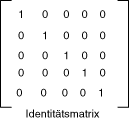

# Gewusst wie: Verwenden einer Farbmatrix zum Transformieren einer Farbe
[!INCLUDE[ndptecgdiplus](../../../../includes/ndptecgdiplus-md.md)] stellt die <xref:System.Drawing.Image>\-Klasse und die <xref:System.Drawing.Bitmap>\-Klasse zum Speichern und Bearbeiten von Bildern bereit.  Das <xref:System.Drawing.Image>\-Objekt und das <xref:System.Drawing.Bitmap>\-Objekt speichern die Farbe jedes Pixels als 32\-Bit\-Zahl: jeweils 8 Bit für Rot, Grün, Blau und Alpha.  Jeder der vier Anteile entspricht einer Zahl von 0 bis 255, wobei 0 für keine Intensität und 255 für volle Farbintensität steht.  Durch den Alphaanteil wird die Transparenz der Farbe angegeben: 0 entspricht vollständiger Transparenz und 255 vollständiger Deckung.  
  
 Ein Farbvektor ist ein Vierfachwert in der Form \(Rot, Grün, Blau, Alpha\).  Der Farbvektor \(0, 255, 0, 255\) stellt beispielsweise eine nicht transparente Farbe ohne Rot oder Blau, jedoch mit voller Grünintensität dar.  
  
 Gemäß einer anderen Farbdarstellungskonvention wird für volle Intensität die Ziffer 1 verwendet.  Entsprechend dieser Konvention würde die im vorherigen Abschnitt beschriebene Farbe durch den Vektor \(0, 1, 0, 1\) dargestellt werden.  Die auf dem Wert 1 basierende Konvention wird in [!INCLUDE[ndptecgdiplus](../../../../includes/ndptecgdiplus-md.md)] bei der Durchführung von Farbtransformationen für höchste Intensität verwendet.  
  
 Sie können lineare Transformationen \(Drehung, Skalierung u. ä.\) auf Farbvektoren anwenden, indem Sie die Farbvektoren mit einer 4x4\-Matrix multiplizieren.  Für Verschiebungen \(nicht linear\) kann jedoch keine 4x4\-Matrix verwendet werden.  Wenn Sie jedem Farbvektor eine fünfte Koordinate \(z. B. die Ziffer 1\) als Dummy hinzufügen, können Sie mit einer 5x5\-Matrix eine Kombination aus linearen Transformationen und Verschiebungen anwenden.  Eine Transformation, die aus einer linearen Transformation besteht, auf die eine Verschiebung folgt, wird als affine Transformation bezeichnet.  
  
 Angenommen, Sie möchten z. B. ausgehend von der Farbe \(0.2, 0.0, 0.4, 1.0\) die folgenden Transformationen anwenden:  
  
1.  Verdoppelung des Rotanteils  
  
2.  Erhöhung des Rot\-, Grün\- und Blauanteils um den Wert 0.2  
  
 Durch die folgende Matrixmultiplikation werden die beiden Transformationen in der gezeigten Reihenfolge ausgeführt.  
  
   
  
 Die Elemente einer Farbmatrix sind erst nach Zeile und anschließend nach Spalte indiziert \(nullbasiert\).  Der Eintrag in der fünften Zeile und der dritten Spalte von Matrix "M" wird z. B. durch M\[4\]\[2\] dargestellt.  
  
 Die 5x5\-Identitätsmatrix \(siehe folgende Abbildung\) verfügt in der Diagonalen über Einsen und ansonsten lediglich über Nullen.  Wird ein Farbvektor mit der Identitätsmatrix multipliziert, bleibt der Farbvektor unverändert.  Die beste Möglichkeit, die Matrix einer Farbtransformation zu bilden, besteht darin, ausgehend von der Identitätsmatrix eine geringfügige Änderung vorzunehmen, durch die die gewünschte Transformation erzielt wird.  
  
   
  
 Detailliertere Ausführungen zu Matrizen und Transformationen finden Sie unter [Koordinatensysteme und Transformationen](../../../../docs/framework/winforms/advanced/coordinate-systems-and-transformations.md).  
  
## Beispiel  
 Im folgenden Beispiel wird die in den vorangehenden Abschnitten beschriebene Transformation auf ein komplett einfarbiges Bild \(0.2, 0.0, 0.4, 1.0\) angewendet.  
  
 In der folgenden Abbildung ist das ursprüngliche Bild auf der linken und das transformierte Bild auf der rechten Seite zu sehen.  
  
   
  
 Im Code aus dem nachstehenden Beispiel werden die folgenden Schritte ausgeführt, um das Bild neu einzufärben:  
  
1.  Initialisieren eines <xref:System.Drawing.Imaging.ColorMatrix>\-Objekts.  
  
2.  Erstellen eines <xref:System.Drawing.Imaging.ImageAttributes>\-Objekts und Übergeben des <xref:System.Drawing.Imaging.ColorMatrix>\-Objekts an die <xref:System.Drawing.Imaging.ImageAttributes.SetColorMatrix%2A>\-Methode des <xref:System.Drawing.Imaging.ImageAttributes>\-Objekts.  
  
3.  Übergeben des <xref:System.Drawing.Imaging.ImageAttributes>\-Objekts an die <xref:System.Drawing.Graphics.DrawImage%2A>\-Methode eines <xref:System.Drawing.Graphics>\-Objekts.  
  
 [!code-csharp[System.Drawing.RecoloringImages#21](../../../../samples/snippets/csharp/VS_Snippets_Winforms/System.Drawing.RecoloringImages/CS/Class1.cs#21)]
 [!code-vb[System.Drawing.RecoloringImages#21](../../../../samples/snippets/visualbasic/VS_Snippets_Winforms/System.Drawing.RecoloringImages/VB/Class1.vb#21)]  
  
## Kompilieren des Codes  
 Das vorhergehende Beispiel ist für die Verwendung mit Windows Forms konzipiert und erfordert <xref:System.Windows.Forms.PaintEventArgs> `e`, einen Parameter des <xref:System.Windows.Forms.Control.Paint>\-Ereignishandlers.  
  
## Siehe auch  
 [Neueinfärben von Bildern](../../../../docs/framework/winforms/advanced/recoloring-images.md)   
 [Koordinatensysteme und Transformationen](../../../../docs/framework/winforms/advanced/coordinate-systems-and-transformations.md)