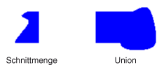

# Bereiche in GDI+
Ein Bereich ist ein Teil der Anzeigebereich des ein Ausgabegerät an. Regionen können es sich um einfachen (ein einzelnes Rechteck) oder komplexe (eine Kombination aus Polygone und geschlossene Kurven) handeln. Die folgende Abbildung zeigt zwei Bereiche: einen erstellt aus einem Rechteck und die andere erstellt aus einem Pfad.  
  
   
  
## Verwenden von Bereichen  
 Bereiche werden häufig zum Ausschneiden und Treffertests. Clipping wird das Zeichnen auf einen bestimmten Bereich neben dem Anzeigebereich, in der Regel der Teil, der zu aktualisierenden beschränkt. Treffertests beinhaltet die Überprüfung, um festzustellen, ob der Cursor befindet sich in einem bestimmten Bereich des Bildschirms, wenn eine Maustaste gedrückt wird.  
  
 Sie können einen Bereich aus einem Rechteck oder einen Pfad erstellen. Sie können auch komplexe Regionen erstellen, durch die Kombination der vorhandener Regions. Die <xref:System.Drawing.Region> Klasse bietet die folgenden Methoden zum Kombinieren von Bereichen: <xref:System.Drawing.Region.Intersect%2A>, <xref:System.Drawing.Region.Union%2A>, <xref:System.Drawing.Region.Xor%2A>, <xref:System.Drawing.Region.Exclude%2A>, und <xref:System.Drawing.Region.Complement%2A>.  
  
 Die Schnittmenge der beiden Regionen ist der Satz aller Punkte, die zu beiden Bereichen gehören. Die Union ist der Satz aller Punkte, die zu den anderen oder beide Regionen gehören. Das Komplement eines Datenbereichs ist der Satz aller Punkte, die nicht in der Region sind. Die folgende Abbildung zeigt die Schnittmenge und die Union der beiden Regionen in der vorherigen Abbildung dargestellt.  
  
   
  
 Die <xref:System.Drawing.Region.Xor%2A> -Methode angewendet wird, um ein Paar von Regionen, erzeugt einen Bereich, der alle Punkte enthält, die zu einer Region oder zur anderen jedoch nicht zu beiden gehören. Die <xref:System.Drawing.Region.Exclude%2A> -Methode angewendet wird, um ein Paar von Regionen, erzeugt eine Region, die alle Punkte in der ersten Region enthält, die nicht im zweiten Bereich enthalten sind. Die folgende Abbildung zeigt die Bereiche, die aus dem Anwenden der <xref:System.Drawing.Region.Xor%2A> und <xref:System.Drawing.Region.Exclude%2A> Methoden, um die beiden Bereiche am Anfang dieses Themas.  
  
   
  
 Um einen Bereich zu füllen, müssen Sie eine <xref:System.Drawing.Graphics> -Objekt, eine <xref:System.Drawing.Brush> -Objekt, und ein <xref:System.Drawing.Region> Objekt. Die <xref:System.Drawing.Graphics> Objekt enthält die <xref:System.Drawing.Graphics.FillRegion%2A> -Methode, und die <xref:System.Drawing.Brush> Objekt speichert Attribute für die Füllung, z. B. Farbe oder ein Muster. Das folgende Beispiel füllt einen Bereich mit einer Volltonfarbe aus.  
  
 [!code-csharp[LinesCurvesAndShapes#61](../../../../samples/snippets/csharp/VS_Snippets_Winforms/LinesCurvesAndShapes/CS/Class1.cs#61)]
 [!code-vb[LinesCurvesAndShapes#61](../../../../samples/snippets/visualbasic/VS_Snippets_Winforms/LinesCurvesAndShapes/VB/Class1.vb#61)]  
  
## Siehe auch  
 <xref:System.Drawing.Region?displayProperty=nameWithType>  
 [Linien, Kurven und Formen](../../../../docs/framework/winforms/advanced/lines-curves-and-shapes.md)  
 [Verwenden von Bereichen](../../../../docs/framework/winforms/advanced/using-regions.md)
