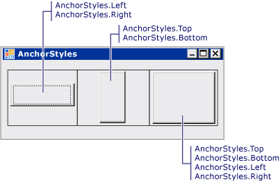

# Gewusst wie: Verankern und Andocken von untergeordneten Steuerelementen in einem TableLayoutPanel-Steuerelement
Das <xref:System.Windows.Forms.TableLayoutPanel>\-Steuerelement unterstützt die Eigenschaften <xref:System.Windows.Forms.Control.Anchor%2A> und <xref:System.Windows.Forms.Control.Dock%2A> in seinen untergeordneten Steuerelementen.  
  
### So richten Sie ein untergeordnetes Steuerelement in einer TableLayoutPanel\-Zelle aus  
  
1.  Erstellen Sie ein <xref:System.Windows.Forms.TableLayoutPanel>\-Steuerelement auf Ihrem Formular.  
  
2.  Legen Sie den Wert der Eigenschaften <xref:System.Windows.Forms.TableLayoutPanel.ColumnCount%2A> und <xref:System.Windows.Forms.TableLayoutPanel.RowCount%2A> des <xref:System.Windows.Forms.TableLayoutPanel>\-Steuerelements auf 1 fest.  
  
3.  Erstellen Sie ein <xref:System.Windows.Forms.Button>\-Steuerelement im <xref:System.Windows.Forms.TableLayoutPanel>\-Steuerelement.  Das <xref:System.Windows.Forms.Button> nimmt die obere linke Ecke der Zelle ein.  
  
4.  Ändern Sie den Wert der <xref:System.Windows.Forms.Control.Anchor%2A>\-Eigenschaft des <xref:System.Windows.Forms.Button>\-Steuerelements in `Links`.  Das <xref:System.Windows.Forms.Button>\-Steuerelement wird so verschoben, dass es sich am linken Rand der Zelle ausrichtet.  
  
    > [!NOTE]
    >  Dieses Verhalten weicht vom Verhalten anderer Containersteuerelemente ab.  Bei anderen Containersteuerelementen wird das untergeordnete Steuerelement nicht verschoben, wenn die <xref:System.Windows.Forms.Control.Anchor%2A>\-Eigenschaft festgelegt wird, und der Abstand zwischen dem verankerten Steuerelement und der Grenze des übergeordneten Containers ist zum Zeitpunkt der Festlegung der <xref:System.Windows.Forms.Control.Anchor%2A>\-Eigenschaft fixiert.  
  
5.  Ändern Sie den Wert der <xref:System.Windows.Forms.Control.Anchor%2A>\-Eigenschaft des <xref:System.Windows.Forms.Button>\-Steuerelements in `Oben, Links`.  Das <xref:System.Windows.Forms.Button>\-Steuerelement wird so verschoben, dass es die ober linke Ecke der Zelle einnimmt.  
  
6.  Wiederholen Sie Schritt 5 mit dem Wert `Oben, Rechts`, um das <xref:System.Windows.Forms.Button>\-Steuerelement in die obere rechte Ecke der Zelle zu verschieben.  Wiederholen Sie diesen Schritt mit den Werten `Unten, Links` und `Unten, Rechts`.  
  
### So strecken Sie ein untergeordnetes Steuerelement in einer TableLayoutPanel\-Zelle  
  
1.  Ändern Sie den Wert der <xref:System.Windows.Forms.Control.Anchor%2A>\-Eigenschaft des <xref:System.Windows.Forms.Button>\-Steuerelements in `Links, Rechts`.  Die Größe des <xref:System.Windows.Forms.Button>\-Steuerelements wird so angepasst, dass es die gesamte Breite der Zelle einnimmt.  
  
    > [!NOTE]
    >  Dieses Verhalten weicht vom Verhalten anderer Containersteuerelemente ab.  In anderen Containersteuerelementen wird die Größe des untergeordneten Steuerelements nicht angepasst, wenn die <xref:System.Windows.Forms.Control.Anchor%2A>\-Eigenschaft auf `Links, Rechts` oder `Oben, Unten` festgelegt wird.  
  
2.  Ändern Sie den Wert der <xref:System.Windows.Forms.Control.Anchor%2A>\-Eigenschaft des <xref:System.Windows.Forms.Button>\-Steuerelements in `Oben, Unten`.  Die Größe des <xref:System.Windows.Forms.Button>\-Steuerelements wird so angepasst, dass es die gesamte Höhe der Zelle einnimmt.  
  
3.  Ändern Sie den Wert der <xref:System.Windows.Forms.Control.Anchor%2A>\-Eigenschaft des <xref:System.Windows.Forms.Button>\-Steuerelements in `Oben, Unten, Links, Rechts`.  Die Größe des <xref:System.Windows.Forms.Button>\-Steuerelements wird so geändert, dass es die gesamte Zelle ausfüllt.  
  
4.  Ändern Sie den Wert der <xref:System.Windows.Forms.Control.Anchor%2A>\-Eigenschaft des <xref:System.Windows.Forms.Button>\-Steuerelements in `Keine`.  Die Größe des <xref:System.Windows.Forms.Button>\-Steuerelements wird geändert, und es wird mittig in der Zelle positioniert.  
  
5.  Ändern Sie den Wert der <xref:System.Windows.Forms.Control.Dock%2A>\-Eigenschaft des <xref:System.Windows.Forms.Button>\-Steuerelements in <xref:System.Windows.Forms.DockStyle>.  Das <xref:System.Windows.Forms.Button>\-Steuerelement wird so verschoben, dass es sich am linken Rand der Zelle ausrichtet.  Das <xref:System.Windows.Forms.Button>\-Steuerelement behält seine Breite, aber seine Höhe wird so angepasst, dass es die gesamte Zellenhöhe einnimmt.  
  
    > [!NOTE]
    >  Dies ist dasselbe Verhalten, das in anderen Containersteuerelementen auftritt.  
  
6.  Ändern Sie den Wert der <xref:System.Windows.Forms.Control.Dock%2A>\-Eigenschaft des <xref:System.Windows.Forms.Button>\-Steuerelements in <xref:System.Windows.Forms.DockStyle>.  Die Größe des <xref:System.Windows.Forms.Button>\-Steuerelements wird so geändert, dass es die gesamte Zelle ausfüllt.  
  
## Beispiel  
 Die folgende Abbildung zeigt fünf Schaltflächen, die in fünf separaten <xref:System.Windows.Forms.TableLayoutPanel>\-Zellen verankert sind.  
  
   
  
 Die folgende Abbildung zeigt vier Schaltflächen, die in den Ecken von vier separaten <xref:System.Windows.Forms.TableLayoutPanel>\-Zellen verankert sind.  
  
   
  
 Die folgende Abbildung zeigt drei Schaltflächen, die durch die Verankerung in drei separaten <xref:System.Windows.Forms.TableLayoutPanel>\-Zellen gestreckt wurden.  
  
   
  
 Das folgende Codebeispiel veranschaulicht alle Kombinationen aus <xref:System.Windows.Forms.Control.Anchor%2A>\-Eigenschaftswerte für ein <xref:System.Windows.Forms.Button>\-Steuerelement in einem <xref:System.Windows.Forms.TableLayoutPanel>\-Steuerelement.  
  
 [!code-csharp[System.Windows.Forms.TableLayoutPanel.AnchorExampleForm#1](../../../../samples/snippets/csharp/VS_Snippets_Winforms/System.Windows.Forms.TableLayoutPanel.AnchorExampleForm/CS/TlpAnchorExampleForm.cs#1)]
 [!code-vb[System.Windows.Forms.TableLayoutPanel.AnchorExampleForm#1](../../../../samples/snippets/visualbasic/VS_Snippets_Winforms/System.Windows.Forms.TableLayoutPanel.AnchorExampleForm/VB/TlpAnchorExampleForm.vb#1)]  
  
## Kompilieren des Codes  
 Für dieses Beispiel benötigen Sie Folgendes:  
  
-   Verweise auf die Assemblys "System", "System.Data", "System.Drawing" und "System.Windows.Forms".  
  
 Informationen zum Erstellen dieses Beispiels über die Befehlszeile für [!INCLUDE[vbprvb](../../../../includes/vbprvb-md.md)] oder [!INCLUDE[csprcs](../../../../includes/csprcs-md.md)] finden Sie unter [Erstellen von der Befehlszeile aus](../Topic/Building%20from%20the%20Command%20Line%20\(Visual%20Basic\).md) oder [Erstellen über die Befehlszeile mit csc.exe](../../../../ocs/csharp/language-reference/compiler-options/command-line-building-with-csc-exe.md).  Sie können dieses Beispiel auch in [!INCLUDE[vsprvs](../../../../includes/vsprvs-md.md)] erstellen, indem Sie den Code in ein neues Projekt einfügen.  Siehe auch [Gewusst wie: Kompilieren und Ausführen eines vollständigen Windows Forms\-Codebeispiels mit Visual Studio](http://msdn.microsoft.com/library/Bb129228\(v=vs.110\)).  
  
## Siehe auch  
 <xref:System.Windows.Forms.TableLayoutPanel>   
 [TableLayoutPanel\-Steuerelement](../../../../docs/framework/winforms/controls/tablelayoutpanel-control-windows-forms.md)