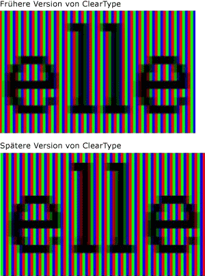
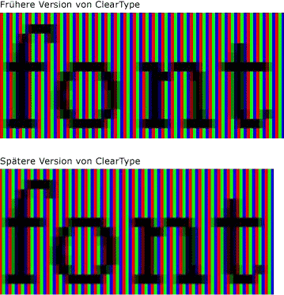

# &#220;bersicht &#252;ber ClearType
Dieses Thema enthält eine Übersicht über die [!INCLUDE[TLA#tla_ct](../../../../includes/tlasharptla-ct-md.md)]\-Technologie im [!INCLUDE[TLA#tla_winclient](../../../../includes/tlasharptla-winclient-md.md)].  
  
 [!INCLUDE[autoOutline](../Token/autoOutline_md.md)]  
  
   
## Übersicht über die Technologie  
 [!INCLUDE[TLA2#tla_ct](../../../../includes/tla2sharptla-ct-md.md)] ist eine von [!INCLUDE[TLA#tla_ms](../../../../includes/tlasharptla-ms-md.md)] entwickelte Softwaretechnologie, mit der die Lesbarkeit auf LCD\-Bildschirmen \(Liquid Crystal Displays\) verbessert wird, z. B. auf Laptopbildschirmen, Pocket PC\-Bildschirmen und Flachbildschirmen.  Dazu greift [!INCLUDE[TLA2#tla_ct](../../../../includes/tla2sharptla-ct-md.md)] auf die einzelnen vertikalen Farbstreifenelemente in jedem Pixel auf einem LCD\-Bildschirm zu.  Vor der Einführung von [!INCLUDE[TLA2#tla_ct](../../../../includes/tla2sharptla-ct-md.md)] war das kleinste Detail, das ein Computer anzeigen konnte, ein einzelnes Pixel. Wird jedoch [!INCLUDE[TLA2#tla_ct](../../../../includes/tla2sharptla-ct-md.md)] auf einem LCD\-Monitor ausgeführt, können Textfeatures angezeigt werden, die nur einen Bruchteil eines Pixels breit sind.  Die zusätzliche Auflösung verbessert die Schärfe der kleinen Details bei der Textanzeige, wodurch der Text viel leichter über lange Zeiträume gelesen werden kann.  
  
 Die [!INCLUDE[TLA2#tla_ct](../../../../includes/tla2sharptla-ct-md.md)]\-Version, die in [!INCLUDE[TLA#tla_winclient](../../../../includes/tlasharptla-winclient-md.md)] verfügbar ist, ist die neueste Generation von [!INCLUDE[TLA2#tla_ct](../../../../includes/tla2sharptla-ct-md.md)] und bietet eine Reihe von Verbesserungen gegenüber der in [!INCLUDE[TLA#tla_gdi](../../../../includes/tlasharptla-gdi-md.md)] enthaltenen Version.  
  
   
## Subpixelpositionierung  
 Eine wesentliche Verbesserung gegenüber der Vorgängerversion von [!INCLUDE[TLA2#tla_ct](../../../../includes/tla2sharptla-ct-md.md)] liegt in der Verwendung der Subpixelpositionierung.  Im Unterschied zu der in [!INCLUDE[TLA2#tla_gdi](../../../../includes/tla2sharptla-gdi-md.md)] enthaltenen [!INCLUDE[TLA2#tla_ct](../../../../includes/tla2sharptla-ct-md.md)]\-Implementierung gestattet es die in [!INCLUDE[TLA#tla_winclient](../../../../includes/tlasharptla-winclient-md.md)] enthaltene [!INCLUDE[TLA2#tla_ct](../../../../includes/tla2sharptla-ct-md.md)]\-Version, dass Symbole innerhalb des Pixels starten und nicht nur am Außenrand des Pixels.  Aufgrund dieser zusätzlichen Auflösung bei der Positionierung von Symbolen sind die Abstände und Proportionen der Symbole präziser und konsistenter.  
  
 In den beiden folgenden Beispielen wird veranschaulicht, wie Symbole am Subpixelrand beginnen können, wenn die Subpixelpositionierung verwendet wird.  Im Beispiel links erfolgt das Rendering unter Verwendung der Vorgängerversion des [!INCLUDE[TLA2#tla_ct](../../../../includes/tla2sharptla-ct-md.md)]\-Renderers, der keine Subpixelpositionierung eingesetzt hat.  Im Beispiel rechts erfolgt das Rendering mit der neuen Version des [!INCLUDE[TLA2#tla_ct](../../../../includes/tla2sharptla-ct-md.md)]\-Renderers, der die Subpixelpositionierung verwendet.  Beachten Sie, wie die Buchstaben **e** und **l** im Bild rechts leicht unterschiedlich gerendert werden, weil die Wiedergabe jeweils bei einem anderen Subpixel startet.  Bei der Anzeige des Texts in Normalgröße auf dem Bildschirm ist dieser Unterschied aufgrund des hohen Kontrasts des Symbolbilds nicht bemerkbar.  Dies ist nur dank der ausgereiften Farbfilterung möglich, die in [!INCLUDE[TLA2#tla_ct](../../../../includes/tla2sharptla-ct-md.md)] integriert ist.  
  
   
Mit älterer und neuerer Version von ClearType angezeigter Text  
  
 In den beiden folgenden Beispielen wird die Ausgabe des älteren [!INCLUDE[TLA2#tla_ct](../../../../includes/tla2sharptla-ct-md.md)]\-Renderers mit der neuen Version des [!INCLUDE[TLA2#tla_ct](../../../../includes/tla2sharptla-ct-md.md)]\-Renderers verglichen.  Die Subpixelpositionierung \(rechts dargestellt\) verbessert den Zeichenabstand auf dem Bildschirm deutlich, insbesondere bei kleinen Zeichengrößen, bei denen der Unterschied zwischen einem Subpixel und einem ganzen Pixel einen signifikanten Anteil der Zeichenbreite darstellt.  Beachten Sie, dass der Abstand zwischen den Buchstaben im zweiten Bild gleichmäßiger ist.  Der Vorteil, den die Subpixelpositionierung insgesamt für die Darstellung von Text auf dem Bildschirm bringt, ist deutlich größer und stellt eine bedeutsame Weiterentwicklung der [!INCLUDE[TLA2#tla_ct](../../../../includes/tla2sharptla-ct-md.md)]\-Technologie dar.  
  
   
Text in älterer und neuerer Version von ClearType  
  
   
## Antialiasing in y\-Richtung  
 Eine weitere Verbesserung durch [!INCLUDE[TLA2#tla_ct](../../../../includes/tla2sharptla-ct-md.md)] in [!INCLUDE[TLA#tla_winclient](../../../../includes/tlasharptla-winclient-md.md)] ist das Antialiasing in y\-Richtung.  [!INCLUDE[TLA2#tla_ct](../../../../includes/tla2sharptla-ct-md.md)] in [!INCLUDE[TLA2#tla_gdi](../../../../includes/tla2sharptla-gdi-md.md)] ohne Antialiasing in y\-Richtung liefert eine bessere Auflösung auf der x\-Achse, nicht jedoch auf der y\-Achse.  Oben und unten an den flachen Kurven beeinträchtigen die gezackten Kanten die Lesbarkeit.  
  
 Im folgenden Beispiel wird die Darstellung ohne Antialiasing in y\-Richtung veranschaulicht.  Hier fallen die gezackten Kanten oben und unten am Buchstaben deutlich ins Auge.  
  
   
Text mit gezackten Kanten an flachen Kurven  
  
 [!INCLUDE[TLA2#tla_ct](../../../../includes/tla2sharptla-ct-md.md)] in [!INCLUDE[TLA#tla_winclient](../../../../includes/tlasharptla-winclient-md.md)] liefert ein Antialiasing in der y\-Richtung, um die gezackten Kanten zu glätten.  Dies ist besonders wichtig zur Verbesserung der Lesbarkeit ostasiatischer Sprachen, in denen Ideogramme über nahezu gleiche Anteile von horizontalen und vertikalen flachen Kurven verfügen.  
  
 Im folgenden Beispiel wird die Auswirkung eines Antialiasing in y\-Richtung veranschaulicht.  In diesem Fall weist der Buchstabe oben und unten eine geglättete Kurvenlinie auf.  
  
   
Text mit ClearType\-Antialiasing in y\-Richtung  
  
   
## Hardwarebeschleunigung  
 [!INCLUDE[TLA2#tla_ct](../../../../includes/tla2sharptla-ct-md.md)] in [!INCLUDE[TLA#tla_winclient](../../../../includes/tlasharptla-winclient-md.md)] kann die Hardwarebeschleunigung zur Steigerung der Leistung und zur Reduzierung von CPU\-Auslastung und Systemarbeitsspeicheranforderungen nutzen.  Durch Verwendung der Pixel\-Shader und des Videoarbeitsspeichers der Grafikkarte ermöglicht [!INCLUDE[TLA2#tla_ct](../../../../includes/tla2sharptla-ct-md.md)] ein schnelleres Rendering von Text, insbesondere bei Animationen.  
  
 [!INCLUDE[TLA2#tla_ct](../../../../includes/tla2sharptla-ct-md.md)] in [!INCLUDE[TLA#tla_winclient](../../../../includes/tlasharptla-winclient-md.md)] ändert die systemweiten [!INCLUDE[TLA2#tla_ct](../../../../includes/tla2sharptla-ct-md.md)]\-Einstellungen nicht.  Durch Deaktivieren von [!INCLUDE[TLA2#tla_ct](../../../../includes/tla2sharptla-ct-md.md)] in [!INCLUDE[TLA#tla_mswin](../../../../includes/tlasharptla-mswin-md.md)] wird für das Antialiasing in [!INCLUDE[TLA#tla_winclient](../../../../includes/tlasharptla-winclient-md.md)] der Graustufenmodus festgelegt. Außerdem ändert [!INCLUDE[TLA2#tla_ct](../../../../includes/tla2sharptla-ct-md.md)] in [!INCLUDE[TLA#tla_winclient](../../../../includes/tlasharptla-winclient-md.md)] die Einstellungen des [ClearType Tuner PowerToy](http://www.microsoft.com/typography/ClearTypePowerToy.mspx) nicht.  
  
 Für das Architekturdesign von [!INCLUDE[TLA#tla_winclient](../../../../includes/tlasharptla-winclient-md.md)] wurde die Entscheidung getroffen, ein auflösungsunabhängiges Layout mit besserer Unterstützung für DPI\-Monitore mit höherer Auflösung zu erreichen, die immer mehr Verbreitung finden.  Dies hat zur Folge, dass [!INCLUDE[TLA#tla_winclient](../../../../includes/tlasharptla-winclient-md.md)] das Textrendering mit Aliasing oder die Bitmaps in bestimmten ostasiatischen Schriftarten nicht unterstützt, da diese Funktionen auflösungsabhängig sind.  
  
   
## Weitere Informationen  
 [ClearType\-Informationen](http://www.microsoft.com/typography/ClearTypeInfo.mspx)  
  
 [ClearType Tuner PowerToy](http://www.microsoft.com/typography/ClearTypePowerToy.mspx)  
  
## Siehe auch  
 [ClearType\-Registrierungseinstellungen](../../../../docs/framework/wpf/advanced/cleartype-registry-settings.md)