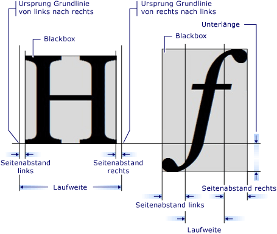

# Einführung in das "GlyphRun"-Objekt und das "Glyphs"-Element
In diesem Thema wird beschrieben, die <xref:System.Windows.Media.GlyphRun> Objekt und die <xref:System.Windows.Documents.Glyphs> Element.  
  
  
   
## Einführung in GlyphRun  
 [!INCLUDE[TLA#tla_winclient](../../../../includes/tlasharptla-winclient-md.md)] bietet Unterstützung für erweiterte Text einschließlich Glyphe auf Dokumentebene Markups mit direktem Zugriff auf <xref:System.Windows.Documents.Glyphs> für Kunden abfangen und Text nach der Formatierung beibehalten werden soll. Diese Funktionen stellen wichtige Unterstützung für verschiedene Text-Rendering-Voraussetzungen in jedem der folgenden Szenarios bereit.  
  
1.  Bildschirmanzeige von Dokumenten mit festem Format  
  
2.  Druckszenarios  
  
    -   [!INCLUDE[TLA#tla_xaml](../../../../includes/tlasharptla-xaml-md.md)] als Druckersprache für Geräte  
  
    -   [!INCLUDE[TLA#tla_mxdw](../../../../includes/tlasharptla-mxdw-md.md)]  
  
    -   Vorherige Druckertreiber, Ausgabe von [!INCLUDE[TLA#tla_win32](../../../../includes/tlasharptla-win32-md.md)]-Anwendungen an das feste Format  
  
    -   Druckerspooler-Format  
  
3.  Darstellung von Dokumenten mit festem Format, einschließlich Clients für vorherige Versionen von [!INCLUDE[TLA#tla_mswin](../../../../includes/tlasharptla-mswin-md.md)] und anderen Computergeräten  
  
> [!NOTE]
>  <xref:System.Windows.Documents.Glyphs> und <xref:System.Windows.Media.GlyphRun> festem Format Dokumentpräsentation und Drucken Szenarien dienen. [!INCLUDE[TLA#tla_winclient](../../../../includes/tlasharptla-winclient-md.md)] Stellt etliche Elemente für das allgemeine Layout und [!INCLUDE[TLA#tla_ui](../../../../includes/tlasharptla-ui-md.md)] Szenarien, z. B. <xref:System.Windows.Controls.Label> und <xref:System.Windows.Controls.TextBlock>. Weitere Informationen zu Layout- und [!INCLUDE[TLA2#tla_ui](../../../../includes/tla2sharptla-ui-md.md)]-Szenarios finden Sie unter [Typografie in WPF](../../../../docs/framework/wpf/advanced/typography-in-wpf.md).  
  
   
## Das GlyphRun-Objekt  
 Die <xref:System.Windows.Media.GlyphRun> -Objekt stellt eine Sequenz von Symbolen aus einer einzelnen Schriftart einer einzelnen Schriftfamilie mit einer einzelnen Größe und mit einem einzelnen Rendering-Format dar.  
  
 <xref:System.Windows.Media.GlyphRun> umfasst sowohl Schriftartdetails wie z. B. Glyphe <xref:System.Windows.Documents.Glyphs.Indices%2A> und Positionen der einzelnen Glyphe. Es beinhaltet außerdem die ursprüngliche [!INCLUDE[TLA#tla_unicode](../../../../includes/tlasharptla-unicode-md.md)] Codepunkte, die die Ausführung von Zeichen-zu-Glyphe Puffer, Offset Zuordnungsinformationen und Flags pro Zeichen und pro Symbol generiert wurde.  
  
 <xref:System.Windows.Media.GlyphRun> verfügt über eine entsprechende allgemeine <xref:System.Windows.FrameworkElement>, <xref:System.Windows.Documents.Glyphs>. <xref:System.Windows.Documents.Glyphs> kann verwendet werden, in der Elementstruktur und [!INCLUDE[TLA2#tla_xaml](../../../../includes/tla2sharptla-xaml-md.md)] Markup zum darstellen <xref:System.Windows.Media.GlyphRun> Ausgabe.  
  
   
## Das Glyphs-Element  
 Die <xref:System.Windows.Documents.Glyphs> Element darstellt, die Ausgabe des einen <xref:System.Windows.Media.GlyphRun> in [!INCLUDE[TLA2#tla_xaml](../../../../includes/tla2sharptla-xaml-md.md)]. Das folgende Markupsyntax zur Beschreibung der <xref:System.Windows.Documents.Glyphs> Element.  
  
 [!code-xaml[GlyphsOvwSample1#1](../../../../samples/snippets/csharp/VS_Snippets_Wpf/GlyphsOvwSample1/CS/default.xaml#1)]  
  
 Die folgenden Eigenschaftendefinitionen entsprechen den ersten vier Attributen im Beispielmarkup.  
  
|Eigenschaft|Beschreibung|  
|--------------|-----------------|  
|<xref:System.Windows.Documents.Glyphs.FontUri%2A>|Gibt einen Ressourcenbezeichner: Dateiname, Web [!INCLUDE[TLA#tla_uri](../../../../includes/tlasharptla-uri-md.md)], oder Ressourcenverweis in der Anwendung .exe oder den Container.|  
|<xref:System.Windows.Documents.Glyphs.FontRenderingEmSize%2A>|Gibt den Schriftgrad in Zeichenoberflächeneinheiten an (Der Standardwert ist .96 Zoll)|  
|<xref:System.Windows.Documents.Glyphs.StyleSimulations%2A>|Gibt Flags für Fett-und Kursivdruck an|  
|<xref:System.Windows.Documents.Glyphs.BidiLevel%2A>|Gibt die bidirektionale Layoutebene an. Gerade Werte und Nullwerte implizieren Layout von links nach rechts; ungerade Werte implizieren Layout von rechts nach links.|  
  
   
### Indices-Eigenschaft  
 Die <xref:System.Windows.Documents.Glyphs.Indices%2A> Eigenschaft ist eine Zeichenfolge mit Symbolspezifikationen. Wenn ein Symbol ein einzelnes Cluster bildet, wird der Spezifikation auf des ersten Symbols im Cluster die Spezifikation vorangestellt, wie viele Symbole und wie viele Codepunkte sich kombinieren, um das Cluster zu bilden. Die <xref:System.Windows.Documents.Glyphs.Indices%2A> Eigenschaft, die in einer Zeichenfolge die folgenden Eigenschaften werden erfasst.  
  
-   Symbolindizes  
  
-   Symboldikten  
  
-   Kombinieren von Glyphen-Anlagevektors  
  
-   Clusterzuordnung zwischen Codepunkten und Glyphen  
  
-   Symbolflags  
  
 Jede Symbolspezifikation hat folgendes Format:  
  
 `[GlyphIndex][,[Advance][,[uOffset][,[vOffset][,[Flags]]]]]`  
  
   
## Symbolmetriken  
 Jedes Symbol definiert Metriken, die angeben, wie sie mit anderen entspricht <xref:System.Windows.Documents.Glyphs>. Die folgende Abbildung definiert die verschiedenen typografischen Eigenschaften von zwei unterschiedlichen Symbolen.  
  
   
  
   
## Symbol-Markup  
 Im folgenden Codebeispiel wird veranschaulicht, wie mit verschiedenen Eigenschaften der <xref:System.Windows.Documents.Glyphs> Element im [!INCLUDE[TLA2#tla_xaml](../../../../includes/tla2sharptla-xaml-md.md)].  
  
 [!code-xaml[GlyphsOvwSamp2#1](../../../../samples/snippets/csharp/VS_Snippets_Wpf/GlyphsOvwSamp2/CS/default.xaml#1)]  
  
## Siehe auch  
 [Typografie in WPF](../../../../docs/framework/wpf/advanced/typography-in-wpf.md)  
 [Dokumente in WPF](../../../../docs/framework/wpf/advanced/documents-in-wpf.md)  
 [Text](../../../../docs/framework/wpf/advanced/optimizing-performance-text.md)
