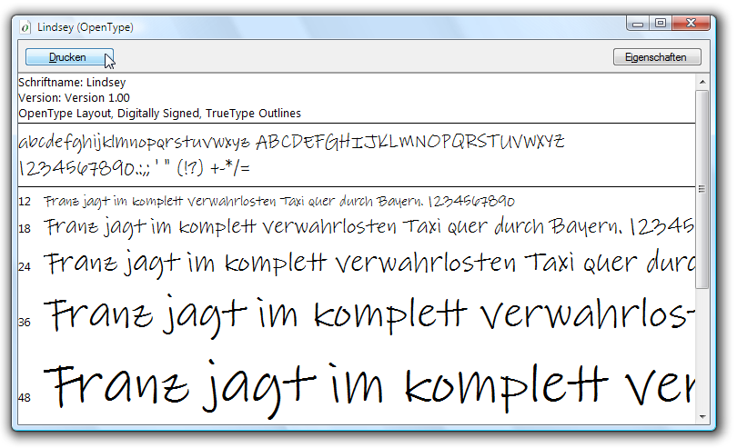

# OpenType-Beispielschriftartenpaket
Dieses Thema enthält eine Übersicht über die [!INCLUDE[TLA#tla_opentype](../../../../includes/tlasharptla-opentype-md.md)]\-Beispielschriftarten, die mit dem [!INCLUDE[TLA2#tla_wcsdk](../../../../includes/tla2sharptla-wcsdk-md.md)] verteilt werden.  Die Beispielschriftarten unterstützen erweiterte [!INCLUDE[TLA#tla_opentype](../../../../includes/tlasharptla-opentype-md.md)]\-Funktionen, die in [!INCLUDE[TLA#tla_winclient](../../../../includes/tlasharptla-winclient-md.md)]\-Anwendungen verwendet werden können.  
  
   
  
   
## Schriftarten im OpenType\-Schriftartenpaket  
 Das [!INCLUDE[TLA2#tla_wcsdk](../../../../includes/tla2sharptla-wcsdk-md.md)] stellt einen Satz von [!INCLUDE[TLA#tla_opentype](../../../../includes/tlasharptla-opentype-md.md)]\-Beispielschriftarten bereit, die Sie bei der Erstellung von [!INCLUDE[TLA#tla_winclient](../../../../includes/tlasharptla-winclient-md.md)]\-Anwendungen verwenden können.  Die Beispielschriftarten werden gemäß der Lizenz der Ascender Corporation bereitgestellt.  Diese Schriftarten implementieren nur einen Teil der mit dem [!INCLUDE[TLA#tla_opentype](../../../../includes/tlasharptla-opentype-md.md)]\-Format definierten Features.  In der folgenden Tabelle sind die Namen der [!INCLUDE[TLA#tla_opentype](../../../../includes/tlasharptla-opentype-md.md)]\-Beispielschriftarten aufgeführt.  
  
|**Name**|**Datei**|  
|--------------|---------------|  
|Kootenay|Kooten.ttf|  
|Lindsey|Linds.ttf|  
|Miramonte|Miramo.ttf|  
|Miramonte Bold|Miramob.ttf|  
|Pericles|Peric.ttf|  
|Pericles Light|Pericl.ttf|  
|Pescadero|Pesca.ttf|  
|Pescadero Bold|Pescab.ttf|  
  
 Die folgende Abbildung zeigt, wie die [!INCLUDE[TLA#tla_opentype](../../../../includes/tlasharptla-opentype-md.md)]\-Beispielschriftarten aussehen.  
  
   
Schriftarten im OpenType\-Schriftartenpaket  
  
 Die Beispielschriftarten werden gemäß der Lizenz der Ascender Corporation bereitgestellt.  Ascender ist ein Anbieter erweiterter Schriftprodukte.  Informationen zur Lizenzierung von erweiterten oder benutzerdefinierten Versionen der Beispielschriftarten finden Sie auf der [Ascender Corporation\-Website](http://go.microsoft.com/fwlink/?LinkId=182627).  
  
> [!NOTE]
>  Es liegt in Ihrer Verantwortung als Entwickler sicherzustellen, dass Sie über die erforderlichen Lizenzrechte für alle Schriftarten verfügen, die Sie in eine Anwendung einbetten oder anders verteilen.  
  
   
## Installieren der Schriftarten  
 Sie können die [!INCLUDE[TLA#tla_opentype](../../../../includes/tlasharptla-opentype-md.md)]\-Beispielschriftarten im [!INCLUDE[TLA#tla_mswin](../../../../includes/tlasharptla-mswin-md.md)]\-Standardschriftartenverzeichnis **\\WINDOWS\\Fonts** installieren.  Installieren Sie die Schriftarten mithilfe von Schriftarten in der Schriftartensystemsteuerung.  Nachdem Sie die Schriftarten installiert haben, können alle Anwendungen darauf zugreifen, die auf [!INCLUDE[TLA#tla_mswin](../../../../includes/tlasharptla-mswin-md.md)]\-Standardschriftarten verweisen. Sie können einen repräsentativen Satz von Zeichen in mehreren Schriftgraden anzeigen, indem Sie auf die Schriftdatei doppelklicken.  Die folgende Bildschirmabbildung zeigt die Lindsey\-Schriftartendatei Linds.ttf.  
  
   
Anzeigen der Lindsey\-Schriftart  
  
   
## Verwenden der Schriftarten  
 Es gibt zwei Methoden, um Schriftarten in der Anwendung verwenden zu können.  Sie können Ihrer Anwendung Schriftarten als Projektinhaltselemente hinzufügen, die nicht als Ressourcen innerhalb einer Assembly eingebettet sind.  Sie können Ihrer Anwendung Schriftarten auch als Projektressourcenelemente hinzufügen, die in die Assemblydateien der Anwendung eingebettet sind.  Weitere Informationen finden Sie unter [Verpacken von Schriftarten mit Anwendungen](../../../../docs/framework/wpf/advanced/packaging-fonts-with-applications.md).  
  
## Siehe auch  
 <xref:System.Windows.Documents.Typography>   
 [Features für OpenType\-Schriftarten](../../../../docs/framework/wpf/advanced/opentype-font-features.md)   
 [Verpacken von Schriftarten mit Anwendungen](../../../../docs/framework/wpf/advanced/packaging-fonts-with-applications.md)