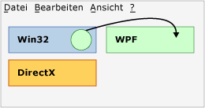
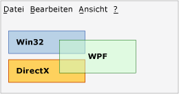
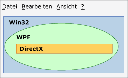

# &#220;bersicht &#252;ber die Technologieregionen
Wenn mehrere Präsentationstechnologien wie WPF, Win32 oder DirectX in einer Anwendung verwendet werden, müssen sie die Renderingbereiche in einem gemeinsamen Fenster auf der obersten Ebene gemeinsam nutzen.  In diesem Thema werden Probleme beschrieben, die die Präsentation und Eingabe für die WPF\-Interoperationsanwendung betreffen.  
  
## Bereiche  
 In einem Fenster der obersten Ebene können Sie sich jedes HWND, das eine der Technologien einer Interoperationsanwendung umfasst, so vorstellen, als verfüge es über einen eigenen Bereich \(bezeichnet als "Airspace"\).  Jedes Pixel im Fenster gehört zu genau einem HWND, das den Bereich dieses HWND bildet.  \(Genau genommen ist mehr als ein [!INCLUDE[TLA2#tla_winclient](../../../../includes/tla2sharptla-winclient-md.md)]\-Bereich vorhanden, wenn mehrere [!INCLUDE[TLA2#tla_winclient](../../../../includes/tla2sharptla-winclient-md.md)]\-HWNDs vorhanden sind. Für diese Diskussion wird jedoch davon ausgegangen, dass nur ein HWND vorhanden ist\).  Der Bereich impliziert, dass alle Ebenen oder anderen Fenster, die versuchen, während der Lebensdauer der Anwendung oberhalb dieses Pixels einen Rendervorgang durchzuführen, Teil der gleichen Renderebenentechnologie sein müssen.  Der Versuch, [!INCLUDE[TLA2#tla_winclient](../../../../includes/tla2sharptla-winclient-md.md)]\-Pixel über [!INCLUDE[TLA2#tla_win32](../../../../includes/tla2sharptla-win32-md.md)] zu rendern, führt zu unerwünschten Ergebnissen und wird während der Interoperation [!INCLUDE[TLA2#tla_api#plural](../../../../includes/tla2sharptla-apisharpplural-md.md)] so weit wie möglich vermieden.  
  
### Beispiele für Bereiche  
 Die folgende Abbildung zeigt eine Anwendung, in der [!INCLUDE[TLA2#tla_win32](../../../../includes/tla2sharptla-win32-md.md)], [!INCLUDE[TLA2#tla_dx](../../../../includes/tla2sharptla-dx-md.md)] und [!INCLUDE[TLA2#tla_winclient](../../../../includes/tla2sharptla-winclient-md.md)] kombiniert werden.  Jede Technologie verwendet einen eigenen, nicht überlappenden Satz von Pixeln, und es gibt keine Probleme mit dem Bereich.  
  
   
  
 Angenommen, diese Anwendung verwendet die Position des Mauszeigers, um eine Animation zu erstellen, die versucht, in einem dieser drei Bereiche einen Rendervorgang durchzuführen.  Unabhängig davon, welche Technologie für die Animation selbst verantwortlich ist, verletzt diese Technologie den Bereich der beiden anderen.  Die folgende Abbildung zeigt einen Versuch, einen WPF\-Kreis in einem Win32\-Bereich zu rendern.  
  
   
  
 Auch der Versuch, Transparenz\/Alphablending zwischen verschiedenen Technologien zu verwenden, führt zu einer Verletzung des Bereichs.  In der folgenden Abbildung verletzt das [!INCLUDE[TLA2#tla_winclient](../../../../includes/tla2sharptla-winclient-md.md)]\-Feld die [!INCLUDE[TLA2#tla_win32](../../../../includes/tla2sharptla-win32-md.md)]\- und [!INCLUDE[TLA2#tla_dx](../../../../includes/tla2sharptla-dx-md.md)]\-Bereiche.  Da die Pixel im [!INCLUDE[TLA2#tla_winclient](../../../../includes/tla2sharptla-winclient-md.md)]\-Feld halbtransparent sind, müssten sie sowohl zu [!INCLUDE[TLA2#tla_dx](../../../../includes/tla2sharptla-dx-md.md)] als auch zu [!INCLUDE[TLA2#tla_winclient](../../../../includes/tla2sharptla-winclient-md.md)] gehören, was nicht möglich ist.   Daher liegt eine weitere Verletzung vor, und die Erstellung ist nicht möglich.  
  
   
  
 In den vorhergehenden drei Beispielen wurden rechteckige Bereiche verwendet, es sind jedoch unterschiedliche Formen möglich.  Ein Bereich kann z. B. ein Loch aufweisen.  Die folgende Abbildung zeigt einen [!INCLUDE[TLA2#tla_win32](../../../../includes/tla2sharptla-win32-md.md)]\-Bereich mit einem rechteckigen Loch, dessen Größe den kombinierten [!INCLUDE[TLA2#tla_winclient](../../../../includes/tla2sharptla-winclient-md.md)]\- und [!INCLUDE[TLA2#tla_dx](../../../../includes/tla2sharptla-dx-md.md)]\-Bereichen entspricht.  
  
   
  
 Bereiche können auch nicht rechteckig sein oder eine beliebige Form aufweisen, die von einem [!INCLUDE[TLA2#tla_win32](../../../../includes/tla2sharptla-win32-md.md)]\-HRGN \(Bereich\) definiert wird.  
  
   
  
## Transparenz und Fenster der obersten Ebene  
 Der Fenster\-Manager in Windows verarbeitet tatsächlich nur [!INCLUDE[TLA2#tla_win32](../../../../includes/tla2sharptla-win32-md.md)]\-HWNDs.  Daher ist jedes [!INCLUDE[TLA2#tla_winclient](../../../../includes/tla2sharptla-winclient-md.md)]\-<xref:System.Windows.Window> ein HWND.  Das <xref:System.Windows.Window>\-HWND muss die allgemeinen Richtlinien für alle HWNDs erfüllen.  Innerhalb dieses HWND kann durch [!INCLUDE[TLA2#tla_winclient](../../../../includes/tla2sharptla-winclient-md.md)]\-Code alles durchgeführt werden, was von [!INCLUDE[TLA2#tla_winclient](../../../../includes/tla2sharptla-winclient-md.md)] [!INCLUDE[TLA2#tla_api#plural](../../../../includes/tla2sharptla-apisharpplural-md.md)] unterstützt wird.  Zur Interaktion mit anderen HWNDs auf dem Desktop muss [!INCLUDE[TLA2#tla_winclient](../../../../includes/tla2sharptla-winclient-md.md)] die Verarbeitungs\- und Renderingregeln von [!INCLUDE[TLA2#tla_win32](../../../../includes/tla2sharptla-win32-md.md)] beachten.  [!INCLUDE[TLA2#tla_winclient](../../../../includes/tla2sharptla-winclient-md.md)] unterstützt nicht rechteckige Fenster durch die Verwendung von [!INCLUDE[TLA2#tla_win32](../../../../includes/tla2sharptla-win32-md.md)] [!INCLUDE[TLA2#tla_api#plural](../../../../includes/tla2sharptla-apisharpplural-md.md)]\-HRGNs für nicht rechteckige Fenster und überlappende Fenster für Alphablending pro Pixel.  
  
 Konstante Alpha\- und Hintergrundfarben werden nicht unterstützt.  Die Funktionen für überlappende Fenster in [!INCLUDE[TLA2#tla_win32](../../../../includes/tla2sharptla-win32-md.md)] unterscheiden sich je nach Plattform.  
  
 Überlappende Fenster können dazu führen, dass das gesamte Fenster lichtdurchlässig \(halbtransparent\) wird, indem ein Alphawert festgelegt wird, der auf jedes Pixel im Fenster angewendet wird.  \([!INCLUDE[TLA2#tla_win32](../../../../includes/tla2sharptla-win32-md.md)] unterstützt tatsächlich Alphablending pro Pixel, wobei dies in praktischen Programmen jedoch sehr schwer anwendbar ist, da Sie in diesem Modus jedes untergeordnete HWND selbst zeichnen müssten, einschließlich Dialogfelder und Dropdownmenüs\).  
  
 [!INCLUDE[TLA2#tla_winclient](../../../../includes/tla2sharptla-winclient-md.md)] unterstützt HRGNs, wobei jedoch keine verwalteten [!INCLUDE[TLA2#tla_api#plural](../../../../includes/tla2sharptla-apisharpplural-md.md)] für diese Funktion verfügbar sind.  Sie können Plattformaufrufe und <xref:System.Windows.Interop.HwndSource> verwenden, um die relevanten [!INCLUDE[TLA2#tla_win32](../../../../includes/tla2sharptla-win32-md.md)] [!INCLUDE[TLA2#tla_api#plural](../../../../includes/tla2sharptla-apisharpplural-md.md)] aufzurufen.  Weitere Informationen finden Sie unter [Aufrufen systemeigener Funktionen aus verwaltetem Code](../Topic/Calling%20Native%20Functions%20from%20Managed%20Code.md).  
  
 Überlappende Fenster in [!INCLUDE[TLA2#tla_winclient](../../../../includes/tla2sharptla-winclient-md.md)] bieten auf verschiedenen Betriebssystemen unterschiedliche Funktionen.  Dies ist darauf zurückzuführen, dass [!INCLUDE[TLA2#tla_winclient](../../../../includes/tla2sharptla-winclient-md.md)] zum Rendern [!INCLUDE[TLA2#tla_dx](../../../../includes/tla2sharptla-dx-md.md)] verwendet und überlappende Fenster hauptsächlich für das [!INCLUDE[TLA2#tla_gdi](../../../../includes/tla2sharptla-gdi-md.md)]\-Rendering konzipiert sind, nicht für das [!INCLUDE[TLA2#tla_dx](../../../../includes/tla2sharptla-dx-md.md)]\-Rendering.  
  
-   [!INCLUDE[TLA2#tla_winclient](../../../../includes/tla2sharptla-winclient-md.md)] unterstützt hardwarebeschleunigte überlappende Fenster unter [!INCLUDE[TLA#tla_longhorn](../../../../includes/tlasharptla-longhorn-md.md)] und höher.  Hardwarebeschleunigte überlappende Fenster unter [!INCLUDE[TLA2#tla_winxp](../../../../includes/tla2sharptla-winxp-md.md)] erfordern Unterstützung von [!INCLUDE[TLA#tla_dx](../../../../includes/tlasharptla-dx-md.md)], sodass die Möglichkeiten von der [!INCLUDE[TLA#tla_dx](../../../../includes/tlasharptla-dx-md.md)]\-Version auf dem Computer abhängen.  
  
-   [!INCLUDE[TLA2#tla_winclient](../../../../includes/tla2sharptla-winclient-md.md)] unterstützt keine Transparenz\-Hintergrundfarben, da [!INCLUDE[TLA2#tla_winclient](../../../../includes/tla2sharptla-winclient-md.md)] nicht garantieren kann, dass genau die angeforderte Farbe gerendert werden kann, insbesondere dann nicht, wenn das Rendering hardwarebeschleunigt ist.  
  
-   Bei der Ausführung der Anwendung unter [!INCLUDE[TLA2#tla_winxp](../../../../includes/tla2sharptla-winxp-md.md)] führen überlappende Fenster über [!INCLUDE[TLA2#tla_dx](../../../../includes/tla2sharptla-dx-md.md)]\-Oberflächen zu einem Flackern, wenn die [!INCLUDE[TLA2#tla_dx](../../../../includes/tla2sharptla-dx-md.md)]\-Anwendung das Rendering ausführt.  \(Die eigentliche Renderingreihenfolge sieht wie folgt aus: [!INCLUDE[TLA#tla_gdi](../../../../includes/tlasharptla-gdi-md.md)] blendet das überlappende Fenster aus, anschließend zeichnet [!INCLUDE[TLA2#tla_dx](../../../../includes/tla2sharptla-dx-md.md)], und dann zeigt [!INCLUDE[TLA#tla_gdi](../../../../includes/tlasharptla-gdi-md.md)] das überlappende Fenster wieder an.\)  Nicht überlappende [!INCLUDE[TLA2#tla_winclient](../../../../includes/tla2sharptla-winclient-md.md)]\-Fenster weisen diese Einschränkung ebenfalls auf.  
  
## Siehe auch  
 [Interaktion zwischen WPF und Win32](../../../../docs/framework/wpf/advanced/wpf-and-win32-interoperation.md)   
 [Exemplarische Vorgehensweise: Hosten einer WPF\-Uhr in Win32](../../../../docs/framework/wpf/advanced/walkthrough-hosting-a-wpf-clock-in-win32.md)   
 [Hosten von Win32\-Inhalt in WPF](../../../../docs/framework/wpf/advanced/hosting-win32-content-in-wpf.md)