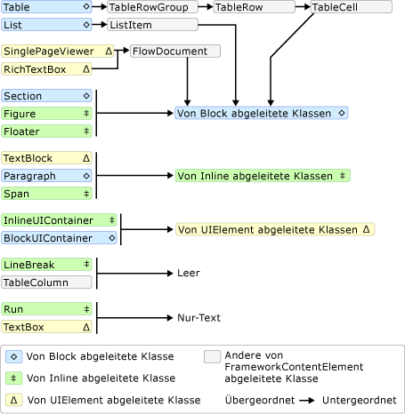

# &#220;bersicht &#252;ber das TextElement-Inhaltsmodell
In dieser Inhaltsmodellübersicht wird der unterstützte Inhalt für ein <xref:System.Windows.Documents.TextElement> beschrieben.  Die <xref:System.Windows.Documents.Paragraph>\-Klasse ist ein Typ von <xref:System.Windows.Documents.TextElement>.  Ein Inhaltsmodell beschreibt, welche Objekte\/Elemente in anderen enthalten sein können.  In dieser Übersicht wird das Inhaltsmodell zusammengefasst, das für von <xref:System.Windows.Documents.TextElement> abgeleitete Objekte verwendet wird.  Weitere Informationen finden Sie unter [Übersicht über Flussdokumente](../../../../docs/framework/wpf/advanced/flow-document-overview.md).  
  
   
  
   
## Inhaltsmodelldiagramm  
 Im folgenden Diagramm wird das Inhaltsmodell für Klassen zusammengefasst, die von <xref:System.Windows.Documents.TextElement> abgeleitet sind, sowie für andere Klassen als die `TextElement`\-Klasse, die in dieses Modell passen.  
  
   
  
 Wie aus dem vorherigen Diagramm ersichtlich, hängen die für ein Element zulässigen untergeordneten Elemente nicht unbedingt davon ab, ob eine Klasse von der <xref:System.Windows.Documents.Block>\-Klasse oder einer <xref:System.Windows.Documents.Inline>\-Klasse abgeleitet wird.  Beispielsweise kann <xref:System.Windows.Documents.Span> \(eine von <xref:System.Windows.Documents.Inline> abgeleitete Klasse\) nur untergeordnete <xref:System.Windows.Documents.Inline>\-Elemente haben, während <xref:System.Windows.Documents.Figure> \(ebenfalls eine von <xref:System.Windows.Documents.Inline> abgeleitete Klassen\) nur untergeordnete <xref:System.Windows.Documents.Block>\-Elemente haben kann.  Aus diesem Grund ist ein Diagramm nützlich, um schnell zu bestimmen, welches Element in einem anderen enthalten sein kann.  Als Beispiel kann das Diagramm verwendet werden, um festzustellen, wie der Fließinhalt einer <xref:System.Windows.Controls.RichTextBox> konstruiert werden kann.  
  
1.  Eine <xref:System.Windows.Controls.RichTextBox> muss ein <xref:System.Windows.Documents.FlowDocument> enthalten, das wiederum ein von einem <xref:System.Windows.Documents.Block> abgeleitetes Objekt enthalten muss.  Im Folgenden wird das entsprechende Segment des vorherigen Diagramms dargestellt.  
  
       
  
     So könnte das Markup zu diesem Zeitpunkt aussehen.  
  
     [!code-xml[FlowOvwSnippets_snip#SchemaWalkThrough1](../../../../samples/snippets/csharp/VS_Snippets_Wpf/FlowOvwSnippets_snip/CS/MiscSnippets.xaml#schemawalkthrough1)]  
  
2.  Gemäß dem Diagramm können Sie zwischen mehreren <xref:System.Windows.Documents.Block>\-Elementen wählen, darunter <xref:System.Windows.Documents.Paragraph>, <xref:System.Windows.Documents.Section>, <xref:System.Windows.Documents.Table>, <xref:System.Windows.Documents.List> und <xref:System.Windows.Documents.BlockUIContainer> \(siehe Von Block abgeleitete Klassen im vorherigen Diagramm\).  Angenommen, das gewünschte Element ist eine <xref:System.Windows.Documents.Table>.  Gemäß dem vorherigen Diagramm enthält eine <xref:System.Windows.Documents.Table> eine <xref:System.Windows.Documents.TableRowGroup>, in der <xref:System.Windows.Documents.TableRow>\-Elemente enthalten sind, die <xref:System.Windows.Documents.TableCell>\-Elemente enthalten, welche ein von einem <xref:System.Windows.Documents.Block> abgeleitetes Objekt enthalten.  Im Folgenden wird das entsprechende Segment für <xref:System.Windows.Documents.Table>, dargestellt, das aus dem vorherigen Diagramm stammt.  
  
       
  
     Im Folgenden wird das entsprechende Markup dargestellt.  
  
     [!code-xml[FlowOvwSnippets_snip#SchemaWalkThrough2](../../../../samples/snippets/csharp/VS_Snippets_Wpf/FlowOvwSnippets_snip/CS/MiscSnippets.xaml#schemawalkthrough2)]  
  
3.  Wiederum sind ein oder mehrere <xref:System.Windows.Documents.Block>\-Elemente unter einer <xref:System.Windows.Documents.TableCell> erforderlich.  Um bei einem einfachen Beispiel zu bleiben, platzieren Sie einen kurzen Text in der Zelle.  Dazu können Sie einen <xref:System.Windows.Documents.Paragraph> mit einem <xref:System.Windows.Documents.Run>\-Element verwenden.  Im Folgenden werden die entsprechenden Segmente aus dem Diagramm dargestellt, die zeigen, dass ein <xref:System.Windows.Documents.Paragraph> ein <xref:System.Windows.Documents.Inline>\-Element und <xref:System.Windows.Documents.Run> \(ein <xref:System.Windows.Documents.Inline>\-Element\) lediglich Nur\-Text enthalten kann.  
  
       
  
       
  
 Im Folgenden wird das vollständige Beispiel in Markup dargestellt.  
  
 [!code-xml[FlowOvwSnippets_snip#SchemaExampleWholePage](../../../../samples/snippets/csharp/VS_Snippets_Wpf/FlowOvwSnippets_snip/CS/SchemaExample.xaml#schemaexamplewholepage)]  
  
   
## Programmgesteuertes Arbeiten mit TextElement\-Inhalt  
 Der Inhalt von einem <xref:System.Windows.Documents.TextElement> besteht aus Auflistungen. Durch das Arbeiten mit diesen Auflistungen wird der Inhalt von <xref:System.Windows.Documents.TextElement>\-Objekten programmgesteuert bearbeitet.  Von <xref:System.Windows.Documents.TextElement> abgeleitete Klassen verwenden drei verschiedene Auflistungen:  
  
-   <xref:System.Windows.Documents.InlineCollection>: Stellt eine Auflistung von <xref:System.Windows.Documents.Inline>\-Elementen dar.  <xref:System.Windows.Documents.InlineCollection> definiert den zulässigen untergeordneten Inhalt der Elemente <xref:System.Windows.Documents.Paragraph>, <xref:System.Windows.Documents.Span> und <xref:System.Windows.Controls.TextBlock>.  
  
-   <xref:System.Windows.Documents.BlockCollection>: Stellt eine Auflistung von <xref:System.Windows.Documents.Block>\-Elementen dar.  <xref:System.Windows.Documents.BlockCollection> definiert den zulässigen untergeordneten Inhalt der Elemente <xref:System.Windows.Documents.FlowDocument>, <xref:System.Windows.Documents.Section>, <xref:System.Windows.Documents.ListItem>, <xref:System.Windows.Documents.TableCell>, <xref:System.Windows.Documents.Floater> und <xref:System.Windows.Documents.Figure>.  
  
-   <xref:System.Windows.Documents.ListItemCollection>: Ein fortlaufendes Inhaltselement, das ein besonderes Inhaltselement in einer geordneten oder ungeordneten <xref:System.Windows.Documents.List> darstellt.  
  
 Sie können diese Auflistungen mithilfe der jeweiligen Eigenschaften von **Inlines**, **Blocks** und **ListItems** bearbeiten \(Elemente hinzufügen oder entfernen\).  Die folgenden Beispiele zeigen, wie der Inhalt eines Span\-Elements mit der **Inlines**\-Eigenschaft bearbeitet wird.  
  
> [!NOTE]
>  Das Table\-Element verwendet zum Bearbeiten seines Inhalts mehrere Auflistungen, die hier jedoch nicht vorgestellt werden.  Weitere Informationen finden Sie unter [Übersicht über Tabellen](../../../../docs/framework/wpf/advanced/table-overview.md).  
  
 Im folgenden Beispiel wird ein neues <xref:System.Windows.Documents.Span>\-Objekt erstellt. Danach werden mithilfe der `Add`\-Methode zwei Textausführungen als untergeordnete Inhaltselemente des <xref:System.Windows.Documents.Span>\-Objekts hinzugefügt.  
  
 [!code-csharp[SpanSnippets#_SpanInlinesAdd](../../../../samples/snippets/csharp/VS_Snippets_Wpf/SpanSnippets/CSharp/Window1.xaml.cs#_spaninlinesadd)]
 [!code-vb[SpanSnippets#_SpanInlinesAdd](../../../../samples/snippets/visualbasic/VS_Snippets_Wpf/SpanSnippets/visualbasic/window1.xaml.vb#_spaninlinesadd)]  
  
 Im folgenden Beispiel wird ein neues <xref:System.Windows.Documents.Run>\-Element erstellt und am Anfang von <xref:System.Windows.Documents.Span> eingefügt.  
  
 [!code-csharp[SpanSnippets#_SpanInlinesInsert](../../../../samples/snippets/csharp/VS_Snippets_Wpf/SpanSnippets/CSharp/Window1.xaml.cs#_spaninlinesinsert)]
 [!code-vb[SpanSnippets#_SpanInlinesInsert](../../../../samples/snippets/visualbasic/VS_Snippets_Wpf/SpanSnippets/visualbasic/window1.xaml.vb#_spaninlinesinsert)]  
  
 Im folgenden Beispiel wird das letzte <xref:System.Windows.Documents.Inline>\-Element in <xref:System.Windows.Documents.Span> gelöscht.  
  
 [!code-csharp[SpanSnippets#_SpanInlinesRemoveLast](../../../../samples/snippets/csharp/VS_Snippets_Wpf/SpanSnippets/CSharp/Window1.xaml.cs#_spaninlinesremovelast)]
 [!code-vb[SpanSnippets#_SpanInlinesRemoveLast](../../../../samples/snippets/visualbasic/VS_Snippets_Wpf/SpanSnippets/visualbasic/window1.xaml.vb#_spaninlinesremovelast)]  
  
 Im folgenden Beispiel wird der gesamte Inhalt \(<xref:System.Windows.Documents.Inline>\-Elemente\) aus <xref:System.Windows.Documents.Span> gelöscht.  
  
 [!code-csharp[SpanSnippets#_SpanInlinesClear](../../../../samples/snippets/csharp/VS_Snippets_Wpf/SpanSnippets/CSharp/Window1.xaml.cs#_spaninlinesclear)]
 [!code-vb[SpanSnippets#_SpanInlinesClear](../../../../samples/snippets/visualbasic/VS_Snippets_Wpf/SpanSnippets/visualbasic/window1.xaml.vb#_spaninlinesclear)]  
  
   
## Typen, für die dieses Inhaltsmodell freigegeben wird  
 Die folgenden Typen erben von der <xref:System.Windows.Documents.TextElement>\-Klasse und können verwendet werden, um den in dieser Übersicht beschriebenen Inhalt anzuzeigen.  
  
 <xref:System.Windows.Documents.Bold>, <xref:System.Windows.Documents.Figure>, <xref:System.Windows.Documents.Floater>, <xref:System.Windows.Documents.Hyperlink>, <xref:System.Windows.Documents.InlineUIContainer>, <xref:System.Windows.Documents.Italic>, <xref:System.Windows.Documents.LineBreak>, <xref:System.Windows.Documents.List>, <xref:System.Windows.Documents.ListItem>, <xref:System.Windows.Documents.Paragraph>, <xref:System.Windows.Documents.Run>, <xref:System.Windows.Documents.Section>, <xref:System.Windows.Documents.Span>, <xref:System.Windows.Documents.Table>, <xref:System.Windows.Documents.Underline>.  
  
 Beachten Sie, dass diese Liste nur nicht abstrakte Typen umfasst, die mit dem [!INCLUDE[TLA2#tla_winfxsdk](../../../../includes/tla2sharptla-winfxsdk-md.md)] verteilt werden.  Sie verwenden möglicherweise andere Typen, die von <xref:System.Windows.Documents.TextElement> erben.  
  
   
## Typen, die TextElement\-Objekte enthalten können  
 Siehe [WPF\-Inhaltsmodell](../../../../docs/framework/wpf/controls/wpf-content-model.md).  
  
## Siehe auch  
 [Bearbeiten von einem FlowDocument mit der Blocks\-Eigenschaft](../../../../docs/framework/wpf/advanced/how-to-manipulate-a-flowdocument-through-the-blocks-property.md)   
 [Bearbeiten von fortlaufenden Inhaltselementen mit der Blocks\-Eigenschaft](../../../../docs/framework/wpf/advanced/how-to-manipulate-flow-content-elements-through-the-blocks-property.md)   
 [Bearbeiten von einem FlowDocument mit der Blocks\-Eigenschaft](../../../../docs/framework/wpf/advanced/how-to-manipulate-a-flowdocument-through-the-blocks-property.md)   
 [Bearbeiten der Spalten einer Tabelle mit der Columns\-Eigenschaft](../../../../docs/framework/wpf/advanced/how-to-manipulate-table-columns-through-the-columns-property.md)   
 [Bearbeiten der Zeilengruppen einer Tabelle mit der RowGroups\-Eigenschaft](../../../../docs/framework/wpf/advanced/how-to-manipulate-table-row-groups-through-the-rowgroups-property.md)