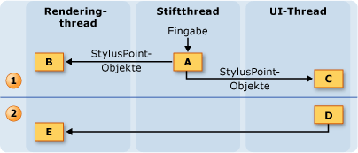
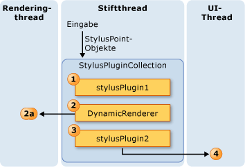

# Das Threadmodell für FreihandeingabenThe Ink Threading Model
Einer der Vorteile von Freihandeingaben auf einem Tablet PC ist, dass es mit einem regulären Stift und Papier viel wie beim Schreiben idealer.One of the benefits of ink on a Tablet PC is that it feels a lot like writing with a regular pen and paper.  Um dies zu erreichen, erfasst der Tablettstift Eingabedaten eine viel höhere Ausfallrate als eine Maus und die Freihandeingabe während des Schreibvorgangs rendert.To accomplish this, the tablet pen collects input data at a much higher rate than a mouse does and renders the ink as the user writes.  Thread (Benutzeroberflächenthread) der Anwendung reicht nicht für das Sammeln von Daten und zum Rendern von Freihandeingaben, da er blockiert werden kann.The application's user interface (UI) thread is not sufficient for collecting pen data and rendering ink, because it can become blocked.  Um dies zu lösen eine [!INCLUDE[TLA2#tla_winclient](../../../../includes/tla2sharptla-winclient-md.md)] Anwendung zwei zusätzliche Threads verwendet, wenn Freihandeingabe.To solve this, a [!INCLUDE[TLA2#tla_winclient](../../../../includes/tla2sharptla-winclient-md.md)] application uses two additional threads when a user writes ink.  
  
 Die folgende Liste beschreibt die Threads, die Teil zum Sammeln und Rendern von Freihandeingaben annehmen:The following list describes the threads that take part in collecting and rendering digital ink:  
  
-   Pen-Thread - des Threads, die Eingabe des Tablettstifts akzeptiert.Pen thread - the thread that takes input from the stylus.  (In der Praxis können dies ist eine Threadpool, aber dieses Thema bezieht sich darauf als Stiftthread.)(In reality, this is a thread pool, but this topic refers to it as a pen thread.)  
  
-   Anwendung Benutzeroberflächenthread - Threads, der die Benutzeroberfläche der Anwendung steuert.Application user interface thread - the thread that controls the user interface of the application.  
  
-   Dynamische Renderingthread - zeichnet der Thread, der der Freihandeingabe während der Benutzer ein Strichs.Dynamic rendering thread - the thread that renders the ink while the user draws a stroke. Die dynamische Renderingthread unterscheidet sich dem Thread, andere Elemente der Benutzeroberfläche für die Anwendung gerendert, werden, wie unter Window Presentation Foundation [Threadmodell](../../../../docs/framework/wpf/advanced/threading-model.md).The dynamic rendering thread is different than the thread that renders other UI elements for the application, as mentioned in Window Presentation Foundation [Threading Model](../../../../docs/framework/wpf/advanced/threading-model.md).  
  
 Das Freihand-Modell entspricht dem, ob die Anwendung verwendet die <xref:System.Windows.Controls.InkCanvas> oder ein benutzerdefiniertes Steuerelement mit dem Umwandlungsoperator in [Erstellen eines Steuerelements der Freihand-Eingabe](../../../../docs/framework/wpf/advanced/creating-an-ink-input-control.md).The inking model is the same whether the application uses the <xref:System.Windows.Controls.InkCanvas> or a custom control similar to the one in [Creating an Ink Input Control](../../../../docs/framework/wpf/advanced/creating-an-ink-input-control.md).  Obwohl in diesem Thema wird erläutert, in Form eines threading der <xref:System.Windows.Controls.InkCanvas>, dieselben Konzepte gelten, wenn Sie ein benutzerdefiniertes Steuerelement erstellen.Although this topic discusses threading in terms of the <xref:System.Windows.Controls.InkCanvas>, the same concepts apply when you create a custom control.  
  
## Übersicht über ThreadingThreading Overview  
 Das folgende Diagramm veranschaulicht das Threadingmodell an, wenn ein Benutzer einen Strich zeichnet:The following diagram illustrates the threading model when a user draws a stroke:  
  
 ![Threadingmodell beim Zeichnen eines Strichs. ] (../../../../docs/framework/wpf/advanced/media/inkthreading-drawingink.png "InkThreading_DrawingInk")  
  
1.  Aktionen, die auftreten, während der Benutzer den Strich zeichnetActions occurring while the user draws the stroke  
  
    1.  Wenn der Benutzer einen Strich zeichnet, sind die Tablettstiftpunkte in verschiedenen für den Stiftthread.When the user draws a stroke, the stylus points come in on the pen thread.  Stift-Plug-ins, einschließlich der <xref:System.Windows.Input.StylusPlugIns.DynamicRenderer>, akzeptieren Sie die Tablettstift Punkten im Thread Stift und haben die Möglichkeit, die sie vor dem Ändern der <xref:System.Windows.Controls.InkCanvas> Empfangs.Stylus plug-ins, including the <xref:System.Windows.Input.StylusPlugIns.DynamicRenderer>, accept the stylus points on the pen thread and have the chance to modify them before the <xref:System.Windows.Controls.InkCanvas> receives them.  
  
    2.  Die <xref:System.Windows.Input.StylusPlugIns.DynamicRenderer> die Tablettstift Punkten im dynamischen Renderingthread rendert.The <xref:System.Windows.Input.StylusPlugIns.DynamicRenderer> renders the stylus points on the dynamic rendering thread. Dies geschieht, zur gleichen Zeit wie im vorherigen Schritt.This happens at the same time as the previous step.  
  
    3.  Die <xref:System.Windows.Controls.InkCanvas> empfängt die Tablettstift Punkten im UI-Thread.The <xref:System.Windows.Controls.InkCanvas> receives the stylus points on the UI thread.  
  
2.  Aktionen, die auftritt, nachdem der Benutzer den Strich beendetActions occurring after the user ends the stroke  
  
    1.  Nach Abschluss der Benutzer die Kontur zeichnen die <xref:System.Windows.Controls.InkCanvas> erstellt eine <xref:System.Windows.Ink.Stroke> -Objekt und fügt es der <xref:System.Windows.Controls.InkPresenter>, die statisch gerendert wird.When the user finishes drawing the stroke, the <xref:System.Windows.Controls.InkCanvas> creates a <xref:System.Windows.Ink.Stroke> object and adds it to the <xref:System.Windows.Controls.InkPresenter>, which statically renders it.  
  
    2.  UI-Thread-Warnungen der <xref:System.Windows.Input.StylusPlugIns.DynamicRenderer> , die die Kontur statisch gerendert wird, sodass der <xref:System.Windows.Input.StylusPlugIns.DynamicRenderer> entfernt die visuelle Darstellung des Strichs.The UI thread alerts the <xref:System.Windows.Input.StylusPlugIns.DynamicRenderer> that the stroke is statically rendered, so the <xref:System.Windows.Input.StylusPlugIns.DynamicRenderer> removes its visual representation of the stroke.  
  
## Freihandeingaben und Tablettstift-Plug-insInk collection and Stylus Plug-ins  
 Jede <xref:System.Windows.UIElement> verfügt über eine <xref:System.Windows.Input.StylusPlugIns.StylusPlugInCollection>.Each <xref:System.Windows.UIElement> has a <xref:System.Windows.Input.StylusPlugIns.StylusPlugInCollection>.  Die <xref:System.Windows.Input.StylusPlugIns.StylusPlugIn> Objekte in der <xref:System.Windows.Input.StylusPlugIns.StylusPlugInCollection> empfangen und die Tablettstift Punkten im Thread Stift ändern können.The <xref:System.Windows.Input.StylusPlugIns.StylusPlugIn> objects in the <xref:System.Windows.Input.StylusPlugIns.StylusPlugInCollection> receive and can modify the stylus points on the pen thread. Die <xref:System.Windows.Input.StylusPlugIns.StylusPlugIn> Objekte erhalten die Tablettstiftpunkte entsprechend ihrer Reihenfolge in der <xref:System.Windows.Input.StylusPlugIns.StylusPlugInCollection>.The <xref:System.Windows.Input.StylusPlugIns.StylusPlugIn> objects receive the stylus points according to their order in the <xref:System.Windows.Input.StylusPlugIns.StylusPlugInCollection>.  
  
 Das folgende Diagramm veranschaulicht die hypothetische Situation, in dem die <xref:System.Windows.UIElement.StylusPlugIns%2A> Auflistung von einer <xref:System.Windows.UIElement> enthält `stylusPlugin1`, <xref:System.Windows.Input.StylusPlugIns.DynamicRenderer>, und `stylusPlugin2`in dieser Reihenfolge.The following diagram illustrates the hypothetical situation where the <xref:System.Windows.UIElement.StylusPlugIns%2A> collection of a <xref:System.Windows.UIElement> contains `stylusPlugin1`, a <xref:System.Windows.Input.StylusPlugIns.DynamicRenderer>, and `stylusPlugin2`, in that order.  
  
 ![Reihenfolge der Tablettstift-Plugins beeinflusst Ausgabe. ] (../../../../docs/framework/wpf/advanced/media/inkthreading-pluginorder.png "InkThreading_PluginOrder")  
  
 In der vorherigen Abbildung erfolgt Folgendes:In the previous diagram, the following behavior takes place:  
  
1.  `StylusPlugin1` Ändert die Werte für x und y.`StylusPlugin1` modifies the values for x and y.  
  
2.  <xref:System.Windows.Input.StylusPlugIns.DynamicRenderer> empfängt die geänderte Tablettstiftpunkte, und im dynamischen Renderingthread gerendert.<xref:System.Windows.Input.StylusPlugIns.DynamicRenderer> receives the modified stylus points and renders them on the dynamic rendering thread.  
  
3.  `StylusPlugin2` empfängt die geänderte Tablettstiftpunkte und weiteren ändert die Werte für x und y.`StylusPlugin2` receives the modified stylus points and further modifies the values for x and y.  
  
4.  Die Anwendung die Tablettstiftpunkte erfasst und Abschluss der Benutzer die Strichbreite nach der Strich statisch gerendert.The application collects the stylus points, and, when the user finishes the stroke, statically renders the stroke.  
  
 Nehmen wir an, die `stylusPlugin1` schränkt die Tablettstift Punkten zu einem Rechteck und `stylusPlugin2` übersetzt die Tablettstift Punkten rechts.Suppose that `stylusPlugin1` restricts the stylus points to a rectangle and `stylusPlugin2` translates the stylus points to the right.  Im obigen Szenario der <xref:System.Windows.Input.StylusPlugIns.DynamicRenderer> empfängt die eingeschränkten Tablettstiftpunkte, jedoch nicht die übersetzten Tablettstiftpunkte.In the previous scenario, the <xref:System.Windows.Input.StylusPlugIns.DynamicRenderer> receives the restricted stylus points, but not the translated stylus points.  Wenn der Benutzer einen Strich zeichnet, Strichs innerhalb der Grenzen des Rechtecks gerendert, jedoch die Kontur ist scheinbar nicht übersetzt werden, bis der Benutzer den Stift anhebt.When the user draws the stroke, the stroke is rendered within the bounds of the rectangle, but the stroke doesn't appear to be translated until the user lifts the pen.  
  
### Ausführen von Vorgängen mit einem Tablettstift-Plug-in auf dem UI-threadPerforming operations with a Stylus Plug-in on the UI thread  
 Da der genaue Treffertests für den Stiftthread ausgeführt werden kann, möglicherweise einige Elemente gelegentlich Tablettstift Eingabetyp für andere Elemente empfangen.Because accurate hit-testing cannot be performed on the pen thread, some elements might occasionally receive stylus input intended for other elements. Wenn Sie müssen sicherstellen, dass die Eingabe vor dem Ausführen eines Vorgangs ordnungsgemäß weitergeleitet wurde, abonnieren, und führen Sie den Vorgang in der <xref:System.Windows.Input.StylusPlugIns.StylusPlugIn.OnStylusDownProcessed%2A>, <xref:System.Windows.Input.StylusPlugIns.StylusPlugIn.OnStylusMoveProcessed%2A>, oder <xref:System.Windows.Input.StylusPlugIns.StylusPlugIn.OnStylusUpProcessed%2A> Methode.If you need to make sure the input was routed correctly before performing an operation, subscribe to and perform the operation in the <xref:System.Windows.Input.StylusPlugIns.StylusPlugIn.OnStylusDownProcessed%2A>, <xref:System.Windows.Input.StylusPlugIns.StylusPlugIn.OnStylusMoveProcessed%2A>, or <xref:System.Windows.Input.StylusPlugIns.StylusPlugIn.OnStylusUpProcessed%2A> method. Diese Methoden werden vom Thread Anwendung aufgerufen, nachdem die genauer Treffertest ausgeführt wurde.These methods are invoked by the application thread after accurate hit-testing has been performed. Rufen Sie zum Abonnieren dieser Methoden die <xref:System.Windows.Input.StylusPlugIns.RawStylusInput.NotifyWhenProcessed%2A> -Methode in der Methode, die an den Stiftthread auftritt.To subscribe to these methods, call the <xref:System.Windows.Input.StylusPlugIns.RawStylusInput.NotifyWhenProcessed%2A> method in the method that occurs on the pen thread.  
  
 Das folgende Diagramm veranschaulicht die Beziehung zwischen den Stiftthread und UI-Thread in Bezug auf die Stylus-Ereignisse von einem <xref:System.Windows.Input.StylusPlugIns.StylusPlugIn>.The following diagram illustrates the relationship between the pen thread and UI thread with respect to the stylus events of a <xref:System.Windows.Input.StylusPlugIns.StylusPlugIn>.  
  
   
  
## Rendern von FreihandeingabenRendering Ink  
 Wenn der Benutzer einen Strich zeichnet <xref:System.Windows.Input.StylusPlugIns.DynamicRenderer> rendert in einem separaten Thread Kanton Freihandeingaben "von der Stift übertragen" selbst, wenn der UI-Thread ausgelastet ist.As the user draws a stroke, <xref:System.Windows.Input.StylusPlugIns.DynamicRenderer> renders the ink on a separate thread so the ink appears to "flow" from the pen even when the UI thread is busy.  Die <xref:System.Windows.Input.StylusPlugIns.DynamicRenderer> eine visuelle Struktur im dynamischen Rendering-Thread erstellt, wie sie Tablettstiftpunkte erfasst.The <xref:System.Windows.Input.StylusPlugIns.DynamicRenderer> builds a visual tree on the dynamic rendering thread as it collects stylus points.  Wenn der Benutzer den Strich beendet die <xref:System.Windows.Input.StylusPlugIns.DynamicRenderer> fordert benachrichtigt werden, wenn die Anwendung den nächsten Renderingdurchlauf ausgeführt wird.When the user finishes the stroke, the <xref:System.Windows.Input.StylusPlugIns.DynamicRenderer> asks to be notified when the application does the next rendering pass.  Nach Abschluss des nächsten Renderingdurchlauf, die Anwendung die <xref:System.Windows.Input.StylusPlugIns.DynamicRenderer> seiner visuellen Struktur bereinigt.After the application completes the next rendering pass, the <xref:System.Windows.Input.StylusPlugIns.DynamicRenderer> cleans up its visual tree.  Das folgende Diagramm veranschaulicht diesen Prozess.The following diagram illustrates this process.  
  
   
  
1.  Der Benutzer beginnt, den Strich.The user begins the stroke.  
  
    1.  Die <xref:System.Windows.Input.StylusPlugIns.DynamicRenderer> erstellt die visuelle Struktur.The <xref:System.Windows.Input.StylusPlugIns.DynamicRenderer> creates the visual tree.  
  
2.  Der Benutzer ist die Kontur zeichnen.The user is drawing the stroke.  
  
    1.  Die <xref:System.Windows.Input.StylusPlugIns.DynamicRenderer> erstellt die visuelle Struktur.The <xref:System.Windows.Input.StylusPlugIns.DynamicRenderer> builds the visual tree.  
  
3.  Der Benutzer beendet den Strich.The user ends the stroke.  
  
    1.  Die <xref:System.Windows.Controls.InkPresenter> seiner visuellen Struktur des Strichs hinzugefügt.The <xref:System.Windows.Controls.InkPresenter> adds the stroke to its visual tree.  
  
    2.  Media Integration Layer (MIL) wird statisch Striche gerendert.The Media Integration Layer (MIL) statically renders the strokes.  
  
    3.  Die <xref:System.Windows.Input.StylusPlugIns.DynamicRenderer> bereinigt die visuellen Elemente.The <xref:System.Windows.Input.StylusPlugIns.DynamicRenderer> cleans up the visuals.
