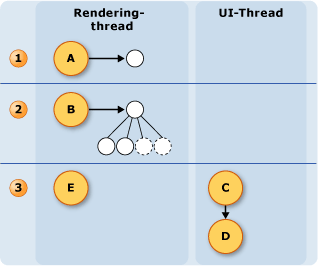

# Das Threadmodell für Freihandeingaben
Einer der Vorteile von Freihandeingaben auf einem Tablet PC ist, dass es mit einem regulären Stift und Papier viel wie beim Schreiben idealer.  Um dies zu erreichen, erfasst der Tablettstift Eingabedaten eine viel höhere Ausfallrate als eine Maus und die Freihandeingabe während des Schreibvorgangs rendert.  Thread (Benutzeroberflächenthread) der Anwendung reicht nicht für das Sammeln von Daten und zum Rendern von Freihandeingaben, da er blockiert werden kann.  Um dies zu lösen eine [!INCLUDE[TLA2#tla_winclient](../../../../includes/tla2sharptla-winclient-md.md)] Anwendung zwei zusätzliche Threads verwendet, wenn Freihandeingabe.  
  
 Die folgende Liste beschreibt die Threads, die Teil zum Sammeln und Rendern von Freihandeingaben annehmen:  
  
-   Pen-Thread - des Threads, die Eingabe des Tablettstifts akzeptiert.  (In der Praxis können dies ist eine Threadpool, aber dieses Thema bezieht sich darauf als Stiftthread.)  
  
-   Anwendung Benutzeroberflächenthread - Threads, der die Benutzeroberfläche der Anwendung steuert.  
  
-   Dynamische Renderingthread - zeichnet der Thread, der der Freihandeingabe während der Benutzer ein Strichs. Die dynamische Renderingthread unterscheidet sich dem Thread, andere Elemente der Benutzeroberfläche für die Anwendung gerendert, werden, wie unter Window Presentation Foundation [Threadmodell](../../../../docs/framework/wpf/advanced/threading-model.md).  
  
 Das Freihand-Modell entspricht dem, ob die Anwendung verwendet die <xref:System.Windows.Controls.InkCanvas> oder ein benutzerdefiniertes Steuerelement mit dem Umwandlungsoperator in [Erstellen eines Steuerelements der Freihand-Eingabe](../../../../docs/framework/wpf/advanced/creating-an-ink-input-control.md).  Obwohl in diesem Thema wird erläutert, in Form eines threading der <xref:System.Windows.Controls.InkCanvas>, dieselben Konzepte gelten, wenn Sie ein benutzerdefiniertes Steuerelement erstellen.  
  
## Übersicht über Threading  
 Das folgende Diagramm veranschaulicht das Threadingmodell an, wenn ein Benutzer einen Strich zeichnet:  
  
 ![Threadingmodell beim Zeichnen eines Strichs. ] (../../../../docs/framework/wpf/advanced/media/inkthreading-drawingink.png "InkThreading_DrawingInk")  
  
1.  Aktionen, die auftreten, während der Benutzer den Strich zeichnet  
  
    1.  Wenn der Benutzer einen Strich zeichnet, sind die Tablettstiftpunkte in verschiedenen für den Stiftthread.  Stift-Plug-ins, einschließlich der <xref:System.Windows.Input.StylusPlugIns.DynamicRenderer>, akzeptieren Sie die Tablettstift Punkten im Thread Stift und haben die Möglichkeit, die sie vor dem Ändern der <xref:System.Windows.Controls.InkCanvas> Empfangs.  
  
    2.  Die <xref:System.Windows.Input.StylusPlugIns.DynamicRenderer> die Tablettstift Punkten im dynamischen Renderingthread rendert. Dies geschieht, zur gleichen Zeit wie im vorherigen Schritt.  
  
    3.  Die <xref:System.Windows.Controls.InkCanvas> empfängt die Tablettstift Punkten im UI-Thread.  
  
2.  Aktionen, die auftritt, nachdem der Benutzer den Strich beendet  
  
    1.  Nach Abschluss der Benutzer die Kontur zeichnen die <xref:System.Windows.Controls.InkCanvas> erstellt eine <xref:System.Windows.Ink.Stroke> -Objekt und fügt es der <xref:System.Windows.Controls.InkPresenter>, die statisch gerendert wird.  
  
    2.  UI-Thread-Warnungen der <xref:System.Windows.Input.StylusPlugIns.DynamicRenderer> , die die Kontur statisch gerendert wird, sodass der <xref:System.Windows.Input.StylusPlugIns.DynamicRenderer> entfernt die visuelle Darstellung des Strichs.  
  
## Freihandeingaben und Tablettstift-Plug-ins  
 Jede <xref:System.Windows.UIElement> verfügt über eine <xref:System.Windows.Input.StylusPlugIns.StylusPlugInCollection>.  Die <xref:System.Windows.Input.StylusPlugIns.StylusPlugIn> Objekte in der <xref:System.Windows.Input.StylusPlugIns.StylusPlugInCollection> empfangen und die Tablettstift Punkten im Thread Stift ändern können. Die <xref:System.Windows.Input.StylusPlugIns.StylusPlugIn> Objekte erhalten die Tablettstiftpunkte entsprechend ihrer Reihenfolge in der <xref:System.Windows.Input.StylusPlugIns.StylusPlugInCollection>.  
  
 Das folgende Diagramm veranschaulicht die hypothetische Situation, in dem die <xref:System.Windows.UIElement.StylusPlugIns%2A> Auflistung von einer <xref:System.Windows.UIElement> enthält `stylusPlugin1`, <xref:System.Windows.Input.StylusPlugIns.DynamicRenderer>, und `stylusPlugin2`in dieser Reihenfolge.  
  
 ![Reihenfolge der Tablettstift-Plugins beeinflusst Ausgabe. ] (../../../../docs/framework/wpf/advanced/media/inkthreading-pluginorder.png "InkThreading_PluginOrder")  
  
 In der vorherigen Abbildung erfolgt Folgendes:  
  
1.  `StylusPlugin1`Ändert die Werte für x und y.  
  
2.  <xref:System.Windows.Input.StylusPlugIns.DynamicRenderer>empfängt die geänderte Tablettstiftpunkte, und im dynamischen Renderingthread gerendert.  
  
3.  `StylusPlugin2`empfängt die geänderte Tablettstiftpunkte und weiteren ändert die Werte für x und y.  
  
4.  Die Anwendung die Tablettstiftpunkte erfasst und Abschluss der Benutzer die Strichbreite nach der Strich statisch gerendert.  
  
 Nehmen wir an, die `stylusPlugin1` schränkt die Tablettstift Punkten zu einem Rechteck und `stylusPlugin2` übersetzt die Tablettstift Punkten rechts.  Im obigen Szenario der <xref:System.Windows.Input.StylusPlugIns.DynamicRenderer> empfängt die eingeschränkten Tablettstiftpunkte, jedoch nicht die übersetzten Tablettstiftpunkte.  Wenn der Benutzer einen Strich zeichnet, Strichs innerhalb der Grenzen des Rechtecks gerendert, jedoch die Kontur ist scheinbar nicht übersetzt werden, bis der Benutzer den Stift anhebt.  
  
### Ausführen von Vorgängen mit einem Tablettstift-Plug-in auf dem UI-thread  
 Da der genaue Treffertests für den Stiftthread ausgeführt werden kann, möglicherweise einige Elemente gelegentlich Tablettstift Eingabetyp für andere Elemente empfangen. Wenn Sie müssen sicherstellen, dass die Eingabe vor dem Ausführen eines Vorgangs ordnungsgemäß weitergeleitet wurde, abonnieren, und führen Sie den Vorgang in der <xref:System.Windows.Input.StylusPlugIns.StylusPlugIn.OnStylusDownProcessed%2A>, <xref:System.Windows.Input.StylusPlugIns.StylusPlugIn.OnStylusMoveProcessed%2A>, oder <xref:System.Windows.Input.StylusPlugIns.StylusPlugIn.OnStylusUpProcessed%2A> Methode. Diese Methoden werden vom Thread Anwendung aufgerufen, nachdem die genauer Treffertest ausgeführt wurde. Rufen Sie zum Abonnieren dieser Methoden die <xref:System.Windows.Input.StylusPlugIns.RawStylusInput.NotifyWhenProcessed%2A> -Methode in der Methode, die an den Stiftthread auftritt.  
  
 Das folgende Diagramm veranschaulicht die Beziehung zwischen den Stiftthread und UI-Thread in Bezug auf die Stylus-Ereignisse von einem <xref:System.Windows.Input.StylusPlugIns.StylusPlugIn>.  
  
 ![Freihand-Threadingmodellen &#40; UI und Stift &#41; ] (../../../../docs/framework/wpf/advanced/media/inkthreading-plugincallbacks.png "InkThreading_PluginCallbacks")  
  
## Rendern von Freihandeingaben  
 Wenn der Benutzer einen Strich zeichnet <xref:System.Windows.Input.StylusPlugIns.DynamicRenderer> rendert in einem separaten Thread Kanton Freihandeingaben "von der Stift übertragen" selbst, wenn der UI-Thread ausgelastet ist.  Die <xref:System.Windows.Input.StylusPlugIns.DynamicRenderer> eine visuelle Struktur im dynamischen Rendering-Thread erstellt, wie sie Tablettstiftpunkte erfasst.  Wenn der Benutzer den Strich beendet die <xref:System.Windows.Input.StylusPlugIns.DynamicRenderer> fordert benachrichtigt werden, wenn die Anwendung den nächsten Renderingdurchlauf ausgeführt wird.  Nach Abschluss des nächsten Renderingdurchlauf, die Anwendung die <xref:System.Windows.Input.StylusPlugIns.DynamicRenderer> seiner visuellen Struktur bereinigt.  Das folgende Diagramm veranschaulicht diesen Prozess.  
  
   
  
1.  Der Benutzer beginnt, den Strich.  
  
    1.  Die <xref:System.Windows.Input.StylusPlugIns.DynamicRenderer> erstellt die visuelle Struktur.  
  
2.  Der Benutzer ist die Kontur zeichnen.  
  
    1.  Die <xref:System.Windows.Input.StylusPlugIns.DynamicRenderer> erstellt die visuelle Struktur.  
  
3.  Der Benutzer beendet den Strich.  
  
    1.  Die <xref:System.Windows.Controls.InkPresenter> seiner visuellen Struktur des Strichs hinzugefügt.  
  
    2.  Media Integration Layer (MIL) wird statisch Striche gerendert.  
  
    3.  Die <xref:System.Windows.Input.StylusPlugIns.DynamicRenderer> bereinigt die visuellen Elemente.
