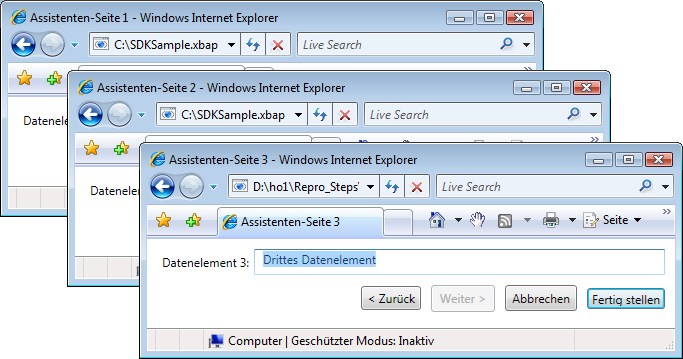
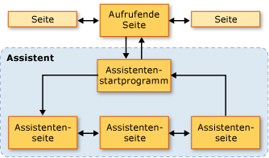
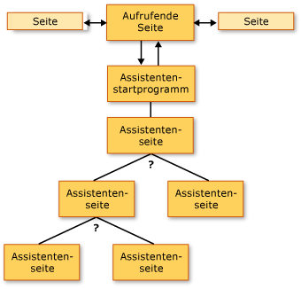
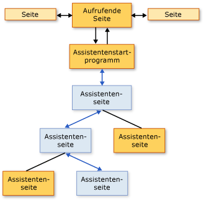
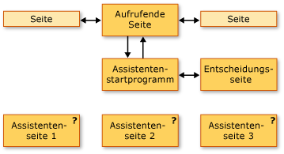

# &#220;bersicht &#252;ber Navigationstopologien
 Diese Übersicht enthält eine Einführung in die Navigationstopologien von [!INCLUDE[TLA2#tla_wpf](../../../../includes/tla2sharptla-wpf-md.md)].  Anschließend werden drei allgemeine Navigationstopologien mit Beispielen erläutert.  
  
> [!NOTE]
>  Für dieses Thema sollten Sie mit dem Konzept der strukturierten Navigation mithilfe von Seitenfunktionen in [!INCLUDE[TLA2#tla_wpf](../../../../includes/tla2sharptla-wpf-md.md)] vertraut sein.  Weitere Informationen zu diesen beiden Themen finden Sie unter [Übersicht über die strukturierte Navigation](../../../../docs/framework/wpf/app-development/structured-navigation-overview.md).  
  
 Dieses Thema enthält folgende Abschnitte:  
  
-   [Navigationstopologien](#Navigation_Topologies)  
  
-   [Strukturierte Navigationstopologien](#Structured_Navigation_Topologies)  
  
-   [Navigation über eine feste lineare Topologie](#Navigation_over_a_Fixed_Linear_Topology)  
  
-   [Dynamische Navigation über eine feste hierarchische Topologie](#Dynamic_Navigation_over_a_Fixed_Hierarchical_Topology)  
  
-   [Navigation über eine dynamisch generierte Topologie](#Navigation_over_a_Dynamically_Generated_Topology)  
  
   
## Navigationstopologien  
 In [!INCLUDE[TLA2#tla_wpf](../../../../includes/tla2sharptla-wpf-md.md)] erfolgt die Navigation normalerweise über Seiten \(<xref:System.Windows.Controls.Page>\) mit Links \(<xref:System.Windows.Documents.Hyperlink>\), über die man durch Anklicken auf andere Seiten gelangt.  Seiten, zu denen man navigiert, werden durch [!INCLUDE[TLA#tla_uri#plural](../../../../includes/tlasharptla-urisharpplural-md.md)] \(siehe [Paket\-URI in WPF](../../../../docs/framework/wpf/app-development/pack-uris-in-wpf.md)\) identifiziert.  Betrachten Sie das folgende einfache Beispiel, in dem Seiten, Links und [!INCLUDE[TLA#tla_uri#plural](../../../../includes/tlasharptla-urisharpplural-md.md)] dargestellt werden:  
  
 [!code-xml[NavigationTopologiesOverviewSnippets#Page1](../../../../samples/snippets/csharp/VS_Snippets_Wpf/NavigationTopologiesOverviewSnippets/CS/Page1.xaml#page1)]  
  
 [!code-xml[NavigationTopologiesOverviewSnippets#Page2](../../../../samples/snippets/csharp/VS_Snippets_Wpf/NavigationTopologiesOverviewSnippets/CS/Page2.xaml#page2)]  
  
 Diese Seiten sind in einer *Navigationstopologie* angeordnet, deren Struktur von der Art und Weise bestimmt wird, wie Sie zwischen den einzelnen Seiten navigieren können.  Die gezeigte Navigationstopologie ist für einfache Szenarien geeignet. In bestimmten Fällen können jedoch komplexere Topologien erforderlich sein, die zum Teil nur definiert werden können, während eine Anwendung ausgeführt wird.  
  
 In diesem Thema werden drei allgemeine Navigationstopologien behandelt: *feste lineare*, *feste hierarchische* und *dynamisch generierte* Topologien.  Jede Navigationstopologie wird anhand eines Beispiels erläutert, das eine [!INCLUDE[TLA2#tla_ui](../../../../includes/tla2sharptla-ui-md.md)] wie in der folgenden Abbildung aufweist:  
  
   
  
   
## Strukturierte Navigationstopologien  
 Es gibt zwei umfassende Typen von Navigationstopologien:  
  
-   **Feste Topologie**: Diese Topologie wird zum Zeitpunkt der Kompilierung definiert und ändert sich während der Laufzeit nicht.  Feste Topologien sind hilfreich, wenn die Navigation durch die Seiten in einer festen Reihenfolge \(linear oder hierarchisch\) erfolgt.  
  
-   **Dynamische Topologie**: Diese Topologie wird während der Laufzeit und auf Grundlage von Eingaben definiert, die vom Benutzer, der Anwendung oder dem System gemacht werden.  Dynamische Topologien sind hilfreich, wenn die Navigation durch Seiten in unterschiedlichen Reihenfolgen möglich ist.  
  
 Obwohl es möglich ist, Navigationstopologien mithilfe von Seiten zu erstellen, werden in den Beispielen Seitenfunktionen verwendet. Seitenfunktionen bieten zusätzliche Unterstützung für die Weiter\- und Rückgabe von Daten zwischen den einzelnen Seiten einer Topologie.  
  
   
## Navigation über eine feste lineare Topologie  
 Die Struktur einer festen linearen Topologie entspricht der eines Assistenten, der aus einer oder mehreren Seiten besteht, durch die in einer festen Reihenfolge navigiert wird.  Die folgende Abbildung zeigt den Verlauf eines Assistenten mit einer festen linearen Topologie sowie dessen Struktur auf oberster Ebene.  
  
   
  
 Folgende Verhaltensweisen sind für die Navigation über eine feste lineare Topologie typisch:  
  
-   Die Navigation von einer aufrufenden Seite zu einer Starterseite, die den Assistenten initialisiert und zur ersten Seite des Assistenten navigiert.  Eine Starterseite \(eine <xref:System.Windows.Navigation.PageFunction%601> ohne [!INCLUDE[TLA2#tla_ui](../../../../includes/tla2sharptla-ui-md.md)]\) ist nicht erforderlich, da eine aufrufende Seite die erste Seite des Assistenten direkt aufrufen kann.  Durch die Verwendung einer Starterseite kann die Initialisierung des Assistenten jedoch vereinfacht werden.  
  
-   Benutzer können über die Schaltflächen Vorwärts und Zurück \(oder Links\) zwischen den Seiten navigieren.  
  
-   Benutzer können mithilfe des Journals zwischen den Seiten navigieren.  
  
-   Benutzer können den Assistenten auf jeder Assistentenseite abbrechen, indem sie auf die Schaltfläche Abbrechen klicken.  
  
-   Benutzer können den Assistenten auf der letzten Assistentenseite abschließen, indem sie auf die Schaltfläche Fertig stellen klicken.  
  
-   Wenn ein Assistent abgebrochen wird, gibt der Assistent ein entsprechendes Ergebnis und keine Daten zurück.  
  
-   Wenn ein Assistent abgeschlossen wird, gibt der Assistent ein entsprechendes Ergebnis und die gesammelten Daten zurück.  
  
-   Wenn der Assistent abgeschlossen oder abgebrochen wird, werden die Seiten, die der Assistent umfasst, aus dem Journal entfernt.  Dadurch wird jede Instanz des Assistenten isoliert, und potenzielle Daten\- oder Zustandsanomalien werden vermieden.  
  
   
## Dynamische Navigation über eine feste hierarchische Topologie  
 In einigen Anwendungen gibt es Seiten, die eine Navigation zu zwei oder mehreren anderen Seiten ermöglichen, wie in der folgenden Abbildung veranschaulicht wird.  
  
   
  
 Diese Struktur bezeichnet man als feste hierarchische Topologie. Die Reihenfolge, in der die Hierarchie durchlaufen wird, wird häufig zur Laufzeit durch die Anwendung oder den Benutzer bestimmt.  Jede Seite in der Hierarchie, die eine Navigation zu zwei oder mehreren Seiten ermöglicht, sammelt zur Laufzeit Daten, die erforderlich sind, zu bestimmen, zu welcher Seite navigiert wird.  Die folgende Abbildung veranschaulicht eine von mehreren möglichen Navigationsreihenfolgen auf Grundlage der vorherigen Abbildung.  
  
   
  
 Obwohl bei dieser Topologie die Reihenfolge für die Navigation durch die Seiten einer festen hierarchischen Struktur zur Laufzeit bestimmt wird, ist die Benutzererfahrung dieselbe wie bei einer festen linearen Topologie:  
  
-   Die Navigation von einer aufrufenden Seite zu einer Starterseite, die den Assistenten initialisiert und zur ersten Seite des Assistenten navigiert.  Eine Starterseite \(eine <xref:System.Windows.Navigation.PageFunction%601> ohne [!INCLUDE[TLA2#tla_ui](../../../../includes/tla2sharptla-ui-md.md)]\) ist nicht erforderlich, da eine aufrufende Seite die erste Seite des Assistenten direkt aufrufen kann.  Durch die Verwendung einer Starterseite kann die Initialisierung des Assistenten jedoch vereinfacht werden.  
  
-   Benutzer können über die Schaltflächen Vorwärts und Zurück \(oder Links\) zwischen den Seiten navigieren.  
  
-   Benutzer können mithilfe des Journals zwischen den Seiten navigieren.  
  
-   Benutzer können die Navigationsreihenfolge ändern, wenn sie mithilfe des Journals zurück navigieren.  
  
-   Benutzer können den Assistenten auf jeder Assistentenseite abbrechen, indem sie auf die Schaltfläche Abbrechen klicken.  
  
-   Benutzer können den Assistenten auf der letzten Assistentenseite abschließen, indem sie auf die Schaltfläche Fertig stellen klicken.  
  
-   Wenn ein Assistent abgebrochen wird, gibt der Assistent ein entsprechendes Ergebnis und keine Daten zurück.  
  
-   Wenn ein Assistent abgeschlossen wird, gibt der Assistent ein entsprechendes Ergebnis und die gesammelten Daten zurück.  
  
-   Wenn der Assistent abgeschlossen oder abgebrochen wird, werden die Seiten, die der Assistent umfasst, aus dem Journal entfernt.  Dadurch wird jede Instanz des Assistenten isoliert, und potenzielle Daten\- oder Zustandsanomalien werden vermieden.  
  
   
## Navigation über eine dynamisch generierte Topologie  
 In einigen Anwendungen kann die Reihenfolge, in der durch zwei oder mehrere Seiten navigiert wird, nur zur Laufzeit bestimmt werden, sei es durch den Benutzer, die Anwendung oder durch externe Daten.  Die folgende Abbildung veranschaulicht einen Satz von Seiten mit einer unbestimmten Navigationsreihenfolge.  
  
   
  
 Die nächste Abbildung veranschaulicht eine Navigationsreihenfolge, die zur Laufzeit vom Benutzer ausgewählt wurde.  
  
   
  
 Die Navigationsreihenfolge wird als dynamisch generierte Topologie bezeichnet.  Wie bei den anderen Navigationstopologien bleibt die Benutzererfahrung dieselbe:  
  
-   Die Navigation von einer aufrufenden Seite zu einer Starterseite, die den Assistenten initialisiert und zur ersten Seite des Assistenten navigiert.  Eine Starterseite \(eine <xref:System.Windows.Navigation.PageFunction%601> ohne [!INCLUDE[TLA2#tla_ui](../../../../includes/tla2sharptla-ui-md.md)]\) ist nicht erforderlich, da eine aufrufende Seite die erste Seite des Assistenten direkt aufrufen kann.  Durch die Verwendung einer Starterseite kann die Initialisierung des Assistenten jedoch vereinfacht werden.  
  
-   Benutzer können über die Schaltflächen Vorwärts und Zurück \(oder Links\) zwischen den Seiten navigieren.  
  
-   Benutzer können mithilfe des Journals zwischen den Seiten navigieren.  
  
-   Benutzer können den Assistenten auf jeder Assistentenseite abbrechen, indem sie auf die Schaltfläche Abbrechen klicken.  
  
-   Benutzer können den Assistenten auf der letzten Assistentenseite abschließen, indem sie auf die Schaltfläche Fertig stellen klicken.  
  
-   Wenn ein Assistent abgebrochen wird, gibt der Assistent ein entsprechendes Ergebnis und keine Daten zurück.  
  
-   Wenn ein Assistent abgeschlossen wird, gibt der Assistent ein entsprechendes Ergebnis und die gesammelten Daten zurück.  
  
-   Wenn der Assistent abgeschlossen oder abgebrochen wird, werden die Seiten, die der Assistent umfasst, aus dem Journal entfernt.  Dadurch wird jede Instanz des Assistenten isoliert, und potenzielle Daten\- oder Zustandsanomalien werden vermieden.  
  
## Siehe auch  
 <xref:System.Windows.Controls.Page>   
 <xref:System.Windows.Navigation.PageFunction%601>   
 <xref:System.Windows.Navigation.NavigationService>   
 [Übersicht über die strukturierte Navigation](../../../../docs/framework/wpf/app-development/structured-navigation-overview.md)