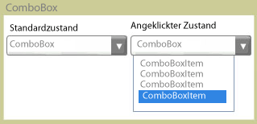

# ComboBox
Die <xref:System.Windows.Controls.ComboBox> -Steuerelement stellt Benutzern eine Liste mit Optionen. Die Liste wird angezeigt und ausgeblendet werden, wie das Steuerelement erweitert bzw. reduziert. In seinem Standardzustand verwenden wird die Liste zeigt nur eine Auswahl reduziert. Der Benutzer klickt auf eine Schaltfläche, um die vollständige Liste der Optionen anzuzeigen.  
  
 Die folgende Abbildung zeigt eine <xref:System.Windows.Controls.ComboBox> in verschiedenen Zuständen.  
  
   
Reduziert und erweitert  
  
## In diesem Abschnitt  
 [Vorgehensweise: Abrufen eines ComboBoxItem](https://msdn.microsoft.com/library/8a0d2622-64b6-41fc-bf80-9669a1eacb53)  
  
## Referenz  
 <xref:System.Windows.Controls.ComboBox>
