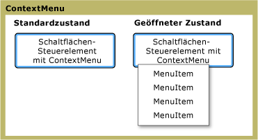

# ContextMenu
Das <xref:System.Windows.Controls.ContextMenu> ermöglicht es einem Steuerelement, ein <xref:System.Windows.Controls.Menu> anzuzeigen, das sich speziell auf den Kontext des Steuerelements bezieht.  In der Regel wird das <xref:System.Windows.Controls.ContextMenu> der [!INCLUDE[TLA#tla_ui](../../../../includes/tlasharptla-ui-md.md)] durch Klicken mit der rechten Maustaste oder über die Menütaste der Tastatur geöffnet.  
  
 Die folgende Abbildung zeigt ein <xref:System.Windows.Controls.ContextMenu> in zwei unterschiedlichen Zuständen: dem Standardzustand und dem geöffneten Zustand.  Im Standardzustand wird das Steuerelement reduziert dargestellt.  Wenn der Benutzer mit der rechten Maustaste auf das übergeordnete Element des Menüs klickt, wird das Steuerelement erweitert, und die Menüoptionen werden eingeblendet.  
  
   
Kontextmenü in unterschiedlichen Zuständen  
  
## In diesem Abschnitt  
 [Übersicht über ContextMenu](../../../../docs/framework/wpf/controls/contextmenu-overview.md)  
  
## Referenz  
 <xref:System.Windows.Controls.ContextMenu>  
  
## Verwandte Abschnitte