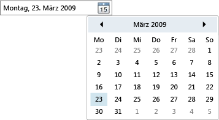

# DatePicker
Das <xref:System.Windows.Controls.DatePicker>\-Steuerelement ermöglicht Benutzern die Datumsauswahl durch Eingabe in einem Textfeld oder Verwendung eines <xref:System.Windows.Controls.Calendar>\-Dropdownsteuerelements.  
  
 Die folgende Abbildung zeigt eine <xref:System.Windows.Controls.DatePicker>.  
  
   
DatePicker\-Steuerelement  
  
 Viele Eigenschaften eines <xref:System.Windows.Controls.DatePicker>\-Steuerelements sind für die Verwaltung des integrierten <xref:System.Windows.Controls.Calendar> vorgesehen und werden genau wie die entsprechende Eigenschaft in <xref:System.Windows.Controls.Calendar> verwendet.  Insbesondere die Eigenschaften <xref:System.Windows.Controls.DatePicker.IsTodayHighlighted%2A?displayProperty=fullName>, <xref:System.Windows.Controls.DatePicker.FirstDayOfWeek%2A?displayProperty=fullName>, <xref:System.Windows.Controls.DatePicker.BlackoutDates%2A?displayProperty=fullName>, <xref:System.Windows.Controls.DatePicker.DisplayDateStart%2A?displayProperty=fullName>, <xref:System.Windows.Controls.DatePicker.DisplayDateEnd%2A?displayProperty=fullName>, <xref:System.Windows.Controls.DatePicker.DisplayDate%2A?displayProperty=fullName> und <xref:System.Windows.Controls.DatePicker.SelectedDate%2A?displayProperty=fullName> werden genau wie deren <xref:System.Windows.Controls.Calendar>\-Entsprechungen verwendet.  Weitere Informationen finden Sie unter <xref:System.Windows.Controls.Calendar>.  
  
 Benutzer können ein Datum direkt in einem Textfeld eingeben, wodurch die <xref:System.Windows.Controls.DatePicker.Text%2A>\-Eigenschaft festgelegt wird.  Wenn der <xref:System.Windows.Controls.DatePicker> die eingegebene Zeichenfolge nicht in ein gültiges Datum konvertieren kann, wird das <xref:System.Windows.Controls.DatePicker.DateValidationError>\-Ereignis ausgelöst.  Standardmäßig verursacht dies eine Ausnahme, jedoch kann ein Ereignishandler für <xref:System.Windows.Controls.DatePicker.DateValidationError> die <xref:System.Windows.Controls.DatePickerDateValidationErrorEventArgs.ThrowException%2A>\-Eigenschaft auf `false` festlegen und verhindern, dass eine Ausnahme ausgelöst wird.  
  
## Siehe auch  
 [Steuerelemente](../../../../docs/framework/wpf/controls/index.md)   
 [Erstellen von Formaten und Vorlagen](../../../../docs/framework/wpf/controls/styling-and-templating.md)